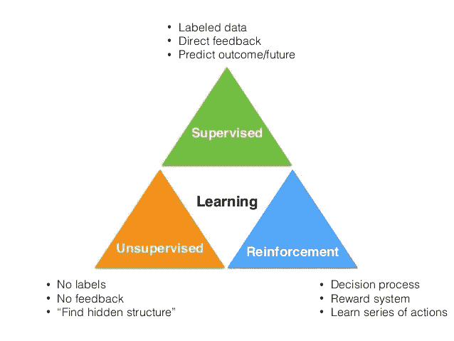
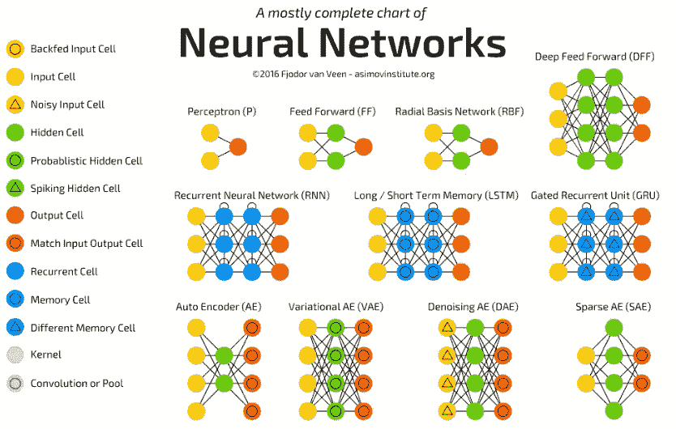

# 我辞职学 AI。以下是你开始的原因和方法。

> 原文：<https://medium.com/coinmonks/i-quit-my-job-to-learn-ai-heres-why-and-how-you-can-get-started-84bdfc35a3c3?source=collection_archive---------0----------------------->

离职从来都不是一个容易的决定，尤其是如果你离职不是为了找新工作，也不是为了创业，而是为了学习新东西！这是我六个月前做的，我的朋友和同事对我的决定感到惊讶。你猜怎么着？我也是！然而，这个看似荒谬的决定是经过深思熟虑、长时间准备和一点点轻率(我不得不承认)后做出的，这是一个有计算风险和计算不确定性的举动。现在我正在一个在线学习平台上帮助我的朋友审查学生的深度学习项目，并在一所大学担任研究员，我现在对机器学习和深度学习的了解比半年前多了很多。前面的路对我来说还是不清楚，但是希望会越来越好。毕竟，正如苏格拉底曾经说过的，

> "未经审视的人生不值得过。"

我觉得现在的数据科学/大数据/机器学习/深度学习/人工智能的强大已经不需要解释了，它们无疑是解决现实世界 80%问题的 20%工具。

尽管有足够的理由去学习这些技能，但是要注意，如果数学/统计学/计算机科学不是你的专业，那么学习起来会有点困难。

> 尽管生命短暂，但对你来说，它有足够长的时间去做你深深感兴趣的事情。

如果你致力于这一领域，希望这篇文章对你有用，让你免于在机器学习的森林中徘徊。

# **辞职学 AI 前要考虑的因素**

*2018 年 7 月 30 日:新增本节*

我知道有不同的人想学习人工智能，因为他们害怕被取代。然而，我敢说目前 AI 不会取代人类，[甚至放射科医生](https://hbr.org/2018/03/ai-will-change-radiology-but-it-wont-replace-radiologists)(除非你 100%的工作时间都在做目前 AI 擅长的相对低级的事情，比如识别事物)。为什么？因为算法和模型都相当有限。他们渴望数据，不可转移，计算昂贵，识别模式但不理解因果关系…等等。即使 AI 可以生成图像，但目前的 AI 还远远不能部署在生产中取代人类设计师。

> 与过去相比，现在的人工智能已经取得了令人难以置信的成就。但是与理想相比，目前的人工智能还远远不够完善。

无论如何，当你为自己设计学习人工智能的策略时，这里有一些因素供你考虑。

*   你的目标:明确你的目标。你想专攻哪个领域？(计算机视觉？自然语言处理？数据科学？机器人技术？)你是想专注于研究以了解和开发新的东西，还是想快速学习并将其应用于现实世界？
*   你的背景:如果你不是数学/计算机科学专业的，你需要首先缩小你的知识差距，因为你必须阅读一些学术论文和代码。
*   你的能力:你是一个善于自学的人吗？网上有丰富的资源，但知道如何利用它们的人最终会获得成功。(后面我会写一篇关于学习如何学习的帖子)
*   你的经济状况:计算你的最低生活成本，看看你的资产负债表是否能维持你的学习计划。如果没有，想象一下你还能在融资方面做些什么。
*   世界:我可以预见，随着更多的人改变职业生涯，许多学生选择计算机科学作为他们的专业(重点是人工智能)，未来几年人工智能工程师可能会过剩(特别是在计算机视觉领域)。有两到三个专业总是好的，但不要把所有的鸡蛋放在一个篮子里。

最后但同样重要的是，不管你来自哪里，也不管你过去在学校的表现有多差，你总有机会在未来取得成功，因为没有人知道未来。毕竟，最重要的是你如何定义成功，你的目标，你的毅力，你的策略和你的行动。

# **菜单—字段概述**

A 人工智能([General](https://en.wikipedia.org/wiki/Artificial_general_intelligence)vs[Narrow](https://en.wikipedia.org/wiki/Weak_AI)):AI 是一个如此熟悉的术语，但我们很难确定一个单一的定义。即使没有明确定义这个术语，我们也可以根据人工智能的一般智能对其进行分类。如果机器能像人类一样执行智力任务并拥有认知能力，它就被视为人工一般智能(AGI)。与 AGI 相反，如果一台机器只能解决一个特定的问题，它就被认为是狭义的人工智能。

M 你将在 ML 教科书或课程中看到的常见主题:回归、朴素贝叶斯、决策树、KNN、SVM、K-means、PCA…

基于其学习风格，ML 可以分为:

One of the ways to classify Machine Learning [[Source]](http://www.techjini.com/blog/machine-learning/)

*监督学习:*监督学习使用数据的输入输出配对来训练模型。因为模型需要标记的数据来指导学习，即我们需要明确地指定，例如，哪张图片是猫的图像，哪张是卡车。因此被称为“被监督的”。

*非监督学习:*与监督学习相反，非监督学习在没有标记数据的情况下发现数据的隐藏结构。像 K-means 这样的聚类技术，像 PCA 这样的潜在变量模型就是这种类型的例子。

*强化学习(RL):* RL 是研究智能体如何在不同的环境状态下采取行动，以最大化其累积回报。AlphaGo 也是使用(深度)强化学习来训练的。下面是代理如何在多次迭代后学会玩吃豆人的演示。

Few days ago, Maluuba successfully brought the Pac-Man game to another level.

Deep 学习(DL):ML 的一个子字段。深度学习是使用人工神经网络**包含一个以上的隐藏层**。它可以是监督/非监督/强化学习。它广泛应用于图像识别、语音识别、自然语言处理、生成新数据等领域。流行的架构包括:

*   *多层感知器(MLP):* 神经网络的基本类型。神经元是前馈和全连接的。它可用于回归和分类。
*   *卷积神经网络(CNN):* 受生物过程的启发，CNN 广泛应用于图像识别(人脸检测、视频分析等)。
*   *递归神经网络(RNN):* 具有“记忆”的神经网络。它特别擅长处理序列数据。LSTM、GRU 是你在 RNN 不会错过的地方。
*   *生成对抗网络(GAN):* 由 Ian Goodfellow 于 2014 年提出，GAN 使用两个神经网络相互竞争(或学习)。你可以用 GAN 生成新的(准确的说是假的)图像和新的数据。

Variants of deep neural network [[Source](http://www.asimovinstitute.org/neural-network-zoo/)]

# 开胃菜——先决条件

传销行业为人们设置了很高的门槛。为了在这个领域取得成功，你需要对多元微积分、线性代数、统计学、编程、云计算等有一个完整而完善的理解。下面的资源(以及本文中的所有资源)都是我尝试过并精心挑选的材料，我挑选它们是因为它们通俗易懂，直观详细。

> *数学-微积分:*微积分对你理解神经网络如何通过对损失函数求微分来学习优化模型很重要。

*   伦纳德教授的《微积分 3》—微积分的详细解释
*   [3blue1brown](https://www.youtube.com/playlist?list=PLZHQObOWTQDMsr9K-rj53DwVRMYO3t5Yr) —微积分的精彩动画
*   betterexplained.com[——每篇文章都非常好](https://betterexplained.com/articles/a-gentle-introduction-to-learning-calculus/)

> *数学-线性代数:*你需要知道向量、矩阵、张量、点积的基本概念，才能理解基本的神经网络。当你学习奇异值分解、时间反向传播等等时，你需要知道更多。

*   我可以说这是我见过的最好的线性代数系列
*   帕维尔·格林菲尔德的这幅也不错

> *统计学:*统计学概念在 ML 中无处不在。

*   [统计 101](https://www.youtube.com/user/BCFoltz/playlists)
*   乔·布利茨坦的哈佛统计 110——世界上最好的讲座之一！他的书也很棒！

> *计算机科学:*计算机基础知识和编码一样重要。所以不要在不了解其工作原理的情况下编码。

*   哈佛扩展学校——计算机科学的好入门
*   电脑专家伊莱——许多 1 小时的不同主题的教程
*   科里·斯查费的 Python 视频——结构良好，直观
*   [斯坦福 ee364a 凸优化](https://www.youtube.com/playlist?list=PL3940DD956CDF0622)

# **主菜——我们开始吧**

乌尔斯:多亏了 MOOC，现在每个人都可以去听课和学习。我根据难度对以下课程进行了评级。一般来说，如果你是这个领域的新手，你可以从 1 星课程开始，你可以同时学习 ML 和 DL(在我看来，它们没有太多的依赖性)。然而，如果你想学习复杂的神经网络架构，如 CNN 和 RNN，我建议你先完成基本的深度学习课程(“香草”神经网络)。

> 机器学习

[吴恩达的机器学习](https://www.coursera.org/learn/machine-learning) : ★☆☆

[uda city 的机器学习](https://www.udacity.com/course/intro-to-machine-learning--ud120) : ★☆☆

加州理工学院教授亚塞尔·阿布-穆斯塔法的机器学习: ★★☆

[斯坦福 CS229](https://www.youtube.com/playlist?list=PLA89DCFA6ADACE599) : ★★☆

> 深度学习

[吴恩达的 deep learning . ai:](https://www.coursera.org/learn/neural-networks-deep-learning/home/welcome)★☆☆

[fast.ai](http://www.fast.ai/) : ★☆☆

[uda city 深度学习](https://www.udacity.com/course/deep-learning--ud730) : ★☆☆

[data camp 用 python 深度学习](https://www.datacamp.com/courses/deep-learning-in-python) : ★☆☆

[深度学习南多·德·弗雷塔斯](https://www.youtube.com/playlist?list=PLE6Wd9FR--EfW8dtjAuPoTuPcqmOV53Fu) : ★★☆

杰弗里·辛顿的神经网络:★★

> 特定主题

[CNN by Andrej Karpathy](https://www.youtube.com/playlist?list=PLlJy-eBtNFt6EuMxFYRiNRS07MCWN5UIA)(2016):★★☆(包含基础深度学习)

[CNN by 斯坦福大学工程学院](https://www.youtube.com/playlist?list=PLC1qU-LWwrF64f4QKQT-Vg5Wr4qEE1Zxk) (2017): ★★☆

克里斯·曼宁和理查德·索彻的 NLP

[uda city 的强化学习](https://www.udacity.com/course/reinforcement-learning--ud600) : ★☆☆

大卫·西尔弗的强化学习 : ★★☆

网上课程对学习很有帮助。然而，教科书是必要的补充，为深入学习提供数学证明、直觉和练习。

*   Python 机器学习——这本书不仅介绍了所有的 ML 概念，还包括 python 代码。从 ML 开始是个好主意。
*   统计学习介绍——通过 R 语言的应用，这是一本统计学习的好教材。
*   《理解机器学习:从理论到算法》——剑桥出版，这本书是 ML 概念和理论的很好参考。
*   深度学习——包括 DL 的各种概念。你也可以在线阅读。
*   强化学习:导论——由现代强化学习的创始人萨顿、R. S .和巴尔托撰写。第二版现已完成，[可在线免费获得](http://incompleteideas.net/book/bookdraft2017nov5.pdf)。
*   人工智能:现代方法(第三版)

日志/网站:网上有数不清的资源，下面是一些很棒的资料。

*   [哈里森·金斯利](https://pythonprogramming.net/)
*   阿迪特·德什潘德
*   [colah 的博客](http://colah.github.io/)
*   [机器学习掌握](http://machinelearningmastery.com/blog/)

研究论文:研究论文可以给你模型的“原始味道”。

*   [arXiv.org](https://arxiv.org/)
*   [ICLR](http://www.iclr.cc/)
*   [牛逼——引用最多的深度学习论文](https://github.com/terryum/awesome-deep-learning-papers)

竞争:练习！练习！练习！应用您所学的知识，创建您自己的模型来解决最具挑战性的问题！

*   [图像网](http://image-net.org/) —计算机视觉挑战赛
*   [Kaggle](https://www.kaggle.com/) —数据科学挑战

其他资源

*   [Github](https://github.com/) —著名的开源软件项目主持人。
*   [Quora](https://www.quora.com/)——如果你有任何困难，请在这里寻求帮助并提出任何问题！

# **喝酒——提神醒脑**

人工智能现在发展很快，你几乎每天都能看到新的研究论文发表。当然，我们不可能学到所有的东西，但是我们能做的是让自己保持更新，并通过他人的视角探索这个领域。这样做，我们可能有更好的方法来解决问题。

*   关注社交网络中的玩家制造者(如[扬·勒村](https://www.facebook.com/yann.lecun)、[吴恩达](https://www.facebook.com/andrew.ng.96)等)
*   设置 Google 提醒

# **甜点——最后几句话**

AI 就像一把刀，一把枪或者核技术。这是一把双刃剑，如果使用得当，我们可以拯救生命，拯救我们的星球，如果使用不当，我们可能会毁灭自己。我们很幸运生活在一个见证人工智能崛起的时代，甚至实际上学会了用大量无私的机构、研究人员和人们贡献的开放资源来建造一个人工智能。如果有一天你终于在这个领域取得成功，我希望你不仅用它来为自己赚好钱，而且用它来拯救地球，帮助那些在世界上被遗忘的角落里受苦的人。

让我们拥抱 AI！

> [直接在您的收件箱中获得最佳软件交易](https://coincodecap.com/?utm_source=coinmonks)

