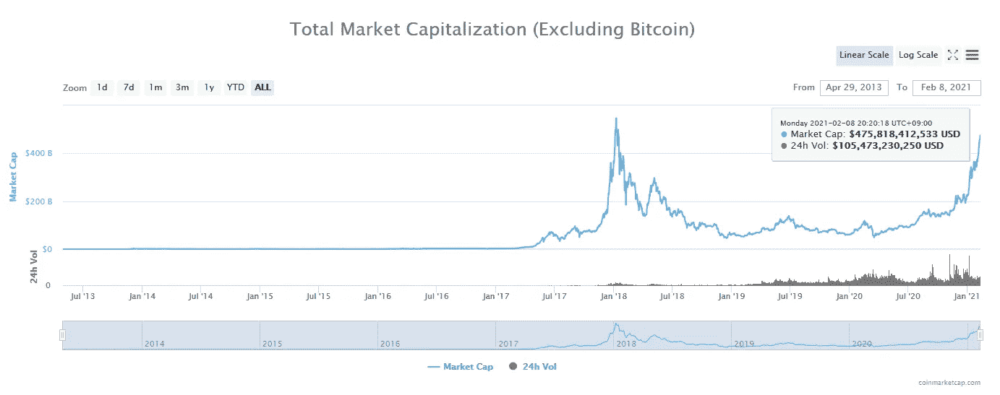
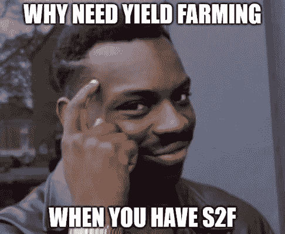
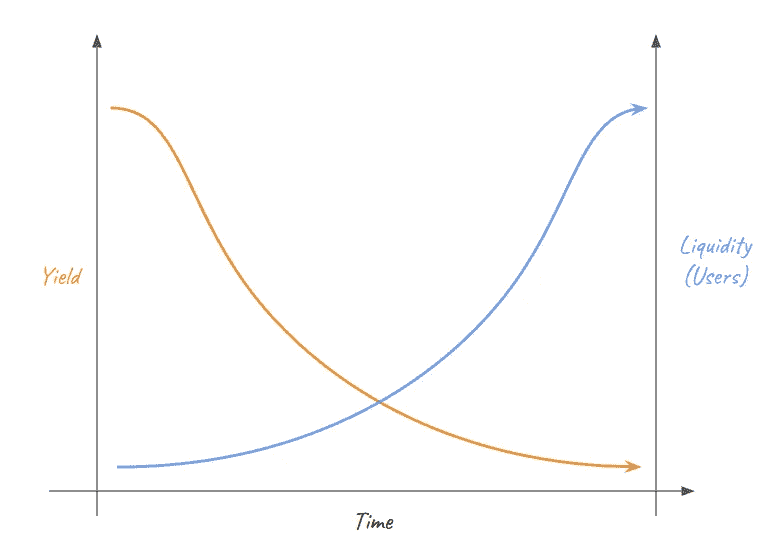

# 我花了一周的时间学习高产农业，然后我成功了。

> 原文：<https://medium.com/coinmonks/i-spent-a-week-learning-about-yield-farming-and-then-i-yielded-845b66f058f1?source=collection_archive---------0----------------------->

## 义务:这篇文章不是财务建议

在经历了 GameStop 崩溃的后果后，我开始寻找一个“更好”的解决方案，以解决订单流支付的“集中系统”问题，这影响了像 Robinhood 这样的中小市值股票经纪人，在我看来，这是势头被破坏的原因。

随着 Defi 成为加密货币世界目前的热门话题，我不禁惊讶于替代硬币经济和围绕 DEx(分散交易所)的第二层解决方案是如何吸引大量资金流入的。

$475M excluding BTC (source: [https://coinmarketcap.com/charts/](https://coinmarketcap.com/charts/))

围绕 dex 的最流行的讨论似乎是产量农业。随着来自 Mirror finance 的[合成股票](https://finance.yahoo.com/news/terra-launches-mirror-protocol-first-200000652.html?guccounter=1)的推出，你现在可以在获得极高的 3xx% APY (ig:大众抵押品和稳定硬币对之间较低的波动性)的同时，获得相对较低的风险。此外，随着 Terra network($ term)和 Pancakeswap ($CAKE)现在与币安智能链兼容，您可以以更低的初始成本开始耕作，而不必在区块链以太坊(例如$ UNI/$寿司)。尽管我真的很有兴趣将我的一些加密资产转移到高产农场，但在睡了几天后，我决定放弃。以下是原因:

1.  作为一个像我这样的半 btc 最大化主义者，人们可以从我最喜欢的宏观投资者[迈克尔·塞勒](https://twitter.com/michael_saylor)、[普兰布](https://twitter.com/100trillionUSD?s=20)和[拉乌尔·帕尔](https://twitter.com/RaoulGMI?s=20)那里借用一些想法来给出一个快速的迷因答案:

Why put your assets at risk when you can park it in cold wallet?

如果你想更快地积累 BTC，我不会否认资产价值最大化的好处。这就引出了下一个原因。

2.此外，由于 APY 利率根据池内的流动性实时变化，它可能会随着时间的推移遵循以下趋势:

Higher APY attracts more users, thus higher liquidity and lower APY over time

我更喜欢把我的钱放在我觉得舒服的地方，然后至少 5 年后忘记它，频繁地在不同的区块链之间转移资金是有风险的，类似于做日间交易者，这不是我的风格。

3.币安智能连锁还没有受到[闪贷攻击](https://www.coindesk.com/the-defi-flash-loan-attack-that-changed-everything)(还没有)。会吗？更高的市值会吸引更多的坏演员吗？这又增加了一层风险，我现在不愿意承担。

4.这一条对我个人来说可能是最重要的。合成资产或大众，试图模仿知名公司的股票，如特斯拉(Tesla)、苹果(Apple)，甚至纳斯达克 100 强指数。

现在，我对这些合成资产的问题是，它们不是真正的股票，而只是一种加密资产，由与股票市场价格匹配的稳定资本支持。作为一名价值投资者，这对我来说毫无意义，因为当我在几周的研究和决策后决定将资金投入一家公司时，我想支持并为这家我认为对世界有价值主张的公司欢呼。此外，如果没有真正的股票，你可能会错过其他黄金机会，比如 SpaceX 或 Starlink 的 IPO。

接下来，因为这些合成资产可以 24/7 交易，并且价格可以随股票市场波动，所以您现在可能暴露于以下风险载体:
4.1 放大的波动性:来自市场前后的好消息或坏消息可以放大合成资产的价格- >非永久性损失
4.2 市场现在非常激烈，许多宏观投资者都在谈论即将到来的市场崩溃- >非永久性损失

I probably won’t be able to sleep at night

这 2、3、4 种风险加起来太大了，我晚上睡觉都得睁一只眼闭一只眼。这也需要我经常转移我的资金，这也有税收的影响，因此我现在宁愿花更多的时间做 DD 和创造收入。再说一次，我并不否认这里有钱可赚，我只是不想冒险。

如果你热衷于这样做，mQQQ 或 mMSFT 可能是一个很好的候选人，因为纳斯达克指数不稳定。等等，[什么](https://screener.fidelity.com/ftgw/etf/goto/snapshot/performance.jhtml?symbols=QQQ)？好吧，那么 mMSFT 可能更好，因为我持有一堆它们，它们在 V 型复苏后似乎没有上升那么多(sob)

不过，这里有一个警告。如果有一天这些公司决定将一部分股票放在区块链，你可以把它们借给人们，让他们在持有你的股票的同时获得收益，我会是第一个排队的人(对于那些好奇的人，请查看下面戴夫·李对 Compound CEO 的采访)。

Very good interview about Defi and how it’s growing rapidly

不过，对 Defi 的这次冒险让我对 Oracle 技术产生了浓厚的兴趣。像$LINK 和$BAND 这样的人正在努力解决一些真正有用的问题。可惜在日本买山寨币挺麻烦的。

> 最新消息:特斯拉购买了价值 15 亿美元的 BTC。现在，它将有足够的资金，通过从其储备中获得贷款，为其未来想要创造的任何技术提供资金。我好激动。LFG。

最后，每个投资者都有自己的风险偏好和风格。只是要小心，不要投资那些你输不起的东西。如果你不是那种喜欢思考这一切的人，[总会有办法的。](https://www.investopedia.com/ask/answers/042415/what-average-annual-return-sp-500.asp)

> 加入 Coinmonks [电报频道](https://t.me/coincodecap)和 [Youtube 频道](https://www.youtube.com/c/coinmonks/videos)获取每日[加密新闻](http://coincodecap.com/)

## 另外，阅读

*   [复制交易](/coinmonks/top-10-crypto-copy-trading-platforms-for-beginners-d0c37c7d698c) | [加密税务软件](/coinmonks/crypto-tax-software-ed4b4810e338)
*   [网格交易](https://coincodecap.com/grid-trading) | [加密硬件钱包](/coinmonks/the-best-cryptocurrency-hardware-wallets-of-2020-e28b1c124069)
*   [密码电报信号](http://Top 4 Telegram Channels for Crypto Traders) | [密码交易机器人](/coinmonks/crypto-trading-bot-c2ffce8acb2a)
*   [ko only 回顾](https://coincodecap.com/koinly-review) | [Binaryx 回顾](https://coincodecap.com/binaryx-review)|[Hodlnaut vs CakeDefi](https://coincodecap.com/hodlnaut-vs-cakedefi-vs-celsius)
*   [MoonXBT vs Bybit vs 币安](https://coincodecap.com/bybit-binance-moonxbt) | [硬件钱包](/coinmonks/hardware-wallets-dfa1211730c6)
*   [火币交易机器人](https://coincodecap.com/huobi-trading-bot) | [如何购买 ADA](https://coincodecap.com/buy-ada-cardano) | [Geco？一次审查](https://coincodecap.com/geco-one-review)
*   [币安 vs Bitstamp](https://coincodecap.com/binance-vs-bitstamp) | [Bitpanda vs 比特币基地 vs Coinsbit](https://coincodecap.com/bitpanda-coinbase-coinsbit)
*   [如何购买瑞波(XRP)](https://coincodecap.com/buy-ripple-india) | [非洲最好的加密交易所](https://coincodecap.com/crypto-exchange-africa)
*   [最佳加密交易所](/coinmonks/crypto-exchange-dd2f9d6f3769) | [印度最佳加密交易所](/coinmonks/bitcoin-exchange-in-india-7f1fe79715c9)
*   [面向开发人员的最佳加密 API](/coinmonks/best-crypto-apis-for-developers-5efe3a597a9f)
*   最佳[密码借贷平台](/coinmonks/top-5-crypto-lending-platforms-in-2020-that-you-need-to-know-a1b675cec3fa)
*   杠杆代币的终极指南