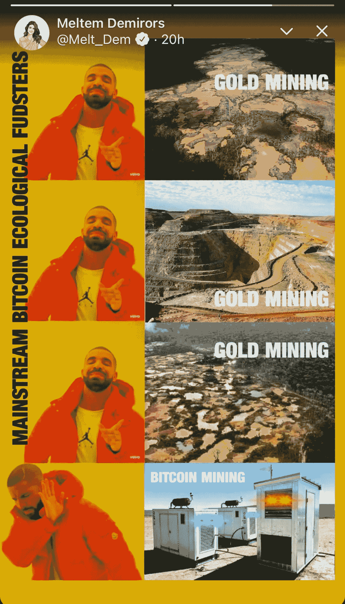

# 想了解一下比特币，但是不知道从何入手！

> 原文：<https://medium.com/coinmonks/i-want-to-learn-about-bitcoin-but-i-dont-know-where-to-start-3047a7b27a28?source=collection_archive---------5----------------------->

*我是一名比特币投资者和爱好者。我在不到 6 个月的时间里用加密技术赚了超过 10 万美元，我想给你一些比特币的基础知识。*

首先，让我们花一点时间来欣赏你在处理一个可能令人生畏和感到不知所措的问题时的勇气。

N ext，让我们弄清楚一些事情——没有人*完全理解*比特币，正如没有人能够完全理解汽车的发明对世界意味着什么。

早在 20 世纪初，人们常常对汽车司机说，“你疯了！你为什么不骑马或坐马车？简单多了。汽车在路上的平衡能力不如一匹马！你将在哪里得到汽油？马可以吃任何地方生长的草。如果你没油了，你就会搁浅。”

(请记住，他们的道路是由泥土或鹅卵石铺成的，加油站很少，而且没人认为这种情况会改变。)

当然，汽车制造商和司机可以理解汽车的引擎，但他们无法告诉怀疑者未来会发生什么；他们只知道这项技术是革命性的。谁能预料到有一天会修建一系列复杂的州际公路？从覆盖在土路上的沥青中，新的发明会涌现出来。滑板、踏板车、摩托车、依赖道路的不同运动和娱乐、让通勤成为每个人选择的公共交通系统，等等！

# “互联网会失败的。”

这是 20 世纪 90 年代常见的标题。二十多年后，我不确定我是否相信…

当你谈到**比特币这个话题时，**从一种总有一天会过时的新技术的角度来看待它会有所帮助。要完全理解它是什么以及如何使用它需要时间，因为它目前是新的。请对自己有耐心；随着你花更多的时间沉浸在这个话题中，你会开始越来越多地掌握它。

> 比特币是数字货币。
> 
> 比特币运行在区块链技术上。
> 
> 区块链保留交易的电子记录。

打个比方，区块链就是互联网，比特币就是一个网站。

Photo by [Ben Szymanski](https://unsplash.com/@macintoshaesthetic?utm_source=medium&utm_medium=referral) on [Unsplash](https://unsplash.com?utm_source=medium&utm_medium=referral)

如果你想了解比特币，首先，你必须了解钱和区块链的成就。在这里，我收集了一份**免费**资源清单，帮助你学习比特币、区块链以及“钱”是如何运作的基础知识。

*简而言之，*区块链是一种记录信息的系统，这种系统很难或不可能改变、入侵或欺骗系统。T2 区块链是交易的数字记录，在 T4 区块链 T5 的计算机系统网络上复制和分发。通过可以自由选择参与的无限数量的计算机系统来分发交易记录，世界上的每个人都有一个现存流通货币的分类账。这与中央银行当局的现行制度相反，现行制度只告诉你你有多少钱。

## 为什么这很重要

目前，当 Lisa 从她的银行向 Bobs 汇款时，账户中的数字会发生变化。-丽莎 5 美元，鲍勃 5 美元。鲍勃可以去他的银行提取 5 美元现金。虽然银行追踪每个人有多少钱，但它实际上并没有所有的库存现金。事实上，如果此时每个人都想把钱从银行取出来，我们会发现自己处于大约 20 世纪 30 年代的美国状况——没有足够的现金来周转。这意味着中央银行账本上记录的钱比流通中的钱多。用史酷比的话说— *ruh roh！*

最重要的是，发行的货币(美元)没有任何有价值的商品支持，它只是一张纸。

*1973 年，在尼克松总统的领导下，美国告别了* [*金本位*](https://www.thebalance.com/what-is-the-history-of-the-gold-standard-3306136) *，将美国货币变成了* [*法定货币*](https://www.investopedia.com/terms/f/fiatmoney.asp) *。历史记载中的每一种法定货币最终都失败了。*

# 比特币学习资源:

# 视频—不到 20 分钟

[比特币是什么？为傻瓜们简单解释的比特币](https://www.youtube.com/watch?v=41JCpzvnn_0&t=229s)—99 个比特币

[7 分钟区块链](https://www.youtube.com/watch?v=yubzJw0uiE4&t=166s) — Simplilearn

[街区学校](https://links.ledger.com/e/evib?_t=62c6a4ea5484430dbb7571e36c7bde50&_m=3b9ddefddf4d46f3b0703bf65c85b0e8&_e=AZ-we7CJ8SIsC_D6ei3O7jskJqPt2lDd6ecNSt0ucGQf_v7OLjeTHifTPRs8FALoOqA-T_gN-HSqdgdD3u0t4Xo1xzUD3UoI_GJnVJqMuQCb_6eQDE-jnThjXBD3sdNM) —总账

[区块链革命](http://blockchain-revolution.com/) — TED 演讲解释比特币和现实世界的使用

# 文章—不到 20 分钟

[为什么比特币如此重要](https://dealbook.nytimes.com/2014/01/21/why-bitcoin-matters/?_r=0) —马克·安德森

[比特币入门](https://bitcoin.org/en/getting-started)—bitcoin.org

[melt em demi mirors on bit coin，NFTs，and angel investing](https://thecaptable.sacra.com/p/meltem-demirors-coinshares-interview) (文章)——melt em 是 Coinshare 的高管，coin share 是一家拥有 40 亿美元资产的数字资产投资公司

# 纪录片:60-90 分钟

**"黄金&美元"**为我们生活的后经济危机世界搭建舞台我们如何以及为何面临通胀等问题。他们用通俗易懂的英语解释了什么是“钱”，为什么用最低工资根本不可能养活一个家庭，以及为什么今天的年轻人陷入了永无止境的债务循环。当你发现这是有意为之时，你可能会和我一样愤怒。看着这个让我很不安；它促使我采取行动。在意识到比特币可以被用作对抗经济不平等的武器后，我被吸引住了。

**《比特币的兴起与崛起》**讲述了来自匹兹堡的 35 岁程序员丹尼尔与妻子和三个男孩的生活。当他在 2011 年第一次发现比特币时，它成为了他的痴迷。他意识到这项技术改变世界的潜力。这部纪录片展示了比特币从一个小众编程爱好到被数百万人使用的不断发展的国际货币系统的过程，以及一路上的所有坎坷。

请点击此处查看:

*   黄金&美元:货币如何变得不值钱|货币解读 —世界货币纪录片
*   [比特币的崛起与崛起](https://youtu.be/sZ-aUlNY9_g) — 2014 年追踪比特币崛起的纪录片

> 你知道 2014 年 BTC 每枚硬币 850 美元吗？

今天，03/20/21，一个比特币价值 59000 美元。

# 文章:2-4 小时

*   [比特币:一种点对点的电子现金系统](https://bitcoin.org/bitcoin.pdf) —中本聪

“作为一种技术描述，比特币白皮书是第一份概述加密安全、不可信的点对点电子支付系统原则的文件，该系统从根本上设计为透明和抗审查，并将财务控制权放回个人手中。当时，金融市场的过度投机和银行拿价值数百万美元的储户资金冒险，引发了一场金融危机。”— [coindesk](https://www.coindesk.com/what-is-the-bitcoin-white-paper)

*   [隐足纲](https://www.gemini.com/cryptopedia) —双子座

“Cryptopedia 是一个旨在通过向世界提供免费、高质量的加密教育来促进这种理解的平台。”—双子座

# 书籍:1-3 天

*   [数字黄金](https://www.audible.com/pd/Digital-Gold-Audiobook/B00UX8QC2E?qid=1616206604&sr=1-1&ref=a_search_c3_lProduct_1_1&pf_rd_p=83218cca-c308-412f-bfcf-90198b687a2f&pf_rd_r=7D3GMV4NSFHXJV6V76CV) —纳撒尼尔·波普
*   [货币互联网](https://www.audible.com/pd/The-Internet-of-Money-Audiobook/B071KXKQD7?plink=9Q27hnw9LboWk4FH&ref=a_pd_Digita_c5_adblp13npsbx_1_3&pf_rd_p=84f8cf28-a842-4761-accd-e5126124c7a3&pf_rd_r=0GQQVV29F5GQZE4VF11F) —安德烈亚斯·安东诺普洛斯
*   [比特币标准](https://www.audible.com/pd/The-Bitcoin-Standard-Audiobook/B07D7ZRKLJ?plink=EIXBamJdDcMwwfRW&ref=a_pd_The-In_c5_adblp13npsbx_1_3&pf_rd_p=84f8cf28-a842-4761-accd-e5126124c7a3&pf_rd_r=Q1X7VPH2TTNMZ36M88C1) — Saifedean Ammous

根据你的学习风格，我强烈推荐你通过有声读物来听这些。我花了两天时间完成了《数字黄金》,同时还能倾听和享受我的生活。

**数字黄金由** [**纳撒尼尔·波普**](https://twitter.com/nathanielpopper) 把我压在了座位的边缘。你会从纪录片《比特币的兴起和崛起》中认出一些名字《数字黄金》向你展示了比特币发展的历史，它就在我们眼皮底下发展，而当时人们几乎还不知道如何收发电子邮件和访问网站。与任何新的货币体系一样，前进的道路上也有坎坷。罗马不是一天建成的，人们不会在一夜之间从以物易物转变为交换黄金。要了解比特币的未来，就要深挖它的起源。

**[**安德里亚斯·安东诺普洛斯**](https://aantonop.com/) 的《货币的互联网》是安德里亚斯关于比特币的演讲集。他使用迷人而歇斯底里的类比，以一种不那么技术性和相关的方式进一步阐明比特币。在车里听一段很棒的休闲音乐，或者做一份烤奶酪！**

****

****比特币标准作者**[**Saifedean Ammous**](https://twitter.com/saifedean?s=20)**这本书更深入地探讨了经济史和理论，解释了我们今天在历史上发展了多少货币体系。正如 audible 所描述的那样，“比特币标准分析了比特币崛起的历史背景、允许其快速增长的经济属性及其可能的经济、政治和社会影响。”****

# ****课程:1-4 周****

*   ****[人人用比特币](https://learn.saylor.org/course/view.php?id=468)——来自塞勒学院的免费比特币基础课程认证****
*   ****[7 天比特币速成班](https://99bitcoins.com/subscribe-to-newsletter/)——每天一封邮件，由 99 个比特币提供的短期教育速成班****

****在花了几个月的时间尽可能地吸收比特币的每一点信息，并已经设置了比特币钱包来购买比特币之后，当我看到由**塞勒学院**提供的这门课程时，我决定更进一步。****

********

****我完成了这门课程，并获得了通用比特币知识证书。在我自学之后，这门课程的某些部分感觉有些重复，但它绝对填补了经济学原理和钱包安全等知识的空白。****

****这 5 个单元的课程完全免费。通过完成所有单元，以及通过期末考试，你将获得一个证书，你可以添加到 [LinkedIn](https://www.linkedin.com/) ！****

## ****这是一个你将在第四单元学到的例子****

********

# ****关于比特币迷因和知识，请关注 Twitter:****

****[@熔体 _Dem](https://twitter.com/Melt_Dem)****

****[@michael_saylor](https://twitter.com/michael_saylor)****

****[@APompliano](https://twitter.com/APompliano)****

****[@Kayto_Han](https://twitter.com/Kayto_Han)****

********************************

> ****在迈克尔·塞勒的推文中，他经常回答遗留金融系统的问题或提供指控的背景****

****对比特币的一个常见误解是它对环境的影响。目前的媒体趋势是指责比特币过度使用能源，通过说“比特币的总用电量在荷兰之上！”对此，我用这个迷因来回应:****

********

******让我们把事情搞清楚——**我不是想“卖给你比特币”****

****想象一下 1995 年，互联网刚刚起步。亚马逊、雅虎、易贝和 Internet Explorer 都推出了。几乎没有人知道什么是网站，更不用说电子邮件了。少数确实了解互联网甚至很少参与的人今天变得非常富有。****

****如果每次有人说“我希望几年前买了亚马逊的股票”时，我都有一分钱****

****我不是想卖给你比特币。不，我是某个书呆子告诉你，你可能会后悔没有学习互联网——我的意思是，更快地*比特币*！****

# ****最后，我希望这些资源可以帮助你从某个地方开始。****

****Crypto 势不可挡，你并不孤单。许多人刚刚开始他们的未知之旅。九个月前，我无法告诉你比特币是什么。快进到今天，我已经从我的加密投资中赚了一大笔美元。现在我明白了这种货币可以改变人们的生活，我想告诉全世界！我相信我们一起崛起，在比特币的情况下，这是 1000%真实的。****

## ****请将此分享给任何你认识的刚接触比特币并准备学习更多知识的人！😀****