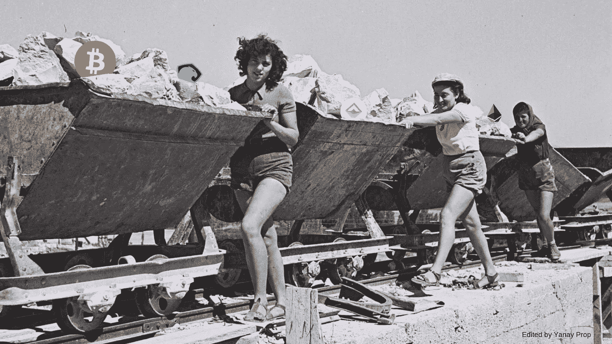

# 我想住在道里

> 原文：<https://medium.com/coinmonks/i-want-to-live-in-a-dao-9be39b890ff?source=collection_archive---------0----------------------->

Kibbutz work in the 60s (without the tokens😉)

一月份从阿拉康回来后，我无法停止思考阿刀和我的小家乡——以色列的一个集体农场——之间的相似之处。

**重要**——对于不熟悉刀这个名词的人，我建议看一下【aragon.org】的和[的刀培养箱](https://www.daoincubator.org/)

## 写这篇文章的目的

我发表这篇文章是为了强调加密网络在我们的世界中最具潜在影响力的用例之一。虽然许多公共话语似乎都围绕着加密作为可靠货币的想法，但我最感兴趣的是区块链的用例，它们赋予了决策和人类协作的自由。在这个具体的用例中，我看到了社区成为 DAO 的巨大潜力。现实地说，我认为我家乡的例子对大多数人来说更有意义。这是以色列的一个乡村( [Kibbutz](https://en.wikipedia.org/wiki/Kibbutz) )，建立在一个有趣的治理模式上，并且恰好是我的家乡。这个地方有点独特，我认为它可以从作为一个道运作中受益匪浅。

## 集体农场最关心的是分散经济

集体农场是一种社会习俗中的商业。那家企业的所有股东都在里面工作，一起生活，一起吃饭，分享利润。

作为一名工作集体农场成员，你应该:为集体农场的主要业务工作——通常在工厂、农业或其设施中的一个——例如，食堂、教育、医疗中心或其他。主要的想法是每个人都提供他们的工作，作为回报，可以指望集体农场照顾他们的所有需求。这意味着几乎所有东西都是免费的，包括食物、医疗、住房、交通、假期、香烟、酒等等。

集体农场的意识形态有点类似于一个开源社区，建立在“游戏中的皮肤”之上。每个成员都必须为整体做出贡献，并接受这样做的激励。

## 问题出在哪里

随着时间的推移，以色列的一些集体农场已经扩大了规模。这些企业大多是生产支票纸、婴儿尿布或农业解决方案的工厂(就像我的家乡一样)。另一方面，他们中的许多人从银行获得了大笔贷款，或者将股份出售给外部人士，为他们庞大工厂的巨额运营成本提供资金。

这是逐渐形成的，因为它的社会已经形成了一种过度消费的文化。在一切都是免费的地方，人类的本性就是消费多于所需。泡沫在 2000 年代初破裂，然后许多集体农场决定停止这个派对，导致欠银行太多钱。

集体农场已经分散了，没有任何东西是免费的，人们可以自由地在社区外工作。

## 社区的现状

我的集体农场已经偿还了债务(通过出售它曾经拥有的价值数十亿美元的农业设备工厂的股份)。如今，社区想要带回一些旧集体农场的文化。他们想招募新的集体农场成员，并投资新的企业来创造新的收入来源。到目前为止，事实证明这并不十分成功，因为缺乏激励去加入一个由一小撮人控制的、治理体系不健全的、经营不善的企业。也许这些词可以用在我的集体农场之外，来描述许多种类的社区、城市和国家。

## 这个社区如何作为一个道来改进

想想这些对这种社会的好处，更广泛地说，这个概念如何应用于更多的人口、城市、国家和大陆。

**如果这个社区是一把刀:**

*   每个集体农场成员都必须持有集体农场的令牌(TCR ),这将赋予他投票权，同时保持完全匿名。这将带来改进想法、合作和改变现实而不涉及任何政治的机会。
*   新成员必须购买本地令牌才能住在集体农场并参与管理。
*   代币是流动的、可转让的和有价值的。人们可以决定不让他们参与管理，并把代币卖给其他基布兹(道)成员。在这种情况下，他们不会是集体农场的一部分，而会被视为居民。如果他们相信这个项目，他们会长期持有资产。
*   集体农场的资金和财务将完全透明；每个人都可以追踪每一笔开销，并批评它。结果很可能是购买力和利用率的自动提高。
*   社交方面:铸造的代币越多，这个地方和社区就越受欢迎。价值在代币中累积。早期的信徒和贡献者受益于他们的支持。
*   这些代币将用于支付居民服务费。新来的人会给集体农场带来源源不断的现金流和服务费。
*   最重要的是，运营成本将会降低。支付给经理、负责人、财务总监等的大部分工资。会被淘汰。它将不再需要，因为它将由社区自动控制，由智能合同验证和授权。

一切都将是链上的、透明的，并且消耗更少的能量。人们会受到鼓励，参与社区决策，为当地的福祉做出贡献。更类似于过去，只是这一次，有更多的匿名性，透明度和自由。

这个概念中最让我兴奋的部分是拥有一个位置令牌。提供给特定位置的用户并由其使用的令牌。这种令牌的想法主要是只向与特定位置相关联的人表示值。我选择举这个例子是因为我认为，和所有事情一样，我们必须从小处着手，进行实验，不断发展，不断重复。一个小村庄(500 个居民)可能是采用成千上万个更大的居住社区的巨大基础。从一个小集体农场开始可能是在更大的社区和居民区测试 DAO 用例的第一步。一个成功的实验可以解放和自动化大量的官僚机构、(纸面)金钱和时间。

也许思考一下我们作为一个社会拥有一个基于位置的令牌的可能结果会很有趣。举个例子，拿着一个像我的家乡或者相反像旧金山这样的地方的标志的社会信号效应。如何将其转化为网络的价值、象征价值和人们的声誉？

## 结论

虽然分散决策经济的未来似乎是不可避免的(至少对我来说)，但仍有许多问题需要解决。建立这样一个治理体系的一些挑战包括达成社会共识，否则什么都不会改变。要达到这一点，需要大量的教育、开放的思想以及承认当前的体系已经崩溃。我很好奇，想看看我们能从以色列集体农场的特色中，结合道带给我们的创新，得到些什么。

一个没有独裁者的主权社区(无论是数字的还是实体的)，并由连锁治理提供动力，可能是我们将经历的最强大、最优雅的社会。

感谢 [Boris Wertz](https://medium.com/u/23d3bd5e855c?source=post_page-----9be39b890ff--------------------------------) 和 [Yannick](https://medium.com/u/6098e80b175b?source=post_page-----9be39b890ff--------------------------------) 对这篇文章提供了有用的反馈。

> [在您的收件箱中直接获得最佳软件交易](https://coincodecap.com/?utm_source=coinmonks)

