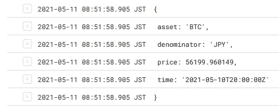

# 我写了一个无服务器的应用程序来自动在 GCP 购买加密货币

> 原文：<https://medium.com/coinmonks/i-wrote-a-serverless-app-to-automate-my-cryptocurrency-purchases-17c9a869d0c7?source=collection_archive---------4----------------------->

我不得不承认，在加密货币方面，我算是一个大器晚成者。

在 2017 年用 *shitcoins* 烧伤自己之后，我回去积累我在投资理论、区块链技术和比特币方面的知识，然后从 2020 年末开始作为 maxi 每周都会 DCA 到 BTC(我知道。不应该错过三月的跳水。)

尽管已经有了一个系统，有时候你*就是无法停止关注价格走势，最终想要把握市场时机。我在日本使用的交易所 BitFlyer 的重复购买功能也产生了大量开销。这一点以及我一直想尝试 l̵o̵s̵i̵n̵g̵用自动算法交易押注我的钱的事实，激励我编写自己的机器人并开源它，以防社区中有人发现它有用。*

[https://github.com/kalanyuz/gcp-cryptobot](https://github.com/kalanyuz/gcp-cryptobot)

我选择了 [nestjs](https://nestjs.com/) 作为这个机器人的框架，因为它非常通用并且非常可扩展。该机器人被设计为部署在[云运行](https://cloud.google.com/run)上，并利用他们的一些产品来增加安全性和减少维护。然而，它也被设计成容器化的，所以你可以很容易地修改它以在任何地方运行。

# 我们来谈谈吧

System diagram showing how the bot works (as of May 2021.)

对于规格，我希望机器人是 1。固定
2。弹性
3。可伸缩
4。可配置的

**安全**

当涉及到安全性时，容器化的应用程序为您提供了优势，在 CloudRun 上部署它可以让您访问 GCP 应用程序喜欢的工具，而不必自己进行配置。

该机器人已经建立了警卫和拦截器，将允许特定的传入请求(例如。仅接受来自 TradingView 的警报)或删除包含配置文件中不允许的资产交易请求的请求。如果你只想堆叠 sat，用服务账户 IAM 锁定你的应用，只允许来自[云调度器](https://cloud.google.com/scheduler)的请求。

它还利用 GCP 的[秘密管理器](https://cloud.google.com/secret-manager)来管理 API 密钥的存储，这样你就不必在你的源代码或终端命令历史中保留它。尽管如此，重要的是**永远不要给你的 API 键超过必要的访问权限**。例如，这个机器人只支持自动购买和出售，所以你不应该授予 API 键提取资金的权利。

**富有弹性**

部署容器化的无服务器应用程序可以最大限度地减少服务中断并保证正常运行时间(例如当你的房子停电时，你不会想在撞车前错过你的出口)。云运行也可以扩展到零，因此您的成本也保持在最低水平。

**可扩展**

NestJs 非常具有可扩展性。该机器人是非常模块化的，因此您可以通过添加更多的交换或服务和拦截器来扩展其安全功能，从而轻松地添加 contribute。

**可配置**

bot 为您提供了一个`config.yaml`文件，允许您配置 bot 的行为。在这里你可以设置你的自动买入再平衡配置文件，或者告诉机器人它可以交易哪些交易对。

# **示例用例**

**自动交易**
目前，该机器人支持 TradingView 中的警报，因此，如果您有订阅，您可以设置 webhooks 来发送警报上的购买/出售请求，机器人将处理其余部分。你可以从`exchange.ts`文件中的`BotRequest`类看到 bot 接受什么请求格式。

下面是我如何使用 [Piriya Sambandaraksa](https://medium.com/u/46f509fcc598?source=post_page-----17c9a869d0c7--------------------------------) 的 CDC-Actionzone 为我的机器人设置警报的例子:一个基于 EMA 的、非常简单、非常容易理解但相对安全的指示器。你可以在这里阅读指示器。如果你是泰国人，有兴趣了解更多关于比特币的知识，我强烈推荐他的 [youtube 频道](https://www.youtube.com/channel/UCxx6Lgcyxs01U1U1p4so8Ng)。

Don’t reveal your services’ URL to anyone else to reduce potential attack.

The bot logs the incoming requests so you can always check if it’s working as intended.

**自动堆栈** 这个很简单，你必须首先禁用从特定地址发出请求的全局守卫。之后，您可以设置一个调度程序 cron，以您想要的频率自动购买。例如，我使用`0 6 * * 1`在周一早上 6:00 自动完成我的每周采购。

# 合作者欢迎！

我本人计划在未来几周内增加对币安的支持，因为这是我目前正在使用的两个交换平台。

如果你喜欢这个机器人的想法，并希望增加你所在地区的交易所，或使其更容易在本地运行，请提交一份公关！