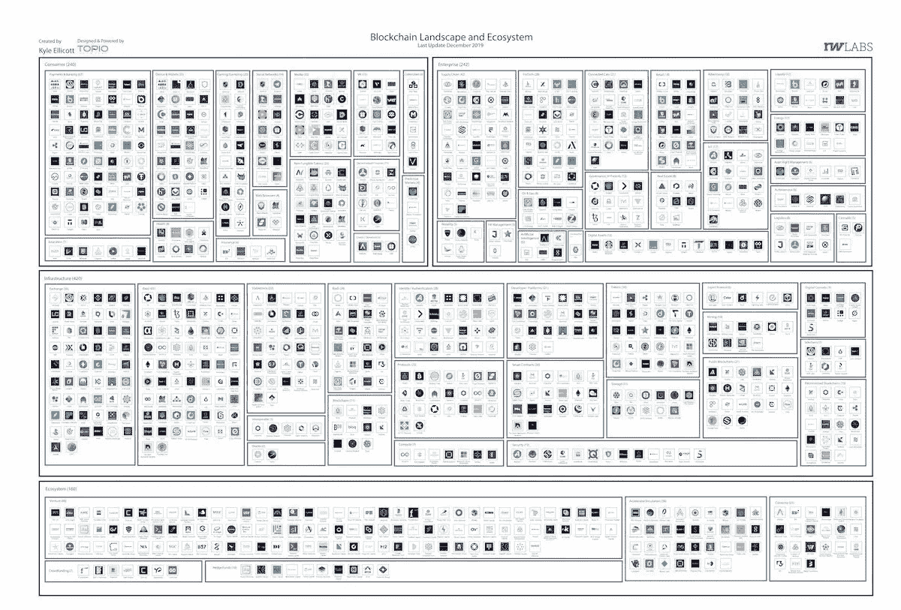

# IBM 宣布咖啡从农场到杯子/ 2020 预测/百度推出 Xuperchain

> 原文：<https://medium.com/coinmonks/ibm-announces-coffee-from-farm-to-cup-2020-predictions-baidu-launches-xuperchain-94f11029e5af?source=collection_archive---------1----------------------->

Photo by [Jamie Street](https://unsplash.com/@jamie452?utm_source=unsplash&utm_medium=referral&utm_content=creditCopyText) on [Unsplash](https://unsplash.com/s/photos/2020?utm_source=unsplash&utm_medium=referral&utm_content=creditCopyText)

*2020 年 1 月 8 日*

*新年快乐* 🥳 *欢迎来到咆哮的 20 年代！我很高兴从 CES 上发布我的第一篇 20 年代直播帖子开始这个新的十年！更多内容来自展览，但让我们深入了解区块链最近发生的一切，DApps & DLT 的风景。* ***IBM*** *和****Farmer Connect****本周在 CES 展会上发布了一款新的应用，该应用通过区块链将喝咖啡的人和种植咖啡豆的农民联系起来。* ***委内瑞拉汉堡王*** *在快餐连锁店开通加密货币支付。* ***百度*** *为其备受期待的开放网络区块链 Xuperchain 发布了公测版。* **安永&扬**宣布向公众发布他们的第三代零知识证明区块链技术。***电报*** *让我们知道 TON 钱包在推出时不会与它的消息应用程序集成，加上从* ***币安对 DeFi 无边界状态的研究，2020 年的预测*** *等等。*

*我们甚至在大量的研究中找到了补习的余地(* [*Q4 2019 区块链景观**&*](https://www.topionetworks.com/markets/blockchain-landscape-5bf43854b9abe4633c1f87da)[*DApps 景观*](https://www.topionetworks.com/markets/dapps-stack-landscape-5de8d07eb9abe453e04203f8) *) &书籍(关于* [*数字资产*](https://www.scribd.com/document/430637579/Current-Market-Overview-of-Digital-Assets)*&*[*企业区块链*！)、基础设施、DApps、比特币、经济学、交易所和 Stablecoins。为了了解更多信息，让你跟上时代的步伐，这里有一张本周业内热门新闻的快照。**](https://www.amazon.com/dp/B07Z3LJCHW/ref=cm_sw_r_tw_dp_U_x_C6iSDbACJJN2Z)

## ☕ [IBM 在 2020 年国际消费电子展上发布了一款可以追踪咖啡豆从农场到杯子的应用](https://www.techrepublic.com/article/ibm-and-coffee-sellers-announce-app-at-ces-2020-that-tracks-bean-from-farm-to-cup/)

科技巨头 IBM 和 Farmer Connect 宣布了一款新应用，该应用通过区块链将喝咖啡的人和种植咖啡豆的农民联系起来。该应用程序允许消费者支持农民社区，并提高咖啡销售商的透明度……[阅读更多信息](https://www.techrepublic.com/article/ibm-and-coffee-sellers-announce-app-at-ces-2020-that-tracks-bean-from-farm-to-cup/)

## 🍔[汉堡王在 40 家门店中率先开始比特币支付](https://cointelegraph.com/news/burger-king-venezuela-starts-bitcoin-payments-in-first-of-40-stores)

委内瑞拉的汉堡王(Burger King)与总部位于巴拿马的加密货币商户网关初创公司 Cryptobuyer 合作，在这家快餐连锁店开放了加密货币支付，该公司还运营着一批比特币自动取款机。该公司表示，我们已经开始接受比特币，以及 altcoins Ether、Litecoin、币安币(BNB)和 Dash (DASH)以及 stablecoin Tether (USDT)在我们位于加拉加斯 Sambil 地区的汉堡王分店，并将很快扩大到 30 家分店……[阅读更多](https://cointelegraph.com/news/burger-king-venezuela-starts-bitcoin-payments-in-first-of-40-stores)

## 📈[2020 年代的加密货币会怎样](https://blog.coinbase.com/what-will-happen-to-cryptocurrency-in-the-2020s-d93746744a8f)

据[比特币基地](https://medium.com/u/cbc31cc3214a?source=post_page-----94f11029e5af--------------------------------)[的联合创始人兼首席执行官 Brian Armstrong](https://medium.com/u/b9034df3e57a?source=post_page-----94f11029e5af--------------------------------) 称，到这个十年结束时，大多数科技初创公司都将拥有一个加密组件，就像今天大多数科技初创公司使用互联网和机器学习一样。政府和机构也将大举进入加密货币领域……[阅读更多](https://blog.coinbase.com/what-will-happen-to-cryptocurrency-in-the-2020s-d93746744a8f)

## 🇨🇳 [百度推出“Xuperchain”区块链项目公测版](https://www.theblockcrypto.com/linked/52145/baidu-launches-public-beta-for-its-xuperchain-blockchain-project)

中国领先的互联网搜索引擎百度于 2019 年 1 月 6 日推出了备受期待的开放网络区块链 Xuperchain 的公共测试版。根据最新报道，Xuperchain 网络将由一组主节点运行，从而将该系统归入高性能区块链网络的范畴……[阅读更多信息](https://www.theblockcrypto.com/linked/52145/baidu-launches-public-beta-for-its-xuperchain-blockchain-project)

## 📖[恩斯特&扬在以太坊的赌注上加倍下注](https://www.forbes.com/sites/benjessel/2020/01/06/ernst--young-doubles-down-on-their-bet-with-ethereum/)

审计和咨询巨头安永(Ernst & Young)宣布向公共领域发布他们的第三代零知识证明区块链技术，作为该公司努力使公共网络为企业采用做好准备的一部分。该公司表示，通过全力以赴公开区块链技术，它在自己的联盟中脱颖而出。然而，安永会计师事务所的区块链主管保罗·布罗迪(Paul Brody)提出了一个有说服力的论点，解释了公司为何采取尝试的方法，并指出了与私人网络相关的采用和加入的挑战……[阅读更多信息](https://news.8btc.com/chinas-tech-hub-shenzhen-kicks-off-cleanup-of-crypto-related-companies)

## 📖[2020 年 20 个区块链预测](https://money.com/ethereum-bitcoin-blockchain-predictions/)

作为数字资产风险管理顾问公司的管理合伙人和区块链软件巨头 [ConsenSys](https://medium.com/u/6c7078bf7b01?source=post_page-----94f11029e5af--------------------------------) 的前全球业务发展主管，Andrew Keys 对 2020 年的区块链做出了 20 项预测。这篇文章深入剖析了区块链技术的快速发展、加密市场的极端波动性以及新兴的生态系统和去中心化文化……[阅读更多](https://money.com/ethereum-bitcoin-blockchain-predictions/)

## 📖[为什么 2019 年实际上是区块链在金融服务领域的秘密成功](https://www.forbes.com/sites/biserdimitrov/2020/12/30/why-2019-was-actually-a-secret-success-for-blockchain-in-financial-services/#31eb9af61280)

2019 年是区块链科技在金融服务领域取得成功的一年。2019 年是稳定的硬币、支付网络和数字资产基础设施的一年。与医疗保健和保险等其他垂直行业相比，金融服务领域在采用区块链方面取得了更显著、更大的进步……[阅读更多信息](https://www.forbes.com/sites/biserdimitrov/2020/12/30/why-2019-was-actually-a-secret-success-for-blockchain-in-financial-services/#31eb9af61280)和了解更多信息 [Biser Dimitrov](https://medium.com/u/f91a4cb3fbb7?source=post_page-----94f11029e5af--------------------------------)

# 本周阅读的研究:

🔥今天，[币安](https://medium.com/u/57600910a883?source=post_page-----94f11029e5af--------------------------------)发布了他们关于**无边界 DeFi** 状态的最新研究。以下是一些关键要点:

*   基于以太坊的 DeFi 的用户端仍然很小，平均每月用户数超过 40，000 人，**这些用户中 90%都在使用分散式交易所**。
*   与此同时，活跃项目的数量，即每天超过 50 个用户的数量，在 2019 年几乎翻了一番，而不断涌现的开发者一直在开发新产品和建立新服务。
*   在 2020 年，我们预计**基于以太坊的 DeFi** 会有新的发展(例如，衍生产品、抵押不足的计划、ERC-20 USDT 协议的加入)**赌注会成为 DeFi** 的基础构建模块，而 **Alt-DeFi 会因为更突出的跨链互操作性解决方案等原因而获得发展势头**。

你可以在这里找到[完整报告](https://research.binance.com/analysis/defi-3-2020-borderless-state-of-defi)。

# 本周的更多内容:

📖[与 Booking.com 合作后，加密预订服务增长 33%](https://cointelegraph.com/news/crypto-booking-service-sees-33-boost-after-partnership-with-bookingcom)

📖[北美在 2019 年看到了最多的加密和区块链投资](https://www.theblockcrypto.com/linked/52031/north-america-saw-the-most-crypto-and-blockchain-investment-in-2019)

📖[互操作性:2020 年及以后的愿景](/the-liquidapps-blog/interoperability-a-2020-vision-and-beyond-816f734a6b40)作者[liquidps](https://medium.com/u/111b26bf40a9?source=post_page-----94f11029e5af--------------------------------)

📖[咆哮的 20 年代的 5 大技术趋势，第一部分:区块链、云、开源](https://www.zdnet.com/article/5-technology-trends-for-the-roaring-20s-part-one-blockchain-cloud-open-source/)

📖[基于委员会的区块链分片的安全性和可扩展性](/@adlerjohn/security-and-scalability-in-committee-based-blockchain-sharding-58fab3901193)作者[约翰·阿德勒](https://medium.com/u/a005f91be571?source=post_page-----94f11029e5af--------------------------------)

📖[到 2020 年底，卡尔达诺将成为最主要的力量](https://eng.ambcrypto.com/cardano-to-be-most-predominant-force-by-2020-end-charles-hoskinson/)

📖[看！那里！在哪里？2019 年 zkp 的新兴用例](https://www.theblockcrypto.com/post/52004/look-there-where-emerging-use-cases-for-zkps-in-2019)

📖[一些经济学家真的明白了](https://www.forbes.com/sites/caitlinlong/2019/12/28/some-economists-really-do-get-it/#17911d915217)由[凯特琳·龙](https://medium.com/u/7262834671c1?source=post_page-----94f11029e5af--------------------------------)

📖[通过](/shapeshift-stories/proof-of-keys-c09f8f643354) [ShapeShift](https://medium.com/u/5ee4b8323e7a?source=post_page-----94f11029e5af--------------------------------) 验证密钥

💰[中国央行表示，中国数字货币“进展顺利”](https://www.theblockcrypto.com/linked/52092/chinas-digital-currency-progressing-smoothly-says-central-bank)

# 分散式应用程序手表

## 📖 [Telegram 称 TON Wallet 在发布时不会与其消息应用程序整合](https://www.theblockcrypto.com/post/52128/telegram-says-ton-wallet-wont-integrate-with-its-messaging-app-at-launch)

因涉嫌非法出售 17 亿美元代币而与美国证券交易委员会发生纠纷。Telegram 表示，TON Wallet 是一个建立在网络上的应用程序，可以存储 TON 的原生 gram 令牌，它将是一个独立于 [Telegram Messenger](https://medium.com/u/dca24e3a130c?source=post_page-----94f11029e5af--------------------------------) 的独立服务。该公司还表示，它没有作出任何承诺或承诺为区块链开发任何应用程序，并且在网络上线后可能不会这样做……[阅读更多信息](https://www.theblockcrypto.com/linked/51183/libras-second-roadmap-outlines-its-final-push-toward-mainnet-launch)

## 📖[DApp 市场变得如此之大，这让谷歌和苹果感到担忧](https://telegra.ph/The-DApp-market-is-getting-so-big-its-making-Google-and-Apple-worry-01-01)

根据 [DappRadar](https://medium.com/u/b355b203c3dd?source=post_page-----94f11029e5af--------------------------------) 2019 dapp 行业回顾，[以太坊](https://medium.com/u/d626b3859bc9?source=post_page-----94f11029e5af--------------------------------) dapp 生态系统在今年出现了显著的增长。考虑到今年动荡的市场和围绕该平台的一些争议，这是一个了不起的成就……[阅读更多](https://telegra.ph/The-DApp-market-is-getting-so-big-its-making-Google-and-Apple-worry-01-01)

## 📖[与游戏和赌博 Dapps 相比，DeFi 仍然落后](https://www.coindesk.com/compared-to-gaming-and-gambling-dapps-defi-is-still-behind)

dapp 用户数量从 5 月份的 110，000 人减少到 12 月初的 41，000 人，减少了 62%。尽管去年围绕分散金融(DeFi)应用的增长和需求进行了大肆宣传，但游戏和赌博仍然是区块链应用最受欢迎的用例… [阅读更多信息](https://www.coindesk.com/compared-to-gaming-and-gambling-dapps-defi-is-still-behind)

📖dApps 真是个好主意。迄今为止的处决非常可怕。作者[弗雷德·克鲁格](https://medium.com/u/96b0bb995683?source=post_page-----94f11029e5af--------------------------------)

📖[网络效应:Gnosis Safe 和 Pepo，由](https://blog.gnosis.pm/network-effects-gnosis-safe-and-pepo-the-new-dapp-for-the-crypto-community-3b8160e62898) [Gnosis](https://medium.com/u/e7281ad70ea?source=post_page-----94f11029e5af--------------------------------) 开发的用于加密社区的新 dapp】

> *👉下载新的* [*区块链用于基础设施景观*](https://www.topionetworks.com/events/5d79268b78e00230faba6f77) *Q4 2019 版&* [*DApps“栈”景观*](https://www.topionetworks.com/markets/dapps-stack-landscape-5de8d07eb9abe453e04203f8)

**Q4 2019 Edition** of the Blockchain for Infrastructure & Ecosystem Landscape

不想等到下周，[现在就订阅](http://click1.m.readwritelabs.com/xsdqkbbrgsdtqkmntpjlstcnkytvpvphsnhsqlvbrhhd_yfqbfcmslnskglmckvqv.html?source=post_page---------------------------)📥有关区块链、DApps 等的实时行业见解！

> [直接在您的收件箱中获得最佳软件交易](https://coincodecap.com/?utm_source=coinmonks)

