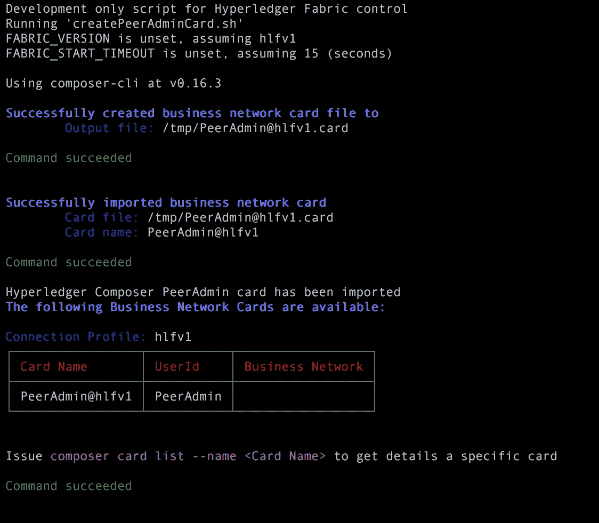

# Hyperledger 作曲家揭秘！

> 原文：<https://medium.com/coinmonks/ibm-blockchain-demystified-3af55ab7c7bb?source=collection_archive---------0----------------------->


# 什么是区块链，它对 IBM 意味着什么？

> “区块链是一个共享的、不可变的账本，用于记录交易的历史。它培育了建立信任、责任和透明度的新一代交易应用程序。”

简而言之，我们可以将区块链定义为“**分散的不变资产**

**Hyperledger 作曲**基于 *Hyperledger 架构*。Hyperledger fabric 是由 Linux 基金会创建的开源商业区块链。IBM 为 Hyperledger 项目做出了巨大贡献，并完成了各种基于 Hyperledger Fabric 的项目。与以太坊和其他基于加密货币概念的区块链不同，IBM 在私人和基于许可的商业区块链领域向前迈进了一步，参与者彼此认识。Hyperledger Fabric 区块链基于“实用拜占庭容错”协议。与以太坊的 PoW(证明或工作)协议不同，Hyperledger Fabric PBFT 协议没有挖掘的概念，这使得它在计算方面比以太坊有更好的性能，但它缺乏可伸缩性，这是一种折衷。

> [发现并回顾最佳区块链软件](https://coincodecap.com)


Comparison between 3 different blockchain technologies

# **打造你的第一个区块链，打造迷你学生级门户“BlockchainUDC”**

## 什么是 Hyperledger Fabric？

> Hyperledger Composer 简化了基于 Hyperledger Fabric 区块链基础架构的应用程序开发。

## 先决条件

1.  安装 Docker
2.  安装 VSCode 和 VSCode Hyperledger Composer 插件
3.  安装所需的 npm 节点软件包

```
 npm install -g composer-cli
 npm install -g generator-hyperledger-composer
 npm install -g composer-rest-server
 npm install -g yo
```

3.设置和运行 Hyperledger 结构

```
 mkdir fabric-tools
 cd fabric-tools
 curl -O [https://raw.githubusercontent.com/hyperledger/composer-                        tools/master/packages/fabric-dev-servers/fabric-dev-servers.zip](https://raw.githubusercontent.com/hyperledger/composer-tools/master/packages/fabric-dev-servers/fabric-dev-servers.zip)
 unzip fabric-dev-servers.zip
 ./downloadFabric.sh
 ./startFabric.sh
 ./createPeerAdminCard.sh
```


When you start Hyperledger Fabric



when you create a peer admin command with this command `./createPeerAdminCard.sh`

# 使用 Composer 实例化您的业务区块链

1.  创建新的项目目录

```
 mkdir app
 cd app
```

2.用你的 npm 插件实例化一个商业网络

```
yo hyperledger-composer:businessnetwork

> Business network name: my-network
> Description: A simple blockchain network
> Author name:  saif
> Author email: s4saif.121@email.com
> License: Apache-2.0
> Namespace: org.acme.mynetwork
```


3.导航到业务网络文件夹并安装依赖项

```
 cd my-network 
 npm install
```


Project structure of your network

*   您可以定义您的模型，这些模型可以是中的*参与者、资产、事件和事务*。这里的 cto 文件是 **org.acme.mynetwork.cto**
*   您在 lib 文件夹下的 **logic.js** 中定义智能合约的区块链逻辑

4.编写您的模型文件


*   **第 8–12 行:**您创建了一个将参与区块链的参与者，在本例中是教授。你用注释“o”定义你的类成员，用“→”定义关系
*   **第 15–19 行:**你定义你的资产，也就是学生的等级 *assetGrade。*该资产具有学生 ID 和等级。
*   **第 22–25 行:**您创建了一个智能合同来更改学生的最终成绩

5.编写您的 logic.js


*   在这里，您对智能合约的功能进行编码，这是您的业务逻辑。
*   **第 7 行:**声明在模型文件中实例化的智能契约事务
*   **第 10–18 行:**原型化您的交易功能，即您的智能合约。**第 11 行**在您的资产模型中保存新等级。第 13 行调用管理存储在区块链中的资产的 assetregistry 方法。**第 14–17 行**是一个回调承诺，如果使用定义的正确名称空间可以成功访问合同。**第 17 行**更新区块链中的资产，这是您的新等级

## 创建。bna 文件

一旦一切都设置好了，让我们创建一个. bna 文件来定义你的区块链的编译逻辑

```
 mkdir dist
 composer archive create --sourceType dir --sourceName . -a ./dist/network.bna
```


As simple as that :)

## 在 composer playground 上测试您的区块链应用

**什么是作曲家游乐场？**

> Hyperledger **作曲家游乐场**！在这个 web 沙箱中，您可以部署、编辑和测试业务网络定义

前往[https://composer-playground.mybluemix.net](https://composer-playground.mybluemix.net)使用作曲家游乐场

1.  创建导入/替换按钮并选择*拖放到此处上传或浏览*


2.选择你的。根据之前的命令创建的 bna

3.转到测试目录，实际测试您的业务区块链应用程序

4.创建一个新的参与者，在本例中是教授


5.创建一个空资产，即学生成绩


6.点击*提交交易*按钮，调用智能合同更改等级


7.智能合同将被调用，资产将发生变化。

8.在*所有交易*按钮中，您将拥有通过智能合约进行的所有交易的历史记录


## 部署。Hyperledger Fabric 区块链上的 bna 文件

```
> composer network install --card PeerAdmin@hlfv1  --archiveFile <business-network-archive>composer network start --networkName <business-network-name> --networkVersion <business-network-version> --networkAdmin <admin-name> --networkAdminEnrollSecret <enroll-secret> --card <peer-admin-card> --file <admin-card-file-name>
> composer network start --card PeerAdmin@hlfv1 -A admin -S adminpw -a dist/network.bna -f networkadmin.card
> composer card import -f networkadmin.card
```


composer runtime install — card PeerAdmin@hlfv1 — businessNetworkName my-network


composer network start — card PeerAdmin@hlfv1 -A admin -S adminpw -a network.bna -f networkadmin.card


`composer card import -f networkadmin.card`

## 用 Restfull CRUD Apis 连接你的区块链

```
> composer-rest-server
```


Fill in your proper details which correct network card name which we recently created

在 http://localhost:3000 :)上探索 loopback 创建的 Restful Apis


Awesome!

现在，您可以利用这些 rest apis 在 Angular/React/Vuejs 或您选择的框架中创建一个合适的前端应用程序。

# 阅读更多信息:

1.  关注我更多:[https://www.engineerability.com](https://www.engineerability.com)

> [直接在您的收件箱中获得最佳软件交易](https://coincodecap.com/?utm_source=coinmonks)

[](https://coincodecap.com/?utm_source=coinmonks)

## **结论**

本教程仅介绍了基本知识，以便通过使用 Hyperledger Composer 开始使用基于 Hyperledger Fabric 的 **Hyperledger Composer** 。我们成功地创建了一个端到端的区块链，允许教授存储学生的成绩。在本教程的基础上，你可以创建一个黑板的区块链复制品。有了区块链，可能性是无限的。

如果这是一个信息丰富的博客，如果你喜欢，请鼓掌:)写这个博客已经付出了很多努力。

[](http://bit.ly/2G71Sp7)

**Click to read today’s top story**