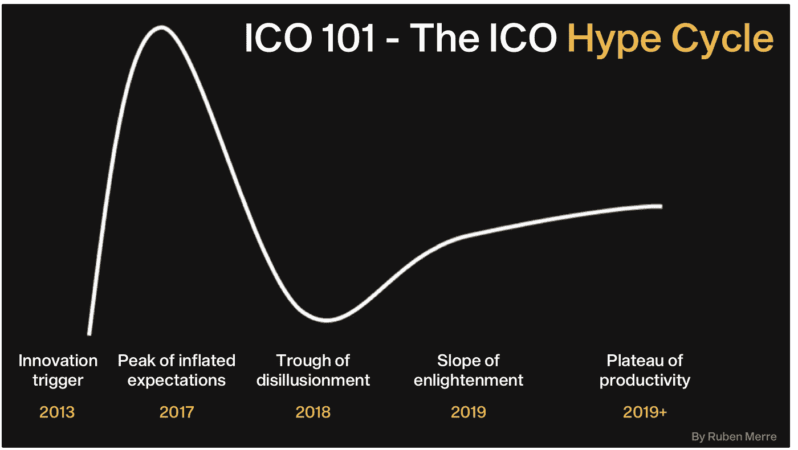
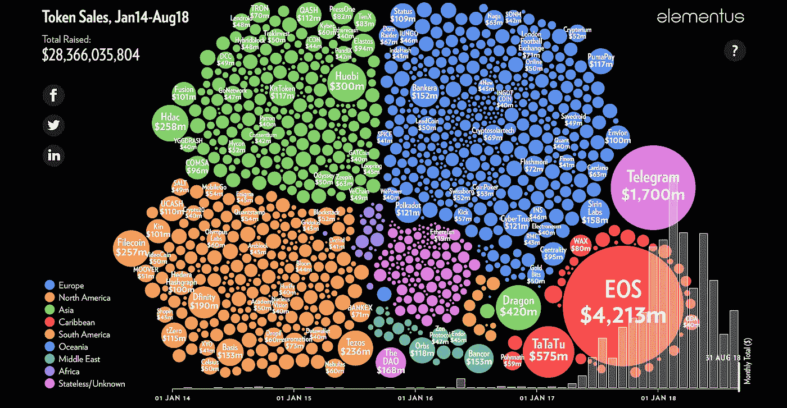
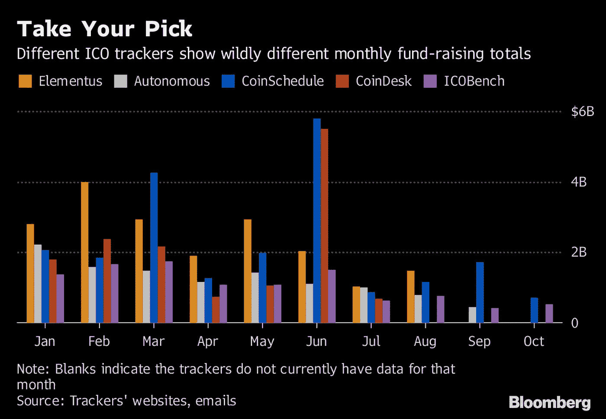
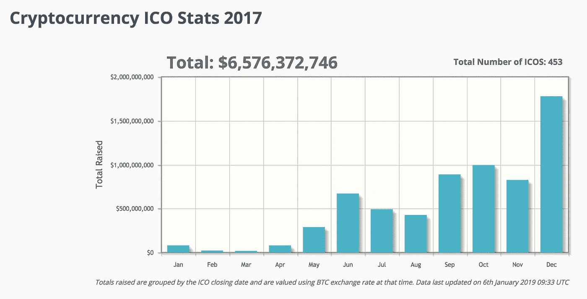
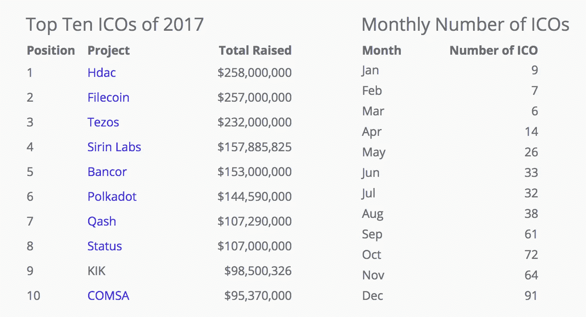
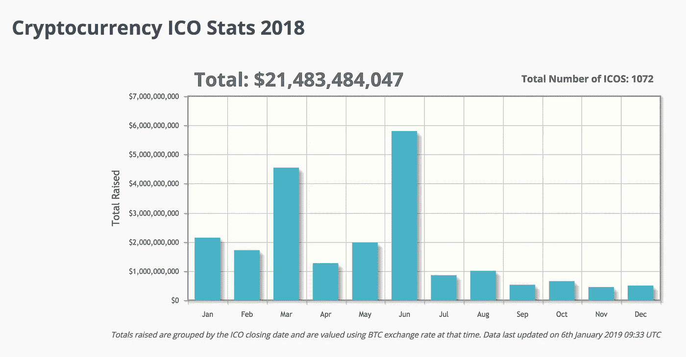
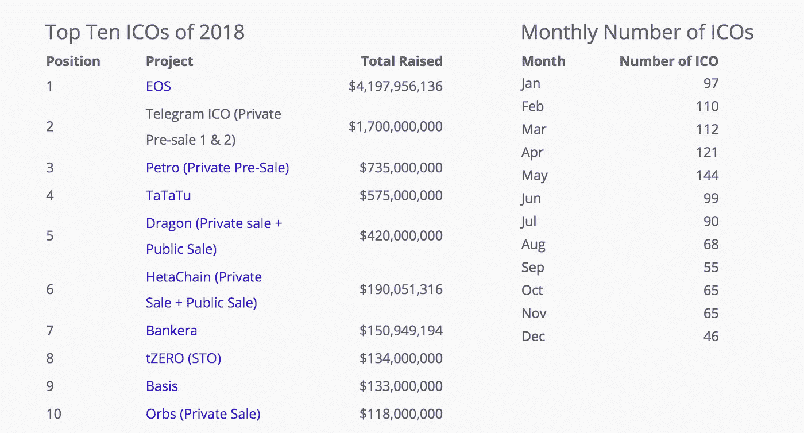
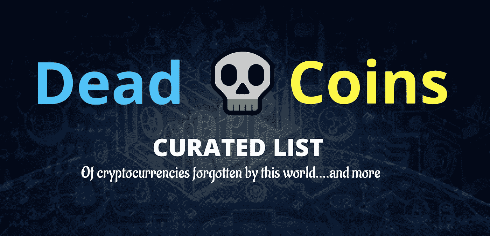
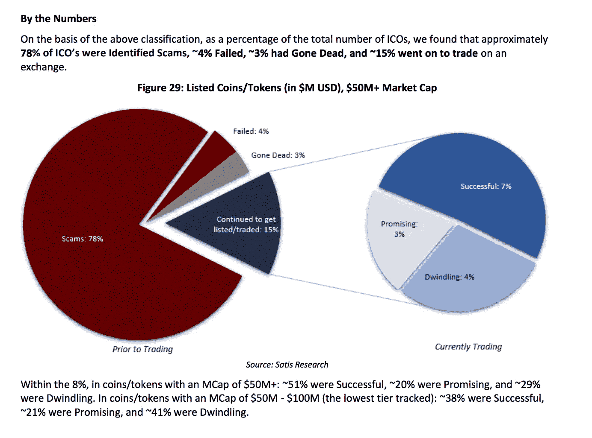

# ICO 101——最初的硬币发行炒作周期

> 原文：<https://medium.com/coinmonks/ico-101-the-initial-coin-offering-hype-cycle-3855274ac2ff?source=collection_archive---------0----------------------->

ICOs 如何在 2017 年蓬勃发展-在 2018 年面临现实检查，并在 2019 年重振新的改进框架

The ICO Hype Cycle

作者的 2021 年快速更新:请在这里找到关于 ido(初始 Dex 产品)以及 ico 如何演变成 ido 的最新文章:

 [## 从 ICO 到 IDO:加密资金炒作周期的演变

### ico 如何以及为什么演变成 ieo 和 ido(初始 Dex 产品)

medium.com](/ngrave/from-ico-to-ido-evolution-of-the-crypto-funding-hype-cycle-5f867a1c367d) 

# 0.介绍

亲爱的读者:

本文是关于初始硬币发行(ico)、初始交易所发行(ieo)、分散自治 ico(DAICOS)和安全令牌发行(sto)的完整系列文章的一部分。

你可以找到最重要的[部分 I 她的](https://hackernoon.com/a-comprehensive-guide-to-icos-crypto-funding-the-rise-the-boom-the-bust-the-next-b159fdf38010) e:

 [## 下一代 ico 和加密基金的综合指南

### 为什么需要转变观念& ico 的未来会是什么样子

hackernoon.com](https://hackernoon.com/a-comprehensive-guide-to-icos-crypto-funding-the-rise-the-boom-the-bust-the-next-b159fdf38010) 

这里还有[第二部](https://hackernoon.com/a-comprehensive-guide-to-the-next-generation-of-crypto-funding-v-ico-ieo-daico-eto-sto-939909782da6):

 [## 下一代加密基金综合指南| (V)ICO | IEO |戴科|埃托| STO |

### ICOs 时代的到来。探索加密资金革命的下一步。(第二部分)

hackernoon.com](https://hackernoon.com/a-comprehensive-guide-to-the-next-generation-of-crypto-funding-v-ico-ieo-daico-eto-sto-939909782da6) 

快乐阅读！

# 1.最初的硬币发行热潮。ICOs anno 2017。

在 2013 年和 2014 年的第一批 ico 之后，包括以太坊令牌的销售(正如我在上一篇文章中详细解释的[)，真正的势头到来之前需要一些时间。但到 2017 年，最初的硬币发行火了。突然间，一切变得如此艰难，以至于整个加密市场完全变成了抛物线。在某些时候，基本上任何热衷于快速赚钱的人都可以提交一份数字所谓的#白皮书，在许多情况下，这是一个完全虚构的业务，而秘密投资者——更确切地说是投机者——仍会向他们投入超出想象的大量资金。](https://hackernoon.com/ico-101-history-of-initial-coin-offerings-icos-part-1-from-mastercoin-to-ethereum-4689b7c2326b)

看看下面的气泡图就知道了。它以互动的方式工作，你可以看到截至 2017 年初气泡是如何破裂到屏幕上的:

# 2.筹到的钱。2017 & 2018 年度热门项目。

那么到目前为止，ICOs 实际上已经筹集了多少资金呢？[据 Bloomber](https://www.bloomberg.com/news/articles/2018-11-05/how-much-have-token-sales-raised-in-2018-depends-on-who-you-ask) g 报道，这要看你问谁了。他们这样说:

> “区块链可能被宣传为不可改变的公共账本，但在它催生的充满争议的加密世界中，当披露标准仍在每天即兴制定时，确立真相可能会很棘手。就 ico 而言，由于没有人需要提交任何监管文件，甚至披露他们的身份，因此仍然很难确定发行者声称自己筹集了多少资金。(贾丝汀娜·李，彭博)

据报道，实际筹集的资金可能相差多远的一个例子是加密交换项目 Ruby-x。coin schedule 说它筹集了 12 亿美元；ICORating，2 亿美元；Autonomous Research 表示，选择排除它是因为它的在线足迹不可靠。Ruby-X 没有透露其总部在哪里，也没有回复寻求置评的电子邮件。

显然，鉴于加密货币的不稳定性，它还取决于你确定的官方 ICO 截止日期。还是 ICO 发布日期？还是预发射？还是？此外，由于特定加密货币之间的“汇率”可以同时与典型的比特币或以太币挂钩，以投资于该项目，因此在法定货币也可以投资的情况下，需要类似的东西。然后，实际上问题就出现了，汇率何时真正固定下来。最好也给菲亚特，因为这是他们试图在这里报告以上。如果能有某种标准化的方法来实际测量它，那就太好了。但是话说回来，ICO-ers 可能不太关心这样一个“会计”的“细节”。

无论如何，对于那些仍然在寻找一个有趣的资源来查找实际的 ICO 相关汇总数据的人来说， [CoinSchedule](https://www.coinschedule.com) 可能是一个有趣的网站。你可以在下面找到几张截图，显示了特定时间段内的总筹资额以及前十大 ico 的规模(以及其他信息)。2017 年，最大的一批包括 1 亿美元-2.5 亿美元的 Hdac、Filecoin、Tezos、Sirin Labs、Bancor、Polkadot、Qash 和 Status。所有这些名字对如今的普通密码爱好者来说应该听起来很熟悉。

2018 年，排名前几位的项目都筹集了 2017 年 2.5 亿美元的数倍资金。#仅 EOS 就筹集了超过 40 亿美元，Telegram 筹集的资金不到 2M 美元。这又把我们带回到整个“现在筹集的实际金额是多少？”问题。例如，[彭博](https://www.bloomberg.com/news/articles/2018-11-05/how-much-have-token-sales-raised-in-2018-depends-on-who-you-ask)报告的石油公司价值为 7 . 35 亿美元，如下所示:

> “今年 3 月，总统尼古拉斯·马杜罗表示，石油项目已经获得了 50 亿美元的报价；今年 4 月，他说这次出售筹集了 33 亿美元；CoinSchedule 和 ICORating 引用的数字是 7.35 亿美元。(贾丝汀娜·李，彭博)

[彭博还报告了](https://www.bloomberg.com/news/articles/2018-11-05/how-much-have-token-sales-raised-in-2018-depends-on-who-you-ask)另一层复杂性:

> “让事情变得更复杂的是，ico 的性质也在不断演变。越来越多的代币以私人方式[提供给选定的投资者，而不是像这项创新最初为人所知的那样通过互联网众筹(贾丝汀娜·李，彭博)](https://www.bloomberg.com/news/articles/2018-08-08/token-sales-turn-exclusive-as-private-investors-snatch-up-deals)

# 3.ICOs 变成了流氓。骗局。狗屎硬币。杰苏斯科恩。

到目前为止，我们还没有深入了解 ICOs 真正的阴暗特征。但是一篇关于 ICOs 的文章，如果没有提到 scam 或 shitcoin 这个词，那将是闻所未闻的！所以让我们开始吧。一个让你开始了解这个奇妙世界的有趣网站是 https://deadcoins.com/。

[Deadcoins.com](https://deadcoins.com/)提供了不少于 680 个“死亡”硬币，12 个“黑客”，即与恶意软件客户端一起工作的 ico(有趣吧？！)、182 个骗局、60 个恶搞币(如 JesusCoin、Bitcorn、ButtCoin、SexCoin、Asstoken、CryptoMeth、ObamaCoin、TrollCoin、ScamCoin 等。)

2018 年 7 月出版的彭博的一份令人难以置信的全面[研究文件报告称，约 78%的 ico 在交易前被识别为骗局。不用说，我并没有凭空创造出相关的 scammy 角色！](https://research.bloomberg.com/pub/res/d28giW28tf6G7T_Wr77aU0gDgFQ)

该报告进一步强调，尽管超过 80%的项目(按份额计算)被认定为骗局(uuff！至少大部分资金流向了质量！).对于顽固分子，你可以在报告第 23 页的下图中找到术语的确切含义。

# 4.更好的替代方案的出现:DAICOs、IEOs、sto 和 eto。

我已经写下了一整篇关于下一个接管 ICOs 筹款能力的竞争者的文章。这篇文章相当大，可以在这里找到。每一种选择都有自己的优点和缺点。此外，根据你的目标是什么样的筹资或代币发行，通常这些方法中的一种会更受青睐和/或推荐。

# 5.启蒙的斜坡

在经历了激烈的加密熊市和 ICO 热潮之后的大规模低谷之后，市场上的一些首批稳定信号在 2019 年期间实现了，同时出现了新的融资替代方案。有一点似乎一天比一天确定:符号化的趋势是真实的。更好、更有意义的融资方式和区块链平台将会出现，越来越多的资产类别将拥有基于区块链的代币版本。是时候进入生产力的平台期了吗？

**注**:作者 2021 年快速更新:请点击此处找到关于 IDOs(初始 Dex 发行)以及 ICOs 如何演变成 IDOs 的最新文章[:](/ngrave/from-ico-to-ido-evolution-of-the-crypto-funding-hype-cycle-5f867a1c367d)

 [## 从 ICO 到 IDO:加密资金炒作周期的演变

### ico 如何以及为什么演变成 ieo 和 ido(初始 Dex 产品)

medium.com](/ngrave/from-ico-to-ido-evolution-of-the-crypto-funding-hype-cycle-5f867a1c367d) 

**Outro:**

如果你喜欢这篇文章，别忘了点击拍手按钮！

并随时关注我 [**中**](/@ruben.merre) **。**

再次感谢阅读和鼓掌。

[鲁本](https://www.linkedin.com/in/ruben-merre/)

**关于 Ruben 和 NGRAVE:**

*Ruben Merre 是一位技术企业家，通晓多种语言，终身学习，是世界上最安全的加密货币钱包“ZERO”背后的数字资产安全公司*[*n grave*](https://ngrave.io/)*的创始人兼首席执行官。自 2018 年以来，鲁本和他的团队与纳米技术、密码学和硬件安全领域的顶级人士以及思想领袖合作，如著名密码学教授、比特币论文的第二参考文献 Jean-Jacques Quisquater。结果是:一个真正的端到端数字资产管理解决方案，具有最高的安全性(EAL7，世界上最高的安全认证)，以及直观的用户交互。*

 [## NGRAVE |无与伦比的加密安全性和无缝体验

### 第一个端到端的加密管理解决方案。最冷的硬件钱包。最冷的钥匙备份。不…

ngrave.io](https://ngrave.io) 

## 另外，阅读

*   最佳加密交易机器人
*   [德里比特评论](/coinmonks/deribit-review-options-fees-apis-and-testnet-2ca16c4bbdb2) |选项、费用、API 和 Testnet
*   [FTX 密码交易所评论](/coinmonks/ftx-crypto-exchange-review-53664ac1198f)
*   最好的比特币[硬件钱包](/coinmonks/the-best-cryptocurrency-hardware-wallets-of-2020-e28b1c124069?source=friends_link&sk=324dd9ff8556ab578d71e7ad7658ad7c)
*   [加密复制交易平台](/coinmonks/top-10-crypto-copy-trading-platforms-for-beginners-d0c37c7d698c)
*   最好的[加密税务软件](/coinmonks/best-crypto-tax-tool-for-my-money-72d4b430816b)
*   [最佳加密交易平台](/coinmonks/the-best-crypto-trading-platforms-in-2020-the-definitive-guide-updated-c72f8b874555)
*   最佳[加密贷款平台](/coinmonks/top-5-crypto-lending-platforms-in-2020-that-you-need-to-know-a1b675cec3fa)
*   [block fi vs Celsius](/coinmonks/blockfi-vs-celsius-vs-hodlnaut-8a1cc8c26630)vs Hodlnaut
*   [莱杰 vs 特雷佐](/coinmonks/ledger-vs-trezor-best-hardware-wallet-to-secure-cryptocurrency-22c7a3fd391e)
*   Bitsgap 评论——一个轻松赚钱的加密交易机器人
*   为专业人士设计的加密交易机器人
*   [3commas Review](https://blog.coincodecap.com/3commas-review-an-excellent-crypto-trading-bot) |一款优秀的密码交易机器人
*   [PrimeXBT 审查](/coinmonks/primexbt-review-88e0815be858) |杠杆交易、费用和交易
*   Bitmex 的[保证金交易指南](/coinmonks/the-idiots-guide-to-margin-trading-on-bitmex-dbbd7742c6fc?source=friends_link&sk=7bfa99d2a181142510c8442c8ddb0786)
*   [加密摇摆交易的权威指南](/coinmonks/the-definitive-guide-to-crypto-swing-trading-7e4af6496d4d?source=friends_link&sk=70448050bd9323b42f63bfc0bb1e60d1)
*   [Bitmex 高级保证金交易指南](/coinmonks/bitmex-advanced-margin-trading-guide-2270c195ce25?source=friends_link&sk=1d986cca731f5084b9a2db4a4bc4a7ad)
*   面向开发者的最佳加密 API
*   [加密套利](/coinmonks/crypto-arbitrage-guide-how-to-make-money-as-a-beginner-62bfe5c868f6)指南:新手如何赚钱
*   顶级[比特币节点](https://blog.coincodecap.com/bitcoin-node-solutions)提供商
*   最佳[加密制图工具](/coinmonks/what-are-the-best-charting-platforms-for-cryptocurrency-trading-85aade584d80)
*   了解比特币的[最佳书籍有哪些？](/coinmonks/what-are-the-best-books-to-learn-bitcoin-409aeb9aff4b)

> [直接在您的收件箱中获得最佳软件交易](https://coincodecap.com?utm_source=coinmonks)

