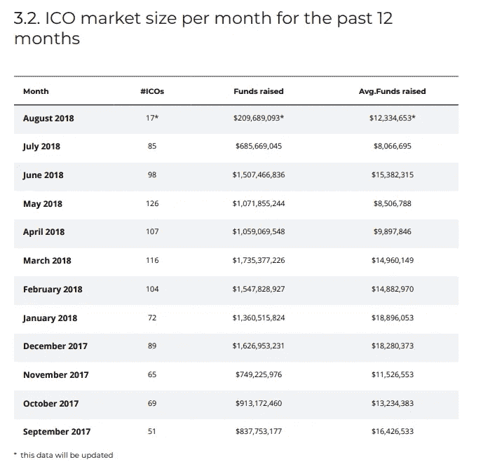
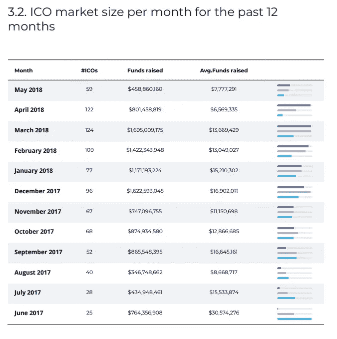

# ICO 市场放缓:夏天还是沉睡？

> 原文：<https://medium.com/coinmonks/ico-market-slows-summer-or-slumber-698c2fd1abc9?source=collection_archive---------7----------------------->

ICOBench 最近发布的分析[指出，最近几个月，ICO 的推出和融资都明显放缓。首次发行硬币有时被称为“代币销售”或“代币发行”。](https://icobench.com/report)

当一家公司正在创造一种具有相关效用的新产品，并希望预先建立一个利益相关者生态系统，这些利益相关者将从尽早购买该产品中受益时，就会出现 ICO。这种代币销售使公司能够进一步开发他们的产品，并建立用户基础，公司可以使用一些收益来制造产品。

ICOBench 收集的信息显示，从 6 月到 7 月，融资活动明显放缓，融资额下降了令人瞠目的 10 亿美元。本月看起来更加可怕，只有 30%的 7 月贫血的结果是由 ICO 的。到目前为止，8 月份的结果只有 6 月份的 14%。

Credit: ICOBench

这些结果只涵盖了众所周知的市场:许多 ico 的所谓“私人销售”阶段，这是在私下讨论中进行的，通常没有广告或新闻报道，不包括在这一数据中。它描绘了一幅市场自由落体的画面，资金下降到过去一年未见的水平。

但这并不能说明事情的全部。查看来自同一来源的早期报告，ico bench 5 月份的每周市场评论显示，2017 年 7 月和 8 月的融资明显放缓。虽然这一下降没有 2018 年期间那么严重，但投资者在暑假期间不参与融资可能是因果关系。

Credit: ICOBench

这将使 ICO 市场更像资本市场，如风险投资、首次公开募股和各种债务融资机制，其中每一个都在夏季“休假”4-8 周。但即使是最积极的说法也无法抵消原始事实:7 月和 8 月是通过 ICO 进行众筹的糟糕月份。

9 月份将标志着恢复去年的增长，还是巩固市场的向下转移？30 天后我们就会知道了。

*关于达纳洛夫:我目前是两个 ico 的密码经济顾问:*[*eLocations*](https://elocations.io/)*和*[*Intellos*](http://intellos.com)*和总裁兼首席技术官，*[*Radpay*](https://radpay.com/)*的创始人。2011 年首次参与区块链工作，我拥有经济学博士学位(格拉斯哥大学，最高荣誉)、市场营销 MBA 学位(哈佛商学院，贝克学者)和物理学学士学位(里士满大学，Phi Beta Kappa)。自从我年轻时在 MORTRAN 和 ALGOL68G 开始编写代码以来，我已经与人共同创立了五家公司，其中四家成功退出，包括思科资本支持的 Metacloud 和华平投资支持的 Radnet，并领导了包括 GTE(现为威瑞森)、韵律互动(现为凯捷)和 ADC 在内的上市公司部门。我的研究方向是公共政策，最近的研究方向是区块链和大数据对新兴经济体的影响。我过去的一些工作包括构建第一个基于云的 ERP 系统(在 90 年代中期)，开发世界上第一个电信级 VoIP 和统一通信平台(在 GTE，现在的威瑞森)，以及大数据系统的早期工作(作为甲骨文的合作伙伴)。)我在大数据、机器学习、区块链和 VoIP 方面的工作已经在《连线》、甲骨文的《利润》杂志、《金融时报》和《电话》杂志上发表。*

> [直接在您的收件箱中获得最佳软件交易](https://coincodecap.com/?utm_source=coinmonks)

