# 🚀带恒星的 ICO

> 原文：<https://medium.com/coinmonks/ico-with-stellar-1ced0c729928?source=collection_archive---------1----------------------->

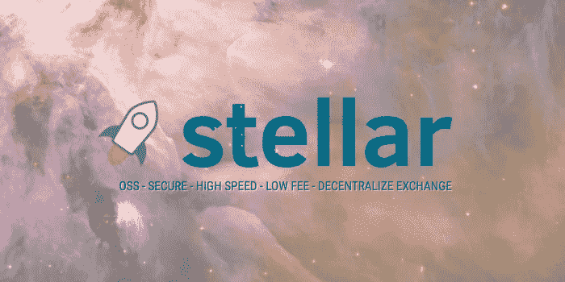

**Image Credit:** [NASA](http://www.nasa.gov/), [ESA](http://www.spacetelescope.org/), and [The Hubble Heritage Team](http://heritage.stsci.edu/)

我应该从[说服](https://www.stellar.org/blog/Q1-2018-stellar-and-state-of-crypto/)你[为什么我选择**恒星**而不是**以太坊**](https://www.coindesk.com/why-a-39-million-ico-chose-stellar-over-ethereum/) 做 ICO 开始，但是[其他人已经做了这个](https://hackernoon.com/why-stellar-could-be-the-next-big-ico-platform-f48fc3cb9a6c)和[那个](https://keybase.io/blog/keybase-stellar)，所以让我们把注意力集中在“如何做”上！:D

> [发现并回顾最佳区块链软件](https://coincodecap.com)

# 步骤 1 —创建帐户

1.  前往**恒星**仪表盘(在**测试网**上):[https://www.stellar.org/laboratory/#account-creator?网络=测试](https://www.stellar.org/laboratory/#account-creator?network=test)
2.  创建并资助发行人、经销商、投资者账户

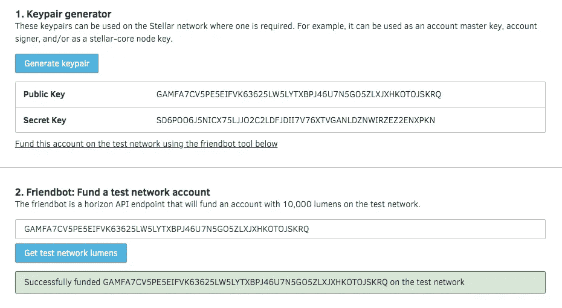

```
// Issuer **Public Key:** GCYEJSMEEP7VQFFS6WELX3QSJRL3OQFIZ4MGXQL6R56P33TKBFBT2GNZ
**Secret Key:** SB3AMLXIMVVUIUUR4RAB6PPUU7JLTICLYL5ASUSF5TFK45RVYI2KVN55// Distributor
**Public Key:** GCUBEOLQ5DOTG5WMCXRCX4MPNXEXLW6JTVO3KDM53ZZIXIL3L4Z6XEI4 **Secret Key:** SCFY4M2KKPIH5FOBQSJ65FKBFVDRVIODD64XKCL76DMBTYLBSPED7FEU// Investor
**Public Key:** GAMFA7CV5PE5EIFVK63625LW5LYTXBPJ46U7N5GO5ZLXJXHKOTOJSKRQ **Secret Key:** SD6POO6J5NICX75LJJO2C2LDFJDII7V76XTVGANLDZNWIRZEZ2ENXPKN
```

> 所以我们得到了**公钥**和**秘钥**，一定要把**秘钥**保密，不要这样公开发布！

# 步骤 2— **经销商**信任我**发行人**

//我们需要首先让分发帐户信任发行帐户。

1.  进入**交易生成器**部分的 Stellar 仪表盘:[https://www.stellar.org/laboratory/#txbuilder?network=test](https://www.stellar.org/laboratory/#txbuilder?params=eyJhdHRyaWJ1dGVzIjp7InNvdXJjZUFjY291bnQiOiJHQlpINUhaTFhLVU5KTUhMNEJTT1lTTU5aU0NGVFpGNzJUQ05VRExVVEZNSlhCTklET0kzMlhXVyJ9LCJvcGVyYXRpb25zIjpbeyJpZCI6MCwiYXR0cmlidXRlcyI6e30sIm5hbWUiOiJjaGFuZ2VUcnVzdCJ9XX0%3D&network=test)
2.  将**经销商公钥**用于**源账户**
3.  点击**获取从…** 按钮开始的账户的下一个序列号

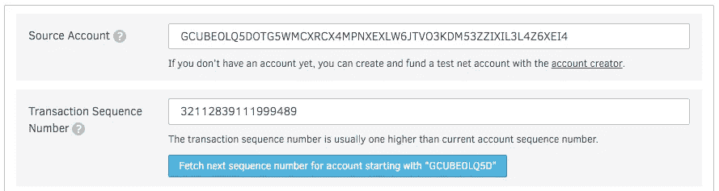

4.为**操作类型**选择**改变信任**

5.添加您的资产代码(在我的例子中是 **FOO** )、**发行人公钥**


6.点击**登录交易签名人**按钮

7.用**分销商密钥**签名。

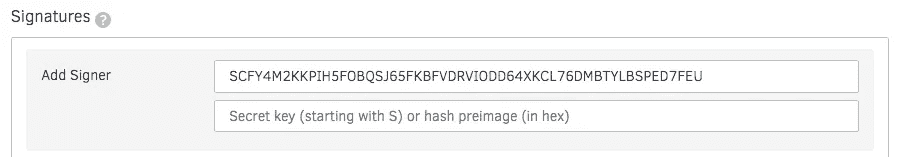

8.点击**提交到过账交易端点**按钮

9.它将导航到**过账交易**页面，只需点击**提交**按钮

你应该看到… [这个](https://www.stellar.org/laboratory/#explorer?resource=transactions&endpoint=single&values=eyJ0cmFuc2FjdGlvbiI6ImY1MDQ5Y2IwYjU3NjFiMWM0YjcyNGQ3MzVmMzNlM2M4OGM1MzJjYTg5MjJkMmE4MTI2MTA5YWFmMjA4MTlmYjAifQ%3D%3D)

# 步骤 3—创建令牌

//我们可以通过从**发行商**向**经销商**付款来创建代币

1.  进入**交易生成器**部分的 Stellar 仪表盘:[https://www.stellar.org/laboratory/#txbuilder?network=test](https://www.stellar.org/laboratory/#txbuilder?params=eyJhdHRyaWJ1dGVzIjp7InNvdXJjZUFjY291bnQiOiJHQlpINUhaTFhLVU5KTUhMNEJTT1lTTU5aU0NGVFpGNzJUQ05VRExVVEZNSlhCTklET0kzMlhXVyJ9LCJvcGVyYXRpb25zIjpbeyJpZCI6MCwiYXR0cmlidXRlcyI6e30sIm5hbWUiOiJjaGFuZ2VUcnVzdCJ9XX0%3D&network=test)
2.  对**源账户**使用**发行人公钥**
3.  点击**获取账户的下一个序列号，从…** 按钮开始

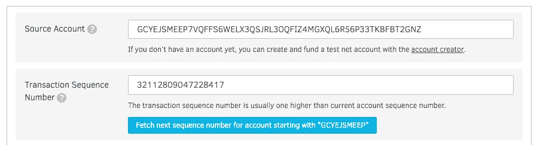

4.为**操作类型**选择**支付**

5.对于**目的地**，使用**经销商公钥**

6.输入任意数字的金额。让我们试试 1000000

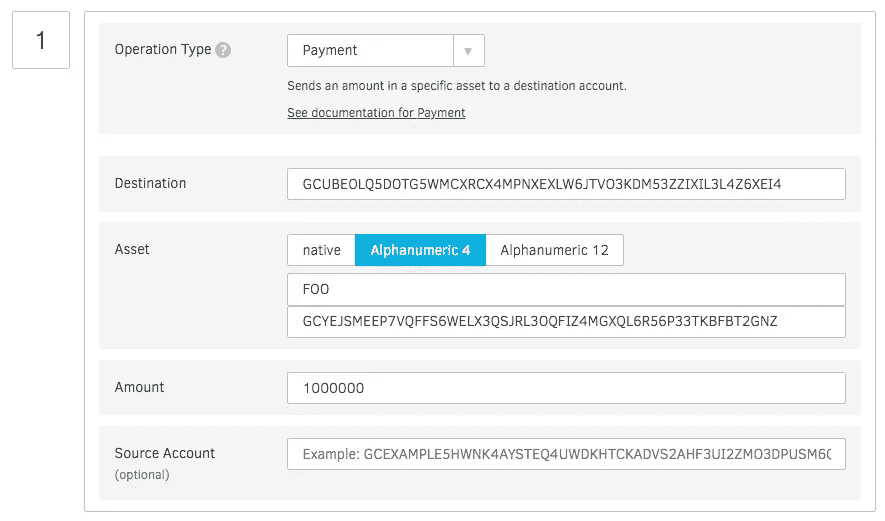

7.点击**登录交易签名人**按钮

8.用**发行人密钥**签名

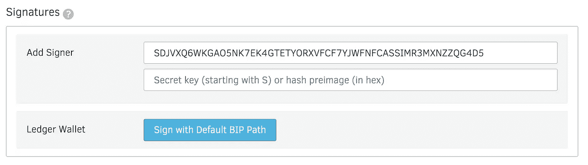

9.点击**提交到过账交易端点**按钮

10.点击**提交**按钮

你应该看看… [这个](https://www.stellar.org/laboratory/#explorer?resource=transactions&endpoint=single&values=eyJ0cmFuc2FjdGlvbiI6ImI5Zjk4MDg2ODM2MWVhNjAwZmFkODA0Yjg5Y2YyYzU5YjZiNzA1N2ZhNzljZTRlZjM4MTVjOWRlYmRlN2RiNmEifQ%3D%3D)

请尝试探索**分销商帐户** [**这里的**](https://www.stellar.org/laboratory/#explorer?resource=accounts&endpoint=single&values=eyJhY2NvdW50X2lkIjoiR0NVQkVPTFE1RE9URzVXTUNYUkNYNE1QTlhFWExXNkpUVk8zS0RNNTNaWklYSUwzTDRaNlhFSTQifQ%3D%3D&network=test) 您应该会看到

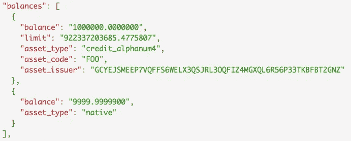

# 步骤 4 —发布关于您的令牌的信息

//这是可选的，这里有一个来自 [**杰德的帖子**](https://www.stellar.org/blog/tokens-on-stellar/) 的例子

```
{
  "code": "FOO",
  "name": "foo token",
  "desc": "1 FOO token entitles you to a bug from katopz.",
  "conditions": "You must travel to Bangkok to receive your bug."
}
```

# 第五步——限制供应量

//这是可选的，如何操作请参见 [**这篇文章**](https://goolge.io/post/launching_stellar_ico/)

# 步骤 6 —分发您的令牌

//我们把价格设为 1 **XLM** = 1 **FOO**

1.  进入【https://www.stellar.org/laboratory/#txbuilder?network=test】的**交易生成器**部分的[恒星仪表盘](https://www.stellar.org/laboratory/#txbuilder?params=eyJhdHRyaWJ1dGVzIjp7InNvdXJjZUFjY291bnQiOiJHQlpINUhaTFhLVU5KTUhMNEJTT1lTTU5aU0NGVFpGNzJUQ05VRExVVEZNSlhCTklET0kzMlhXVyJ9LCJvcGVyYXRpb25zIjpbeyJpZCI6MCwiYXR0cmlidXRlcyI6e30sIm5hbWUiOiJjaGFuZ2VUcnVzdCJ9XX0%3D&network=test)
2.  将**经销商公钥**用于**源账户**
3.  点击**获取账户的下一个序列号，从…** 按钮开始

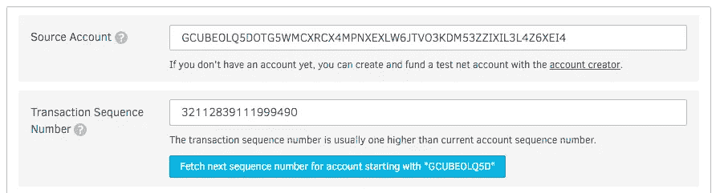

4.为**操作类型**选择**管理报价**

5.输入**资产代码**(我的情况是 FOO)进行出售

6.输入**发行人公钥**

7.输入你想卖多少(在我的例子中是 1000)

8.输入其对 **XLM** 的价格(我选择 1:1)

9.购买**土产**

10.**新报价的报价 ID** 为 0。

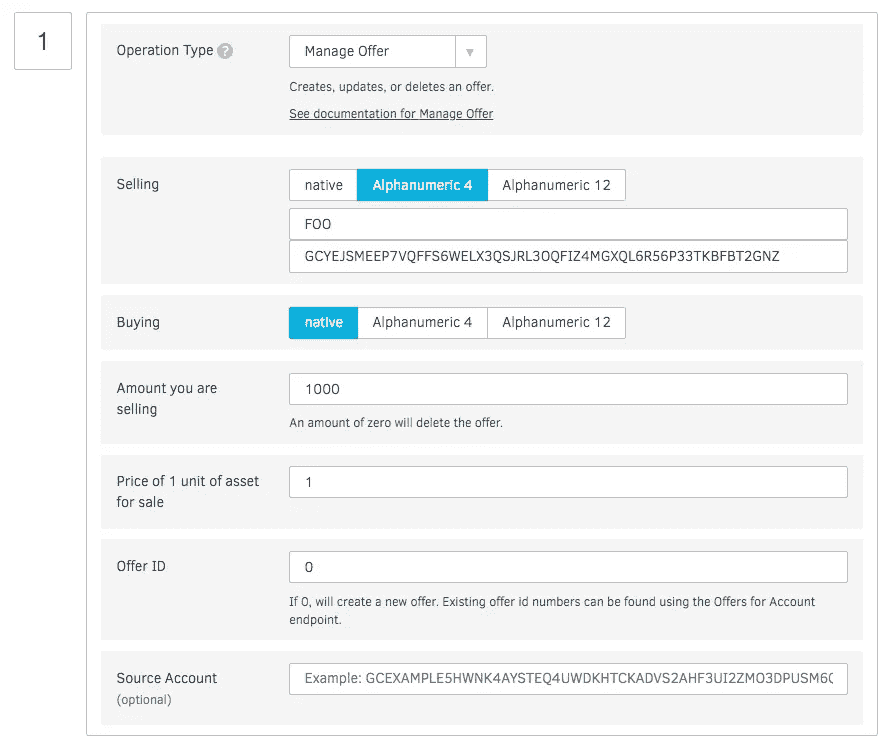

11 .点击**登录交易签名人**按钮

12.用您的**分销商密钥**签名。

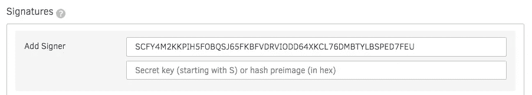

8.点击**提交到过账交易端点**按钮

**9** 。点击**提交**按钮

你应该看看… [这个](https://www.stellar.org/laboratory/#explorer?resource=transactions&endpoint=single&values=eyJ0cmFuc2FjdGlvbiI6IjJiMmZlZjRlNDg4YTExOTdmZjhjYjUyYjZkOGFhNjVmNDU5ZTA4NjgwYTdlNWIzZGNkZjVkNTQ5MzMwNmYwMmUifQ%3D%3D)

# 第七步—购买代币？

//我们需要让**投资者**先信任**发行者**

1.  通过转到[https://www.stellar.org/laboratory/#txbuilder?network=test](https://www.stellar.org/laboratory/#txbuilder?network=test)将 **FOO** 添加到**信任线**
2.  使用**投资者公钥**作为**源账户**
3.  点击**获取从…** 按钮开始的账户的下一个序列号


4.为**操作类型**选择**改变信任**

5.使用 **FOO** 作为资产代码

6.使用**发卡行公钥**作为**发卡行账户 ID**

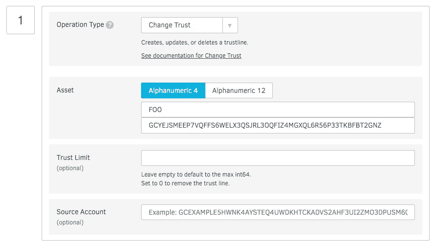

7.用您的**投资者密钥**签名，像往常一样提交

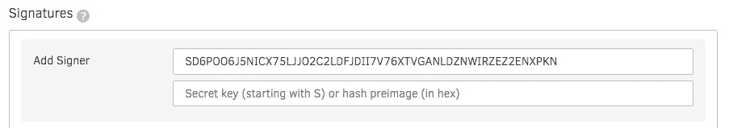

您应该会看到([结果](https://www.stellar.org/laboratory/#explorer?resource=transactions&endpoint=single&values=eyJ0cmFuc2FjdGlvbiI6ImQzYjIxNTZiOTc2NWYyZjlmZjk1ODllZjdkODIzMmY5MzM3NWMwNTkxNjk0ODQwOTY3NzMxMDg2ODM0ZjRjZWEifQ%3D%3D))

8.去 https://www.stellar.org/laboratory/#txbuilder?network=test[买**符**](https://www.stellar.org/laboratory/#txbuilder?network=test)

9.使用**投资者公钥**作为**源账户**

10.点击**获取账户的下一个序列号，从…** 按钮开始


11.管理报价，出售**本地**，从**经销商**处购买**食物**

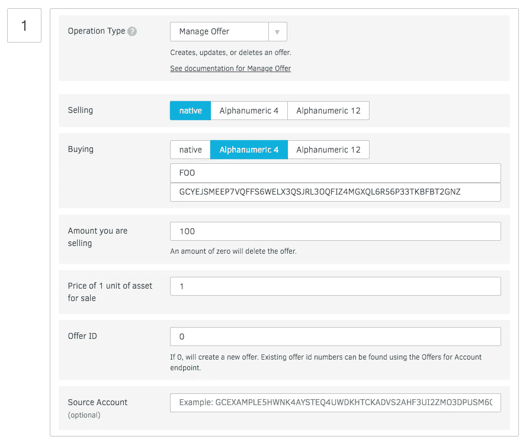

12.用您的**投资者密钥**签名。，像往常一样提交


你应该看到… ( [结果](https://www.stellar.org/laboratory/#explorer?resource=transactions&endpoint=single&values=eyJ0cmFuc2FjdGlvbiI6ImIxNTIxZDZjYTJjZTI4Y2Y3YzIxZWU0NTY1ODA5NGZiY2UzODI0YTkwNWE2ZDk4MjM2NjU1MTI4NDkyMzBiMjQifQ%3D%3D))

为了确保投资者获得令牌，请在此 处查看他们的账户 [**，您应该会看到**](https://www.stellar.org/laboratory/#explorer?resource=accounts&endpoint=single&values=eyJhY2NvdW50X2lkIjoiR0FNRkE3Q1Y1UEU1RUlGVks2MzYyNUxXNUxZVFhCUEo0NlU3TjVHTzVaTFhKWEhLT1RPSlNLUlEifQ%3D%3D&network=test)

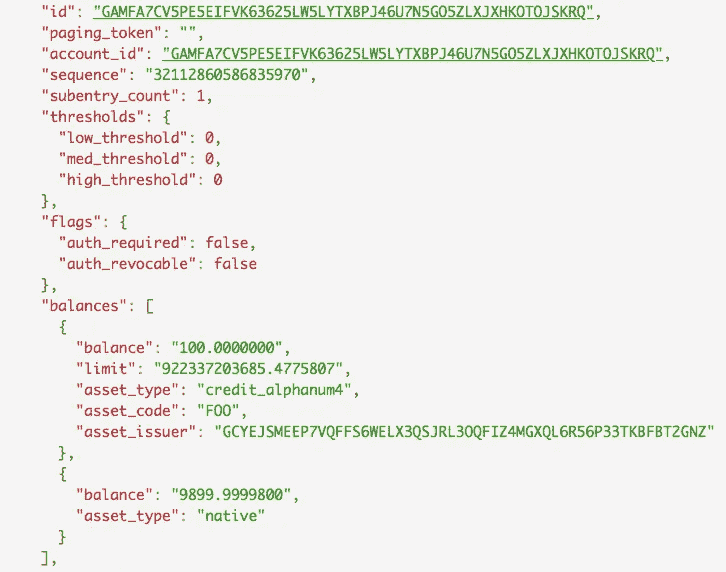

# 概述

*   您在 **testnet** 上由**发布者创建了令牌名称 **FOO** 。**
*   您为 **FOO** token 创建了信任**发行方**的**分销商**，并从**发行方处收取款项。**
*   你让**经销商**创建出售 **FOO 的报价。**
*   你让**投资者**信任 **FOO** token，用 **XLM 买。**

# 奖金

第一天交易！在此输入[进入](https://stellarterm.com/#testnet)进行测试网，并跟随此[链接](https://stellarterm.com/#exchange/FOO-GCYEJSMEEP7VQFFS6WELX3QSJRL3OQFIZ4MGXQL6R56P33TKBFBT2GNZ/XLM-native)进行交易。没有必要乞求在交易所上市！

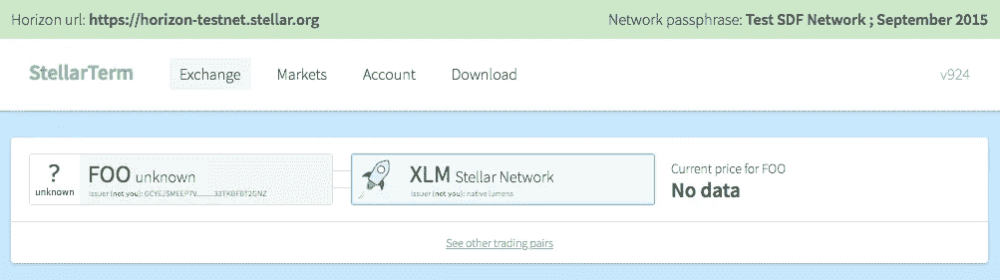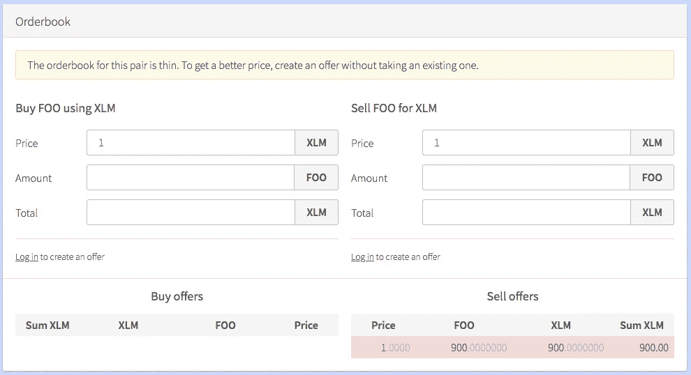

# **待办事宜**

*   [**限制发卡行账户**](https://www.stellar.org/developers/guides/walkthroughs/custom-assets.html#optional-transaction-a-limit-token-supply) 用于限制代币供应。
*   [**Multi-Sig**](https://www.stellar.org/developers/guides/concepts/multi-sig.html) 为多个持有者。
*   [**阈值**](https://www.stellar.org/developers/guides/concepts/accounts.html#thresholds) 为多级访问账户控制。
*   [**锁定令牌**](https://www.stellar.org/developers/guides/walkthroughs/stellar-smart-contracts.html) 在期望周期内的时间限制。
*   [**发行资产**](https://www.stellar.org/developers/guides/issuing-assets.html) 为真实资产持有人。
*   [**费用**](https://www.stellar.org/developers/guides/concepts/fees.html) 保证对缩放用户的最低要求。
*   [](https://github.com/stellar/go/tree/master/services/bifrost#demo)**为接受 ETH、BTC 等。**

# **信用**

*   **[https://www . stellar . org/developers/guides/walk throughs/custom-assets . html](https://www.stellar.org/developers/guides/walkthroughs/custom-assets.html)**
*   **[https://goolge.io/post/launching_stellar_ico/](https://goolge.io/post/launching_stellar_ico/)**
*   **[https://www.stellar.org/blog/tokens-on-stellar/](https://www.stellar.org/blog/tokens-on-stellar/)**
*   **[https://medium . com/@ ASHI sherc/create-an-ico-on-stellar-network-with-custom-token-7b 6 aab 349 f 33](/@ashisherc/create-an-ico-on-stellar-network-with-custom-token-7b6aab349f33)**

> **[直接在您的收件箱中获得最佳软件交易](https://coincodecap.com/?utm_source=coinmonks)**

**[](https://coincodecap.com/?utm_source=coinmonks)**

# **菲亚特哪里买 XLM？(参考)**

**[](https://cex.io/r/0/up107588755/0/) [## 比特币交易所，交易 BTC 美元，BTC 欧元 CEX。超正析象管(Image Orthicon)

### 领先的加密货币交易所于 2013 年在伦敦成立，提供比特币、比特币现金、比特币黄金…

cex.io](https://cex.io/r/0/up107588755/0/) 

# 请捐赠

//这是我的**恒星**账号，所有捐款都属于我的猫！🐈

```
GDI6FBVJSHMF5PF6C7DDM57NAGYTYWMQQW2A6BVA6DTS2ZL7ZDRZBI2S
```