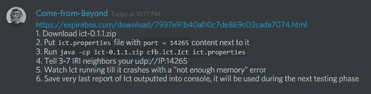
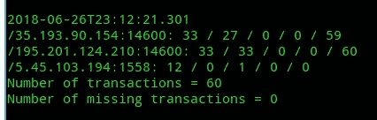

# 试验中的 IOTA 控制剂 0.1.1

> 原文：<https://medium.com/coinmonks/ict-iota-0-1-1-in-test-1ce2e58f5d6e?source=collection_archive---------5----------------------->

## 6 月 27 日 22:17 CEST，ICT (IOTA 控制的代理)的测试已经在 discord 和 [reddit](https://www.reddit.com/r/Iota/comments/8u3fat/ict_011_is_out/) 上公布。

Image [Source](https://www.google.co.in/url?sa=i&rct=j&q=&esrc=s&source=images&cd=&cad=rja&uact=8&ved=2ahUKEwj3m-qQ3PjbAhVVeysKHSaYAfgQjxx6BAgBEAI&url=https%3A%2F%2Foracletimes.com%2Fiota-miota-all-eyes-on-tokyo-as-good-news-beckons%2F&psig=AOvVaw2ReKvZTQ90CjS290rlxfqQ&ust=1530356371249179)

## 什么是 ICT

ICT*(****I****OTA****C****受控代理)*是一款具有群体智能(swarm node)的软件。它的主要目的是 EC(经济集群)，你可以在这里阅读[。想象一个当前的完整节点，但大小始终小于 1GB，因此可以在非常小的设备上运行它](/@comefrombeyond/economic-clustering-and-iota-d3a77388900)[，例如我的 Raspberry Pi Zero，由太阳能供电](https://twitter.com/antonionardella/status/1008950266778013696)。据推测，这些设备将能够通过提供服务来赚取利润。这是最后一块拼图，它将使 IOTA 实现真正的无限扩展。 *(* [*来源*](https://www.reddit.com/r/Iota/comments/8u3fat/ict_011_is_out/e1cbezg/) *)*

群客户端是计划使 IOTA 客户端能够在这些资源非常有限的环境中运行的另一种方法，该方法是在不同设备之间共享核心逻辑和数据库，然后这些设备共同运行它。与群体智能类似，这使得设备集群能够在不成为完整节点的情况下高效地进行交易，但降低了对 SPV 和轻客户端的信任要求。 *(* [*来源*](https://blog.iota.org/iota-development-roadmap-74741f37ed01) *)*

## 参加首次 ICT 测试的说明

就像 CfB 又名谢尔盖·伊万格洛在这里说的:

我们从第一次 ICT 测试开始。

请加入我们关于不和谐的#ict 频道。

**免责声明**:这是测试版，不是工作产品。通过测试，你对软件的实际开发做出了贡献。

说明:

1.  下载 ICT-0 . 1 . 1 . zip—[https://expire box . com/download/7937 e 91 b 40 af 10 c7de 869 c 02 cada 7074 . html](https://expirebox.com/download/7937e91b40af10c7de869c02cada7074.html)
2.  创建一个名为 ict.properties 的文件，并将 port = 14265 作为内容写在 ict-0.1.1.zip 旁边
3.  运行 Java-CP ICT-0 . 1 . 1 . zip CFB . ICT . ICT ICT . properties
4.  告诉 3-7 个 IRI 邻居您的 udp://IP:14265
5.  观察 ICT 运行，直到它因“内存不足”错误而崩溃
6.  保存最后一次输出到控制台的 ICT 报告，它将在下一个测试阶段使用

***我们推荐使用树莓 Pi Zero 之类的设备。***

让我们跳舞:

更多意大利语和德语信息[这里是我的联系人](https://antonionardella.it/contacts/)。

如果你喜欢我的翻译并愿意捐赠:

IOTA: `CHQAYWPQUGQ9GANEWISFH99XBMTZAMHFFMPHWCLUZPFKJTFDFIJXFWCBISUTVGSNW9JI9QCOAHUHFUQC9SYVFXDQ9D`
BTC: `1BFgqtMC2nfRxPRge5Db3gkYK7kDwWRF79`

*最初发表于* [*安东尼奥·纳德拉*](https://antonionardella.it/ict-iota-0-1-1-in-test-en/) *。*