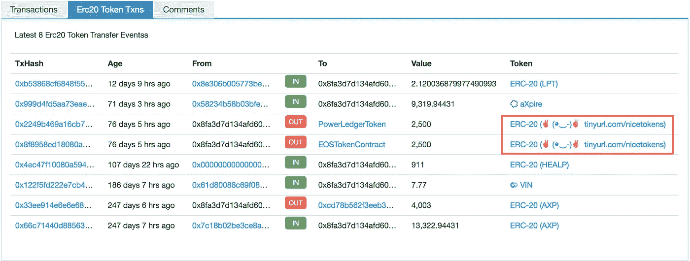

# 识别垃圾 ERC20 传输

> 原文：<https://medium.com/coinmonks/identifying-spammy-erc20-transfers-a42fb9909e05?source=collection_archive---------3----------------------->



当你看到一笔[奇怪的代币转账](https://etherscan.io/tx/0x2249b469a16cb7754a83bb4fc394cc749328d31c229590ce57a37960d04608a1)从你的账户发出时，你可能会感到惊讶。你的第一反应是有人黑了你。

在谷歌搜索了几秒钟后，您意识到这只是令牌创建者使用的一个技巧——任何契约都可以发出带有任何参数的任何事件。在这种情况下，令牌协定发出一个令牌传输，其中“from”地址是您的帐户。然后，以太扫描捕捉到这个事件，并附加到您的地址。

## 用 BigQuery 识别 ERC20 传输垃圾邮件

以下是返回垃圾传输的 SQL:

```
#standardSQL
**with** transfers_and_authorizing_transactions **as** (
  **with** external_accounts **as** (
    **select distinct**(from_address) **as** address
    **from** `bigquery-public-data.ethereum_blockchain.transactions` **as** transactions
  ),
  authorizing_transactions **as** (
    **select** from_address, to_address, **min**(block_number) **as** block_number
    **from** `bigquery-public-data.ethereum_blockchain.transactions` **as** transactions
    **group by** from_address, to_address
  )
  **select** token_transfers.transaction_hash **as** transaction_hash, 
    token_transfers.log_index **as** log_index, 
    authorizing_transactions.block_number **as** authorizing_block_number
  **from** `bigquery-public-data.ethereum_blockchain.token_transfers` **as** token_transfers
  **join** external_accounts **on** external_accounts.address = token_transfers.from_address
  **left join** authorizing_transactions
    **on** authorizing_transactions.from_address =  token_transfers.from_address
    **and** authorizing_transactions.to_address = token_transfers.token_address
    **and** authorizing_transactions.block_number <= token_transfers.block_number
  **where** token_transfers.from_address != **'0x0000000000000000000000000000000000000000'** )
**select** transaction_hash, log_index
**from** transfers_and_authorizing_transactions
**where** authorizing_block_number **is null**
```

[在 BigQuery 中运行它](https://bigquery.cloud.google.com/savedquery/305730109012:db5fb9604e5043bbab1ae7e9906f20b6)

该查询基于以下假设:如果有来自**外部**账户 X 的令牌转移，则必须满足以下条件之一:

*   在过去的某个块中，有一个来自 X 的事务调用了令牌的`approve()`方法。
*   包含转账的交易来自账户 x。

更一般地，如果存在来自外部账户 X 的代币转账，则 X 必须之前已经与代币合约交互(即，向其发送交易)。换句话说，如果 X 从未与令牌进行过交互，那么该转账不可能得到 X 的授权，一定是垃圾邮件。

[该查询](https://bigquery.cloud.google.com/savedquery/305730109012:6ca47f9bfdc34a71ae462d1cc9b6d59c)返回根据转账次数排序的垃圾令牌。排名前几位的是:

1.  [blockwell.ai KYC 卡斯帕令牌](https://etherscan.io/token/0x212d95fccdf0366343350f486bda1ceafc0c2d63) : `424574`
2.  tinyurl.com/nicetokens✌(◕‿-)✌:`61260`
3.  [糖果硬币](https://etherscan.io/token/0x45555629aabfea138ead1c1e5f2ac3cce2add830) : `50175`
4.  [埃尔科因](https://etherscan.io/token/0x225bc3affc1da39bd3cb2100c74a41c62310d1e1) : `46177`

前两个已经在 Etherscan 上被标记为垃圾邮件。其他的可以使用上面描述的简单试探法来标记。

在推特上关注我们 https://twitter.com/EthereumEtl T21。

另请阅读 BigQuery:我们如何构建这个数据集中的[以太坊。](https://cloud.google.com/blog/products/data-analytics/ethereum-bigquery-how-we-built-dataset)

> [在您的收件箱中直接获得最佳软件交易](https://coincodecap.com/?utm_source=coinmonks)

[](https://coincodecap.com/?utm_source=coinmonks)