# 基于深度学习的身份验证:ID-自拍匹配方法

> 原文：<https://medium.com/coinmonks/identity-verification-with-deep-learning-id-selfie-matching-method-be56d72be632?source=collection_archive---------2----------------------->

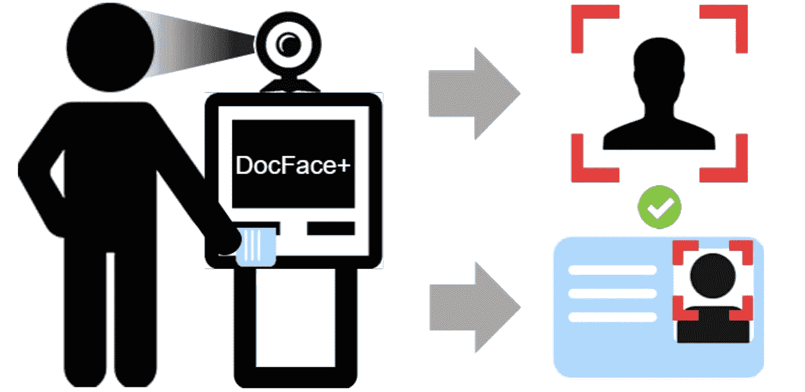

我们生活中大量的日常活动都需要**身份验证**。身份验证提供了一种安全机制，从系统的访问控制一直到过境和银行交易。然而，在许多需要身份验证的活动中，该过程是手动完成的，并且通常很慢，需要人工操作。

身份验证的自动化系统将大大加快这一过程，并在我们需要验证身份的所有活动中提供无缝的安全检查。最简单的方法之一是设计一个系统，将身份证照片与自拍照片进行匹配。

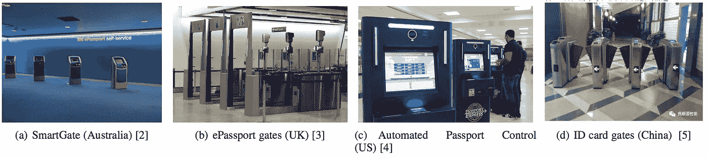

Examples of automatic ID document photo matching systems at international borders

# 以前的作品

在过去，使用自动系统进行身份验证的尝试既有成功的，也有不成功的。一个成功的例子是澳大利亚的 SmartGate。这是一个自动化的自助边境管制系统，由澳大利亚边防部队运作，位于澳大利亚八个国际机场入境大厅的移民检查站。它使用摄像头捕捉验证图片，并尝试将其与个人 ID 进行匹配。此外，中国已经在火车站和机场引入了这种系统。

虽然也有人试图使用传统的计算机视觉技术来匹配身份证件和自拍，但性能更好的方法依赖于深度学习。Zhu 等人提出了第一个使用卷积神经网络进行文档自拍匹配的深度学习方法。

# 最先进的想法

**在他们的新论文中，来自密歇根州立大学** [**的研究人员提出了他们 DocFace 的改进版本——一种用于文档-自拍匹配的深度学习方法。**](https://arxiv.org/pdf/1809.05620.pdf)

他们表明，当许多类只有非常少的样本时，基于梯度的优化方法收敛缓慢——就像现有的 ID-selfie 数据集的情况一样。为了克服这个缺点，他们提出了一种方法，叫做**动态权重印迹(DWI)** 。此外，他们引入了一种新的识别系统，用于从 ID-selfie 对中学习统一的表示，以及一种名为 **DocFace+** 的开源人脸匹配器，用于 ID-selfie 匹配。

# 方法

在构建用于 ID-自拍匹配的自动化系统中存在大量的问题和限制。说起 ID-自拍匹配，众多挑战不同于一般的人脸识别。

两个主要挑战是由于压缩造成的文件(以及自拍)照片的低质量，以及文件发布时间和验证时间之间的巨大时间差。

整个方法基于迁移学习。在大规模人脸数据集**(MS-celebe 1M)**上训练基本神经网络模型，并将特征转移到身份自拍对的目标域。

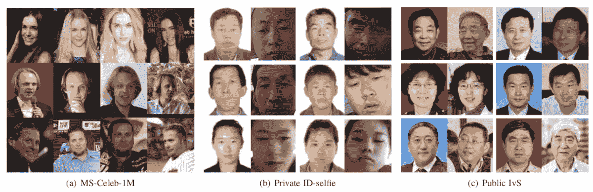

研究人员认为，当处理样本很少的许多类时，收敛非常缓慢，训练经常会陷入局部极小值，因此他们建议使用**加性边际 Softmax (AM-Softmax)** 损失函数以及一种新的优化方法，他们称之为动态权重印迹(DWI)。

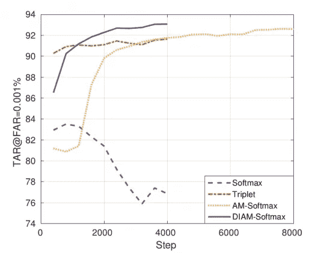

Generalization performance of different loss functions.

# 动态重量压印

由于随机梯度下降以小批量更新网络，在两次触发的情况下(像身份自拍匹配的情况)，每个权重向量在每个历元仅接收两次信号。这些稀疏的吸引信号对分类器权重几乎没有影响。为了克服这个问题，他们提出了一种新的优化方法，其思想是根据样本特征更新权重，从而避免分类器权重的不匹配，加快收敛速度。

与随机梯度下降和其他基于梯度的优化方法相比，所提出的 DWI 算法仅基于真实样本更新权重。它只更新小批量中存在的类的权重，并且它在广泛的数据集上工作得很好，在这些数据集上，所有类的权重矩阵都太大而无法加载，并且只有权重的子集可以被采样用于训练。

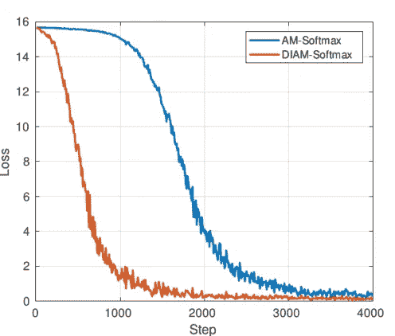

Comparison of AM-Softmax loss and the proposed DIAM loss.

研究人员使用随机梯度下降和 AM-Softmax 损失来训练流行的 Face-ResNet 架构。然后，他们通过将提出的动态重量印迹优化方法与附加边际 Softmax 相结合，在 ID-自拍数据集上对模型进行微调。最后，训练一对兄弟网络学习共享高级参数的身份识别和自拍的特定领域特征。

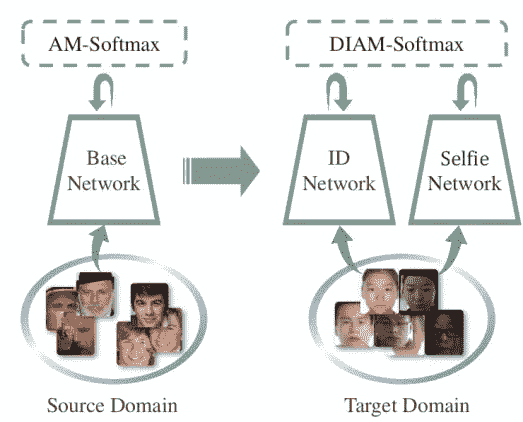

Workflow of the proposed method. A base model is trained on a large scale unconstrained face dataset. Then, the parameters are transferred to a pair of sibling networks, who have shared high-level modules.

# 结果

提出的身份-自拍匹配方法取得了良好的效果，真实接受率达到 97.51±0.40%。作者报告称，他们使用 MS-celebe-1M 数据集和 AM-Softmax 损失函数的方法在 LFW 标准验证方案下达到 99.67%的准确度，在 BLUFR 方案下达到 99.60%的验证率(VR)和 0.1%的错误接受率(FAR)。

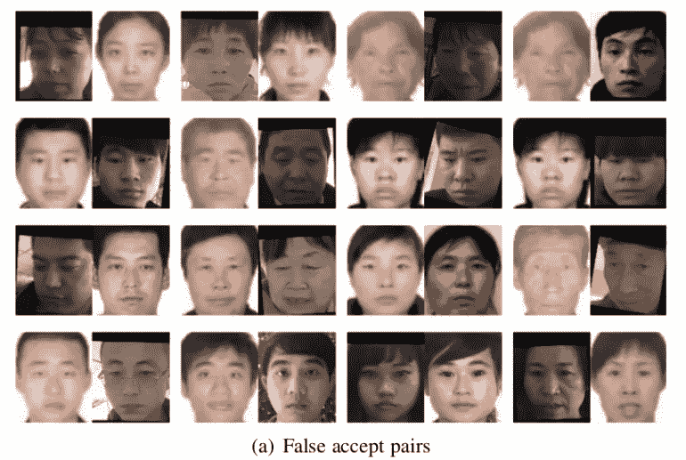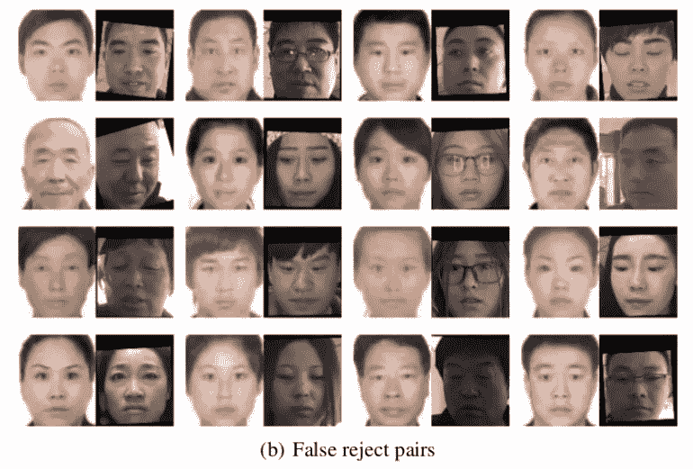

Examples of falsely classified images by our model on the Private ID-selfie dataset.

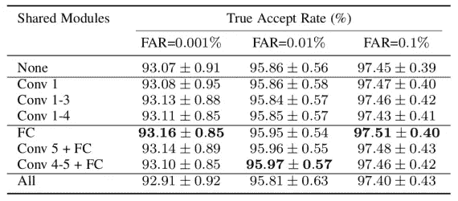

The mean performance of constraining different modules of the sibling networks to be shared

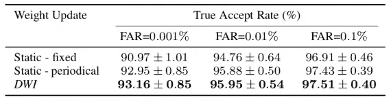

Comparing Static and Dynamic Weight Imprinting regarding TAR

# 与其他最先进技术的比较

该方法与其他最先进的普通人脸匹配方法进行了比较，因为没有现有的公共身份自拍匹配方法。给出了与这些方法在 TAR(真实接受率)和 FAR(错误接受率)方面的比较，如下表所示。

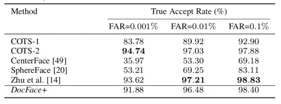

The mean (and s.d. of) performance of different matches on the private ID-selfie dataset

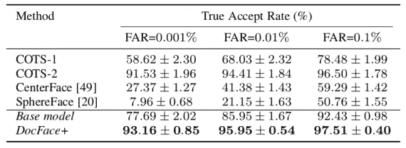

Evaluation results were compared with other methods on Public-IvS dataset

# 结论

提出的用于 ID-selfie 匹配的 DocFace+方法显示了迁移学习的潜力，特别是在没有足够数据可用的任务中。所提出的方法在自拍与身份匹配中实现了高准确度，并且具有在身份验证系统中使用的潜力。此外，提出的新的优化方法——动态权重印记法显示了改进的收敛性和更好的泛化性能，代表了对机器学习领域的重大贡献。

> [在您的收件箱中直接获得最佳软件交易](https://coincodecap.com/?utm_source=coinmonks)

*原载于 2018 年 9 月 24 日*[*neuro hive . io*](https://neurohive.io/en/state-of-the-art/identity-verification-with-deep-learning-id-selfie-matching-method/)*。*