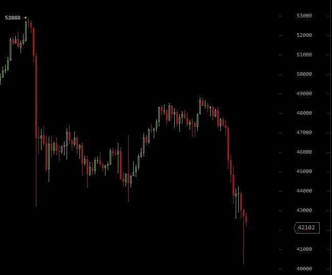
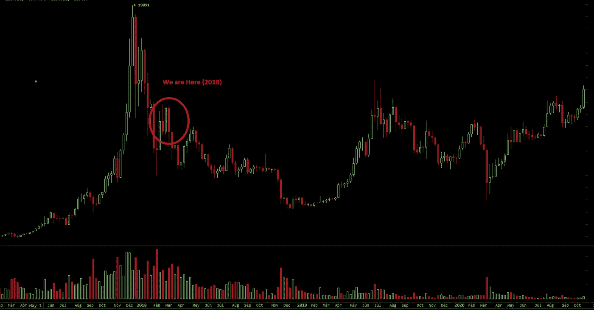
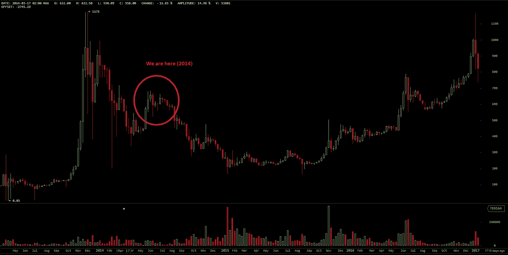

# 如果比特币处于熊市，那么 5 万美元就是牛市陷阱

> 原文：<https://medium.com/coinmonks/if-btc-is-in-a-bear-market-then-50k-was-the-bear-trap-bf4aef203982?source=collection_archive---------8----------------------->

Source: [*Pexels*](https://www.pexels.com/photo/black-and-brown-bear-on-gray-rock-7492295/)

我觉得我会重新开始交易，因为市场变得太可预测了。尽管杠杆交易的赌博性让我望而却步。也许我会采取无杠杆的立场，但这也太有压力，因为高利润需要更高的赌注。

在本月初跌至 43K 美元后，我写道价格正在下跌，但它们反而上涨至 48k 美元，然后在 4h 图上跌至新低。

[Source](http://bitcoinwisdom.com)

我不知道为什么，但图表的移动速度比我想象的要慢，尽管价格行为遵循着我们以前见过的某些模式。或许这与较高的交易量有关，或许当空头试图冲击市场时，他们的影响会有所减弱。

# 这张图表让我们想起了什么吗？

由于细节不可能是相同的，该模式看起来像是再次处于长期熊市，从 30 到 50k 有望反弹，但在那里有强烈的拒绝。

[Source](http://bitcoinwisdom.com)

如果我们仔细观察，今天的图表与结束 2017 年牛市的第一次下跌的规模有所不同。2018 年，比特币从 ATH(2 万美元)下跌了约 70%，跌至 6000 万美元。2021 年的这个时候，它从 65k 下降到 29k，大约是 55%。我没有计算准确的百分比，但这些粗略的估计是有意义的。

随着进入该领域的现金量增加，波动性降低。交易总是存在的，反弹也即将发生。在这种情况下，BTC 涨到 5 万美元花了太多时间，可能要一个多月。

2017–2020

看来这是一个牛市陷阱，也许我们必须再等几个月才能知道。

要点是:

*   有一个熊市，它不需要立即更低的低点(从先前的 29K 低点)，它可以是 32-33K，另一次反弹到 40k，但随后在几个月内下降到 25k 美元
*   价格运行缓慢，波动性降低，交易量增加
*   BTC 今天发现了与 2017 年 3 月相似的阻力，我们将在 2014 年 6 月看到。

# 2014-2015 年的熊市持续时间更长

当我在研究 2017–2019 年的图表和交易时，我有与 2013–2015 年相似的观察。两次熊市持续时间差不多，但 2015 年底部持续时间更长。这是一个长达一年的积累阶段，但它巩固了支持，然后第二次减半帮助 BTC 价格逃脱。

2013–2016

与此同时，在 2019 年 4 月，即 2017 年牛市结束仅一年零四个月后，Cryptos 开始再次上涨，主要是因为中国的庞氏骗局。BTC 在经历了 7 个月的小牛市后，从 2018 年 12 月的 3000 美元低点升至 14000 美元。这也遭到了拒绝，价格最终在 2020 年 3 月再次跌破 4k 美元(距离上次 ATH 两年零两个月)。

2014 年至 2015 年间没有发生这样的事件。价格在反弹，但它没有逃脱熊市的模式。然而，它在 2019 年逃脱了这一趋势。

无论我们从哪个角度看这张图表，似乎都有不可避免的程序化周期。资金突然涌入，这次主要是机构资金。

从现在看来大约一年后，BTC 价格应该在 25k 左右。

# 最后

我已经一次又一次地表达了我对 BTC 图表的失望。我还在 noise.cash ( [链接到帖子](https://noise.cash/post/zm6p9j3tvr4n))上写过关于加密交易所盯住 BTC 的文章，原因是 BTC 交易对和这些交易的高交易量

价格行为不一定是相同的，但有一个跟随先前降价的总趋势。一个抛物线型的牛市，紧接着是一个快速的暴跌，几次反弹，最后价格下跌 75-80%。

从 64k 降到 20k 似乎符合历史价格走势。也许它甚至可以达到 20k，但我看不到比这更低的价格，除非 BTC 彻底输掉这场游戏，其他加密货币接管王位。20K 听起来是一个合理的底部。

不过，还有另一种情况。最喜欢那个，但我想它的时间不多了。要让这种情况发生，BTC 必须立即反弹。BTC 过去总是在超过 35%后进入熊市。下跌 50%意味着之前牛市的立即结束，很可能这次也是如此。

大多数人会不同意这种分析，我之前在今年夏天也曾看涨，但这可能是在适当的短期价格反弹之后出现的反弹和类似的热情。

总而言之，我将不得不写下“如果”这个词，因为这只是一个预测。

所以，如果这是一个熊市，那么 50k 就是牛市陷阱的顶部。我也不喜欢这样，在这种情况下我也不开心，但是我将不得不做出一些让我感到不舒服的安排。久而久之和 BTC 被拒绝的可能性越来越大。

我并不是说这张图表表明我们正处于熊市，只是指出了这样一个事实:久而久之的图表开始与之前的熊市相似。虽然，我可能在主要图片中使用了熊，并提出了一个明确的熊市案例。

除非市场情绪发生重大变化，出现新的投资者，或许是 BTC ETF，否则价格走势将遵循历史图表所显示的趋势，正如 BTC 周期所表明的那样，这将是一个重建和积累的时期。从长期来看，DCA 是一个不错的策略。

**跟我上:***●*[*read cash*](https://read.cash/@Pantera)*●*[*noise cash*](https://noise.cash/u/Pantera99)*●*[*Medium*](/@panterabch)*●*[*Hive*](https://hive.blog/@pantera1)*●*[*steem it*](https://steemit.com/@pantera1)*●*

***如果你喜欢这篇文章，别忘了订阅并点赞！***

*最初发布于*[*https://read . cash*](https://read.cash/@Pantera/if-btc-is-in-a-bear-at-which-point-in-the-chart-is-it-today-1cbcd119)*。*

> 加入 Coinmonks [电报频道](https://t.me/coincodecap)和 [Youtube 频道](https://www.youtube.com/channel/UCbyDhTbOiKh2iUMKBi4-4Zg)了解加密交易和投资

## 另外，阅读

*   [尤霍德勒 vs 科恩洛 vs 霍德诺特](/coinmonks/youhodler-vs-coinloan-vs-hodlnaut-b1050acde55a) | [Cryptohopper vs 哈斯博特](https://blog.coincodecap.com/cryptohopper-vs-haasbot)
*   [币安 vs 北海巨妖](https://blog.coincodecap.com/binance-vs-kraken) | [美元成本平均交易机器人](https://blog.coincodecap.com/pionex-dca-bot)
*   [新加坡十大最佳密码交易所](https://blog.coincodecap.com/crypto-exchange-in-singapore) | [收购 AXS](https://blog.coincodecap.com/buy-axs-token)
*   [投资印度的最佳加密软件](https://blog.coincodecap.com/best-crypto-to-invest-in-india-in-2021) | [HitBTC 评论](/coinmonks/hitbtc-review-c5143c5d53c2)
*   [买 PancakeSwap(蛋糕)](https://blog.coincodecap.com/buy-pancakeswap)|[matrix export Review](https://blog.coincodecap.com/matrixport-review)
*   [最佳免费加密信号](https://blog.coincodecap.com/free-crypto-signals) | [YoBit 评论](/coinmonks/yobit-review-175464162c62) | [Bitbns 评论](/coinmonks/bitbns-review-38256a07e161)
*   [OKEx 回顾](/coinmonks/okex-review-6b369304110f) | [Kucoin 交易机器人](/coinmonks/kucoin-trading-bot-automate-your-trades-8cf0ca2138e0) | [期货交易机器人](/coinmonks/futures-trading-bots-5a282ccee3f5)
*   [AscendEx Staking](https://blog.coincodecap.com/ascendex-staking)|[Bot Ocean Review](https://blog.coincodecap.com/bot-ocean-review)|[最佳比特币钱包](https://blog.coincodecap.com/bitcoin-wallets-india)
*   [霍比审核](https://blog.coincodecap.com/huobi-review) | [OKEx 保证金交易](https://blog.coincodecap.com/okex-margin-trading) | [期货交易](https://blog.coincodecap.com/futures-trading)
*   [比特币基地赌注](https://blog.coincodecap.com/coinbase-staking) | [Hotbit 评论](/coinmonks/hotbit-review-cd5bec41dafb) | [KuCoin 评论](https://blog.coincodecap.com/kucoin-review)
*   [最佳加密交易信号电报](/coinmonks/best-crypto-signals-telegram-5785cdbc4b2b) | [MoonXBT 评论](/coinmonks/moonxbt-review-6e4ab26d037)
*   [Coinswitch 俱吠罗评论](/coinmonks/coinswitch-kuber-review-1a8dc5c7a739) | [电网交易机器人](https://blog.coincodecap.com/grid-trading) | [比特币基地收费](/coinmonks/coinbase-fees-831e77d4f2c5)
*   [Bitget 回顾](https://blog.coincodecap.com/bitget-review)|[Gemini vs block fi](https://blog.coincodecap.com/gemini-vs-blockfi)|[OKEx 期货交易](https://blog.coincodecap.com/okex-futures-trading)
*   [OKEx vs KuCoin](https://blog.coincodecap.com/okex-kucoin) | [摄氏替代品](https://blog.coincodecap.com/celsius-alternatives) | [如何购买 VeChain](https://blog.coincodecap.com/buy-vechain)
*   [币安期货交易](https://blog.coincodecap.com/binance-futures-trading)|[3 commas vs Mudrex vs eToro](https://blog.coincodecap.com/mudrex-3commas-etoro)
*   [在印度利用加密套利赚取被动收入](https://blog.coincodecap.com/crypto-arbitrage-in-india)
*   [德国最佳加密交易所](https://blog.coincodecap.com/crypto-exchanges-in-germany) | [WazirX P2P](https://blog.coincodecap.com/wazirx-p2p)
*   [如何购买 Monero](https://blog.coincodecap.com/buy-monero) | [IDEX 评论](https://blog.coincodecap.com/idex-review) | [BitKan 交易机器人](https://blog.coincodecap.com/bitkan-trading-bot)
*   [币安 vs 比特邮票](https://blog.coincodecap.com/binance-vs-bitstamp) | [比特熊猫 vs 比特币基地 vs Coinsbit](https://blog.coincodecap.com/bitpanda-coinbase-coinsbit)
*   [如何购买 Ripple (XRP)](https://blog.coincodecap.com/buy-ripple-india) | [非洲最好的加密交易所](https://blog.coincodecap.com/crypto-exchange-africa)
*   [非洲最佳密码交易所](https://blog.coincodecap.com/crypto-exchange-africa) | [胡交易所评论](https://blog.coincodecap.com/hoo-exchange-review)