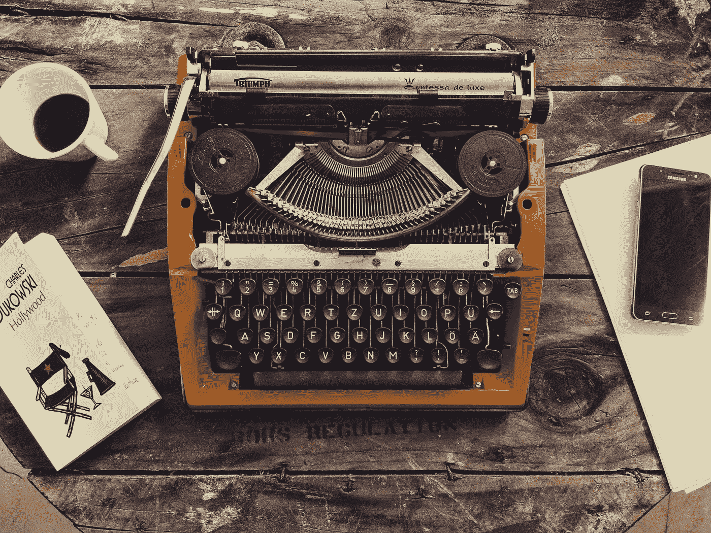

# 如果凯鲁亚克有比特币

> 原文：<https://medium.com/coinmonks/if-kerouac-had-bitcoin-edea5a295c9b?source=collection_archive---------8----------------------->

## **用实际购买力保留艺术家的原始激情**

Photo by [Pereanu Sebastian](https://unsplash.com/@sebastian123?utm_source=unsplash&utm_medium=referral&utm_content=creditCopyText) on [Unsplash](https://unsplash.com/collections/9727046/-typewriter?utm_source=unsplash&utm_medium=referral&utm_content=creditCopyText)

不可否认，杰克·凯鲁亚克并不是美国传统稳定、安全和舒适生活的最佳榜样(不管是哪个时代)。

除非你认为自己经常喝得酩酊大醉，40 多岁还和母亲住在一起，长期流浪是一种“稳定的生活”，否则你很可能不应该模仿他的行为，即使你欣赏由此产生的独特和自发的散文。

然而，作为一个从我十几岁就开始崇拜凯鲁亚克的人(最近重读了*《达摩流浪者》*)，自从再次掉进比特币兔子洞，我开始问一个哲学问题:**如果凯鲁亚克有比特币会怎么样？**

忽略一个显而易见的事实，即比特币在 2009 年之前并不存在，或者凯鲁亚克的漫无边际的冒险可能因为手里拿着一本账本 Nano S 以确保他的长期持有而变得不那么丰富多彩，关于艺术家如何最终保留他们可能从自己的激情中获得的购买力而不是被时间(通货膨胀)、监管(银行账户/政治意愿)和暴利(缺乏版税/无良收藏家)掠夺的问题仍然存在。

> "伟大的事情不是由那些屈服于潮流、时尚和大众观点的人完成的."
> 
> 杰克·凯鲁亚克

凯鲁亚克的开创性作品《在路上》的手稿于 2001 年以 240 万美元的价格卖给了印第安纳波利斯小马队的老板吉姆·伊尔赛。与凯鲁亚克在 1953 年获得的 1000 美元预付款相比，这是微不足道的一笔钱，这部小说将成为美国文学的一部标志性小说。显然，市场和 Irsay 仍然非常重视凯鲁亚克作品中的激情，而且不清楚这些年来凯鲁亚克令人难以置信的混乱遗产得到了多少，版税是如何设立和分配的。

但是在这一点上真的重要吗？凯鲁亚克去世时的第三任妻子斯特拉·桑帕斯已于 1990 年去世。杰克唯一幸存的女儿简·凯鲁亚克于 1996 年去世。甚至没有一个与杰克·凯鲁亚克有丝毫关系的人还活着，但是每天都有人继续从他的作品中获利并以美元估价(凯鲁亚克，作为一个奇怪的神秘的佛教天主教徒，一生都对此感到不安)。凯鲁亚克的生活像许多其他艺术家一样，是一个悲剧故事，讲述了当某人创造了精彩的艺术，然后在我们当前由银行家、律师和人为法律管理的金融系统中被迫放弃时发生的事情。

花点时间想象一下，如果将源自纯粹的激情和生活的部分财富投入比特币，并允许其在旅行的许多间歇中简单地“存在”,凯鲁亚克会做些什么。即使他(或一个可信的保管人)不是早期采用者，比特币也是*字面上的*艺术家、过客和社会局外人的完美储蓄工具。它不仅是有史以来创造的最具流动性的价值，也是自黄金以来世界上最难的货币。

凯鲁亚克和他的产业本可以有一个完全不同的命运，他的激情的购买力得以保留，而不是在 1969 年破产时悲惨而可怕地死去。一种不会随风飘散、落入律师或远亲口袋里的东西，它会让真正的激情和创造力的能量不会飘散，不会分散到各种各样的工业贪婪者中。

简·凯鲁亚克被安全地锁在区块链，她永远不会被拒之门外，无法获得她父亲劳动的合法果实，而且[可能会活得远远超过 44 岁，并改变她自己任性的方式](https://www.sandiegoreader.com/news/1997/jun/26/anybody-who-saw-jan-kerouac-knew-she-was-jacks-dau/)。Sampas 家族也不能没收和获得他们仅仅因为一场走向离婚的摇摇欲坠的婚姻的巧合而相关的钱。这就是生活。

不幸的是，无法向凯鲁亚克解释，当你投资比特币时，你会随着时间的推移变得更加富有，而不是听从美元的命令。尽管像过去和未来的许多艺术家一样，他是一个完美的候选人，但他根本没有选择。对于那些逆势而为、可能收入中断的人来说，比特币是我们期待已久的天赐之物和工具。

对于一个在路上写下*并喜欢出门的人来说，值得注意的是，对于那些在未来某个时候可能也没有住房的人来说，比特币也是一种完美的货币。没有地址，驾照或者银行账户？没问题。*

您可以随时随地获取自己的价值，甚至在准备好之前都不必访问它或与之交互。担心有人没收你的智能手机、硬件钱包或个人物品？记住一个 24 个单词的种子短语，或者把它放在一个不显眼的地方。感觉你在那里被监视，并且[担心一个 5 美元的扳手攻击](https://bitcoinmagazine.com/culture/the-5-wrench-attack-and-your-bitcoin-stack)？把资金寄给一个信任的朋友或者设立一个冷钱包来储存资金。

如果你继续为市场所看重的世界(或者仅仅是你崇拜的粉丝)贡献奇迹，那么你就有能力无忧无虑地保存你的奖励。那些希望在以后有特权访问它们的人(如直系亲属)可以通过多种安全方式获得访问权限。

对于仍然居住在美洲的**流浪者**和**自由精神**(有很多)来说，你可以从凯鲁亚克的悲伤故事中吸取一二。一个是激情和艺术劳动永远不应该被忽视:不要想你想做的事情，只是他妈的已经做了。第二，确保当你从你的激情中提取价值时，你是在把它们投资在同样能给你带来回报的事情上。有创造力是一件非常辛苦的工作，尤其是作为一个厌倦世界的成年人，没有什么比让这种能量消失殆尽，除了绿色账单和坏账之外一无所获更糟糕的了。

> "热爱你的生活，它的每一个细节。"
> 
> 杰克·凯鲁亚克
> 
> *交易新手？试试* [*加密交易机器人*](/coinmonks/crypto-trading-bot-c2ffce8acb2a) *或* [*复制交易*](/coinmonks/top-10-crypto-copy-trading-platforms-for-beginners-d0c37c7d698c) *上* [*最好的加密交易*](/coinmonks/crypto-exchange-dd2f9d6f3769)

> 加入 Coinmonks [电报频道](https://t.me/coincodecap)和 [Youtube 频道](https://www.youtube.com/c/coinmonks/videos)获取每日[加密新闻](http://coincodecap.com/)

# 另外，阅读

*   [免费加密信号](/coinmonks/free-crypto-signals-48b25e61a8da) | [加密交易机器人](/coinmonks/crypto-trading-bot-c2ffce8acb2a)
*   杠杆代币的终极指南
*   [16 款最佳折叠电动自行车](/coinmonks/top-17-folding-electric-bikes-5e296f0918cb)
*   [28 款最佳电动自行车评选](/coinmonks/the-28-best-electric-bikes-review-and-buying-guide-in-2023-7bb3146cb403)
*   前三名[币安期货交易机器人](/coinmonks/top-3-binance-futures-trading-bots-e6031f84b3f9)