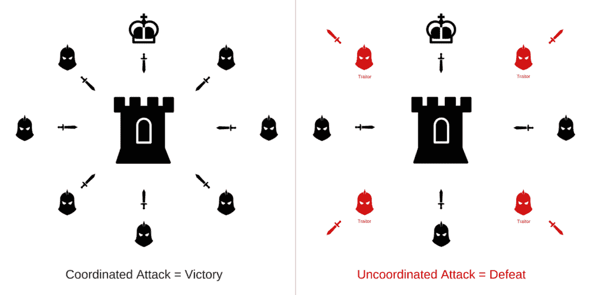
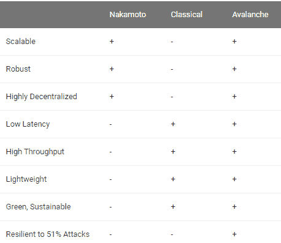
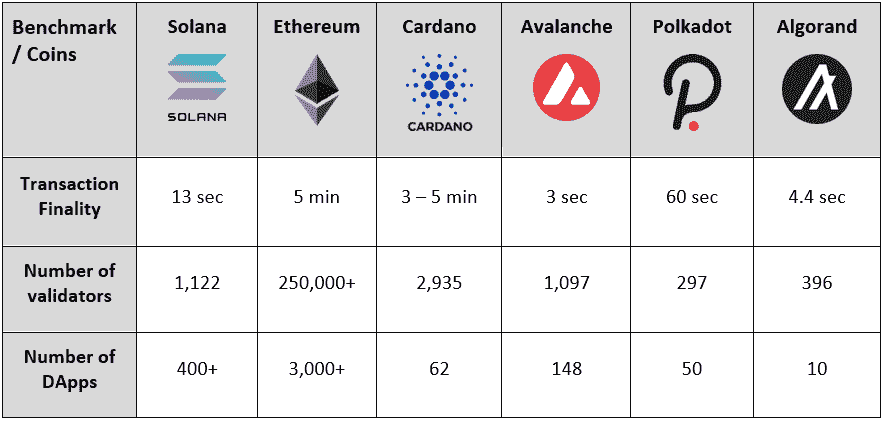
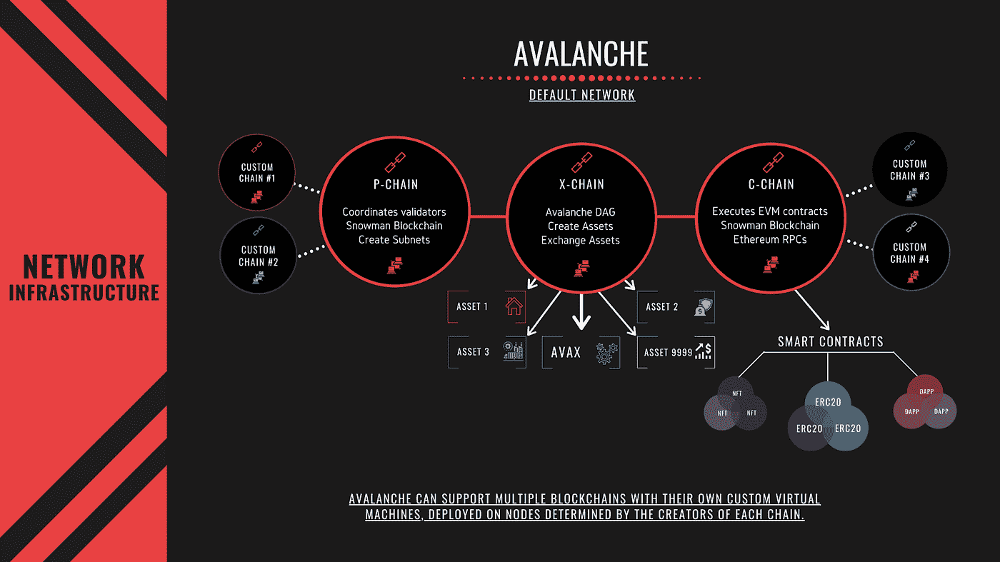
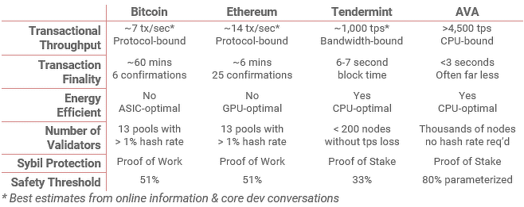
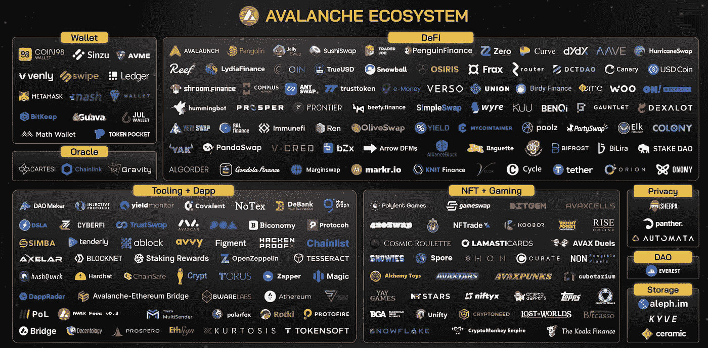
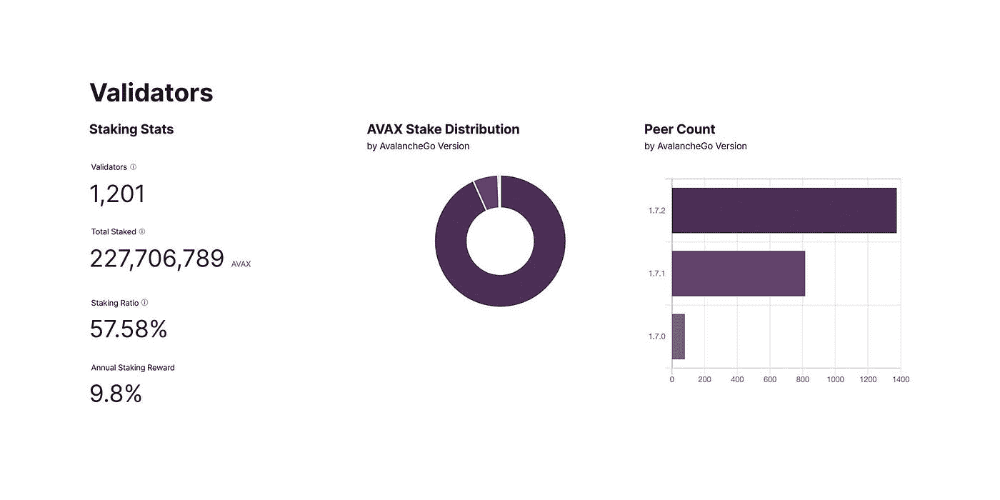

# 雪崩网络

> 原文：<https://medium.com/coinmonks/if-there-ever-were-an-ethereum-killer-it-would-come-in-a-form-of-avalanche-23d407d7088f?source=collection_archive---------1----------------------->

unsplash

## 什么是雪崩？

Avalanche 是一种第一层 **DAG** 优化的共识协议，是分散式应用和定制区块链网络的基础。Avalanche 是一种全球分布式、可互操作、无信任的架构，它通过组合数千个子网来构建一个由多个区块链组成的异构可互操作网络，从而提供无与伦比的分散性。

这是由 Avalanche 的独特共识实现的，它不会以任何方式损害可扩展性或分散性。

我们需要回到过去，以充分理解这意味着什么，以及它是多么具有革命性。

## 共识&拜占庭将军的问题

让我们想象一个名为拜占庭将军的问题的思想实验，该实验由 R. Shostak 于 1982 年首次发表，描述了以下场景:

Source: thewolfofallstreets.io

①拜占庭军队都在敌人城外扎营，每个师由自己的将军指挥。

2)每个将军可以通过信使与其他人交流

3)在观察敌人之后，他们必须决定一个共同的行动计划

4)部分将领可能是 ***叛徒*** ，试图阻止忠诚的将领达成一致

将军们必须决定何时进攻这座城市，但他们需要绝大多数人的支持

在上述情况下，将军们 ***必须有一个算法*** 来保证

(a)所有忠诚的将军决定相同的行动计划，和

(b)少数叛徒不能使忠诚的将军们采纳一个坏计划。

忠诚的将军们都会做算法说他们应该做的事情，但是叛徒们可能会做他们想做的任何事情。不管叛徒做什么，算法必须保证条件。忠诚的将军们不仅应该达成一致，而且应该商定一个合理的计划，一个共识。

上述思考过程表明，共识是至关重要的。分布式网络中的共识更是如此。这使我们进入下一个问题。

## 拜占庭容错(BFT)

源自上述拜占庭将军的问题，是在分布式网络中达成共识的特征，即使当网络中的一些节点未能响应或在不正确的时间内响应。BFT 机制的目标是通过采用集体决策(正确节点和故障节点)来防止系统故障，该集体决策旨在减少故障节点的影响。

## 经典共识

早在 20 世纪 80-90 年代现代形式的区块链技术出现之前，经典的共识方法就已经出现了。几十年来，这一族共识协议被称为“经典共识协议”。从一开始，这些方法就主要用于不同分散程度的分布式数据库。其中最著名的是芭芭拉·利斯科夫和米格尔·卡斯特罗写的《实用拜占庭容错》(pBFT)。

简而言之，此类协议通过类似于议会投票表决新法案的程序达成一致:每个验证者投票决定他们是愿意“接受”还是“拒绝”该交易。

虽然传统的共识协议可以在几秒钟内非常快速地确认交易，但它们只能在网络很小的情况下这样做，通常少于几百个验证者。

此外，这些协议必然需要所有参与者的知识，这使得它们难以在大型环境中部署，例如全球开放的数字货币所需的环境。

## 中本共识

现在快进到 2008 年。中本聪认为传统共识不适合比特币的去中心化和安全性，特别是在加密货币的概念闻所未闻的时候。中本聪共识是共识体系的第一次突破。这消除了所有对所有通信的需要，使它非常适合任何节点可以在任何时候加入的开放、无权限的环境。

不幸的是，这些协议也有一个致命的缺点:它们天生就很慢，每秒只能处理几笔交易，而确认交易只需几分钟。此外，它们还具有高能耗。

## 雪崩共识

2018 年，匿名团队 Rocket 与一组分布式系统研究人员合作，推出了另一个共识协议家族。雪崩协议是这个家族的第一个成员。这是自中本聪以来最大的共识突破。

Avalanche 本质上是无领导的，而不是通过竞争选举或赢得的。网络上的每一个节点都有投票权，没有特殊的特权节点在运作。这些协议随机选择一些参与者并询问网络状态，而不是所有人对所有人投票。这使得能够在几秒钟内确认交易，并在数千 TPS 下操作，同时还使得数千到数百万的参与者能够参与，从而使它们适合于开放的、无许可的设置，其中验证器来来去去。

在分布式系统的历史上，我们只有三次出现新的家族，而 Avalanche 是第三次。

## 背景

计算机科学家 Emin Gun Sirer 博士的大脑产物，他在 2003 年创建了一个名为“Karma”的加密货币原型，他总结如下:

> Karma 是点对点系统的虚拟货币。它的主要优点是不受任何单一实体的控制。它的实施，以及控制其供应和价值的手段，是完全分散的。

他在康奈尔大学当了 20 多年的教授，专门研究分布式分类帐技术。2018 年，在阅读了一篇关于一种新颖的共识机制的研究论文后，Emin 博士请假创建了 AVA 实验室，这篇论文是由一个匿名实体分享的，该实体仅被称为“火箭队”。Avalanche mainnet 不久后上线。

## 这是一只匕首

Avalanche 使用 DAG(有向非循环图)优化的利害关系证明共识协议，称为 Avalanche。在 Avalanche consensus 中，验证器节点互相八卦网络上发生的事务。该信息传播迅速，使得所有验证者在几秒钟内就网络的当前状态达成一致。这实际上使得网络极难被破坏，并且每秒可以处理超过 4，000 个事务(TPS)。

## 定局

在 Nakamoto consensus 协议(如在比特币中使用的)中，一个块可能被包括在链中，但随后被移除，并且不会在规范链中结束。这意味着交易结算要等一个小时。在 Avalanche 中，接受/拒绝是最终的、不可逆的，只需几秒钟。

Source: seekingalpha.com — solwealth

## 三个区块链

雪崩网络由三个独立的区块链组成:X 链、C 链和 P 链。每个链都有不同的目的，这与比特币和以太坊使用的方法截然不同，即让所有节点验证所有交易。雪崩区块链甚至基于他们的用例使用不同的共识机制。

Source: docs.avax.network

1) **P 链** —平台链。允许创建基本上可自定义的 avax 区块链子网

2) **X-Chain** —使用 Avalanche 的 DAG 共识机制，并托管 AVAX 令牌和其他数字资产

3) **C 链** —收缩链。利用以太坊虚拟机实现智能合约功能。

本质上，雪崩共识结合了 Nakamoto 共识的优点(鲁棒性、规模、分散性)和经典共识的所有优点(速度、快速终结和能量效率),而没有缺点。

根据艾娃实验室的说法，该平台每秒可以处理大约 4500 个事务，在 3 秒内完成，这可以说是更适合大规模扩展分散应用程序，这在许多竞争平台上是一个瓶颈。

Source: docs.avax.network

## 自定义区块链和互操作性

Avalanche 允许用户为专门的应用程序开发自己定制的区块链，它支持各种独特的虚拟机，包括以太坊虚拟机和其他虚拟机。该虚拟机然后可以被放在一个子网中，该子网是一个定制的区块链网络，由一组动态的验证器组成，这些验证器一起工作以获得关于一组多个区块链的状态的共识，其中可以指定复杂的规则集，包括满足法规遵从性。因为任何定制的虚拟机都可以在该平台上构建，所以来自任何区块链的项目都可以快速转移，并受益于 Avalanche 的速度、去中心化、低廉的费用和定制。

Avalanche 的互操作区块链的数量也是无限的。

## OPENFI

该框架将在此类项目上市之前评估 Avalanche 上的 DeFi 协议。每个协议将使用六个不同的指标进行评分，其中一些指标是项目的创新程度、团队经验、网络效应和项目基础。

## 未来潜力

Source: coin98.com

雪崩生态系统正在迅速发展。DeFi on Avalanche 已经锁定了近 110 亿美元的价值，许多知名的应用程序，如 AAVE 和曲线金融，都建立在它的基础上。

一些值得注意的例子包括:

## 德勤&雪崩

德勤已经与技术公司艾娃实验室建立了战略联盟，以实现一个新的灾难恢复平台，该平台使用雪崩区块链来帮助州和地方政府轻松证明他们有资格获得联邦紧急资金。

## 粒子—由雪崩提供动力

粒子，是一个平台，将在历史上第一次，获得和标记世界上最伟大的杰作，并建立一个最好的收藏之一。这将通过一个粒子化过程来完成，该过程包括获取一幅画的地契或所有权证明的法律术语，并分成 100×100 的网格，从而产生 10，000 个我们称为粒子的独特的 NFT。今年早些时候，在苏富比的拍卖会上，Particle 以 1290 万美元的价格买下了班克斯的作品《爱在空中》。

## 雪崩&墨西哥

墨西哥金塔纳罗奥州的国会正在实施 Avalanche 的技术，成为第一个使用该技术对其立法文件进行数字认证的国会，该技术通过通信和文件管理系统工作。

## 消防栓和雪崩

Fireblocks 是一家领先的数字资产托管和结算解决方案提供商，为 650 多家银行、对冲基金和金融机构提供服务。其机构用户现在可以访问 Avalanche 的 C 链来保管和转移 AVAX 本机令牌，而不会影响效率或安全性。

此外，其用户可以通过 DeFi API 或 WalletConnect 访问基于 Avalanche 构建的分散式应用。

## 开发基金

Avalanche 已经启动了一项价值超过 2 亿美元的基金，以帮助 Avalanche 公共区块链生态系统内外的生态系统发展、增长和创新。该基金将探索协助其他不断增长的用例的可能性，如安全令牌发行、流动性提供商和自我主权识别，以及整个 Avalanche 生态系统的四个重要增长领域:DeFi、企业应用、NFT 和文化应用。

## 供应动态

Source: docs.avax.network

超过 57%的雪崩供应被锁定以确保区块链的安全。Avalanche 采用了一种类似于以太坊的交易费用燃烧方法，只是使用 AVAX 时，所有交易费用都会被燃烧，而不仅仅是其中的一部分，资产、区块链和子网形成费用也会被燃烧。所有三个区块链都是这样做的，导致了大量的令牌效用和购买压力。

*免责声明:本文包含的信息仅用于教育目的，并不构成 Wheatstones 的任何形式的建议或推荐，用户在做出(或避免做出)任何投资决定时也不打算依赖这些信息。*

> 加入 Coinmonks [电报频道](https://t.me/coincodecap)和 [Youtube 频道](https://www.youtube.com/c/coinmonks/videos)了解加密交易和投资

## 也阅读

 [## 杠杆代币[多头代币]终极指南

### 杠杆化令牌是具有杠杆化风险敞口的 ERC20 令牌，不考虑保证金、要求、管理…

medium.com](/coinmonks/leveraged-token-3f5257808b22)  [## 最佳加密交易所| 2021 年十大加密货币交易所

### 加密货币交易所的加密交易需要了解市场，这可以帮助你获得利润。之前…

blog.coincodecap.com](https://blog.coincodecap.com/crypto-exchange)  [## 2021 年最佳加密交换平台| CoinCodeCap

### 如果我们看看今天的场景，许多加密货币交换平台提供了广泛的功能和深度…

blog.coincodecap.com](https://blog.coincodecap.com/best-swap-platforms)  [## 2021 年最佳加密借贷平台| 6 大比特币借贷平台

### 获得比特币和其他加密货币的最佳贷款利率

medium.com](/coinmonks/top-5-crypto-lending-platforms-in-2020-that-you-need-to-know-a1b675cec3fa)  [## 2021 年最佳免费加密交易机器人

### 2021 年币安、比特币基地、库币和其他密码交易所的最佳密码交易机器人。四进制，位间隙…

medium.com](/coinmonks/crypto-trading-bot-c2ffce8acb2a)  [## 最佳 4 个加密交易信号电报通道

### 这是乏味的找到正确的加密交易信号提供商。因此，在本文中，我们将讨论最好的…

medium.com](/coinmonks/best-crypto-signals-telegram-5785cdbc4b2b)  [## 获取信号、交易机器人和套利

### 在本文中，我们将讨论 bits gap——一个满足您所有交易需求的一站式加密交易平台…

blog.coincodecap.com](https://blog.coincodecap.com/bitsgap-review)  [## 40 个最佳电报频道，用于加密、电影、表演和演讲| CoinCodeCap

### 随着我们周围无限的信息，我们很难筛选和了解有价值的信息。电报有…

blog.coincodecap.com](https://blog.coincodecap.com/best-telegram-channels)  [## 5 个最佳社交交易平台[2021] | CoinCodeCap

### 困惑于社交交易和副本交易哪个平台最好？本文将带您了解各种…

blog.coincodecap.com](https://blog.coincodecap.com/best-social-trading-platforms)  [## BlockFi 评论 2021:利弊和利率| CoinCodeCap

### 今天，我们提出了一个全面的 BlockFi 评论，这是一个成立于 2017 年的加密贷款平台，拥有其…

blog.coincodecap.com](https://blog.coincodecap.com/blockfi-review)  [## 如何在印度购买比特币？2021 年购买比特币的 7 款最佳应用[手机版]

### 如何使用移动应用程序购买比特币印度

medium.com](/coinmonks/buy-bitcoin-in-india-feb50ddfef94)  [## 加密税务软件——五大最佳比特币税务计算器[2021]

### 不管你是刚接触加密还是已经在这个领域呆了一段时间，你都需要交税。

medium.com](/coinmonks/best-crypto-tax-tool-for-my-money-72d4b430816b)  [## 存储比特币的最佳加密硬件钱包[2021] | CoinCodeCap

### 保管您的数字资产很容易，但找到正确的存储方式却是一项繁琐的任务。在线钱包有一个风险…

blog.coincodecap.com](https://blog.coincodecap.com/best-hardware-wallet-bitcoin)  [## Pionex 评论 2021 |免费加密交易机器人和交换

### Pionex 是为交易自动化提供工具的后起之秀。Pionex 上提供了 9 个加密交易机器人…

medium.com](/coinmonks/pionex-review-exchange-with-crypto-trading-bot-1e459d0191ea)  [## 仙境提供了 83，412%的 APY 赌注:仙境是一个骗局吗？CoinCodeCap

### 仙境是雪崩网络的第一个基于时间令牌的分散储备货币协议。一篮子…

blog.coincodecap.com](https://blog.coincodecap.com/wonderland-offers-an-83412-apy-on-staking-is-wonderland-a-scam)  [## 天秤座货币——脸书的加密货币

### 自 2018 年马克·扎克伯格决定致力于改善区块链以来，关于天秤座货币的传言就一直存在…

blog.coincodecap.com](https://blog.coincodecap.com/libra-currency-a-cryptocurrency-by-facebook)