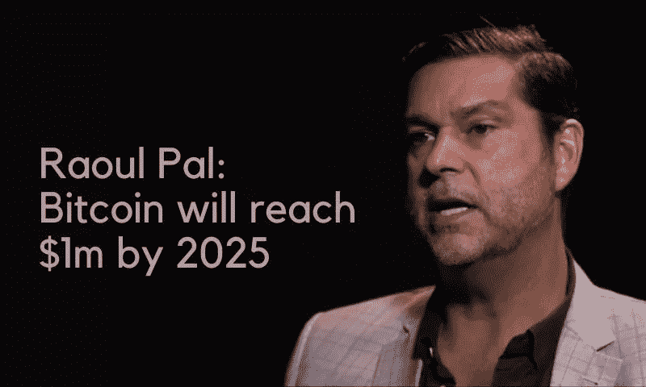
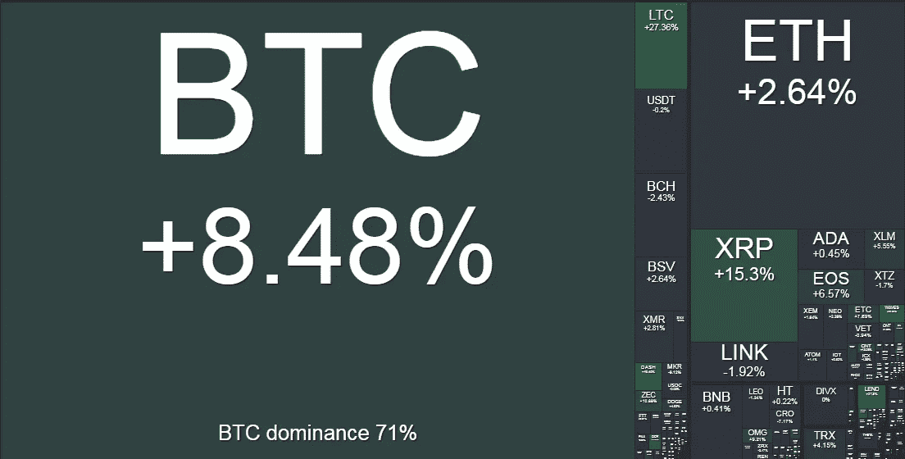

# 如果你建造了它，他们就会来——持有比特币的机构

> 原文：<https://medium.com/coinmonks/if-you-build-it-they-will-come-deba7371293d?source=collection_archive---------1----------------------->

## **本周在 Crypto**

就传统的宏观投资者而言，相当长一段时间以来，前对冲基金经理迈克·诺沃格拉茨(Mike Novogratz)、前高盛和 GLG 投资组合经理拉乌尔·帕尔(Raoul Pal)以及前 Legg Mason 首席信息官比尔·米勒公开表示支持数字资产特别是比特币的宏观投资案例。

随着加密的冬天来了又去，比特币慢慢回升到 5 位数，我们开始看到 Novogratz、Miller 和 Pal 的一些同行的兴趣越来越大。亿万富翁投资者保罗·都铎·琼斯在今年 5 月表示支持，随后在 10 月份接受《美国消费者新闻与商业频道》采访时，他更加坚定地宣称，比特币是对人类创造力的押注，这相当深奥。随后，迈克尔·塞勒(Michael Saylor)的微观战略大张旗鼓地出现了，现在似乎几乎每个月都会有宏观经济、对冲基金和商业领袖进一步认可比特币在这个通胀的 COVID 世界中的地位。我们甚至在上周看到比特币永久熊努里埃尔·鲁比尼，又名末日博士，出来说[比特币“可能是部分价值储存”。](https://www.forbes.com/sites/billybambrough/2020/11/13/nouriel-roubini-cryptos-fiercest-critic-admits-bitcoin-could-be-a-partial-store-of-value/?sh=a2d940a16152&utm_source=hs_email&utm_medium=email&_hsenc=p2ANqtz--EuRs1fBy5PlvUVtQuZ42gXES6elwFuPQ6R6v5HWhPVY6R12nkqljvo4-oopOeCduLjHCL)

*“[比特币]可能是部分价值储存手段，因为不像成千上万我称之为狗屎的其他硬币，它不会那么容易贬值，因为至少有一种算法可以决定比特币的供应量随着时间的推移会增加多少，因为对大多数其他比特币来说，实际上是临时的，它们的贬值速度比[美国美联储]更快，”——努里埃尔·鲁比尼*

在过去的一周里，我们还看到不是别人，正是亿万富翁、宏观投资界的传奇人物斯坦利·德鲁肯米勒(Stanley Druckenmiller)加入了这场争论，进一步证实了中本聪 12 年的发明可能真的不仅仅是昙花一现。对冲基金同行比尔·米勒三年前曾公开表示支持比特币，上周他也公开表示支持比特币，以增强自己对这一押注的信念。

我有点像恐龙，但我已经意识到比特币可能是一种资产类别，作为一种价值储存手段，它具有很大的吸引力。坦率地说，如果黄金赌注成功了，比特币赌注可能会更好，因为它更薄，流动性更差，贝塔系数更大。—斯坦利·德鲁肯米勒

*我认为每一家主要银行、每一家主要投资银行、每一家主要高净值公司最终都会对比特币或类似的东西有所接触。比特币的故事很简单，就是供给和需求。比特币的供应量以每年 2.5%左右的速度增长，而需求的增长速度比这个速度更快，比特币的数量将会是固定的。—比尔·米勒*

毫无疑问，这里有一个趋势。这些高净值的“先行者”一个接一个地拆除了真正的机构投资者的壁垒。随着这些宏观投资先驱开始相信并理解这一小众群体多年来一直呼吁的东西，最初精通技术和加密的比特币火炬手和沉迷于 100 倍波动性的交易员获得了回报。那就是比特币是有史以来最难健全的货币。这是有史以来第一种形式的数字稀缺，而且不会很快消失。

莫尔黑德、诺沃格拉茨、帕尔、都铎·琼斯、米勒和德鲁肯米勒之所以如此富有是有原因的，因为他们很早就看到了宏观机会，并用自己的信念和资本交换了自己的洞察力。这些宏观投资者是量化和承受风险的专家，不惧怕波动性，而且历史已经证明，他们获得了丰厚的回报。最近这类投资者的涌入表明，在我们看来，真正的机构资金还有一段路要走。当我们提到真正的机构投资者时，我们指的是养老基金、主权财富基金和货币市场经理。这些投资者中有许多不能也不愿投资比特币等资产，仅仅是因为他们不能投资于波动性如此之高的资产类别，因为他们的授权不允许此类交易和敞口。Satoshi 的早期采用者和预测的最终游戏(主权和养老基金等真实机构将比特币作为储备资产持有)之间的差距正在被填补(和阿尔法被捕获)，并被 Druckenmiller 等经验丰富的宏观投资者利用。

在我们看来，比特币可能会经历几个市场资本化的价格发现周期，直到波动性开始趋于平稳，这些实体机构开始将资金分配到更适合其使命的资产类别的大门打开。预测价格水平是一场艰难的游戏，但不难想象，当比特币开始挑战黄金的市值时，这些“早期”宏观投资者(如 Druckenmiller)会抛售给实体机构——其市值仅是我们今天的 30 倍左右。

可悲的是，对于 Bridgewater Associate 的投资者来说，雷伊·达里奥仍然落后于上述同行，因为他抵制住了稳健货币的诱惑，并将资金分配到比特币中。上周， [Dalio 继续他对比特币的负面看法](https://cointelegraph.com/news/ray-dalio-believes-nations-will-outlaw-bitcoin-if-btc-price-keeps-rising?utm_source=hs_email&utm_medium=email&_hsenc=p2ANqtz--EuRs1fBy5PlvUVtQuZ42gXES6elwFuPQ6R6v5HWhPVY6R12nkqljvo4-oopOeCduLjHCL),他说，总而言之，1)比特币太不稳定，不能投资于 2)你不能把你的比特币花在零售商品上 3)政府最终会禁止使用任何可能的工具。

这是一种拙劣的表演。有了更多的技术理解，很明显，比特币还没有准备好作为一种交换手段部署，因为第二层应用程序仍在构建中。Lightning Labs 最近发布的公告详细介绍了 Lightning Pool 的发布就是这样一个进步。尽管这项技术承诺在 2018 年实现快速廉价的零售交易，但它仍有一段路要走。就目前而言，比特币是一种价值储存手段和储蓄技术，需要更大程度和更深层次的理解，才能意识到比特币作为一种交易手段的实用性尚未到来。这种观点需要时间和努力来理解，这显然是达利奥评估中缺失的部分。

至于比特币波动太大，这很好地印证了我们的观点，即如果机构资金管理者受制于投资者的严格授权，投资比特币的障碍将依然存在。如果 BTC 价格继续走高，这种仍在观望的投资者的积累只会助长 FOMO 的说法。Bridgewater Associates 可能就是这样一个投资者，他们需要等待 BTC 再经历几轮金融化和随后波动性降低的周期，然后才会跳进去。

也许来自 Dalio 的最悲观的警告是政府禁止它。这种观点表明，就数字资产而言，他们对当前的政治和监管环境严重缺乏了解。美国政府真的会没收数百万美国人的私有财产吗？极不可能。如果新加坡政府和监管机构计划禁止比特币，他们真的批准星展银行建立数字资产交易所了吗？同样，不太可能。

美国证券交易委员会、CFTC 和 OCC 都在 2020 年推出了各种框架、定义和监管，这些框架、定义和监管现在已经根深蒂固地围绕着数字资产行业，并表明政府尽管可能不情愿，但正在慢慢接受这一新行业及其潜力。比特币在美国法规和政治中的足迹并非微不足道，是的，现在和将来都会有一些法规阻碍这个行业，减缓和控制比特币的使用和存储。旅行规则和自我监护问题就是很好的例子；然而，目前完全禁止似乎不太可能。

随着最近的美国大选，这一点得到了进一步加强，因为世界现在可以享受有史以来第一位公开支持和拥有比特币的参议员。来自怀俄明州的当选参议员 Cynthia Lummis 最近在 ABC 新闻上解释了为什么她认为比特币在我们生活的世界中扮演着重要的角色。提醒…这是美国参议员！

*我真的希望将比特币带入全民话题。我是前州司库，我投资了我们州的永久基金。所以我一直在寻找一种好的价值储存方式，而比特币正符合这一要求。——当选参议员辛西娅·卢米斯*

然而，尽管如此，我们还是要感谢像 Dalio 和其他保守机构这样的人，他们将在未来几个周期内充当火箭燃料，将比特币带到价格发现的下一个层面。我们很感激，因为正是这些观点的差异和理解的深度为书呆子、极客和 100 倍投机者提供了世代投资机会，这些人现在正被德鲁肯米勒(Druckenmiller)等宏观重量级人物所取代。天哪，我们已经走了多远了！

Crypto weekly performance: 17th November 2020\. Source [www.bitgur.com](http://www.bitgur.com/?utm_source=hs_email&utm_medium=email&_hsenc=p2ANqtz--EuRs1fBy5PlvUVtQuZ42gXES6elwFuPQ6R6v5HWhPVY6R12nkqljvo4-oopOeCduLjHCL)

在 [www.kenetic.capital](http://www.kenetic.capital) 注册免费的每周简讯

## 另外，阅读

*   最好的[密码交易机器人](/coinmonks/crypto-trading-bot-c2ffce8acb2a)
*   [Deribit 审查](/coinmonks/deribit-review-options-fees-apis-and-testnet-2ca16c4bbdb2) |选项、费用、API 和 Testnet
*   [FTX 密码交易所评论](/coinmonks/ftx-crypto-exchange-review-53664ac1198f)
*   最好的比特币[硬件钱包](/coinmonks/the-best-cryptocurrency-hardware-wallets-of-2020-e28b1c124069?source=friends_link&sk=324dd9ff8556ab578d71e7ad7658ad7c)
*   [密码本交易平台](/coinmonks/top-10-crypto-copy-trading-platforms-for-beginners-d0c37c7d698c)
*   最好的[加密税务软件](/coinmonks/best-crypto-tax-tool-for-my-money-72d4b430816b)
*   [最佳加密交易平台](/coinmonks/the-best-crypto-trading-platforms-in-2020-the-definitive-guide-updated-c72f8b874555)
*   最佳[加密借贷平台](/coinmonks/top-5-crypto-lending-platforms-in-2020-that-you-need-to-know-a1b675cec3fa)
*   [莱杰 vs 特雷佐](/coinmonks/ledger-vs-trezor-best-hardware-wallet-to-secure-cryptocurrency-22c7a3fd391e)
*   [bits gap review](/coinmonks/bitsgap-review-a-crypto-trading-bot-that-makes-easy-money-a5d88a336df2)——一个轻松赚钱的加密交易机器人
*   为专业人士设计的加密交易机器人
*   [3commas Review](https://blog.coincodecap.com/3commas-review-an-excellent-crypto-trading-bot) |一款优秀的密码交易机器人
*   [PrimeXBT 审查](/coinmonks/primexbt-review-88e0815be858) |杠杆交易、费用和交易
*   Bitmex 的[保证金交易指南](/coinmonks/the-idiots-guide-to-margin-trading-on-bitmex-dbbd7742c6fc?source=friends_link&sk=7bfa99d2a181142510c8442c8ddb0786)
*   [eToro 评论](/coinmonks/etoro-review-78807ddeb33c) |交易股票、密码、交易所交易基金、差价合约和商品
*   [Bitmex 高级保证金交易指南](/coinmonks/bitmex-advanced-margin-trading-guide-2270c195ce25?source=friends_link&sk=1d986cca731f5084b9a2db4a4bc4a7ad)
*   开发人员的最佳加密 API
*   [加密套利](/coinmonks/crypto-arbitrage-guide-how-to-make-money-as-a-beginner-62bfe5c868f6)指南:新手如何赚钱
*   顶级[比特币节点](https://blog.coincodecap.com/bitcoin-node-solutions)提供商
*   最佳[加密制图工具](/coinmonks/what-are-the-best-charting-platforms-for-cryptocurrency-trading-85aade584d80)
*   了解比特币的[最佳书籍有哪些？](/coinmonks/what-are-the-best-books-to-learn-bitcoin-409aeb9aff4b)

> [在您的收件箱中直接获得最佳软件交易](https://coincodecap.com?utm_source=coinmonks)

