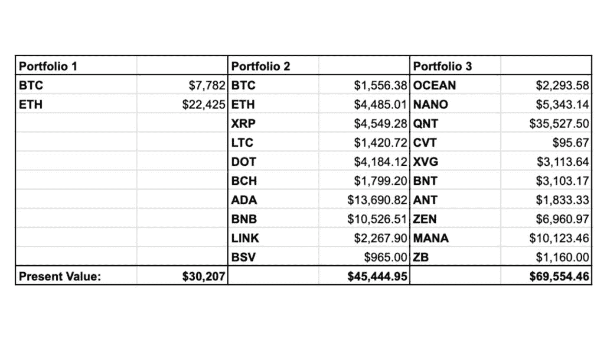
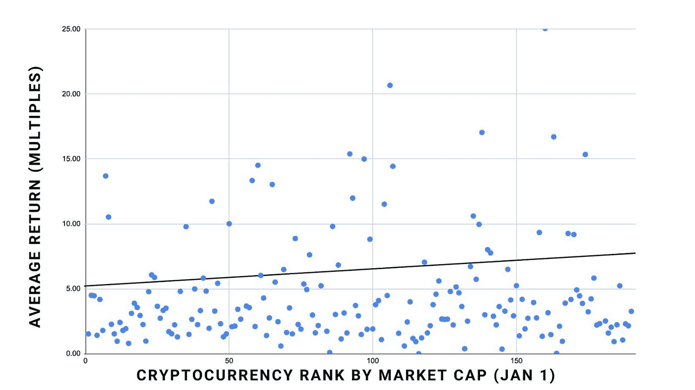
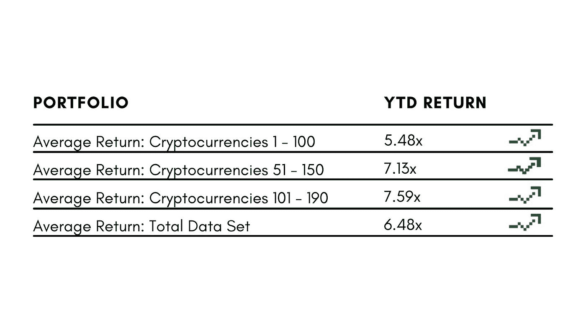

# 如果你没有小盘股加密货币，你就错过了:以下是硬数据。

> 原文：<https://medium.com/coinmonks/if-you-dont-own-small-cap-cryptocurrencies-you-re-missing-out-here-s-the-hard-data-160efc46b920?source=collection_archive---------0----------------------->

我只把一小部分内容放在媒体上。如果你想获得所有加密实用主义新闻更新、投资公告和 altcoin 报告的全部信息，请在此免费注册简讯。

## **第一部分:问题**

在过去的市场周期中，有一件事在加密领域变得很明显:最大的收益不再属于那些只拥有以太坊和比特币的人。

虽然比特币和以太坊看起来都是相对安全的投资，至少在长期内保持了它们的价值，但它们为这种(相对)安全付出的潜在收益较低。

即使比特币达到 50 万至 100 万美元的自由价格目标，也只能代表 10 倍至 20 倍的回报。当我们考虑以太坊 5 万美元的目标价格时，这些倍数是相似的:大约是我们今天的 15 倍。没什么可嘲笑的，但远没有“蓝筹股”货币曾经承诺的 100 倍回报高。​

## **第二部分:解决方案**

那么这些回报从何而来呢？小盘股替代货币——这些新兴的加密货币进入市场是为了解决一个问题，并希望提供一个解决方案，能够为创始人和投资者创造数十亿美元的价值。

Solana、Terra Luna 和 MATIC(年初至今回报率均超过 50 倍)等货币就是曾经适合贴上“小盘股”标签的投资例子。​

## **案例分析**

为了强调我的观点，让我们把三个假设的 10，000 美元的投资组合放在一起，让它们相互竞争，开始日期是 2021 年 1 月 1 日，结束日期是 9 月 14 日:略低于 9 个月。

*   **投资组合 1:**:1 月 1 日，对前两大加密货币(以太坊和比特币)各投资 5000 美元
*   **投资组合 2:**:1 月 1 日，投资 1000 美元于排名前 10 位的加密货币
*   **投资组合 3**:1 月 1 日按市值投资 1000 美元于加密货币 91–100

我并不是说这是完美的数据，完美的风险调整，不涉及运气或随机性，或者它适用于市场周期的所有阶段。但是我在比较苹果和苹果，三个不同的投资组合都是由市场选择的。

首先，这些投资组合中最差的回报是 3 倍，这意味着如果你投资加密，你会远远超过那些投资房地产、股票、债券或任何其他主流资产的人。

但是我们的中/低市值替代币(市值从 91 到 100)的投资组合比最受欢迎的替代币表现更好，而最受欢迎的替代币又比最受欢迎的两种加密币表现更好！

这是相当惊人的，经过反思，很有道理。当然，更小、更不为人知的加密货币有更高的上升潜力！10 亿美元的替代硬币要翻倍，需要市值增加 10 亿美元。一个 1000 亿美元的替代币要翻倍，需要市值增加 1000 亿美元。这一壮举在数学上要困难 100 倍。

这些较小的替代硬币不太为人所知，也不太为人所知。他们给市场带来了新的想法，未经证实的想法要么会给他们带来难以置信的估值，要么会导致他们以戏剧性的方式失败。

但如果你能找出哪些想法是有价值的，哪些论点将得到验证，并确定哪些想法具有不可持续的经济学和粗略的价值主张，市场将会给你带来指数回报。

​

## **平均回报率排名:**

我明白这张假设投资组合表可能会被视为误导，所以我查看了市值最高的 190 种加密债券(我剔除了所有与美元挂钩的稳定债券)，以了解平均回报率。

对此要持保留态度，因为日期是随机的，而且这些数据来自历史上最大的加密牛市中期的一个短时间框架，但我们仍然可以尝试比较小盘股和大盘股的表现:

(A note: coins that returned over 25x are included in the data set, but aren’t displayed on the graph. They are the following: NPXS (25.05x), QNT (34.62x), DOGE (41.5x), ONE (43.43x), LUNA (57.3x), MATIC (70.19x), (FTM 75.45x)

图中的线是数据集的线性回归。cryptos 101–190(再次排除 stablecoins)平均返回比其原始值多 200%的值。

前 100 个 cryptoss 的平均回报率为 5.48 倍，后 90 个 crypto 的平均回报率为 7.59 倍。

与大盘股相比，每投资 1000 美元，小盘股的收益平均会多出 2000 美元！

按群组看一下数据:

## **蓝筹密码依然重要:**

大盘股比小盘股有更大的优势，主要体现在两个方面:波动性和下跌风险。

虽然在过去 9 个月中，排名前 100 位的 cryptos 中只有 5%亏损，但排名前 101-190 位的 cryptos 中有近 10%亏损。

此外，由于小盘股的价格更容易上涨，因此也更容易下跌，从而导致波动。这些蓝筹股在经济低迷/熊市/股市暴跌时持有更多价值，而小型股可能会损失很多。

如果你害怕下跌风险，那就买比特币。你失去所有钱的可能性要小得多。

## **Altcoin 策略**

有一点非常重要:这种投资方式是基于平均值的。与其他类型的投资相比，这更像是一种喷雾祈祷的方式。但是如果回报一般，并且你愿意坚持度过可怕的低谷，那也没关系。

如果你在心理上没有做好承受巨大损失的准备，另类投资不适合你。就像投资初创公司一样，这是一场赌注和概率的游戏。

你必须愿意在一些投资上损失所有的钱。今年以来，排名前 10 的 cryptos 没有一家亏损。在我分析的最小的 90 个 cryptos 中，80%的回报低于他们的平均水平。

但是最好的那些表现出色，足以让整个投资组合达到极高的水平。这就是另类投资的意义所在。

**杰克·尼沃尔德** 密码实用主义者

[**点击这里**](http://cryptopragmatist.com/sign-up/) **在你的收件箱里获得这样的内容，绝对免费。**

> 加入 Coinmonks [电报频道](https://t.me/coincodecap)和 [Youtube 频道](https://www.youtube.com/channel/UCbyDhTbOiKh2iUMKBi4-4Zg)了解加密交易和投资

## 另外，阅读

*   [币安期货交易](https://blog.coincodecap.com/binance-futures-trading)|[3 comas vs Mudrex vs eToro](https://blog.coincodecap.com/mudrex-3commas-etoro)
*   [如何购买 Monero](https://blog.coincodecap.com/buy-monero) | [IDEX 评论](https://blog.coincodecap.com/idex-review) | [BitKan 交易机器人](https://blog.coincodecap.com/bitkan-trading-bot)
*   [币安 vs 比特邮票](https://blog.coincodecap.com/binance-vs-bitstamp) | [比特熊猫 vs 比特币基地 vs Coinsbit](https://blog.coincodecap.com/bitpanda-coinbase-coinsbit)
*   [如何购买 Ripple (XRP)](https://blog.coincodecap.com/buy-ripple-india) | [非洲最好的加密交易所](https://blog.coincodecap.com/crypto-exchange-africa)
*   [非洲最佳加密交易所](https://blog.coincodecap.com/crypto-exchange-africa) | [胡交易所评论](https://blog.coincodecap.com/hoo-exchange-review)
*   [eToro vs robin hood](https://blog.coincodecap.com/etoro-robinhood)|[MoonXBT vs by bit vs Bityard](https://blog.coincodecap.com/bybit-bityard-moonxbt)