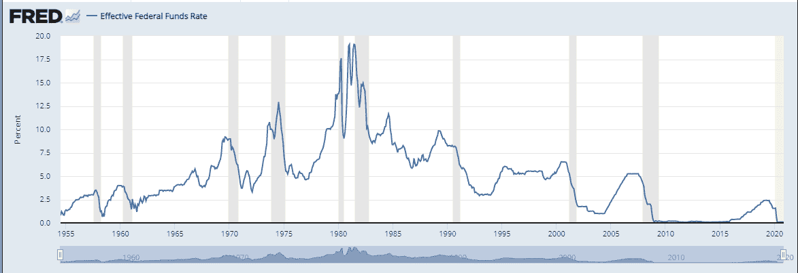
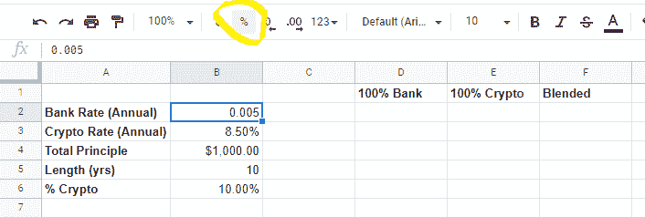
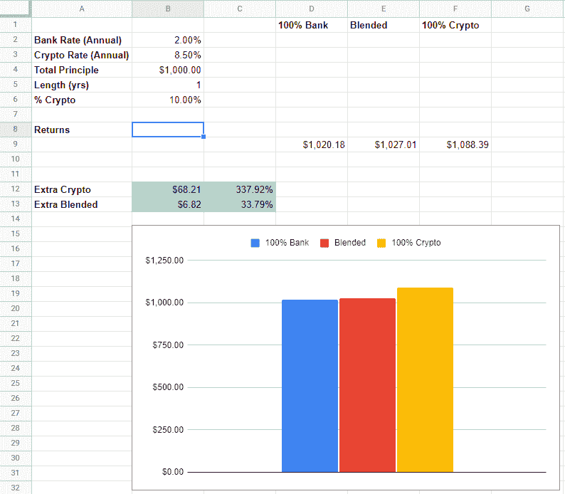
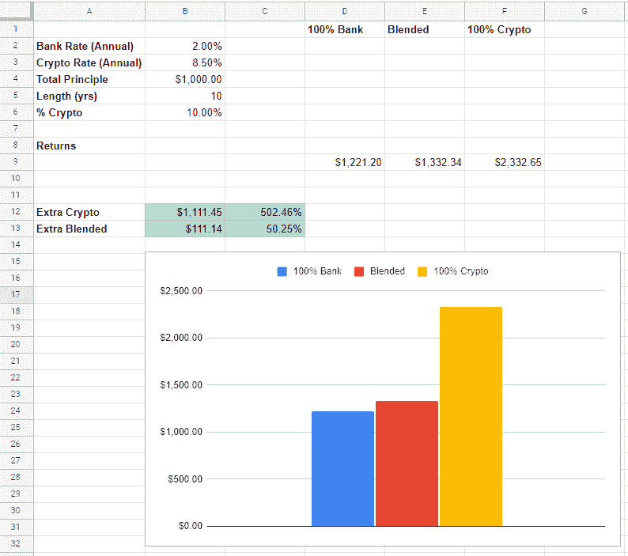

# 2021 年 1 月

> 原文：<https://medium.com/coinmonks/ifeanyis-investment-musings-january-2021-f809928cd538?source=collection_archive---------5----------------------->

祝大家新年快乐，

随着我们步入 2021 年，你的一个决心应该是解除你自己的银行账户，至少是你的一些存款。 **Unbank Yourself** 是一个由[亚历克斯·“机器”·马辛斯基](https://www.linkedin.com/in/mashinsky/)创造的口号，他是一个加密贷款平台 [Celsius Network](https://celsius.network/) 的创始人兼首席执行官。我的#UnbankYourself 旅程始于 2020 年 5 月，当时我在 2018 年用来购买一些加密的平台被加密资产经纪商 [Voyager Digital](https://www.investvoyager.com/) 收购。我在多种加密资产上投入了少量资金，因为我觉得我的投资组合中需要一些加密，坦白地说，我已经有两年多没有关注过它了。2020 年 5 月，我终于在航海家平台上建立了自己的账户，并注意到我钱包里的一些硬币收到了利息。正是这些利息支付让我进入了加密利息兔子洞，并让我今天来到这里，与你们分享我一路上所学到的东西。

请记住，我不是专家。我只是分享我一路走来所学到的东西，也分享我用自己的资金采取的一些行动。如果我得到任何错误的信息，请让我知道。这篇文章中没有任何金融建议。如果你发现这些信息很有趣，请在将你的资金置于风险之前做好自己的研究。

你可能知道也可能不知道，美国美联储银行(美联储)和主要央行已经向储户宣战。利昂·托洛茨基曾说过“你可能对战争不感兴趣，但战争对你感兴趣。”

你会问，美联储是如何宣战的？回答—通过将利率设置为 0%。为了应对 2008 年金融危机，美联储在 2008 年末采取了零利率政策(ZIPR)。该政策一直有效，直到 2015 年底，他们开始逐步提高利率，在 2019 年年中达到 2.5%，然后他们开始再次降低利率。为了帮助应对新冠肺炎危机，美联储再次将利率降回零，并在 12 月的会议上表示，他们计划将利率保持在 0%至少到 2023 年。从下方的[图中可以看出，自 2008 年以来，利率一直处于历史低位。](https://fred.stlouisfed.org/series/fedfunds)

**图 1:自 1955 年以来的联邦基金利率**

尽管低利率对借款人(尤其是那些借钱购买资产的人)来说很好，但对储户和任何有固定收入的人(通常是老年人)来说，低利率是可怕的。在 2019 年年中，你可以获得一份 12 个月的定期存单，收益率超过 2%。虽然不太好，但今天同一家机构在[的 12 个月定期存款将支付你 0.45%。同样在 2019 年年中，你可以从](https://www.towerfcu.org/bank/certificates/)[在线高收益储蓄账户](https://www.marcus.com/us/en/savings/high-yield-savings)之一获得超过 2%的利率，但今天，你将获得 0.5%。如果你只有一个普通的储蓄账户，你可以得到 0.1%。

与此同时，消费者价格指数(CPI ),通货膨胀的官方指标，在 11 月份达到了 1.6%的 T4。这意味着，不管你的钱放在什么样的银行工具里，你实际上会损失至少 1.1%。在这篇文章中，我不会谈论通货膨胀或者 CPI 是否是计算通货膨胀的正确方法。你需要知道的是，为了保持你的购买力，你的储蓄必须产生大于通货膨胀的回报。

虽然有办法获得更高的回报，比如股市，但这并不是为日常需求或应急基金等存钱的正确地方。那么储户该做些什么呢？取消自己的银行帐户(#取消自己的银行帐户)。从传统银行系统中拔出插头，插入加密银行系统。

你可能会问，什么是加密银行系统？通常当我向人们提到加密时，他们会提到比特币和/或加密货币。然后他们会问这样的问题:这不就是人们用来购买毒品和进行各种非法活动的东西吗？加密货币合法吗？加密货币不会波动吗？这些是人们对加密资产的一些疑问和误解。请注意，我说的是加密资产，而不是加密货币。

有许多类型的加密资产。[比特币](https://bitcoin.org/en/)，第一个加密资产，于 2008 年由[中本聪](https://en.wikipedia.org/wiki/Satoshi_Nakamoto)发明，比特币网络于 2009 年 1 月 9 日上线。

在我继续之前，让我首先解决比特币的常见误解，特别是一般的加密。在本节中，我将使用比特币作为加密资产(crypto)的替身，因为比特币是最常见的加密方式

*   *比特币只对罪犯或试图逃避法律的人有用*:比特币可以作为一种支付形式。像所有的支付方式一样，人们可以使用比特币支付合法和非法的商品和服务。就像他们可以使用现金或信用卡一样。
*   *比特币不合法*:比特币在美国是合法的，出于税收目的[已经被美国国税局归类为财产](https://www.irs.gov/irb/2014-16_IRB#NOT-2014-21)。这意味着比特币可以免税持有，直到出售，届时任何收益都要缴纳资本利得税。
*   *比特币易变*:比特币易变。然而，比特币的波动性只是它作为一种增长非常迅速的新资产类别的一个功能。随着比特币的成长，波动性降低了。好消息是，这种波动主要是向上的，这使得比特币成为自诞生以来表现最好的资产类别。这与高增长公司的股票没有什么不同。

虽然比特币的支持者希望有一天能够将其作为日常购物的货币，但它目前还没有准备好以这种方式使用。由于技术原因，它不仅不太适合日常购物，而且以这种方式使用它也不是一个好主意(至少在美国)，因为你需要跟踪你的所有交易以进行纳税申报。

有许多不同类型的加密资产。以下是一些例子:

*   价值资产的存储(在这一点上，比特币是唯一合格的加密资产)；
*   开发分散应用程序或 dApps 的平台(以太坊属于这一类)；
*   Stablecoins (USDC)

还有其他类型的加密资产提供其他类型的功能。然而，就本文的目的而言，上面提到的 3 点就足够了。虽然大多数加密资产价值相对于法定货币(如美元)波动，但稳定的货币不会。这是因为稳定的货币是特别设计的，不会随其所反映的货币而波动。一种稳定的硬币是[美元硬币(USDC)](https://www.circle.com/en/usdc) 。USDC 是一种美元稳定货币，其价值与美元挂钩。这意味着 1 USDC 总是值 1 美元。它能够保持钉住汇率，因为他们需要为任何新铸造的 USDC 持有等量的美元储备。维持这种美元储备的原因是，USDC 可以在需要时兑换成美元。类似于 1971 年之前，当美国放弃金本位制时，美元可以兑换成黄金。

当人们购买 USDC 时，他们不必担心它对美元贬值。它也不会获得任何价值。它只是作为一种在加密生态系统中持有等值美元的方式，允许您在几秒钟内完成交易，而不是用菲亚特完成交易的几天。持有 USDC 的另一个好处是，你可以得到比在传统银行持有美元更高的利率。目前 USDC 的利率至少是 8%。

当传统银行支付不到 1%的利息时，USDC 怎么能产生至少 8%的利息呢？这些高利率是可能的，因为 USDC 的利率不是由美联储设定的，而是由自由市场根据 USDC 的供求关系设定的。在加密经济中，你不能用美元交易。加密生态系统是数字化的，而美元不是。这意味着，如果有人希望在加密生态系统中进行交易，而不受其他加密资产的波动性影响，他们必须首先将另一项加密资产或美元转换为稳定的货币(本例中为 USDC)。由于除非有等量的实际美元储备作为支持，否则 USDC 是无法创造的，因此当需求很高时，稳定硬币的创造速度受到限制。

**购买加密资产:**加密资产可以在加密交易所或经纪公司购买。在美国[比特币基地](https://www.coinbase.com/)，[币安。US](https://www.binance.us/en/home) 和 [Gemini](https://www.gemini.com/) 是购买 crypto 的热门平台。尽管这些平台很受欢迎，但它们并没有引起人们对加密的兴趣。要对 crypto 感兴趣，你必须使用一个能引起兴趣的平台。这些平台采用不同的策略来产生它们支付的收益。

下面列出的加密平台支付 USDC 利息:

*   [摄氏网络](https://celsius.network/)
*   [航海家数码](https://www.investvoyager.com/)
*   [BlockFi](https://blockfi.com/)
*   [Nexo](https://nexo.io/)

一般来说，这些平台将大部分(他们说至少 60%)从其活动中产生的收入返还给他们的平台用户(我们，资产所有者)。

这些平台从客户存款中赚取收益的方式之一是将资金借给第三方。借出客户资产的做法类似于传统金融界的[证券借贷](https://www.investopedia.com/terms/s/securitieslending.asp)，是金融领域最安全的借贷形式之一。[block fi 的联合创始人兼首席执行官扎克·普林斯](https://www.linkedin.com/in/zacprince/)在多次采访中表示，即使在 2008 年金融危机期间，也没有银行或券商因其证券借贷业务而亏损。因此，当你在 Voyager 这样的加密平台上购买你的 stablecoin 时，他们会转过身来，以 12%的利率将你的硬币借给第三方，并支付你 [8.5%(当前利率)](https://rewards.investvoyager.com/interest/)。借出储户的现金(在银行)和股票(在经纪账户)的做法已经存在了几十年。不同之处在于，当传统银行和券商将你的资产借出时，它们将利润传递给管理层(以高薪和奖金的形式)和股东(以股息和股票回购的形式)。相反，这些加密平台所做的是将大部分利润传递给资产所有者。

平台的另一个收入来源是对平台用户的贷款。这些平台为用户提供了一种无需出售即可获得其加密资产部分价值的方式。他们提供的抵押贷款通常不超过贷款价值的 66%(LTV)。这非常类似于经纪账户中的保证金贷款，在这种情况下，一个人可以用自己股票的价值来借款。这些类型的贷款对平台很有吸引力，因为它们控制着资产，可以追加保证金或清算抵押品，以将 LTV 保持在可接受的范围内。

这种贷款对借款人很有吸引力，原因如下:

1.  *不需要出售你的资产*。通过以你的资产为抵押进行贷款，你不必付任何税，也不用担心你出售后密码的价值会上升。
2.  *竞争性利率*。根据 LTV，这些贷款可以低至 1%。提供贷款的平台没有一个利率高于 13%。这些利率比信用卡利率低得多。
3.  *没有信用检查*。只要你在平台上有资产，你就有资格获得贷款。在 Nexo 平台上，你甚至不需要申请贷款。一旦你存入一项资产，他们会自动给你一个信用额度，你可以马上开始使用。这比去银行甚至像 [LendingClub](https://www.lendingclub.com/) 或 [Prosper](https://www.prosper.com/) 这样的点对点借贷平台有很大的优势。

**有哪些风险？**

*无 FDIC 保险:*当你将美元存入美国银行时，你的资金由[联邦存款保险公司(FDIC)](https://www.fdic.gov/) 承保，最高可达 25 万美元。实际上，你的钱是由美国政府的充分信任和信用担保的(世界上最终的财务担保)。在这些贷款平台上，USDC 目前没有任何此类担保。当您持有 USDC 或任何加密资产时，您依赖于该平台，不仅可以保护您的资金免遭盗窃，还可以通过遵守严格的核保指南和流程控制来进行良好的风险管理。将你的资金放在一个可信的平台上是非常重要的。不幸的是，正如其中一个平台 [Cred 在 2020 年 11 月](https://www.bloomberg.com/news/articles/2020-11-09/busted-hedges-alleged-fraud-bankrupt-silicon-valley-crypto-firm)申请破产时显示的那样，确实没有办法知道。他们的破产申请显示，他们不仅没有良好的内部控制和承保指南，还虚报了资产和负债。在 Cred 平台上拥有资金的人无法获得他们的资金，可能只能收回他们在平台上拥有的资金的一部分，如果有的话。

*平台保险不包括借出的资产:*许多这样的平台对他们持有的加密资产进行了保险。但这种保险只适用于平台上实际存在的资金。请记住，平台产生利息并支付给客户的方式之一是将客户的密码借给第三方。这意味着当你的密码被借出时，它不在平台保险范围内。这些平台必须确保适当审查与它们合作的第三方，以确保它们的信誉，或者确保它们有足够的抵押品，可以迅速变现，以防止任何损失。这意味着这些平台需要有非常好的风险管理和收款实践。

*交易对手风险(抵押/再抵押):*平台还可以将其管理的资产抵押给第三方。这种做法被称为抵押。如果该抵押资产再次被作为抵押品，那么它现在已经被再抵押(抵押资产再次被抵押)。虽然这是传统金融行业的普遍做法，在繁荣时期通常不是问题，但如果市场低迷，人们试图拿回自己的资产，这可能会成为一个问题。拥有良好的内部控制和风险管理的另一个原因。这个具体问题并不真正影响 stablecoins。

*有限的支持选项:*这些平台上的支持选项仍然非常有限。他们都有电子邮件支持，通常至少需要一天时间才能给你回复。到目前为止，当我有任何问题时，他们都会回复我。这不是一个风险，更像是一个参考信息，所以你不会感到惊讶。

以下是我在使用这些平台之前主要寻找的东西

*   看他们领导团队的经验，看他们的投资人是谁。我喜欢由拥有良好业绩记录的人领导和/或由经验丰富、可信的机构支持的平台。例如，Voyager 的联合创始人之一在 E-Trade 工作，而 Celsius Network 的首席执行官在推出 Celsius 之前已经创建、运营并成功退出了多家企业。
*   平台提供的利率是否与其他平台一致？为此，我想确保远离一个提供比竞争对手高得多的费率的平台。如果他们提供这样的利率，他们可能会承担更多的风险。
*   听听高管们的采访。我真的很想看看他们的高管是否愿意接受较小平台的采访。我也喜欢他们做长时间的采访，他们愿意从随机的人那里接受问题，并详细回答关于他们商业实践的问题。
*   他们是否正在采取措施增加其持有资产的透明度？例如，Celsius Network 刚刚完成了验证其资产的审计，他们正在开发一个工具，允许任何人按需执行该审计。
*   留意平台上关于任何问题的新闻。

我不是想吓唬你，但我确实认为理解投资的风险是非常重要的，这样他们才能确定潜在的回报是否值得冒这些风险。我认为冒这些风险确实是值得的，并亲自采取了以下步骤来降低在一个平台上完全损失或访问我的所有加密资金的风险:

1.  *开始小规模投资*:我开始时只有不到 10%的储蓄用于加密资产。随着我的学习和变得更加舒适，我慢慢地增加了我在密码领域的储蓄份额。我目前有大约 40%的储蓄投资于加密生态系统。如果这个领域的情况继续看好，我计划至少动用我 60%的存款。
2.  *分散投资*:我的资金分散在 4 个不同的平台上。没有一个平台有我 40%以上的资金。最终，我计划将我的加密资产放在至少 6 个平台上，其中任何一个平台都不会超过我资金的 25%。虽然我对我目前使用的平台很有信心，但是你必须非常小心。
3.  *不断学习*:我一直在努力学习更多关于我正在使用的平台的知识。到目前为止，我对摄氏网络团队印象非常深刻。他们真的试图通过开放他们的平台来尽可能地对他们的用户透明，这样人们可以实际验证他们确实拥有他们声称拥有的资产。他们说，他们偏向于做对他们的用户和 Celsius 网络社区(又名 [Celsians](https://celsians.com/) )最有利的事情，他们的行动表明，这才是他们真正在做的事情。

**工具**

我创建了这个电子表格[来帮助说明通过将你的部分或全部储蓄投入到这些平台中的一个，你可以多赚多少钱。要使用该电子表格，您需要制作一份副本(需要您有一个 Google 帐户)，因为您不能直接对该文档进行任何更改。](https://docs.google.com/spreadsheets/d/1SKRxRnJZuDGA9Z9GN_wHmtl3N9XZb2Js3JP2FPuupOg/edit#gid=0)

电子表格有两个选项卡:

1.  **comparison _ Bank _ and _ Crypto _ Interest:**这是一个交互式表单，您可以在其中输入数字，并查看通过将您的部分或全部储蓄投入 stablecoins 以赚取利息，您可以多赚多少钱。
2.  **Crypto_Accounts:** 在此选项卡中，我列出了我使用的加密平台，并提供了一些关于我的偏好和原因的附加信息。

在你复制了一份之后，你可以输入一些数字，它会告诉你如果你 100%的资金在银行，100%的资金在加密平台或混合平台上，你的回报会是多少。

**注意:**由于 Google sheets 中的一个怪癖，当你输入一个介于 0 和 1%之间的利率(例如 0.5%)时，你必须将其输入为 0.005，然后将单元格的格式更新为百分比。对于 1%及以上的利率来说，这不是问题。请参见下图，了解在 Google sheets 中何处可以找到%图标。如果你知道如何解决这个问题，请告诉我。

电子表格要求您提供以下信息:

*   银行利率
*   加密平台利率
*   总原则
*   你打算存多久
*   您愿意将储蓄的多大比例转移到 crypto

下图(示例 1)显示了一年内 1000 美元的回报结果。银行利率为 2%，加密利率为 8.5%。如果你所有的钱都放在密码里，你会多赚 68.21 美元(多赚 300%以上)，如果你只有 10%的储蓄放在密码里，你会多赚 6.82 美元(多赚 30%以上)。

**例 1**

下图(示例 2)显示了 3 年内 1000 美元的回报结果。银行利率是 0.5%，加密利率是 8.5%。如果你所有的钱都放在 crypto 里，你会多赚 274.19 美元(超过 1800%以上)，如果你只有 5%的储蓄放在 crypto 里，你会多赚 13.71 美元(超过 90%以上)。

**例二**

下图(示例 3)显示了 10 年间 1000 美元的回报结果。其他都和例 1 类似。如果全部是加密的，你会多赚 1111.45 美元(多赚 500%以上)，如果只有 10%是加密的，你会多赚 111.14 美元(多赚 50%以上)。

**例 3**

从上面的例子中可以明显看出，你的钱在高回报投资工具上停留的时间越长，在低回报投资工具上的表现差距就越大。这就是复利的力量。

如果你一直读到最后，感谢你花时间阅读我的就职演说。希望你发现这篇文章是有价值的。如果有你想看的东西或者你想更好解释的概念，请留下评论。欢迎任何关于我如何使这篇文章和未来的文章写得更好的建议。

下次见。和平。

> 加入 Coinmonks [Telegram group](https://t.me/joinchat/EPmjKpNYwRMsBI4p) 学习加密交易和投资

## 另外，阅读

*   什么是[闪贷](https://blog.coincodecap.com/what-are-flash-loans-on-ethereum)？
*   最好的[密码交易机器人](/coinmonks/crypto-trading-bot-c2ffce8acb2a) | [网格交易](https://blog.coincodecap.com/grid-trading)
*   [3 商业评论](/coinmonks/3commas-review-an-excellent-crypto-trading-bot-2020-1313a58bec92) | [Pionex 评论](/coinmonks/pionex-review-exchange-with-crypto-trading-bot-1e459d0191ea) | [Coinrule 评论](https://blog.coincodecap.com/coinrule-review-a-perfect-trading-bot)
*   [AAX 交易所审查](/coinmonks/aax-exchange-review-2021-67c5ea09330c) | [德里比特审查](/coinmonks/deribit-review-options-fees-apis-and-testnet-2ca16c4bbdb2) | [FTX 密码交易所审查](/coinmonks/ftx-crypto-exchange-review-53664ac1198f)
*   [n 零审核](/coinmonks/ngrave-zero-review-c465cf8307fc)
*   [Bybit Exchange 审查](/coinmonks/bybit-exchange-review-dbd570019b71) | [Bityard 审查](https://blog.coincodecap.com/bityard-reivew) | [CoinSpot 审查](https://blog.coincodecap.com/coinspot-review)
*   [3Commas vs Cryptohopper](/coinmonks/3commas-vs-pionex-vs-cryptohopper-best-crypto-bot-6a98d2baa203)
*   最好的比特币[硬件钱包](/coinmonks/the-best-cryptocurrency-hardware-wallets-of-2020-e28b1c124069?source=friends_link&sk=324dd9ff8556ab578d71e7ad7658ad7c) | [BitBox02 回顾](/coinmonks/bitbox02-review-your-swiss-bitcoin-hardware-wallet-c36c88fff29)
*   [莱杰 vs n 格拉夫](https://blog.coincodecap.com/ngrave-vs-ledger) | [莱杰纳米 s vs x](https://blog.coincodecap.com/ledger-nano-s-vs-x)
*   [加密副本交易平台](/coinmonks/top-10-crypto-copy-trading-platforms-for-beginners-d0c37c7d698c) | [比特码副本交易](https://blog.coincodecap.com/bityard-copy-trading)
*   [Vauld Review](https://blog.coincodecap.com/vauld-review)|[you hodler Review](/coinmonks/youhodler-4-easy-ways-to-make-money-98969b9689f2)|[BlockFi Review](/coinmonks/blockfi-review-53096053c097)
*   最好的[加密税务软件](/coinmonks/best-crypto-tax-tool-for-my-money-72d4b430816b) | [硬币追踪评论](/coinmonks/cointracking-review-a-reliable-cryptocurrency-tax-software-5114e3eb5737)
*   最佳[加密借贷平台](/coinmonks/top-5-crypto-lending-platforms-in-2020-that-you-need-to-know-a1b675cec3fa)
*   [莱杰 Nano S vs Trezor one vs Trezor T vs 莱杰 Nano X](https://blog.coincodecap.com/ledger-nano-s-vs-trezor-one-ledger-nano-x-trezor-t)
*   [BlockFi vs Celsius](/coinmonks/blockfi-vs-celsius-vs-hodlnaut-8a1cc8c26630)|[Hodlnaut 回顾](https://blog.coincodecap.com/hodlnaut-review)
*   [Bitsgap 审核](/coinmonks/bitsgap-review-a-crypto-trading-bot-that-makes-easy-money-a5d88a336df2) | [Quadency 审核](/coinmonks/quadency-review-a-crypto-trading-automation-platform-3068eaa374e1)
*   [埃利帕尔泰坦评论](/coinmonks/ellipal-titan-review-85e9071dd029) | [赛克斯斯通评论](https://blog.coincodecap.com/secux-stone-hardware-wallet-review)
*   [DEX Explorer](https://explorer.bitquery.io/ethereum/dex) | [区块链 API](https://explorer.bitquery.io/graphql)|[本地比特币评论](https://blog.coincodecap.com/localbitcoins-review)
*   最佳[区块链分析](https://bitquery.io/blog/best-blockchain-analysis-tools-and-software)工具| [赚比特币](https://blog.coincodecap.com/earn-bitcoin)
*   [加密套利](/coinmonks/crypto-arbitrage-guide-how-to-make-money-as-a-beginner-62bfe5c868f6)指南:新手如何赚钱
*   最佳[加密制图工具](/coinmonks/what-are-the-best-charting-platforms-for-cryptocurrency-trading-85aade584d80) | [最佳加密交易所](https://blog.coincodecap.com/crypto-exchange)
*   了解比特币的[最佳书籍有哪些？](/coinmonks/what-are-the-best-books-to-learn-bitcoin-409aeb9aff4b)

> [直接在您的收件箱中获得最佳软件交易](/coinmonks/newsletters/coinmonks)

