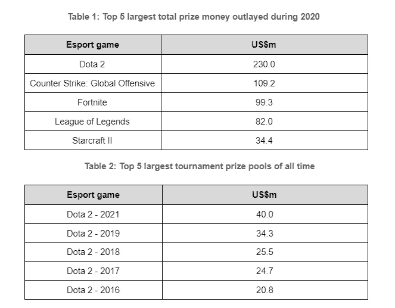

# 伊鲁威姆:第一款 AAA 游戏进入 NFT 游戏竞技场。

> 原文：<https://medium.com/coinmonks/illuvium-the-first-aaa-game-enters-the-nft-gaming-arena-a638050bb7f7?source=collection_archive---------1----------------------->

***披露****——illumium 核心开发团队未就 illumium 生态系统和 ILV token 请求开发此投资分析。本文仅供参考，并非投资建议，因此不应作为投资决策的唯一依据。0x Ventures 的成员在 ILV 投资。本声明旨在披露任何利益冲突，并不建议购买 ILV 代币。本报告中的信息是截至 2021 年 8 月 30 日的最新信息(除非另有说明),未来可能会根据沉积层改良过程(IIP)而发生变化。*

# 目的

这份报告的目的是提供一个机构级的分析，对冲积层生态系统及其本土的象征，ILV。该报告涵盖了对 Illuvium 行业(电子竞技领域)自上而下的总结和对 Illuvium 自下而上的全面分析，包括游戏性、目标市场、生态系统价值创造、ILV 令牌经济学、财务分析、团队、风险和简要路线图。

# 关键要点

*主要优势*

1.  游戏内奖励的奖金池(例如赢得锦标赛、完成任务等。)是 1，000，000 枚 ILV 代币，按现行 ILV 价格计算，价值 4 . 5 亿美元。这个奖金池的规模已经使 Illuvium 在最大的传统电子竞技提供商提供的奖金池中名列前茅。因此，极有可能通过这一资金池激励大量采用。
2.  支撑游戏的经济原则是合理的，为沉积物生态系统的可持续发展提供了坚实的基础
3.  令牌组学及其从协议到 ILV 令牌(仅适用于利益相关者)增值的能力非常强大。

*主要风险*

1.  鉴于奖金池仅由 ILV 代币组成，因此受 ILV 市场风险的影响。如果出现不利情况(如加密市场崩溃)，这将严重限制生态系统的成功发展。
2.  这将是核心开发者作为一个团队制作的第一款游戏(包括传统游戏和加密游戏),因此第一款游戏发行存在重大的执行风险。一个开发迷你游戏(Illuvium Zero)来补充主游戏标题的提议最近被批准了，它将与主游戏标题同时发布。虽然一个独立的团队被分配到其开发中，但没有区块链游戏制作的跟踪记录，如果发生不可预见的事件，可能会危及两款游戏的成功部署，则存在从开发主游戏中分配资源的非零风险。
3.  游戏中的货币(目前称为燃料)将被使用，其货币政策由一个道管理。鉴于游戏尚未发行，这种货币政策被认为是未经证实的，如果没有正确实施，可能会对玩家购买货币的舒适度产生不利影响，从而对游戏的发展和 ILV 赌注者的收入分配产生不利影响。
4.  种子期前和种子期投资者持有 200 万枚令牌，锁定至 2022 年 3 月 31 日，授权期超过 12 个月。鉴于相对于当前流通供应量(约 634，000 英镑)的代币数量可观，在代币解锁后，这可能会在授权期内对 ILV 代币造成重大抛售压力。

# 行业主题

在过去的十年中，电子竞技行业的收入结构经历了许多变化，从本世纪初流行的“付费游戏”模式转变为最近的“游戏赚钱”模式，这似乎为玩家创造了更大的议价能力:

*   *付费游戏* —这可能包括前期费用(如游戏购买)和/或定期的月费。游戏内购买也将适用。
*   *混血儿*(如堡垒之夜)——免费播放/下载。游戏内购买适用。
*   *即玩即赚*(例如伊鲁威姆)——免费玩/下载。游戏内购买适用。越来越关注游戏内收入能够由玩家产生(例如，赢得锦标赛，完成任务等。).

从“付费游戏”过渡到“游戏赚钱”(P2E)的主要好处是通过降低初始前期成本来消除进入壁垒。这加速了新玩家的加入，并吸引了更多通常因价格过高而无法参与游戏的玩家。这可以让更多的玩家熟悉这个游戏，并且——在这个游戏吸引人的基础上——可以让更多的非付费玩家变成付费玩家。区块链彻底改变了 P2E 奥运会的运作方式，提供了在没有中央实体存在的情况下建立和存在自主生态系统的能力。Illuvium 相对于传统电子竞技提供商的竞争优势的综合列表在附录 1 中。

附录 2 提供了过去十年中游戏行业范式转变和发展的更多信息。

# 游戏攻略

Illuvium 是一款基于自动对战、幻想/科幻的游戏，玩家捕捉 NFT 的角色，并在两种不同的游戏类型中使用它们(目前):

1.  一款角色扮演游戏(RPG)/Quest，比喻为神奇宝贝；和
2.  一种战略性的战斗方式，类似于团队战斗战术、DOTA Underlords 或自动象棋。这可以进一步分解成(a)一个正常的战场；和(b)一个所有人都可以自由参加的竞技场(被称为利维坦竞技场)

游戏概述[在这里](https://docs.illuvium.io/whitepaper/game-overview)提供了一个初级读本，它提供了以下信息的背景。

虽然一个玩家可以玩任何一种或两种游戏风格，但团队的意图是吸引玩家玩战斗风格的方法，奖金倾向于这种风格。原因在于它有助于在生态系统中发展数字经济，类似于传统经济的国内生产总值(GDP)。在'*协议价值创造'*部分中对此做了进一步的详细说明。总之，锦标赛奖金成为吸引玩家参与游戏并推动生态系统发展的“胡萝卜”。

作为生态系统设计的一个功能，玩家可以运行一个“商业模式”方法，即收入是锦标赛赢款*加上在二级市场上出售的 Illuvials 的*销售额，以及与游戏中购买相关的费用。因此，只要[收入-费用] > 0，玩家就可以创造可持续的收入流。进一步剖析这一点，有两种广泛的(非详尽的)玩家类型可以形成，并总结在图 1 中:

*玩家 1(小额启动资金):*这个玩家类似于开始他们旅程的人玩[柠檬水大亨](https://en.wikipedia.org/wiki/Lemonade_Tycoon)。从基本设备开始，花费最少的投入成本并获得少量回报。经过一段时间的磨砺后，玩家可以将收入再投资到更高效的设备上，在更受欢迎的地方卖柠檬水，并增加他们的收入。因此，在最初的研磨后，玩家可以通过战略性地再投资于他们的柠檬水业务来创造指数级的产出。在艾鲁威，玩家需要花费一些资金进行游戏购买(t = 0)来开始占领艾鲁威。在捕获了一些冲积矿床(t = 1)后，玩家 1 可以 a)去冲积矿床(蓝色虚线)出售一部分(给玩家 2)，释放一些流动性(ETH 的收入)，然后进行进一步的游戏购买，尝试捕获更高质量的冲积矿床；或者 b)试图参加锦标赛(橙色虚线)来赢得锦标赛奖金(ILV 的收入)。因此，通过对收入进行战略性再投资(当收入达到 t = n + 1 及更高水平时)，产出将呈指数级增长。

*玩家 2(相对较大的启动资金):*该玩家愿意在玩家 1 的时间(t = 0 至 t = 1)内为冲积层支付保费，基本上绕过了早期打磨阶段以获得一定质量的冲积层。请注意，启动资金越大，进入 RPG 游戏的旁路就越大。

**专业提示 1:** 这两种玩家类型的存在创造了对“二级”交易市场的需求，IlluviDEX 提供了创造这一价值的平台，每笔交易(销售额)的 5%归 ILV 赌注者所有。

**专业提示 2:** 玩家可以在不购买游戏内物品的情况下进行游戏，但是 Illuvials 的质量会很低。这完全消除了新玩家的价格壁垒。

与“回合制”相比，使用“自动战斗者”方法的决定将技能从玩家在战斗中的影响简单地“部分的总和”转向使用“Illuvials 之间的协同作用”，创造了一个比前者更大的战略机会集。RPG 风格的游戏将会首先发布，一旦足够数量的 Illuvials 被制造出来，战斗竞技场将会开放。这种时间延迟是故意的，因为没有新玩家的初级/预售购买或“开始卡牌”。

以下是支撑生态系统的主要宏观经济原则(并非详尽)。关于非功能性医疗服务的微观经济原则在“*协议价值创造”*部分进行了总结:

*   没有 Illuvials 的主要购买和预售，减轻了大型投资者在游戏发布时获得所有 Illuvials 的风险
*   “搭便车效应”被游戏中的购买所缓解，这将广泛反映该地区的 Illuvial 的质量。因此，为了有最好的机会进步，在游戏中购买是必需的。这类似于在神奇宝贝实体卡牌游戏中购买增强包。
*   ETH 和 sILV(游戏中使用的赌注奖励，在用作支付后被烧掉)用于购买游戏中的代币(燃料)，代币用于购买游戏中的产品。燃料的细节仍在开发中，它的存在打开了整合主游戏之外的其他资料片游戏的能力。它被包含在本报告中是从 Illuvium 玩家和 sILV 斯泰克的角度，然而这里重要的是将 ETH 和 sILV 引入到 Illuvium 生态系统中。只有联邦理工学院需要通过 IlluviDEX 购买 Illuvials。在'*代币组学'*一节中讨论了对 ILV 代币价值累积的影响。从经济角度来看，与 sILV 相比，让外部资本从 ETH 流入系统预计会对生态系统增长产生更有机和更可持续的影响。

# Illuvium 的目标市场

大致有两个主要群体构成了 Illuvium 的目标市场:

*   *DeFi/Crypto native* —这一群人是唾手可得的，因为他们了解 NFT 人物的价值主张，他们将通过常见的营销渠道(如 Twitter)接触到，并且对与区块链互动的厌恶最小。与“主流”群体相比，规模相对较小。
*   *主流/非加密原生* —这一群体将需要更大的营销来达到，可能最初对与区块链的互动有些厌恶(例如，购买 ETH 来进行游戏内购买，通过不可变 X 初始加入等。)，然而，奖金池的规模可能会激励这群人越过这一准入门槛。该群组的规模比“DeFi/Crypto”群组大。

**专业提示 3** : DeFi 协议和加密游戏协议正在争夺更广泛的加密参与者的注意力。“蓝筹”DeFi 基元(如货币市场、衍生产品、DEX)由于理解协议机制的学习曲线较陡，因此进入门槛较高。这可以延长更广泛的加密参与者(例如，非 DeFi)采用这些协议。鉴于需要理解经济激励、金融数学、价值主张等，加密游戏的学习曲线要平坦得多。很小，以至于更容易吸收。因此，相对于 DeFi 协议，更广泛的密码参与者对密码游戏的采用可能更大和更快。凯恩·沃里克对此的进一步评论——[点击此处](https://twitter.com/kaiynne/status/1424424148927979524?s=21)。此外，NFT 博彩通过在第 2 层或侧链上运行，不需要不断批准新的智能合同和/或天然气付款，比传统的 DeFi 摩擦少得多。

**Pro tip 4:** 投资组合中的严重 DeFi 风险可能导致监管风险集中(即反洗钱、银行、衍生品监管等)。).NFT 博彩(以及更广泛的 NFTs)不受监管机构同等程度的审查，因此当包含在更广泛的 DeFi 投资组合中时，分散了这种风险。

# 协议价值创造——生态系统如何创造价值？

以年度为基础，这里的价值等于玩家数量(Q) x 游戏中预期花费的金额(P)。该协议将通过三种方式吸引“价值”:

1.  游戏中有 100 万 ILV 的奖金(如锦标赛、完成任务等)。按照目前的价格，这将产生 4 . 5 亿美元的巨额资金，极有可能对其采用产生巨大的吸引力。数字本身就说明了一切，然而，当比较传统电子竞技提供商的最高奖金池支出([表 1](https://www.telemediaonline.co.uk/top-5-esports-games-hit-555m-in-total-prize-money-a-50m-increase-in-a-year/) )和最高锦标赛奖金([表 2](https://www.esportsearnings.com/tournaments) )与 Illuvium 持有的战争基金时，他们可能已经发现自己是总奖金池和锦标赛奖金池的前 5 名电子竞技提供商。ILV 战争基金的定价是一把双刃剑，因为 Illuvium 在用户增长、受欢迎程度和创收方面都有所提高，代币价值也是如此，从而提高了战争基金的价值。例如，如果 ILV 市值与 Axie Infinity 的估值相同(2021 年 8 月 12 日)，这将是 4 倍重估，ILV 奖金池的估值为 18 亿美元。但是应该注意，如果 ILV 的价格下降，这可能会产生相反的影响。预计这个奖池将使用 3 年以上，并且大部分奖池将向玩家 v 玩家(PvP)竞技场倾斜，而不是 RPG 风格。

**专业提示 5:** 如果提供给玩家的奖池足够大，它将:

*   有足够的激励让大量玩家参与进来，试图赢得奖励(增加“价值”公式中的“Q”)；和
*   激励玩家购买游戏中的产品(如旅行、碎片等)。)升级 Illuvials 和/或通过 IlluviDEX 购买特定的 Illuvials，以获得最大的获胜机会(增加“价值”公式中的“P”)。

使用图 2 可以进一步总结游戏中大奖的重要性:

游戏内奖池创造了以下需求:

*   玩家在游戏中购买，希望捕捉最高质量的夜光藻，并有最好的机会赢得奖金池；
*   为那些需要流动性并通过 IlluviDEX 出售的玩家提供 Illuvials 和
*   一群玩家愿意在 IlluviDEX 上购买 Illuvials，以跳过试图捕获 Illuvials 的时间，直接参加比赛

以上强调了两个要点:

a.大型“游戏内奖金池”在伊鲁维生态系统中的重要性；和

b.代币积累从生态系统中产生的价值的能力，这可以推动“游戏内奖金池”的价值进一步升值，详细信息请参见“*代币组学”*部分。

*2。支持遗迹内在价值的属性的存在—* 作为玩家进入游戏并试图获得奖品的副产品，他们将意识到(对于那些不知道 Axie Infinity 的人来说)他们的遗迹是 NFT，因此将代表基于以下属性的某种形式的内在价值:

*   *稀缺性/稀有性:*在一个‘世代’中，除了‘金色’、‘闪亮’或‘全息’的伊鲁威生物会越来越稀有之外，伊鲁威生物的数量也是有限的。Axie Infinity 二级市场价格范围(取决于稀缺性)从[1.5 万美元到 650 万新元](https://research.thetie.io/axie-infinity/)不等的例子证明了这一属性的价值；
*   *通货紧缩:*通过以下方式进一步减少沉积物供应:a)每个沉积物都有一条“结合曲线”,这意味着随着更多沉积物被捕获，那一代中的“野生”沉积物将变得更难捕获；和 b)“融合”，这需要燃烧冲积层 NFT 和铸造“融合”的冲积层 NFT 与前者。未来很可能会有进一步的通缩途径；
*   *实用性:* Illuvials 对游戏的进展至关重要，而不仅仅是一个“收藏品”，有些比其他的更具实用性(*Pro tip 7*)；和
*   *时间价值:*随着玩家数量的增加，对新‘一代’illu vials 的需求也变得更大。就像第一代神奇宝贝卡片比后来的几代更有价值一样，时间价值因素也可能会在 Illuvials 身上体现出来。

**专家提示 6:**NFT 值的大小取决于当时人们愿意为它支付的价格(像所有的东西一样)，然而价值可以在不同的事物之间的相对基础上进行推断。那些具有更大稀缺性、更高通缩属性和更大效用的资产，预期会比更丰富、通缩最小和效用最小的资产估值更高。

根据一个遗迹在战斗中的战略影响，它将被认为具有更大的效用，那些补充其他遗迹(通过亲缘或职业)将具有更大的效用，从而具有更大的相对价值。这种类型的 Illuvial 的例子是那些被归类为“提升形态”的，具有多种相似性和多种属性。

3.该团队有进一步的发展计划，通过保持玩家的参与度来增加协议的价值，从而建立长期可持续的协议增长。其中包括:

*   计划中的“迷你游戏”/“资料片”。例如,“伊鲁威姆:零”正在酝酿中，这将涉及数字土地的发布/销售。[链接此处](https://twitter.com/Jeremystormsky/status/1423385380376752139)并参考 Illuvium Discord 中的“迷你游戏”频道了解更多信息；和
*   第二代、第三代、第 n 代萤火虫的持续可控释放将确保生态系统的长寿。

# 令牌组学——令牌如何累积生态系统创造的价值？

有两种从生态系统中获取价值的主要方法，这两种方法根据游戏中购买燃料的交易所使用的货币而不同，即 ETH 或 sILV(如前所述)，ETH 似乎比 sILV 对 ILV 令牌具有更强的获取能力。在这两种情况下，ILV 代币持有者必须下注代币才能累积该值:

*瑞士法郎:*

首先，ETH 用于购买可用于游戏内购买的燃料代币。当购买燃料代币时，交易中 95%的 ETH 流回 ILV 的利益相关者手中(另外 5%流向伊卢维姆的土地所有者:零，不包括在本报告中)。游戏内产品包括:

*   碎片——用来捕捉萤火虫的工具。类似于扑克球(如扑克、大、超、大师等。)，可能是实力的差异，从而导致不同的定价(即更高的实力，更高的成本)。
*   旅行——在整个游戏过程中加速运动的费用；
*   在战争中遭受破坏的伊鲁威人的复活；
*   手工制作；和
*   化妆品

排名前三的产品可用于加快游戏进度，为 ILV 赌客创造游戏内收入。产品 4 和 5 在本质上更具装饰性，虽然更难确定玩家的接受程度，但堡垒之夜(2020 年从“皮肤”销售中获得 51 亿[美元](https://www.businessofapps.com/data/fortnite-statistics/))确实提供了对这些购买偏好的洞察。

第二，ETH 被用来从 IlluviDEX 购买 Illuvials，ILV 的赌注者有权收取与 Illuvials、宝石、水晶、武器、盔甲、灌输物的二次销售相关的费用(目前设定为$交易额的 5%)。

最后，ETH 用于下注，ILV 的赌注者有权对利维坦竞技场战斗下注收取费用(目前设定为每种方式 5%的下注额)。

图 3 显示了玩家(在 ETH 中)支付的费用如何累积回 ILV 赌注者:

总之，使用 ETH 通过以下方式为 ILV 代币增值:

**(1)** 价格升值:通过在瑞士国债 ILV/瑞士联邦储蓄银行池中的 ILV 代币上制造购买压力来提高 ILV 的价格；和

**(2)** 收入收益(仅限赌注者):通过接收从 ILV/瑞士联邦理工学院可持续资产池购买的 ILV。类似于持有公司股权的投资者在股息再投资计划下收到的股份。

**专家提示 8:** 图 3 中预期的高频率行动强调了令牌持有者获得价值的时机是及时的。请注意，分发本地令牌(ILV)作为收入确实会使生态系统面临潜在的出售压力，如果利益相关者希望在收到令牌时出售令牌的话。然而，如果生态系统具有吸引力并提供强劲的 APY，那么这可能会产生利益相关者的净持有行为，从而减少潜在的卖出压力。

*白银货币:*

类似于 ETH 为游戏内产品购买燃料，这也适用于 sILV(赌注者的赌注奖励，通常会锁定 12 个月)。当银耗尽时，它会被烧掉，从而减少最大 ILV 供应量。这种应计值方法的概念旨在减少最大值。供应，从而防止这种供应进入流通，减轻潜在的抛售压力，从而人为地造成供需失衡，推高 ILV 价格。相对于 ETH，sILV 在代币累积上的使用效果较差，原因如下:

*   使用收入来燃烧代币有点类似于 MKR 的回购&燃烧价值累积模型，虽然在概念上看起来很合理，但实际上没有[经验证据](https://twitter.com/jimbobkos/status/1428529512505958404?s=20)表明使用收入来燃烧代币供应和代币价值累积之间的关系；和
*   指定用于赌注奖励的 300 万 ILV 代币目前已经停止流通。一旦一个赌注者获得了 sILV，它就会在 12 个月后进入 Illuvium 生态系统之外的循环。因此，如果没有游戏内货币的选择，这种 ILV 通常会在 12 个月后进入流通，因此燃烧/人为减少供应的好处会在 12 个月的锁定完成后出现，并在这一点后影响 ILV 价格；和
*   考虑到 sILV 在 12 个月内不流通，以及在此期间 ETH 频繁进入生态系统的可能性，预计后者将比前者对 ILV 价格产生更明显的影响。

鉴于 ETH 对增加 ILV 代币价值的影响的假定有效性，一个建议可以是不允许 sILV 在游戏中花费，从而指导 ILV 赌注者使用 ETH 购买所有游戏中的燃料。

**Pro tip 9:** 总的来说，在看到许多不同协议的令牌组学之后，上述协议比大多数协议都更强，并且证明了建立 ILV 令牌的基本价值的能力。看起来资本流动(从玩家>金库>金库> ILV 赌注者)可能是循环的，但是随着 ETH 的主要使用，这意味着有外部资本进入该协议，这创造了一个更可持续的经济生态系统。

从生态系统中获取价值还有三种次要方法，它们是:

*   *辅助 1:* ILV 令牌用于制定对协议的治理，更多细节在“*团队*部分；
*   *Secondary 2* :实施赌注奖励计划以启动生态系统，该计划已存在 3 年，目前产生约 45%的 APY，赌注奖励锁定 1 年，以防止不结盟投资者的即时抛售压力；和
*   *次级 3:* 赌注回报合同包括一个“乘数”作为非流动性溢价的形式，激励赌注者锁定他们的持股长达 1 年，产生 2 倍的 APY。赌注者可以更加灵活地选择非流动性水平(即 1 周、1 个月、6 个月等)。).如果选择少于 1 年的锁定期，则额外 APY 的增加相应地按比例分配。任何形式的锁定都可以降低 ILV 价格的卖出压力，并使 ILV 投资者的时间框架与项目的长期成功更加一致。

# 财务分析

以下分析试图提供潜在年收益率(APYs)的一些指示，这种方法有意避免得出 ILV 的未来价格，因为很难确定这种价格。使用 APY 方法推断，ILV 价格将是投资者对 APY 兴趣的副产品，类似于基于市盈率或 APY 格式的市盈率购买的概念。在下面的计算中有一个粗略的算术水平，因此重要的是要记住它只是指示性的。

假设/方法如下:

*   两个估价模型(截至 2021 年 8 月 12 日的定量数据)已用于本次评估，两个模型都采用了“敏感性”因素，以确保保持稳健性。
*   到工作报告的链接是[这里的](https://docs.google.com/spreadsheets/d/1b5A5wbcWOKcjEuEhCprYSdrD2DYx3JhMy6Kys-nFDro/edit#gid=311080864)带有反映可变输入的橙色阴影单元格。
*   鉴于 Axie Infinity 是市场领先的基于加密的 NFT 游戏提供商(以及拥有丰富的可用数据)，他们的信息已被广泛使用。附录 3 详细说明了使用 SWOT 对 Illuvium 和 Axie Infinity 进行的定性分析。
*   为了关注赌注者的“有机收益”,赌注奖励不计入以下 APY。
*   使用 ETH 购买燃料作为游戏内货币的交易仅计入其中，与游戏内购买相关的任何输入假设已经按比例增加了 95%
*   基于外部加密的数据来自 Tokenterminal、Dapp Radar、Coingecko 和 Illuvium

*估价方法一:*

这主要是试图利用现有的市场竞争对手来估算“游戏内”收入。由于难以估计，博彩交易量被忽略。迭代 1 只关注来自 IlluviDEX 交易费的收入，并保持游戏内产品购买为零。

Axie Infinity NFTs 之前 30 天的交易量为 7 . 95 亿美元，该金额已按年计算，并已收取 5%的管理费。每个列的输出都将交易量下调了敏感度系数，以反映更保守的状态。只有下注的 ILV 代币持有者才有权这样做，因此下注的 ILV 被用作分母(注意:国库代币也被下注，因此有权获得游戏内收入)。

以上展示了*【令牌组学】*章节中**(2)**APY 的影响。下面的分析在*“token omics”*部分显示了价值累积法 **(1)** 的影响，通过将年收入分配到每日数字并将其与 ILV 的平均每日美元交易量进行比较，展示了“买入压力”对 ILV 的影响。例如，在“10%”的敏感性情景下，该协议将购买约 1.2%的交易量。更高的游戏收入意味着更大部分的销量被购买，增加了对 ILV 的过度需求，提高了 ILV 在软件市场的价格。

添加游戏内产品购买并使用 [Fornite 的](https://www.businessofapps.com/data/fortnite-statistics/)自发布(2018)以来已知的最早年收入，在下面的第二次迭代中提供了一个“蓝天”场景。假设 54 亿美元全部归 ILV 股东所有。

*估价方法二:*

鉴于上述方法可能对输入非常敏感，因此使用了另一种估价方法，重点关注过去 30 天 Axie Infinity 用户的数量，并应用每个每日用户的每日 Axie Infinity 收入(饲养费加 DEX 费)(在本练习中保持不变)。注意:这个数字是一个平均值，并不意味着每个用户每天都会花费这么多钱(例如，有些人会少花很多钱，有些人会多花很多钱)。

这适用于 Axie Infinity 玩家的费用偏好，其中不包括游戏内产品购买或投注费用(在 Illuvium 的情况下)。

**专家提示 10:** 上述估价模型证明了冲积层获得强 APY 的能力，更重要的是，突出了这种 APY 的“有机”性质。

最后，关于上述代币累积法对价格的“购买压力”影响，MakerDAO 也进行了同样的分析，要求 CDP 持有者偿还贷款以购买 MKR，并将其发送给 DAO 进行焚烧。下表显示了“蓝筹”DeFi 协议对交易量(0.1%)的收入影响。

# 组

该团队由基兰和亚伦·沃里克(Synthetix 创始人凯恩·沃里克的兄弟)领导。两人都是狂热的企业家，对玩和设计(主要是 Aaron)虚拟游戏有着强烈的热情。然而，值得注意的是，两位创始人都没有将虚拟游戏开发成完整产品和商业化的直接经验。

由 95 名开发人员组成的团队(截至 2021 年 7 月 25 日)远程工作，弥补了制作/商业化经验的差距，他们的经验涵盖游戏(如《生化奇兵》、《我们最后的人》)、顶级电影制作(如《漫威》、《星球大战》、《变形金刚》)和大型品牌营销团队(如索尼、丰田、波音、吉百利)的动画/艺术家设计。核心团队的简历在这里。创始人渴望将员工人数增加到 200-300 人。

*项目资助:*

该团队从种子投资者(包括 Kain-Synthetix、Stani-AAVE 和 Santiago-Parafi Capital)和平衡器池中筹集了 4500 万美元，这笔资金将用于支付工资、开发和利用“虚幻游戏”软件的 5%版税。根据团队估计的燃烧速度，这个资本提供了一个 4 年的跑道。创始人/核心开发者的薪酬结构(美元对 ILV 代币的百分比)目前未知。

类似于游戏内的奖金池，该团队有一个 150 万 ILV 代币的“国库”战争箱，一旦筹集的资金完全耗尽，将在未来提取。

**专业提示 11:** 金库中的 ILV 将被下注并有权获得游戏内收入(不包括下注奖励)，这为正在进行的运营和未来的游戏内奖金(一旦专用奖金池耗尽)创造了可持续的现金流，从而延长了项目的寿命。

*治理:*

该团队的理念是从一开始就将权力归还给 ILV 代币持有者，这就是为什么 ILV 代币赋予持有者(曾经持有股份)治理和影响力的原因。在高层次上，治理过程包括二次投票，以减轻财阀统治的风险，并采用“改进建议”来提议、投票和实施变革，就像以太坊和 Synthetix 网络实施变革的方式一样。更多信息[请点击](https://docs.illuvium.io/whitepaper/dao/)。

# 风险

这种生态系统的开发和实施会带来相关风险，主要风险总结如下:

*   *游戏内奖金池的市场风险:*创造协议价值的主要驱动力是指定用于游戏内奖金的 100 万 ILV 代币。如果这一价值受到市场价格的损害，那么这将对生态系统的成功产生不利影响。可以发展谨慎的资本管理(例如，通过场外交易(OTC)出售 ILV 持有一部分美元)，授权赌注池接收游戏内收入等。)还包括一份计划，说明第三年后 ILV 预计将完全耗尽时会发生什么。
*   *执行风险:*团队目前正在发布他们的第一款游戏，鉴于没有之前游戏发布的跟踪记录，他们执行目标的能力存在重大风险。对此的缓解措施包括设置现实的时间表(以避免承诺过多/交付不足)以及在 alpha 和私有 beta 阶段进行重要的测试。illuvium:Zero——补充了主标题——最近被批准开发并与主标题一起发布。如果由于不可预见的事件，开发主标题的资源被抽走，这可能会影响其成功部署。
*   *游戏内货币(燃料):*使用游戏内货币，该货币的货币政策由阿道管理。目的是确保燃料的价格保持稳定(与作为游戏内货币的 ETH 相比，波动性相对较低)。然而，鉴于游戏尚未发布，这种货币政策和游戏内货币的使用是未经证实的。如果它没有被正确实施，并导致材料价格波动，这可能会造成玩家在游戏中购买和使用这种货币的厌恶。由于此次购买与 ILV 赌注者的关键收入分配方法之一有关，玩家对购买燃料的厌恶可能会减缓游戏的发展以及 ILV 赌注者收入分配的幅度。该货币政策应在公开测试发布前的“私人测试”阶段进行严格测试/建模。
*   *可观的种子前代币和种子代币:*该群组的代币分配为 2，000，000 ILV，目前锁定至 2022 年 3 月 31 日，此后 12 个月线性归属。相对于流通供应量(~634，000)而言，这一分配相当大，如果这些投资者希望减持，这可能会在此期间对 ILV 造成实质性的抛售压力。与高级团队成员最近的安排类似，种子前和种子投资者可以在 36 个月内授予他们的代币，以展示更大的承诺，并限制授予期内的卖出压力。

有关生态系统风险的完整列表，请参考附录 4。

# 路标

以下是路线图中的关键里程碑和时间安排:

*   2021 年 10 月底—游戏演示
*   2021 年第三季度—第四季度—私人测试版
*   2021 年第四季度末——火山爆发:零
*   Q1 2022——主要名称的公开测试版——将包括 7 个地区中的 4 个。剩下的将在主流版本完全发布后解锁
*   2022 年——手机版

表 3 列出了未来 4 个月的短期价格催化剂:

# 附录

*附录 1*

*附录二*

在过去的十年里，游戏行业发生了许多范式转变，破坏并加速了它从一个独立行业向嵌入社会结构的亚文化的演变。关键行业里程碑的时间表如下:

十年伊始，Valve 为 DOTA 锦标赛的“国际系列 1”提供了奖金。2011 年 Twitch 的推出增加了热门游戏的观众数量，随着观众数量的增长，希望向这一群体做广告的大公司的营销预算也在增长。来自营销的收入随后促成了[更大的游戏内奖金池](https://dotesports.com/general/news/biggest-prize-pools-esports-14605)，创造了令人难以置信的飞轮效应，并导致最近的锦标赛奖金超过 3000 万美元，包括“国际 10 人锦标赛”达到 4000 万美元。在此期间，其他值得注意的范式转变包括:

*   推出 EA Play(付费游戏模式)，收入结构从前期游戏购买转向基于订阅的模式，以降低进入的价格壁垒；
*   堡垒之夜(混合付费模式)的推出，进一步打破了免费游戏的收入结构，并将收入集中在游戏内购买上；
*   新冠肺炎危机和相关的强制封锁给虚拟游戏行业和更广泛的元宇宙带来了更大的关注，2020 年游戏下载量增长了 75%(同比)，同期直播的“观看时间”增长了 45%；和
*   Axie Infinity(付费赚取模式)的推出，进一步打破了收入结构，使玩家可以从玩游戏中获得被动收入。

*附录 3*

*附录 4*

> 加入 Coinmonks [电报频道](https://t.me/coincodecap)和 [Youtube 频道](https://www.youtube.com/c/coinmonks/videos)了解加密交易和投资

# 另外，阅读

*   [Bookmap 点评](https://coincodecap.com/bookmap-review-2021-best-trading-software) | [美国 5 大最佳加密交易所](https://coincodecap.com/crypto-exchange-usa)
*   最佳加密[硬件钱包](/coinmonks/hardware-wallets-dfa1211730c6) | [Bitbns 评论](/coinmonks/bitbns-review-38256a07e161)
*   [新加坡十大最佳加密交易所](https://coincodecap.com/crypto-exchange-in-singapore) | [购买 AXS](https://coincodecap.com/buy-axs-token)
*   [红狗赌场评论](https://coincodecap.com/red-dog-casino-review) | [Swyftx 评论](https://coincodecap.com/swyftx-review) | [CoinGate 评论](https://coincodecap.com/coingate-review)
*   [投资印度的最佳密码](https://coincodecap.com/best-crypto-to-invest-in-india-in-2021)|[WazirX P2P](https://coincodecap.com/wazirx-p2p)|[Hi Dollar Review](https://coincodecap.com/hi-dollar-review)