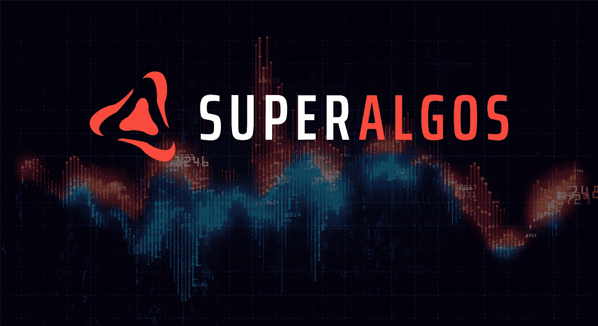
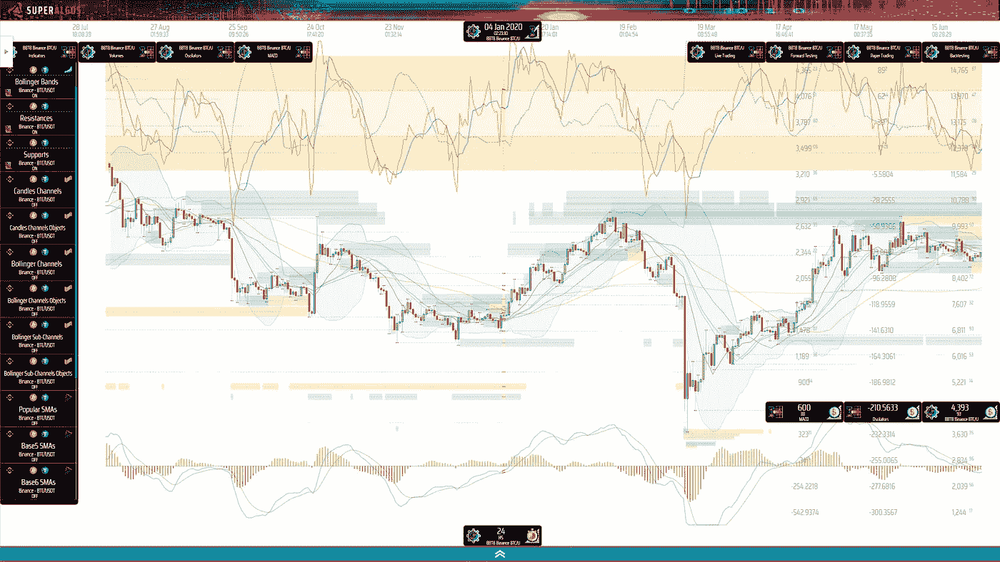
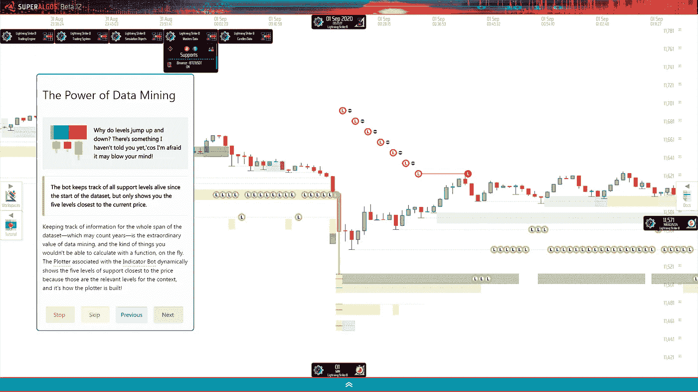

# 我正在投资 Superalgos(SA)，这就是原因！

> 原文：<https://medium.com/coinmonks/im-investing-in-superalgos-sa-and-this-is-why-a2a729f07de6?source=collection_archive---------1----------------------->

## 一个很好的提前进入的机会:公平的发布，一个完成的产品，和刚刚开始的市场营销！

***注:本文并非理财建议。***

我是通过 Superalgos 的创始人之一不久前在 Coinmonks 上发表的一篇文章了解到 super algos 的，这篇文章讲述了[将一个树莓 Pi 变成一个加密交易机器人](/coinmonks/how-to-turn-your-raspberry-pi-into-a-crypto-trading-bot-6cb07b93a8e)。“有意思，”我想……但是在那一点上我没有进一步研究这个项目。

然后华尔街赌注发生了。还记得上百万条小鱼吃鲸鱼午餐的故事吗？这一现象引起了全球新闻媒体两周的关注！就在那时，Coinmonks 从同一作者那里得到了另一篇文章:[华尔街赌注现象如何演变成真正的集体交易智慧](/coinmonks/the-evolution-of-the-wallstreetbets-phenomenon-change-is-coming-and-cant-be-stopped-9e359e86f610)。

> *“这太疯狂了！我对自己说:“这些家伙有所发现。”。所以我开始研究 Superalgos。*

我注意到的第一件事是，项目进展迅速，在开发部门势头越来越猛:网站上的[进度日志](https://superalgos.org/about-project.shtml)显示，他们每两三个月发布一个新版本的平台。对于一个没有大投资者支持的社区运营的开源项目来说，这似乎太好了，不像是真的…所以我继续并[检查了他们的 Github 库](https://github.com/Superalgos/Superalgos/graphs/contributors)。我在网站上发现了一些支持这些说法的疯狂活动，有超过 100 名贡献者，+2k 星，+4k 叉。

> “似乎是真的”，我想，“我怎么从来没听说过他们？”。

# 兔子洞

我接着安装了 [Superalgos 平台](https://superalgos.org/crypto-trading-bots-platform.shtml)。当时，安装过程是相当技术性的，但并不太难，因为回购的自述文件上有明确的说明[。他们最近](https://github.com/Superalgos/Superalgos/blob/master/README.md)[推出了一个便携式版本](/superalgos/superalgos-packaged-application-release-8befd2895102)，它非常容易部署:下载并运行，甚至不需要安装任何东西！甚至还有在线演示[供下载前试用！](https://superalgos.org/crypto-trading-bots-platform-demo.shtml)

> 我做了第一个互动教程，让我大吃一惊！

我对交易自动化感兴趣已经有一段时间了，我已经看到了那里的一切，至少我是这样认为的。尽管如此，我一生中从未见过这样的方法！多么雄心勃勃的事业啊！

该平台非常庞大，涵盖了交易自动化的每个重要方面:从交易所挖掘数据，处理和可视化数据，在多个市场、多个交易所，甚至在多个协调机器中设计、测试和部署交易策略！一切都发生在一个可视化的环境中，这样更容易理解交易和自动化背后的复杂性。

所以， [Superalgos 在 Github 上搜索“交易机器人”](https://github.com/search?q=trading+bots)排在第一位也就不足为奇了。

又来了…为什么我之前没听说过 Superalgos？

A podcast with Super Algos founders

# 检查团队

[根据进度日志](https://superalgos.org/about-project.shtml)，他们的起源故事是这样开始的:

> *2017 年 8 月，项目启动:Superalgos 项目于 2017 年夏天启动，创始人路易斯·费尔南多·莫利纳是一位富有远见的企业家和系统架构师，在金融科技领域为银行开发任务关键型系统。*

这听起来很合适，但是，说实话，我一点也不关心某人的经历或历史。在研究项目时，我关心的是发现团队是否能够交付。

因此，我开始查看进度日志，将其与媒体公告进行对比，甚至深入社区聊天记录和 Github 回购来验证日志是否真实。

确实是。

这是我发现的…

2017 年 8 月是牛市的开始，导致了 2 万美元的比特币 ATH 和 ICO 热潮。尽管如此，这些家伙没有写白皮书，以筹集数百万美元的 ICO。相反，他们继续“低头模式”,开始编码。市场在 2017 年 12 月爆发，随后是一年半的秘密冬天。

> *在秘密冬季期间，车队在做什么？*

在 2018 年 10 月——crypto-winter 中期——交付 MVP，并在 2019 年 8 月短暂的牛市期间交付该平台的 Alpha 版本，该牛市因 Covid 崩溃而缩短。在 2019 年 8 月至 2020 年 3 月 Covid 市场崩盘期间，他们推出了两个测试版！

到 2020 年 10 月当前的大牛市加速时，他们已经发布了 Beta 7！一年后，也就是几个月前，他们发布了 Beta 11，并为即将推出的平台做准备，最终完成了公开测试阶段。

这在我看来就是一个防弹团队！他们不仅熬过了秘密冬天和 Covid 危机…他们像蟑螂一样茁壮成长！感觉就像你可以把它们核化到石器时代，它们会继续在泥板中编码！

真不敢相信我以前没听说过这些家伙！

# 了解项目

我将试着总结一下这个项目是关于什么的。

这些家伙似乎花了四年时间来构建最强大和最灵活的交易机器人平台，以吸引 algo 交易员，以便他们可以利用用户群来开发该项目的实际业务:一个开放的交易智能网络。

> *没错！让我大吃一惊的平台甚至不是项目的主要产品！*

我不得不说，处理这个发现花了一些时间。多么大胆的举动！这些人要么是疯子，要么是真正的梦想家——或者两者兼而有之！

我再说一遍:他们花了四年时间打造了一个不是主打产品的平台。为什么？因为平台是一个更大的生态系统的基础。

这是我在与社区中的一些人交谈后，对整个项目战略的理解和提炼，包括那些随时可以加入贡献者并回答问题的创始人:

## **第一阶段:**

1.  建立最好的加密交易自动化平台，开源它，让每个人都免费，消除所有摩擦，支持采用。
2.  在 Github 上排名第一。这将吸引大量对算法交易感兴趣的开发者。
3.  用本地令牌激励开发人员加速贡献，让所有贡献者拥有项目，这样每个人都投入到集体成功中。这种激励将使项目和产品比任何其他开源项目或公司更快地成长和改进。
4.  将开源项目变成一个不断改进的技术基础设施，拥有不断增长的贡献者基础，包括数据科学家、人工智能工程师和覆盖现代交易自动化所有领域的人。不断改进的产品将吸引最好的算法交易者。
5.  最优秀的 algo 交易者会使用这个平台来创造智能和自动化他们的交易。

到目前为止，这似乎是一个征服小型利基市场的合理商业计划，这似乎是该项目迄今为止所做的。

> *让我惊讶的是，这个项目为什么要做这一切:为了让大众市场的产品成为可能！*

这是接下来要做的，目前正在开发中:

## **第二阶段:**

1.  构建对等网络，以零技术摩擦互联用户群。
2.  激励算法交易者通过点对点网络传播交易信号。
3.  为加密用户构建简单的社交交易应用程序，这样他们就可以部署机器人来消耗来自算法交易者的信号！
4.  让社交交易应用和信号对每个人免费，降低进入门槛，支持无摩擦的大规模采用。

太棒了。

因此，简而言之，该项目建立了 Superalgos 平台，以吸引 algo 交易员(交易自动化专家)，使他们产生交易智能。然后，该项目激励这个利基市场人群产生和传播交易信号，以便更大的大众市场人群可以免费使用这些信号！

# 生意怎么样？

那么，如果一切对所有人免费，这个项目如何赚钱呢？

是的，那是我的下一个问题！

> *答案在* [*代币分配模式*](https://superalgos.org/token-overview.shtml) *: 100%代币归贡献者所有！*

没错！该项目从未出售代币。没有种子轮，没有私人销售，也没有公开销售。项目中的每个人都因其创造的价值而获得代币奖励，无论是代码、业务开发还是交易智能。创始人和其他人一样都是贡献者。谈论公平的发射！

这意味着整个社区在项目和代币的长期成功方面投入巨大，因为每个人都参与了基于代币增值的集体业务。

# 目标市场

为了设定目标并更好地了解我的投资范围，我需要回答几个问题:

目标市场有多大？项目的潜力有多大，能走多远？

目标市场是所有的加密用户。几个月前有两亿，并且增长速度比互联网还快，受到比特币、迷因币、DEFI、NFTs 等等的吸引。作为一个密码专家，我知道密码迟早会统治世界。因此，未来的目标市场将与互联网本身的目标市场相匹配。

那么，Superalgos 可能会进入这个巨大市场的哪一部分呢？

让我们看看…这些社交交易应用程序将允许加密用户跟随社区中的专家，免费复制他们的交易。没有订阅费，没有佣金，没有演出费，什么都没有！

所有人需要做的就是下载应用程序，跟随一个算法交易者，确保他们在交易所的账户有一些 sat 或任何他们想交易的硬币，然后去！

> *谁不想口袋里有个小小的赚钱机器呢？*

我不知道！如果你问我，我找不到一个合理的理由，为什么任何使用 crypto 的普通人不想至少尝试一下这些应用程序，看看它们怎么样！

但是，这种自由交易情报能有多好呢？用户会赚钱吗？

我能给出的最好答案是我不知道，但考虑到激励机制的设计，事情看起来很有希望:算法交易员将获得与追随者数量成比例的象征性奖励。

让我试着打开它。

Algo 交易员使用 Superalgos 平台进行自己的交易。该项目将为他们提供一个额外的计划，将他们产生的情报货币化。

假设我是一个用机器人赚钱的算法交易者。构建和维护我免费使用的平台的项目为我提供了一个额外的收入流，无需任何进一步的努力。我会接受吗？为什么不呢？特别是如果它不涉及到透露我的交易策略，因为我只是提供信号。其实在我之后交易的人可能对我的交易有好处！

如果成功的交易者提供信号，这是一个好的开始。然后，这是 algo 交易者社区之间的公开竞争。追随者越多，代币越多。也就是说，那些提供最佳信号的人会赢得更多代币。因此，产生高质量信号的动机很明显。

这是有道理的，因为如果追随者没有从追随某人中赚钱，他们会简单地删除追随者，而某人不会因为他们的信号而获得代币。

我相信有理由相信有些人会跟随算法交易者赚钱。而且，在一天结束的时候，这是一个人们付出多少努力来找到合适的算法交易者的问题。

这正是激励机制和免费商业模式的设计意图:最终用户免费获得一切，因为他们也为网络增加了价值。怎么会？策展交易情报！找出哪些可行，哪些不可行！简直是天才！

我还是不敢相信我没有早点了解 Superalgos！

# 潜力

除了产品的工作方式和分析整体主张的可行性，我总是喜欢坐着思考项目可能对行业甚至世界产生的影响。

这个项目会有多大的破坏性？这个项目会成为下一个有影响力的候选项目吗？

> *这个项目有几个方面具有颠覆性，但我最着迷的是这个项目所描述的“不可阻挡的协调”。*

还记得我之前提到的华尔街赌注的案子吗？

这个故事是关于数百万投资者在 Gamestop (GME)上建立头寸，以做空该股票的对冲基金。数周以来，全世界都在报道这次联合行动，因为这是第一次发生这样的事情。

如果你当时关注这个故事，你可能还记得，当经纪人 Robinhood 决定停止用户继续购买股票的能力时，整个集体努力突然停止了。令人震惊的是，该公司允许用户卖出股票，但不允许继续买入！

无论罗宾汉的行为背后的原因可能是什么，我们应该吸取的教训是，每当有一方集中控制交易流程时，散户交易者就没有真正的协调能力。

这正是 Superalgos 要解决的问题。

该项目使数百万交易者能够通过相互跟随来协调建仓。与 Reddit 上的 WallStreeBets 人群不同，Superalgos 消除了通信中的所有摩擦，因为行动是通过自动化协调的。

不需要阅读和破译论坛上的一个线程数以千计的信息。作为一个互联网论坛，Reddit 使用了自 90 年代以来就存在的技术。Superalgos 为协调技术带来了急需的迭代。

> 华尔街赌注的数百万投资者花了三周时间才拿到这个头寸。使用 Superalgos，只需一两分钟。

无论这有多好，消除交流中的摩擦都不会是 Superalgos 的最大影响。

> *真正革命性的是协同不可阻挡！*

想想吧！

社交交易应用的用户在他们的设备上运行交易机器人。它不是一个服务提供商可以决定用户可以做什么或不可以做什么的网络服务。此外，用户可以直接在自己选择的交易所进行交易。所有主流交易所都将提供像样的 API。最后，交易信号通过匿名的点对点网络传播。

这几乎是一个抵制审查的设置，因为没有人可以干预两个设备之间的直接通信。

> *当数百万交易员在全球所有交易所联手建仓，而无人能阻止他们时，会发生什么？*

我不知道！但我确实看到这将是一股主要的破坏性力量！

# 竞争

什么比赛？

Superalgos 在商业模式层面具有颠覆性。这样想吧…

你有一个免费的开源平台，首先是在 Github 上。根据像我这样了解一些交易机器人平台的人的经过核实的评论，在功能和灵活性方面，没有什么能与 Superalgos 相比。

社交交易应用程序也是免费开源的，交易信号也是免费开源的。

最重要的是，这是第一个建立这种开放交易情报网络的项目，所以他们有先发优势。

除此之外，还有一台“机器”,它被设计为“自我更新和自我改进”,作为一种不断增长的协作，100%的令牌将激励项目开发。

世界上有谁能与之抗衡？

回到过去，维基百科在与微软 Encarta 和大英百科全书的竞争中获胜，靠的是免费工作的编辑的开放合作，除了利他主义没有其他动机。

我停止我的案子。

# 挑战和威胁

如果你仔细研究这些人是如何设计这个项目的，你可能会得出结论，他们非常清楚在大规模采用的情况下他们可能面临的挑战。

该项目将原来的核心团队结构分散到一个由自治团队组成的横向组织中。代码库[被分割成多个项目](/superalgos/a-multi-project-roadmap-with-plenty-of-contribution-opportunities-8f8d91a60c94)，这样不同的团队可以掌控技术基础设施的不同部分。 [Beta 11 于 2021 年 9 月发布，发布了治理](/superalgos/superalgos-distributes-the-governance-of-the-token-and-the-project-18e1bf372eca)系统，将令牌分发和项目开发方向的控制权交给了社区。

> 去中心化是 crypto 的一个重要特征，使得项目对各种攻击更有弹性。

Superalgos 找到了一个真正的甜蜜点，只向贡献者分发代币——这是一个尽可能公平的发布。他们从未出售代币，这一事实使他们远离了证券法律法规的关注。

该网络的业务——传播交易信号——是一种不受监管的活动，该项目从未以任何方式涉及资金，与金融服务活动无关。

有了这样一个颠覆性的潜力，我毫不怀疑这个项目将会遇到无数的挑战。但我觉得很舒服的是，一个在 crypto winter 和 Covid 中幸存下来的团队——没有资金，靠自己努力，同时提供了这样一个令人惊叹的平台——非常适合这项工作。

# 社区

如果你在交易小组或常规的加密项目社区小组呆了足够长的时间，你可能会开始对人性失去信心。通常，没有人会在乎新来的人，会有不断的叫喊和辱骂，一群垃圾邮件发送者先令屎币，偶尔还有骗子。

> *当我第一次加入 Telegram* *中的主要 Superalgos 社区组并问了几个问题时，我对对话的质量感到惊讶。“多么令人耳目一新”，我想，“感觉就像成年人在做真正的工作”。*

Superalgos 平台似乎吸引了一群高智商的人。这种人足够聪明，能够在交易自动化方面取得成功——这不是一件容易的事情。许多贡献者最终加入了审核团队，而且总是有很多人愿意提供帮助。

每个自主团队都有自己的公共电报组，任何人都可以加入，要么提供帮助，寻求帮助，要么只是参与对话和正在进行的活动。

感觉像是从哪里生长出来的非常健全的基地！顺便说一句，他们也不和谐。

# 令牌

我已经指出了令牌的一些有趣的属性，例如，贡献者之间简单而显著的分布。

网站上的[令牌概述页面解释了其余属性。我将回顾一些重点，如果你愿意，你可以阅读全文。](https://superalgos.org/token-overview.shtml)

最重要的定义是，这是一个通胀率下降的上限经济，非常像比特币。我喜欢简单的记号经济学！提出复杂经济系统的项目最终会疏远那些无法理解设计意图的人。

> *最大供应量 15 亿代币，递减发行计划从每年 1.28 亿代币开始，每六年减半。晶莹剔透！*

目前的流通供应量约为 4.5 亿代币。每枚代币的价值约为 6 美分，目前的市值约为 2700 万美元。

如果你问我，这似乎是一个非常低的项目在目前的发展状态的估值！早在 ICO 泡沫时期，当这些人开始编写代码时，团队正在通过一份白皮书筹集这样的资金！

到底为什么价格这么低？忍耐一下…我一会儿就告诉你！

先说令牌实用程序。

第一个重要的实用案例是治理。令牌持有者通过对 Superalgos 平台内置的治理系统进行投票，来定义发展方向和奖励的分配方式。

一开始，我有点失望，因为我认为大多数用户不会那么关心治理。我认为对这个实用新型的代币没有什么需求。然而，随着网络的成熟，我忽略了治理的重要性，以及项目与交换的关系！

其中一位创始人在一篇文章[中澄清了整个事情，解释了令牌](/superalgos/superalgos-sa-token-demand-drivers-5ca97e9c636d)的需求驱动因素。

事实是，Superalgos 网络最终将集中大量的交易量。我们谈论的是数百万密码用户在多个市场上全天候交易！

交易所显然对获取尽可能多的交易量感兴趣，因此，一旦他们意识到发生了什么，他们就会囤积 Superalgos 代币。为什么？嗯，通过治理工具来影响开发的方向！当然啦！

> *交易所将争夺 Superalgos 项目的控制权。这是事实。*

第二个实用案例是优先访问信号。这意味着，虽然信号对每个人都是免费的，但拥有最多令牌的用户将首先获得信号。

同样，这在开始时很难理解，并且花了一些时间来理解实用程序设计中的精彩之处。

是的，很明显，首先获得信号会导致更好的性能。但当我第一次思考这个问题时，我关注的是错误的变量。我考虑的是时间和延迟，在第一个和最后一个信号接收者之间不应该超过几秒甚至一分钟。但那是错误的分析！时间真的不重要！重要的是秩序册的状态！

想象一下，数百万人追随同一个算法交易者。这意味着数百万份订单一个接一个地出现在订单簿上。所以订单之间的时间间隔并不重要。重要的是在订单序列中的位置。如果我的订单是第一个，我会得到一定的价格。如果是最后一次，我会得到一个更糟糕的价格，因为当我的订单被匹配时，订单簿将会显著移动！

另外，[这篇文章讲述了整件事情背后的博弈理论](/superalgos/superalgos-sa-token-demand-drivers-5ca97e9c636d):如果你没有零个代币，你将是最后一个，但是如果你至少有一个代币，你将领先于所有没有代币的人！这是从市场上获得至少一枚代币的明显动机！当然，按照同样的推理，该逻辑可以应用于无限循环中:如果你得到两个代币，你将获得更多的位置！

因此，很明显，对令牌的需求在最终用户方面也是有保证的！

> *你有没有注意到，没有一个实用程序需要实际花费代币？没错！这两种实用程序都要求持有令牌，而不是消费它！*

这意味着市场的需求端将随着项目意识和使用的增加而增加，而供应端将随着通货膨胀的降低而减少。

等到网络成熟的时候，根本就很难得到任何代币！

# 短期机会

Superalgos 无疑是一个独特的项目。

一切都是这样构建的，团队如何引导平台的整个开发阶段，激励机制的设计使合作永远不会停止增长，不断迭代，直到产品达到完美……我以前从未见过这样的事情！

在研究了这个项目一段时间后，我终于意识到为什么我以前没有听说过 Superalgos，以及估值低的原因:因为他们刚刚开始营销！

现有的社区纯粹是通过口碑和网站和存储库的有机流量建立起来的！

今天很少有人知道这个项目，但是[他们几周前聘请的公关机构](/superalgos/superalgos-kickstarts-the-long-awaited-marketing-phase-of-the-project-7f454ae2dae4)已经在向媒体推销这个项目了，所以我确信这个低得离谱的估值不会持续太久。

至少在我的 Superalgos(SA)市值达到前 100 名、估值达到数十亿美元之前，我会一直持有它。这将是一次地狱之旅！

如果你想上船，你可以在 PancakeSwap 上找到代币。如果你不熟悉 DEX，[这就是你如何装满行李的方法](https://blog.coincodecap.com/buy-superalgos)！

## 也阅读

 [## 2021 年最佳免费加密交易机器人

### 2021 年币安、比特币基地、库币和其他密码交易所的最佳密码交易机器人。四进制，位间隙…

medium.com](/coinmonks/crypto-trading-bot-c2ffce8acb2a)