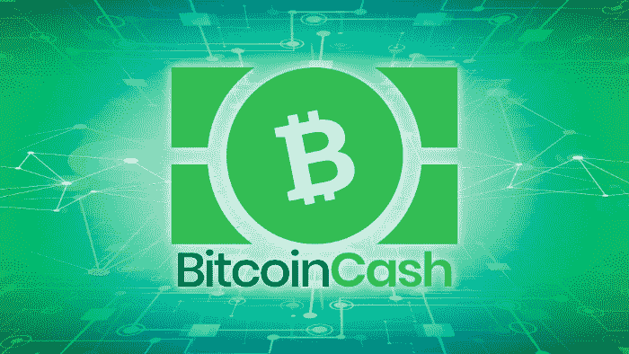
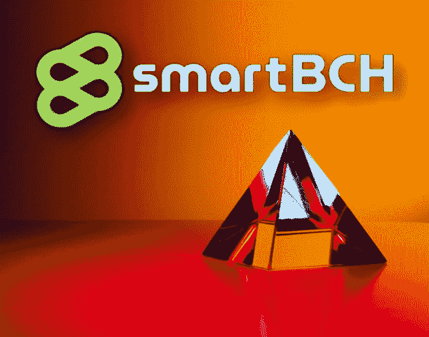

# 比特币现金在现代经济中的影响

> 原文：<https://medium.com/coinmonks/impact-of-bitcoin-cash-in-a-modern-economy-7d651d63452f?source=collection_archive---------10----------------------->

*Image from:* [*Pexels*](https://images.pexels.com/photos/936722/pexels-photo-936722.jpeg?auto=compress&cs=tinysrgb&dpr=2&h=750&w=1260)

考虑到比特币现金相对于其他各种区块链和法定货币的优势以及它的永久发展，我们应该仔细考虑它的长期动态。

目前，世界上有一些最聪明的人正在开发比特币现金链，并创建将适应未来金融的第二层网络。

加密货币不再是地下数字现金，也不仅仅用于黑市，而是目前正在挑战和竞争传统金融。DeFi 提高了赌注，整个市场坐拥两万亿市值。

比特币现金成为长期考虑的力量，因为它包含了所有重要的组成部分。

# 真实世界的应用

[*Source*](https://pixabay.com/tr/photos/tren-g%c3%bcn-bat%c4%b1m%c4%b1-izler-demiryolu-821500/)

随着加密货币市场动态的形成，我们经常看到新的和相对未知的加密货币突然开始吸引投资者的兴趣。通常，开发人员兑现的那一刻，希望就破灭了，这些项目的主要支持者也没有理由继续持有大量代币/硬币。

Chainlink 就是这样的例子，它在区块链世界有着广泛的用途，但最终被大肆宣传，定价过高，以至于无法满足其使用需求。

Chainlink 被归类为分散式 Oracle 网络(或 Oracle)。这是市场如何描述现实世界数据与区块链智能合约的互操作性和桥接。它从它所解释的“独立节点操作符”( [more info](https://docs.chain.link/docs/beginners-tutorial/) )中为 feeds 提供实时值(此时主要是价格)。

智能合约最终将有一个“现实世界”的应用，它仍然是一项处于青春期的技术，正在数字经济的各个领域接受测试，主要是 DeFi 和 NFTs。

它最终将到达其他领域，并将各种官僚程序自动化，提高成本效率，提高生产率，并且也是一种可以与其他现代进步相结合的技术，如人工智能。

随着区块链网络为智能合同提供服务，经济将从中受益。

分散的区块链部分是必不可少的，因为它增强了数据的安全性，同时消除了腐败和官僚主义。

在分散的自治网络中运行的智能合同不需要集中的实体，但在不信任的环境中运行将是治理结构的最终解决方案。

这些智能合同可以应用于我们经济的所有方面，而不仅仅是金融(目前看来是这样)、生产(工业和农业部门)、研究、医疗、保险、养老金制度、能源和废物控制、物流、运输和许多其他领域。

# 比特币现金的重要性

[*Source*](https://wallpaperaccess.com/full/5797837.jpg)

比特币现金最大限度地发挥了区块链的功能。它提供闪电般的交易，费用几乎为零，没有第三方参与。一种直接的 P2P 交易方式，不涉及任何中介，也不损害去中心化特性。

以太坊被发现无法处理采用，并包含缩放问题。它的解决方案是切分，这还没有经过彻底的测试，以太坊 2.0 可能需要 10 年才能完全开发出来。此外，它将成为不包含支持区块链的哈希速率的纯 PoS。虽然投资者预示着以太坊 2.0 的开始，但这主要是因为盈利的原因，因为赌注和 DeFi 收益农业机会，而不是以太坊 2.0 的扩展元素。

## 连锁发展

sidechain SmartBCH 的开发现在很热门，然而，比特币现金开发者也在引入各种想法，旨在使用网络进行令牌化集成和其他方面。

比特币现金社区正在鼓励 R&D，并探索所有途径，而没有像过去 BTC 生态系统那样遭遇“鲸鱼”的反对。这一方面吸引了顶级工程师，他们研究和开发在现代区块链网络时代推动比特币现金的提案(例如:[分组-令牌化](https://bitcoincashresearch.org/t/chip-2021-02-group-tokenization-for-bitcoin-cash/311)、[内省](https://read.cash/@GeneralProtocols/gp-statement-on-chip-2021-02-add-native-introspection-opcodes-1acb5582)、[pm v3-预测市场](https://github.com/bitjson/pmv3)等等)。(更多信息: [Bitcoincashresearch](https://bitcoincashresearch.org/) )。

当市场成熟时，投资者将开始寻找完美的区块链，而不是那些残破昂贵的。

SmartBCH 已经发布并在主网上运行了两个月。它提供了一个运行在比特币现金之上的侧链，以最高效的方式提供智能合约功能，与任何其他区块链网络一样。

## SmartBCH & SLP

[*Source*](https://unsplash.com/photos/ir5gC4hlqT0)

SmartBCH 为比特币现金带来了智能合约，凭借 EVM 和 Web 3.0 的兼容性，它为加密货币领域的所有当前和未来趋势带来了巨大的机遇。目前的范围是 DeFi，但也包括 NFT、Dapps 或娱乐部门。

简单账本协议或 SLP 也是一个有趣的协议，应该被视为对比特币现金的推动。它已经集成到各种钱包中，并且是比特币现金生态系统中第一个允许令牌化的发展。

## 企业解决方案

似乎当金融界醒来时，它会发现比特币现金具备了去中心化金融所需的可持续性。

在 SmartBCH 的例子中，企业或政府可以利用比特币现金创建公共或私人侧链，这一点也变得很明显。从以太坊这边来举例，最新的“[夜幕降临:3](https://github.com/eyblockchain/nightfall_3) ”协议，一个安永&解决以太坊拥塞和增加交易隐私(ZKP 协议)的年轻企业解决方案(来源: [EY](https://www.ey.com/en_gl/news/2021/07/ey-contributes-a-zero-knowledge-proof-layer-2-protocol-into-the-public-domain-to-help-address-increasing-transaction-costs-on-ethereum-blockchain) )。SmartBCH 是企业采用如何进行的完美例子。

## 面向区块链的其他企业

与 nChain 合作的 BitcoinSV 的做法是运行一个能够满足企业需求的网络，但在安全性和集中化方面存在问题，正如一些分析师先前担心的那样，BSV 的网络在今年 8 月遭到了攻击。

IBM 还有一个区块链部门，该部门在 2017 年获得了大量资金，并与 Stellar (XLM)建立了合作关系，该合作关系似乎在 2018 年熊市和令人失望的结果期间结束。IBM 和它的区块链正在出售对数据安全的信任。

这就是 IBM 区块链的情况，没有矿工，也没有去中心化，只有企业和政府使用的 IBM 节点。维护数据和事务所需的信任可能没有得到企业界的乐观对待。

以太坊仍然是区块链企业采用率最高的，并且也有一个单独的网页(在 Consensys.net 内部)专门用于指导方针和技术规范([链接](https://consensys.net/enterprise-ethereum/))。

然而，以太坊也失败了，因为根据它的标准，交易处理是非常重要的，然而它不能扩展以满足高采用水平。

# 最后

所有被认为是具有智能合约功能的去中心化区块链系统，将很快成为任何经济体的必需品。选择将基于网络的质量(分散性、安全性、可扩展性、便宜和快速的交易)。

一些政府和许多公司已经探索了区块链，主要是为了数据中心，尽管这符合需要集中方法的某些标准。

大致解释一下，区块链和中央服务器没有区别。分散的公共区块链为金融网络和治理结构带来最佳效果。

目前，比特币现金是最强大和分散的网络之一，提供优质元素，可以整合到经济的各个领域，而不仅仅是数字货币的范围。

随着代币化和智能合约的发展，比特币现金创造了更多的用例，并探索了新的领域，有很好的机会被大规模采用。

**跟我上:***●*[*read cash*](https://read.cash/@Pantera)*●*[*noise cash*](https://noise.cash/u/Pantera99)*●*[*Medium*](/@panterabch)*●*[*Hive*](https://hive.blog/@pantera1)*●*[*steem it*](https://steemit.com/@pantera1)*●*

***支持内容创作者——订阅和点赞！***

*原载于*[*https://read . cash*](https://read.cash/@Pantera/impact-of-bitcoin-cash-in-a-modern-economy-1ec76cf6)*。*

> 加入 Coinmonks [电报频道](https://t.me/coincodecap)和 [Youtube 频道](https://www.youtube.com/c/coinmonks/videos)了解加密交易和投资

## 另外，阅读

*   [Godex.io 审核](/coinmonks/godex-io-review-7366086519fb) | [邀请审核](/coinmonks/invity-review-70f3030c0502) | [BitForex 审核](https://blog.coincodecap.com/bitforex-review)
*   [最佳比特币保证金交易](/coinmonks/bitcoin-margin-trading-exchange-bcbfcbf7b8e3) | [萝莉点评](/coinmonks/lolli-review-e6ddc7895ad8) | [比特币保证金交易](https://blog.coincodecap.com/bityard-margin-trading)
*   创造并出售你的第一个 NFT | [密码交易机器人](https://blog.coincodecap.com/best-crypto-trading-bots)
*   [德国最佳加密交易所](https://blog.coincodecap.com/crypto-exchanges-in-germany) | [Arbitrum:第二层解决方案](https://blog.coincodecap.com/arbitrum)
*   [维护卡审核](https://blog.coincodecap.com/uphold-card-review) | [信任钱包 vs 元掩码](https://blog.coincodecap.com/trust-wallet-vs-metamask)
*   [Exness 评测](https://blog.coincodecap.com/exness-review)|[moon xbt Vs bit get Vs Bingbon](https://blog.coincodecap.com/bingbon-vs-bitget-vs-moonxbt)
*   [如何开始用加密贷款赚取被动收入](https://blog.coincodecap.com/passive-income-crypto-lending)
*   [Coldcard 评论](https://blog.coincodecap.com/coldcard-review) | [BOXtradEX 评论](https://blog.coincodecap.com/boxtradex-review)|[uni swap 指南](https://blog.coincodecap.com/uniswap)
*   [阿联酋 5 大最佳加密交易所](https://blog.coincodecap.com/best-crypto-exchanges-in-uae) | [SimpleSwap 评论](https://blog.coincodecap.com/simpleswap-review)
*   [购买 Dogecoin 的 7 种最佳方式](https://blog.coincodecap.com/ways-to-buy-dogecoin) | [ZebPay 评论](https://blog.coincodecap.com/zebpay-review)
*   [最佳期货交易信号](https://blog.coincodecap.com/futures-trading-signals) | [流动性交易所评论](https://blog.coincodecap.com/liquid-exchange-review)
*   [最佳加密交易信号电报](/coinmonks/best-crypto-signals-telegram-5785cdbc4b2b) | [MoonXBT 评论](/coinmonks/moonxbt-review-6e4ab26d037)
*   [OKEx 评论](/coinmonks/okex-review-6b369304110f) | [Coinswitch 俱吠罗评论](/coinmonks/coinswitch-kuber-review-1a8dc5c7a739) | [比特币基地收费](/coinmonks/coinbase-fees-831e77d4f2c5)
*   [AscendEX 审查](/coinmonks/ascendex-review-53e829cf75fa) | [OKEx 交易机器人](/coinmonks/okex-trading-bots-234920f61e60) | [OKEx 交易机器人](/coinmonks/okex-trading-bots-234920f61e60)
*   [火币交易机器人](https://blog.coincodecap.com/huobi-trading-bot) | [如何购买 ADA](https://blog.coincodecap.com/buy-ada-cardano) | [Geco？一次审查](https://blog.coincodecap.com/geco-one-review)
*   [币安 vs Bitstamp](https://blog.coincodecap.com/binance-vs-bitstamp)|[bit panda vs 比特币基地 vs Coinsbit](https://blog.coincodecap.com/bitpanda-coinbase-coinsbit)
*   [MoonXBT vs Bybit vs 币安](https://blog.coincodecap.com/bybit-binance-moonxbt)
*   [雷米塔诺评论](https://blog.coincodecap.com/remitano-review)|[1 英寸协议指南](https://blog.coincodecap.com/1inch)
*   [买 PancakeSwap(蛋糕)](https://blog.coincodecap.com/buy-pancakeswap)|[matrix export Review](https://blog.coincodecap.com/matrixport-review)