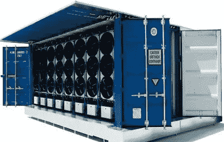

# 中国比特币挖矿禁令的影响

> 原文：<https://medium.com/coinmonks/impact-of-chinas-bitcoin-mining-ban-af0dfd8349b0?source=collection_archive---------2----------------------->

过去几天，我们这些从事矿业的人收到的最常见的问题是，“中国矿商还要多久才能恢复运营？”

在详细考虑了这个问题并消化了其他人的意见后，我估计大部分容量将需要 12-18 个月才能恢复正常；然而，其中一些可能永远不会重新上线。我的推理如下。

首先，所需的能源规模是巨大的。如果中国所有的采矿能力都到了北美，那么北美的采矿能力将是现在的三倍。达到目前的产能需要 12 年时间，因此产能增加两倍不会很快。

在禁令颁布前，我们这些在北美从事矿业的人已经在积极扩张了。在过去的几个月里，我们投入了大量的资源来确保新能源的安全，但这很难。所有容易获得，甚至有点难以获得的电网电力都已经有了保障。离网能源是可用的，但每个离网地点需要三笔交易；一个用于获取原始能源，一个用于发电设备，一个用于专用集成电路——协调所有这些需要大量的时间和精力。无论正在进行的新项目是并网、离网还是混合，其中大多数都包括订购当前或下一代设备，也将使用这种电力。这是因为该项目的股东希望他们在新的能源和基础设施上的投资能够持续最长时间。他们不会特别有兴趣从中国购买二手设备，或者只是为他们提供服务。

在某种程度上，一些权力是可用的——它可能在不太“友好”的地区，这是至关重要的，因为权力不是平等创造的。或者，换句话说，加利福尼亚的一千瓦时的电与南达科他州的一千瓦时的电是不可互换的。鉴于中国矿工刚刚被驱逐出自己的国家，我预计他们会对自己的去向保持谨慎。理想情况下，像我的公司一样，中国矿商希望在美国境内友好的司法管辖区(例如 TX，ND，OK，FL)但不幸的是，在短期内，该功率被大量占用。

这将给中国矿商留下两个选择。选择一，去那些欢迎但通常被认为不太稳定的国家。这些地方包括格鲁吉亚、哈萨克斯坦、萨尔瓦多、巴拉圭。选项二，开始寻找北美的离网或离网/并网混合解决方案(例如滞留气体、燃烧气体、太阳能)。第一种方案速度更快，资本成本更低，但风险更大，最终将没有足够的电力在预期的时间范围内运行。方案二将有较长的准备时间和更多的资本密集型，但更安全，长期运营成本较低。此外，方案二可以满足中国矿商的总能源需求，但方式更加分散，对他们来说，这是一种外国商业模式。中国矿商习惯于在大型设施(固定仓库)中部署，在一个地点管理几十个兆瓦。离网采矿的未来是使用灵活的、移动的、以大约 1 MW 增量部署的集装箱解决方案。

无论中国矿商走向何方，他们将首先部署最新的专用集成电路，最后部署最老的专用集成电路，这是有道理的。如果他们试图出售他们的 ASICs 也是如此，因为大量旧技术的市场将会受到限制。(稍后将详细介绍)这是因为，如果可用功率有限制，那么他们希望利用该功率使用最高效的技术是合乎逻辑的。作为参考，Barefoot Mining 的最新项目在过去的一个月里获得了资金，并将以大约 3MW 的功率运行。它将于 2021 年第四季度末或 2022 年 Q1 时间年初上线。这个时间表的一部分是由于我们正在使用的特定 ASICs 的可用性。我们可以用不同的 ASICs 将它提前几个月，但使用其他设备的长期形式看起来并不那么有吸引力。

因此，有可能一些来自中国的老技术(例如 S9s)可能永远也不会恢复生产，尤其是在大部分产能恢复上线有 12 到 18 个月的延迟的情况下。下一次减半将在 2024 年的 H1 举行。这意味着运营这种设备盈利的剩余时间将接近于零。将这种设备运到美国需要一大笔费用。这很可能会导致 S9s，以及类似的旧设备，在不久的将来大甩卖。请注意，仅在 8 个月前，这种设备的售价为每台 25 美元。我预计，在未来 90 天内，我们将看到这种设备的价格迅速下降，因为中国矿工面对他们的现实/困难，并试图清理旧设备。

Bitfury’s Blockbox AC Bitcoin Mining Container

我确实希望中国矿商一切顺利，尽管他们可能被定位为我的公司的竞争对手。我认为比特币生态系统的健康始终是我们的首要任务。此外，我认为中国矿业资源的最终重新部署将通过分散在世界各地来实现，通常是通过使用离网和小型站点来实现。这将使比特币变得更加分散，比以往任何时候都更加不可阻挡。

h/t to @ aus storms @ Max _ Gagliardi @ CBS spears 和其他在 2021 年 6 月 28 日上午参加了关于离网采矿的 Twitter 空间会议的人。特别感谢主持会议的@MartyBent 和@GAMdotAI，他们做出了很大的贡献，并允许我表达我的观点和想法。

鲍勃·伯内特
赤脚矿业公司首席执行官
2021 年 6 月 28 日

> 加入 [Coinmonks 电报频道](https://t.me/coincodecap)，了解加密交易和投资

**还有，读**

 [## 最佳免费加密交易机器人——前 16 名比特币交易机器人[2021]

### 2021 年币安、比特币基地、库币和其他密码交易所的最佳密码交易机器人。四进制，位间隙…

medium.com](/coinmonks/crypto-trading-bot-c2ffce8acb2a)