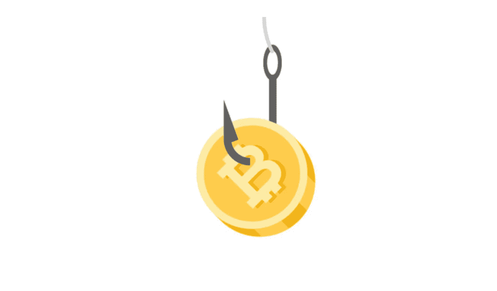

# 系绳交易对比特币价格的影响

> 原文：<https://medium.com/coinmonks/impact-of-tether-trading-on-the-bitcoin-price-f915e26c2c44?source=collection_archive---------1----------------------->

这是周日晚上，我刚刚在 Reddit 上发现了文章“[The Big Short:Inside Crypto ' s Doomsday Machine](https://crypto-anonymous-2021.medium.com/the-bit-short-inside-cryptos-doomsday-machine-f8dcf78a64d3)”。这篇文章基本上是在声称**系绳**——它应该是由美元完全支持的，却没有任何支持。

对于那些从未听说过系绳的人，这里有一个简短的总结:
系绳是一个“[稳定连接](https://en.wikipedia.org/wiki/Stablecoin)”，因为它最初被设计为总是…