# 使用马尔可夫决策过程实现强化学习[教程]

> 原文：<https://medium.com/coinmonks/implement-reinforcement-learning-using-markov-decision-process-tutorial-272012fdae51?source=collection_archive---------3----------------------->

**马尔科夫** **决策过程**，更广为人知的是 **MDP** ，是一种在网格世界环境中进行决策的强化学习方法。gridworld 环境由网格形式的状态组成。

MDP 试图通过将世界划分为状态、动作、模型/过渡模型和奖励来以网格的形式捕捉世界。MDP 的解决方案称为策略，目标是为 MDP 任务找到最佳策略。

因此，任何由一组状态、动作和奖励组成的、遵循马尔可夫特性的强化学习任务都将被认为是 MDP。

在本教程中，我们将深入探讨 MDP、状态、行动、奖励、政策，以及如何使用贝尔曼方程来解决它们。

> 本文是摘自《TensorFlow 强化学习[一书的强化学习教程。](https://www.packtpub.com/big-data-and-business-intelligence/reinforcement-learning-tensorflow)

# 马尔可夫决策过程

MDP 被定义为以下各项的集合:

*   **状态** : S
*   **动作** : A(s)，A
*   **转换模型** : T(s，a，s') ~ P(s'|s，a)
*   **奖励** : R(s)，R(s，a)，R(s，a，s ')
*   **政策**:

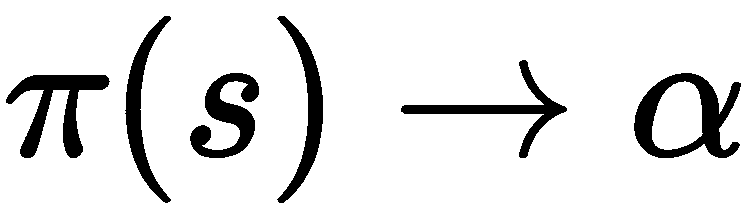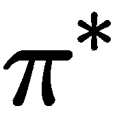

*   是最佳策略

在 MDP 的情况下，环境是完全可观察的，也就是说，无论智能体在任何时间点进行什么观察，都足以做出最优决策。在部分可观察环境的情况下，代理需要一个存储器来存储过去的观察结果，以做出最好的可能决策。

让我们试着把这个分解成不同的乐高积木，来理解这个整体过程意味着什么。

# 马尔可夫性质

简而言之，根据**马尔可夫性质**，为了知道近期的信息(比如在 *t+1* 时刻的信息)，在 *t* 时刻的当前信息是重要的。

给定一个序列，

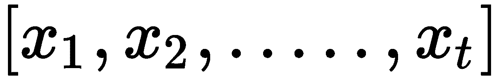

，一阶马尔可夫说，

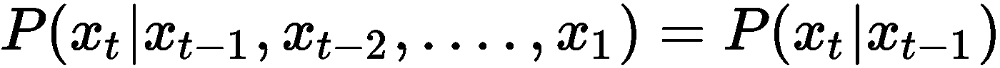

，也就是，

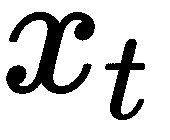

仅取决于

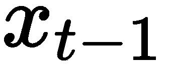

。因此，

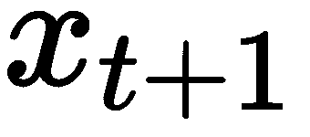

将只取决于

。马尔可夫的二阶理论认为，

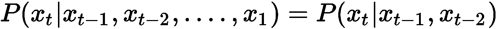

，也就是，

仅取决于

和

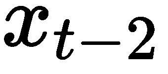

在我们的上下文中，从现在起我们将遵循马尔可夫性质的一阶。因此，如果新状态的概率，比如说

，只取决于当前状态，

，使得当前状态捕获并记住来自过去的属性和知识。因此，根据马尔可夫性质，世界(即环境)被认为是静止的，即世界中的规则是固定的。

# S 状态集

**S 状态集**是不同状态的集合，表示为 **s** ，构成环境。状态是从环境中获得的数据的特征表示。因此，来自代理传感器的任何输入都可以在状态形成中发挥重要作用。状态空间可以是离散的，也可以是连续的。从起始状态开始，必须以最佳路径到达目标状态，而不会以不良状态结束(如下图所示的红色状态)。

假设下面的 gridworld 有 12 个离散的状态，其中绿色网格是目标状态，红色是要避免的状态，黑色是一堵墙，如果你迎面撞上它，你会从墙上反弹回来:

这些状态可以表示为 1，2，…..，12 或通过坐标，(1，1)，(1，2)，…..(3,4).

# 行动

**动作**是代理在特定状态下可以执行的事情。换句话说，动作是代理在给定环境中被允许做的一系列事情。像状态一样，动作也可以是离散的或连续的。

考虑以下 gridworld 示例，该示例具有 12 个离散状态和 4 个离散动作(**向上**、**向下、向右**和向左**):**

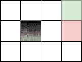

前面的例子显示了动作空间是一个离散集合空间，即 *a*

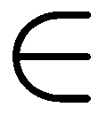

*A* 其中，*A = {上下左右}* 。它也可以被视为状态的函数，即 *a = A(s)* ，其中取决于状态函数，它决定哪个动作是可能的。

# 过渡模型

转换模型 *T(s，a，s’)*是三个变量的函数，它们是当前状态( *s* )、动作( *a* )和新状态(*s’*)，并且定义了在环境中玩游戏的规则。它给出了概率 *P(s'|s，a)* ，即假定代理人在给定状态 *s* 采取行动 *a* ，到达新的 *s'* 状态的概率。

过渡模型在随机世界中起着至关重要的作用，这与确定性世界的情况不同，在确定性世界中，除了确定状态之外，任何着陆状态的概率都为零。

让我们考虑以下环境(世界),并考虑不同的情况，确定的和随机的:

自动作*一*

*A* 其中，*A = {上下左右}* 。

这两种情况的行为取决于某些因素:

*   **确定的环境**:在确定的环境中，如果你采取某个动作，比如说*向上*，你一定会以概率 1 执行那个动作。
*   **随机环境**:在随机环境中，如果你采取同样的动作，比如说*向上*，有一定的概率比如说 0.8 实际执行给定的动作，有 0.1 的概率它可以执行一个垂直于给定动作的动作(或者*向左*或者*向右*)，*向上*。这里对于 s 状态和 *UP* 动作跃迁模型， *T(s '，UP，s) = P(s'| s，UP) = 0.8* 。

因为 *T(s，a，s') ~ P(s'|s，a)* ，这里新状态的概率只取决于当前状态和动作，而不取决于过去的状态。因此，转移模型遵循一阶马尔可夫性质。

我们也可以说，我们的宇宙也是一个随机环境，因为宇宙是由原子组成的，这些原子处于由位置和速度定义的不同状态。每个原子执行的动作改变了它们的状态，并引起宇宙的变化。

# 奖励

状态的**奖励**量化了进入状态的有用性。有三种不同的形式来表示奖励，即， *R(s)* ， *R(s，a)* 和 *R(s，a，s’)*，但它们都是等价的。

对于特定的环境，领域知识在不同状态的奖励分配中起着重要的作用，因为奖励的微小变化对于找到 MDP 问题的最优解很重要。

在采取某项行动时，我们会奖励我们的代理人两种方法。它们是:

*   **功劳分配问题**:我们回顾过去，检查哪些行为导致了现在的奖励，也就是说，哪个行为得到了功劳
*   相比之下，在目前的状态下，我们会检查采取哪种行动会给我们带来潜在的回报

延迟奖励形成了远见计划的想法。因此，这个概念被用来计算不同状态的预期回报。我们将在后面的章节中讨论这一点。

# 政策

到目前为止，我们已经讨论了产生 MDP 问题的模块，即状态、动作、转换模型和奖励，现在来看解决方案。这项政策是解决 MDP 问题的办法。

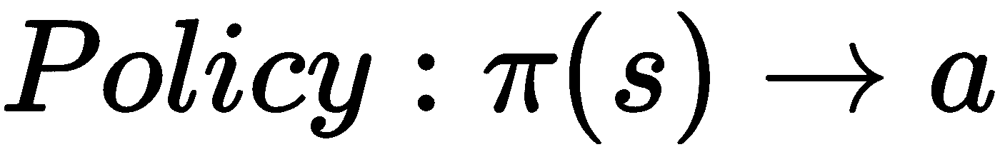

策略是将状态作为输入并输出要采取的动作的函数。因此，策略是代理必须遵守的命令。

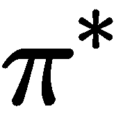

被称为最优策略，它使期望报酬最大化。在采取的所有政策中，最优政策是优化以最大化一生中获得或预期获得的奖励金额的政策。对于 MDP 人来说，生命没有尽头，你必须决定结束的时间。

因此，政策只不过是告诉给定州采取何种行动的指南。它不是一个计划，而是通过返回每个状态要采取的行动来揭示环境的底层计划。

# 贝尔曼方程

自优

政策是使预期回报最大化的政策，因此，

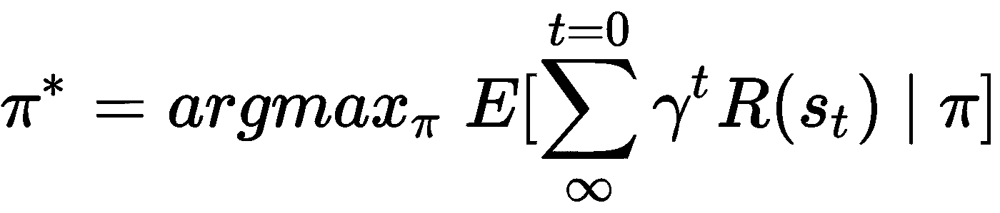

,

在哪里

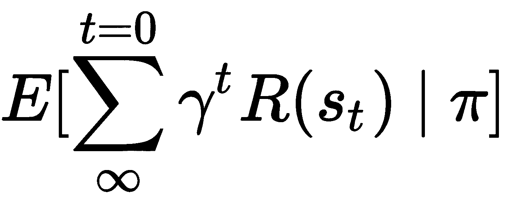

指从代理人观察的状态序列中获得的预期回报值，如果它遵循

政策。因此，

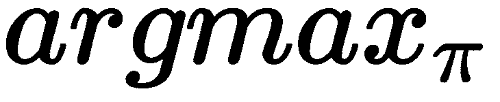

输出

具有最高预期回报的政策。

同样，我们也可以计算一个状态的政策的**效用，即如果我们处于*的*状态，给定一个**

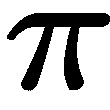

政策，然后，的效用

对于 *s* 州的政策，也就是，

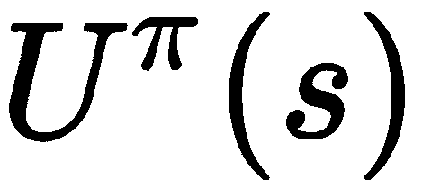

会是从那个州开始的预期回报:

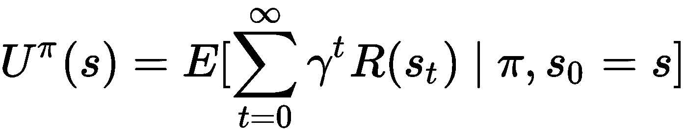

国家的直接奖励，也就是说，

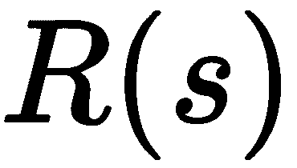

不同于

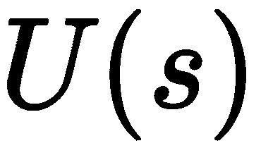

状态(即最优策略的效用)

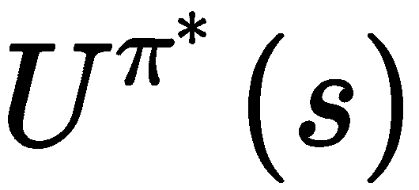

state)因为延迟奖励的概念。从现在开始，使用

国家将指的是国家的最优政策的效用，即

状态。

而且，最优策略也可以看作是使期望效用最大化的策略。因此，

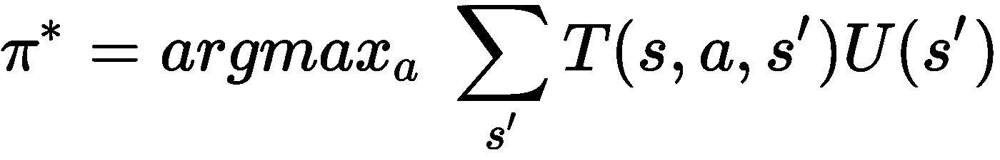

其中， *T(s，a，s')* 为转移概率，即 *P(s'|s，a)* ， *U(s')* 为 *a* 动作作用于 *s* 状态后新落地状态的效用。

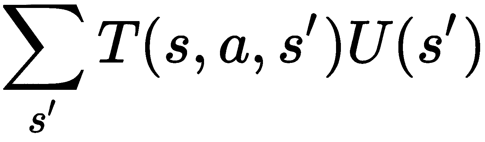

指的是所采取的特定动作的所有可能的新状态结果的总和，则无论哪一个动作给出最大值

这被认为是最优策略的一部分，因此,“s”状态的效用由下面的**贝尔曼方程**给出，

在哪里，

是直接的回报

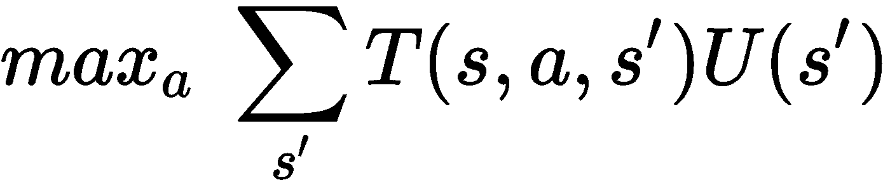

是来自未来的回报，即如果采取行动 a，代理人可以从给定的 s 状态到达的 s 状态的贴现效用。

# 求解贝尔曼方程寻找政策

假设我们在给定的环境中有 n 个状态，如果我们看到贝尔曼方程，

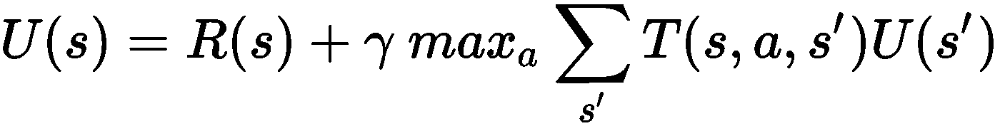

我们发现给定了 n 个 T21 状态；因此，我们将有 *n 个*方程和 *n 个*未知但

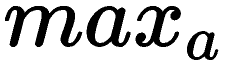

函数使它成为非线性的。因此，我们不能将它们作为线性方程来求解。

因此，为了解决:

*   从任意的实用程序开始
*   基于邻域更新效用直到收敛，即，基于来自给定状态的着陆状态的效用，使用贝尔曼方程更新状态的效用

重复多次，得出状态的真实值。这个迭代收敛到状态真值的过程叫做**值迭代**。

对于游戏结束的终端状态，这些终端状态的效用等于代理人在进入终端状态时收到的即时奖励。

让我们通过实现一个例子来理解这一点。

## 利用贝尔曼方程进行数值迭代的一个例子

考虑以下环境和给定信息:

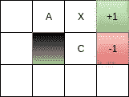

给定信息:

*   *A* 、 *C* 和 *X* 是一些州的名称。
*   绿色的状态是目标状态， *G* ，奖励+1。
*   红色的状态是不好的状态， *B* ，奖励-1，尽量阻止你的代理进入这个状态
*   因此，绿色和红色状态是终端状态，输入任何一个，游戏就结束了。如果代理人遇到绿色状态，即目标状态，代理人获胜，而如果他们进入红色状态，则代理人输掉游戏。

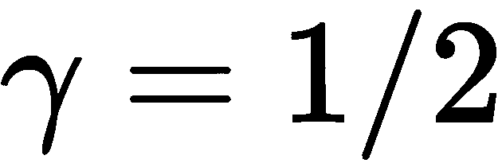

*   ,

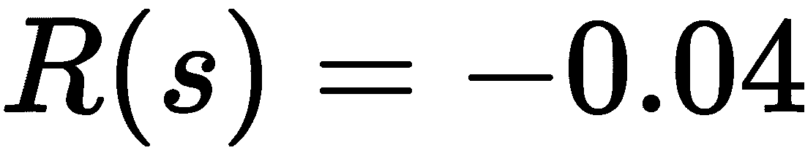

*   (即除了 *G* 和 *B* 状态之外的所有状态的奖励为-0.04)，

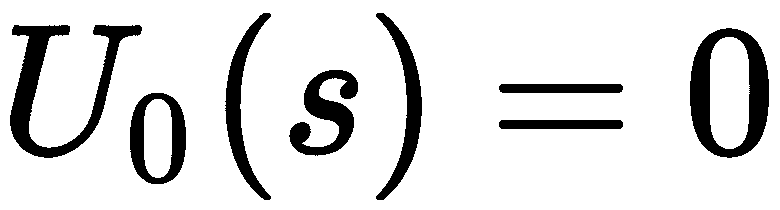

*   (即第一时间步的效用为 0，除了 *G* 和 *B* 状态)。
*   如果朝着期望的方向前进，转移概率 *T(s，a，s’)*等于 0.8；否则，如果垂直于所需方向，则每个值为 0.1。例如，如果动作是*向上*，那么代理以 0.8 的概率向上*移动*，但是以 0.1 的概率向右*移动*并向左*移动 0.1*。

问题:

1.  发现

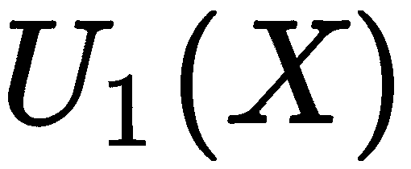

1.  ，时间步骤 1 的 *X* 状态的效用，即代理将经历一次迭代
2.  同样，找到

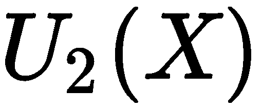

解决方案:

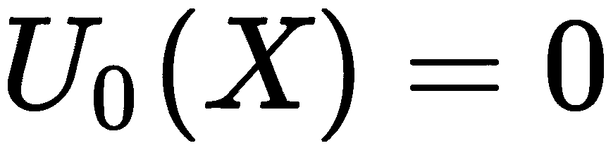

*R(X) = -0.04*

**动作同**

正确

G

0.8+10.8 x 1 = 0.8 右 0.100.1 x 0 = 0 右 0.100.1 x 0 = 0

因此，对于动作 *a =右*，

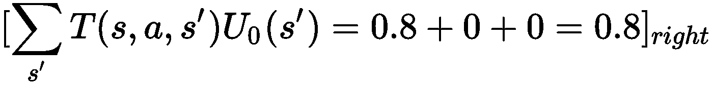

**动作同**

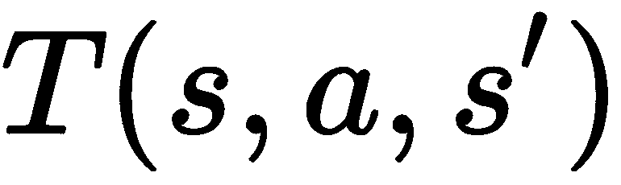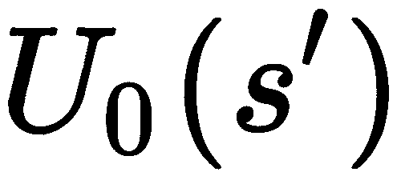

向下

C

0 . 800 . 8 x 0 = 0 下降 0 . 1+10.1 x 1 = 0.1 下降 0.100.1 x 0 = 0

因此，对于动作 *a =向下*，

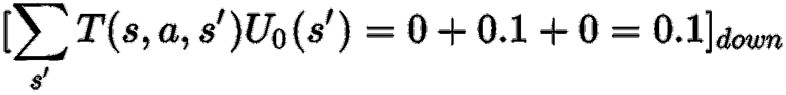

**动作同**

向上

X

0.800.8 x 0 = 0 upg 0.1+10.1 x 1 = 0.1 upa 0.100.1 x 0 = 0

因此，对于动作 *a =上升*，

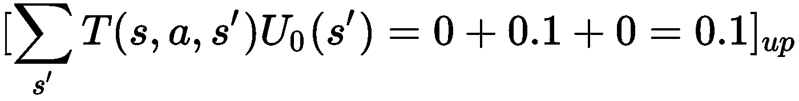

**动作同**

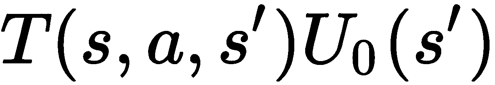

左边的

A

0.800.8 x 0 = 0 leftx 0.100.1 x 0 = 0 leftc 0.100.1 x 0 = 0

因此，对于动作 *a =左*，

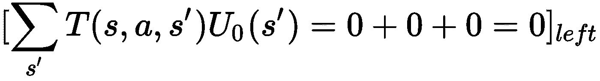

因此，在所有的行动中，

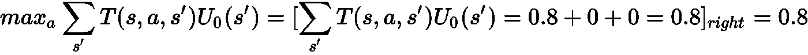

因此，

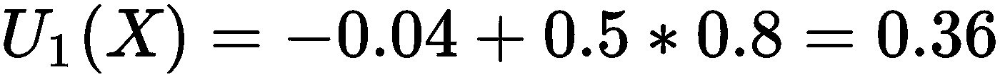

，在哪里

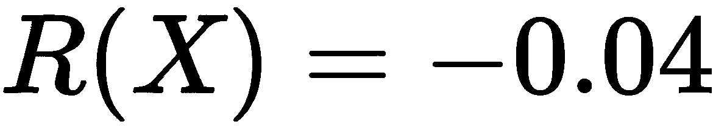

和

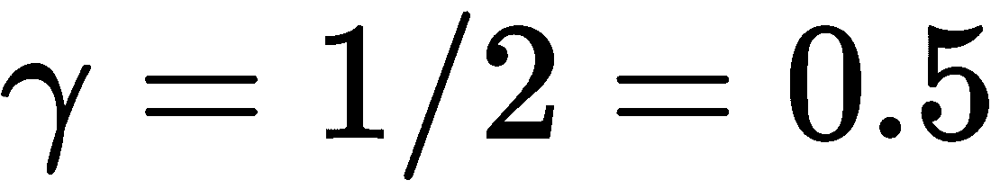

同样，计算

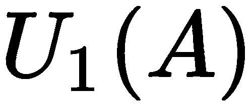

和

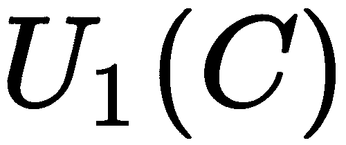

我们得到了

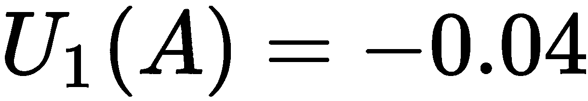

和

因为，

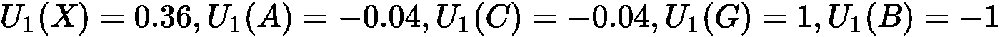

，而且，

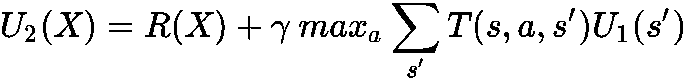

*R(X) = -0.04*

**动作同**

正确

G

0.8+10.8 x 1 = 0.8 右 0.1–0.040.1 x-0.04 =-0.004 右 X0.10.360.1 x 0.36 = 0.036

因此，对于动作 *a =右*，

**动作同**

向下

C

0.8–0.040 . 8 x-0.04 =-0.032 下降 0.1+10.1 x 1 = 0.1 下降 0.1–0.040 . 1 x-0.04 =-0.004

因此，对于动作 *a =向下*，

**动作同**

向上

X

0.80 . 360.8 x 0.36 = 0.288 upg 0.1+10.1 x 1 = 0.1 upa 0.1–0.040.1 x-0.04 =-0.004

因此，对于动作 *a =上升*，

**动作同**

左边的

A

0.8–0.040.8 x-0.04 =-0.032 leftx 0.10 . 360.1 x 0.36 = 0.036 leftc 0.1–0.040.1 x-0.04 =-0.004

因此，对于动作 *a =左*，

因此，在所有的行动中，

因此，

，在哪里

和

因此，对上述问题的回答是:

## 策略迭代

通过迭代策略并更新策略本身而不是值直到策略收敛到最优来获得最优效用的过程被称为**策略迭代**。策略迭代的过程如下:

*   从随机策略开始，

*   给定的

*   迭代步骤 *t* 的策略，计算

*   通过使用以下公式:

*   提高

*   政策制定者

这就结束了一个有趣的强化学习教程。想要从零开始实现最先进的强化学习算法吗？得到这个最畅销的标题，[用 TensorFlow](https://www.packtpub.com/big-data-and-business-intelligence/reinforcement-learning-tensorflow) 强化学习。

# 接下来阅读:

[*强化学习如何工作*](https://hub.packtpub.com/reinforcement-learning-works/)

[*带强化学习的卷积神经网络*](https://hub.packtpub.com/convolutional-neural-networks-reinforcement-learning/)

[*使用 TensorFlow 开始 Q-learning*](https://hub.packtpub.com/getting-started-with-q-learning-using-tensorflow/)