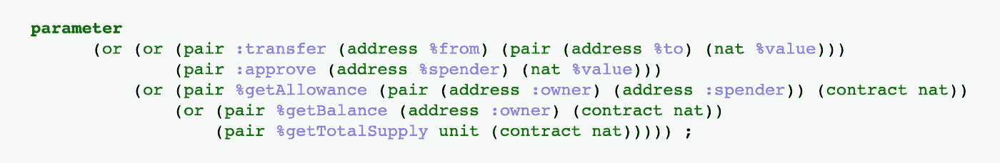
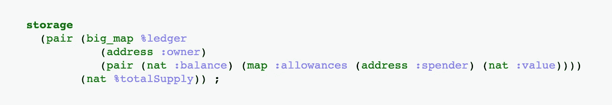
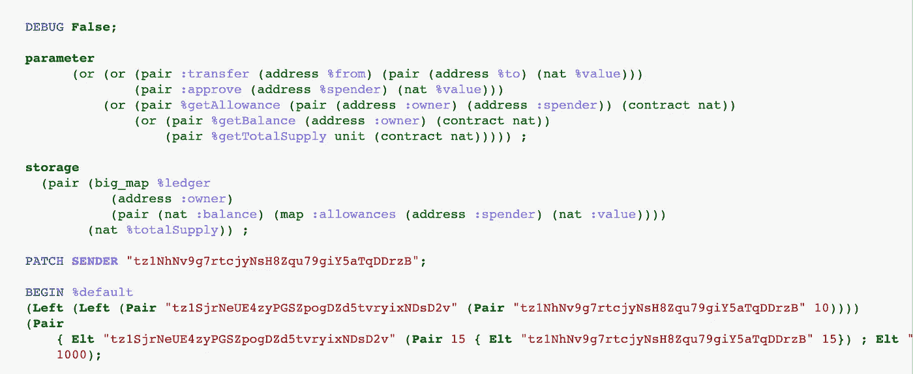

# 用纯迈克尔逊语言实现 FA1.2 令牌(第 1 部分)

> 原文：<https://medium.com/coinmonks/implementing-a-fa1-2-token-in-pure-michelson-part-1-b15e63e0c9b3?source=collection_archive---------0----------------------->

通过一个更复杂的项目将你的迈克尔逊技能提升到一个新的水平


Image from [Pixabay](https://pixabay.com/images/id-5384830/)

在上一篇关于迈克尔逊编程语言的教程中(miniTez 令牌 T1)，我们创建了一个简单的令牌，它只是通过最少的验证将一定数量的令牌从一个帐户转移到另一个帐户。

对 Tezos 上的令牌交互进行标准化的需求推动了社区创建令牌标准，以指示令牌的行为方式以及如何进行交互。这是 [TZIP-7 提案](https://gitlab.com/tzip/tzip/blob/master/proposals/tzip-7/tzip-7.md)的目标。在阅读了 miniTez 教程之后，您应该很容易理解 TZIP-7 提案给基本令牌传输增加了什么。我们将解释它提出的不同观点及其动机。

在理解了实现 TZIP-7 标准的要求之后，我们就可以在键盘上写一些迈克尔逊了。尽管代码会更复杂，但它仍然基于通用指令，没有什么大的难度。你可以查看 Github 库中的[代码，给你一个我们将要写什么的想法。我们构建的契约将严格遵循 TZIP-7 提案，因此没有铸造令牌或其他功能的入口点。但是，标准可以扩展，您可以自由添加它们！](https://github.com/claudebarde/fa12-puremichelson/blob/master/contracts/FA1-2.tz)

对于本教程，我们将使用由 Baking Bad 开发的带有[迈克尔逊内核的笔记本，因为它将为我们提供在编写代码时测试代码所需的灵活性。本教程将分为多个部分:第一部分是对 TZIP-7 标准的介绍，并介绍了用于智能契约的参数和存储的值。契约的不同入口点需要它们自己的文章，这将是本教程后面部分的主题。](https://github.com/baking-bad/michelson-kernel)

开始吧！

# TZIP-7 提案

我以前写过一篇关于 TZIP-7 标准的文章，所以我不会在这里讨论这个提议的细节，而是讨论它在 Michelson 中的实现细节。

TZIP-7 提案要求实现它的令牌具有以下接口:

```
(address :from, (address :to, nat :value))    %transfer
(address :spender, nat :value)                %approve
(view (address :owner, address :spender) nat) %getAllowance
(view (address :owner) nat)                   %getBalance
(view unit nat)                               %getTotalSupply
```

这个接口只引入了契约的入口点，但是隐含了很多东西:

*   `(address :from, (address :to, nat :value)) %transfer`:`transfer`入口点必须接收一个`pair`,左边的`address`表示将提取代币的账户，右边的`pair`包含左边的`address`表示代币的接收者，右边的`nat`表示要转移的代币数量。这并不意味着请求传输的地址必须与`:from`地址相同，因此也可以代表另一个地址启动传输。
*   `(address :spender, nat :value) %approve`:`approve`入口点也必须接收一个`pair`，左边是要批准的帐户地址，右边是授予该帐户的值。这意味着设置批准的地址必须是帐户的所有者。
*   `(view (address :owner, address :spender) nat) %getAllowance`:`getAllowance`入口点被标记为`view`，这意味着该入口点将被其他合同使用，并将返回一个包含所请求许可的交易。入口点接受一个左边包含另一个`pair`的`pair`，左边是所有者的地址，右边是消费者的地址，右边是根对的地址，设置余量作为一个`nat`号。
*   `(view (address :owner) nat) %getBalance`:`getBalance`入口点也是一个视图入口点，它将返回一个事务。它期望一个左边有地址，右边有`nat`值的对。
*   `(view unit nat) %getTotalSupply`:`getTotalSupply`入口点是一个视图入口点，它接受一个`unit`值并返回一个类型为`nat`的值。

虽然简单明了，但该标准暗示了一些事情:

*   存储器中必须有一个`totalSupply`值。TZIP-7 提案没有强制任何类型的存储，但是它暗示实现它的契约必须跟踪令牌的总供应量(否则`getTotalSupply` entrypoint 没有任何东西可以返回)。
*   视图入口点采用类型为`contract nat`的值，而不是简单的`nat`。因为入口点必须向请求该值的契约返回一个事务，`nat`值实际上将是一个`contract nat`值，一个对期望类型为`nat`的值的契约(可能还有它的入口点)的引用。
*   作为参数传递的不同值必须进行注释。这对于我们得到两个地址的`transfer`入口点尤其重要，一个将丢失令牌，一个将获得令牌。

# 迈克尔逊密码

## 参数

对于这个合同，参数将比我们习惯的稍微复杂一些。我们先来看看:



FA1.2 parameter

这个契约引入了一种我们以前没有遇到过的新类型的值:`union`类型。你可以把一个类型为`union`的值想象成一对，在任何时候只有一边可以包含一个值。虽然这看起来像是浪费空间，但实际上这对于条件分支非常有用，因为您可以根据持有值的一方来更改契约的行为。

想象一个`union`类型的值，如下所示:`(or int string)`。这告诉我们，如果左边有一个值，它将是类型`int`，如果右边有一个值，它将是类型`string`。现在，如果你想设置值，你只需要指出你想填充的边和它应该包含的值，例如，`(Left 6)`或`(Right "hello")`。当你的契约遇到这个值时，如果左边有一个`int`或者右边有一个`string`，你可以改变它的行为。

这个模式是迈克尔逊用来模拟入口点的模式。从技术上讲，一个迈克尔逊契约只有一个入口点，但是可以用类型`union`的值模拟更多的入口点。在这个契约中，我们创建了`transfer`和`approve`入口点作为同一个联合值的两边。除了标准所要求的之外，注释对于像 Taquito 这样的第三方应用程序来说也是必不可少的，这些第三方应用程序依赖注释以更友好的方式显示可用的入口点。

类型`union`的值也可以嵌套，这对于创建 2 个以上的入口点非常有价值。作为一种设计选择，我决定将修改存储的入口点放在主联合值的左侧，将视图入口点放在右侧。

除了`union`类型之外，您可以看到这些值被*标注为*，这意味着它们通过一种特殊的符号被命名。以`:`或`@`开头的字符串是注释。根据您想要注释的值的功能，Michelson 有不同类型的注释，对这些注释的解释需要有自己的教程。只需观察这个例子中的注释，并在您自己的代码中尝试一下。

## 仓库

FA1.2 合同不需要复杂的存储，因为它只需要跟踪用户的余额和批准，以及总供应量。



FA1.2 storage

同样，您可以看到这些值是带注释的，这不仅便于您阅读，也便于像 Taquito 这样的外部工具阅读。

存储器由一对组成，左边是一个`big_map`，右边是一个代表总供应量的`nat`值。大地图将记录用户的账户，包括他们的余额和他们设定的津贴。这种大地图一般叫做`ledger`，所以我们也用这个名字。

## 笔记本电脑设置

为了使用笔记本电脑，我们必须准备一个基本的设置。首先，我们希望在编写时运行契约，因此我们在参数和存储声明后使用了`BEGIN`指令来实现这一点。`BEGIN`指令有三个参数:我们的目标入口点、一个参数值和一个存储值。接下来，我们将测试防止非帐户所有者的人执行某些操作的功能，因此我们将使用 Michelson 中的`SENDER`指令。你可以想象，如果没有交易，就没有发送者，所以我们必须在笔记本中模拟它。你可以简单地添加`PATCH SENDER "tz1..." ;`和你选择的地址来做这件事。

随着契约的增长，您可能更喜欢隐藏所有打印出来的关于栈操作的信息。一开始用`DEBUG False ;`就可以实现。



My setup (we’ll set up the arguments in the next part)

## 下一步:第 2 部分中的入口点代码！

## 另外，阅读

*   最好的[密码交易机器人](/coinmonks/crypto-trading-bot-c2ffce8acb2a)
*   [密码本交易平台](/coinmonks/top-10-crypto-copy-trading-platforms-for-beginners-d0c37c7d698c)
*   最好的[加密税务软件](/coinmonks/best-crypto-tax-tool-for-my-money-72d4b430816b)
*   [最佳加密交易平台](/coinmonks/the-best-crypto-trading-platforms-in-2020-the-definitive-guide-updated-c72f8b874555)
*   最佳[密码借贷平台](/coinmonks/top-5-crypto-lending-platforms-in-2020-that-you-need-to-know-a1b675cec3fa)
*   [最佳区块链分析工具](https://bitquery.io/blog/best-blockchain-analysis-tools-and-software)
*   [加密套利](/coinmonks/crypto-arbitrage-guide-how-to-make-money-as-a-beginner-62bfe5c868f6)指南:新手如何赚钱
*   最佳[加密制图工具](/coinmonks/what-are-the-best-charting-platforms-for-cryptocurrency-trading-85aade584d80)
*   [莱杰 vs 特雷佐](/coinmonks/ledger-vs-trezor-best-hardware-wallet-to-secure-cryptocurrency-22c7a3fd391e)
*   了解比特币最好的[书籍有哪些？](/coinmonks/what-are-the-best-books-to-learn-bitcoin-409aeb9aff4b)
*   [3 商业评论](/coinmonks/3commas-review-an-excellent-crypto-trading-bot-2020-1313a58bec92)
*   [AAX 交易所评论](/coinmonks/aax-exchange-review-2021-67c5ea09330c) |推荐代码、交易费用、利弊
*   [德里比特评论](/coinmonks/deribit-review-options-fees-apis-and-testnet-2ca16c4bbdb2) |选项、费用、API 和测试网
*   [FTX 密码交易所评论](/coinmonks/ftx-crypto-exchange-review-53664ac1198f)
*   [n 零审核](/coinmonks/ngrave-zero-review-c465cf8307fc)
*   [Bybit 交换评论](/coinmonks/bybit-exchange-review-dbd570019b71)
*   [3Commas vs Cryptohopper](/coinmonks/cryptohopper-vs-3commas-vs-shrimpy-a2c16095b8fe)
*   最好的比特币[硬件钱包](/coinmonks/the-best-cryptocurrency-hardware-wallets-of-2020-e28b1c124069?source=friends_link&sk=324dd9ff8556ab578d71e7ad7658ad7c)
*   最佳 [monero 钱包](https://blog.coincodecap.com/best-monero-wallets)
*   [莱杰 nano s vs x](https://blog.coincodecap.com/ledger-nano-s-vs-x)
*   [bits gap vs 3 commas vs quad ency](https://blog.coincodecap.com/bitsgap-3commas-quadency)
*   [莱杰纳米 S vs 特雷佐 one vs 特雷佐 T vs 莱杰纳米 X](https://blog.coincodecap.com/ledger-nano-s-vs-trezor-one-ledger-nano-x-trezor-t)
*   [block fi vs Celsius](/coinmonks/blockfi-vs-celsius-vs-hodlnaut-8a1cc8c26630)vs Hodlnaut
*   [Bitsgap 评论](/coinmonks/bitsgap-review-a-crypto-trading-bot-that-makes-easy-money-a5d88a336df2)——一个轻松赚钱的加密交易机器人
*   为专业人士设计的加密交易机器人
*   [PrimeXBT 审查](/coinmonks/primexbt-review-88e0815be858) |杠杆交易、费用和交易
*   [埃利帕尔泰坦评论](/coinmonks/ellipal-titan-review-85e9071dd029)
*   [SecuX Stone 评论](https://blog.coincodecap.com/secux-stone-hardware-wallet-review)
*   [BlockFi 评论](/coinmonks/blockfi-review-53096053c097) |从您的密码中赚取高达 8.6%的利息