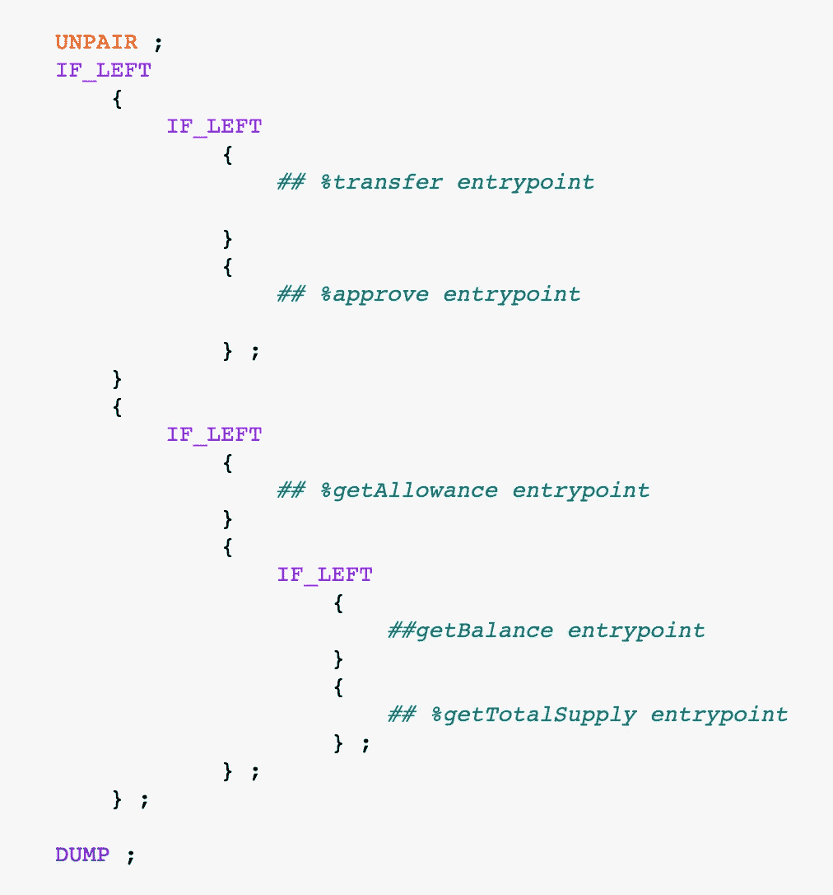
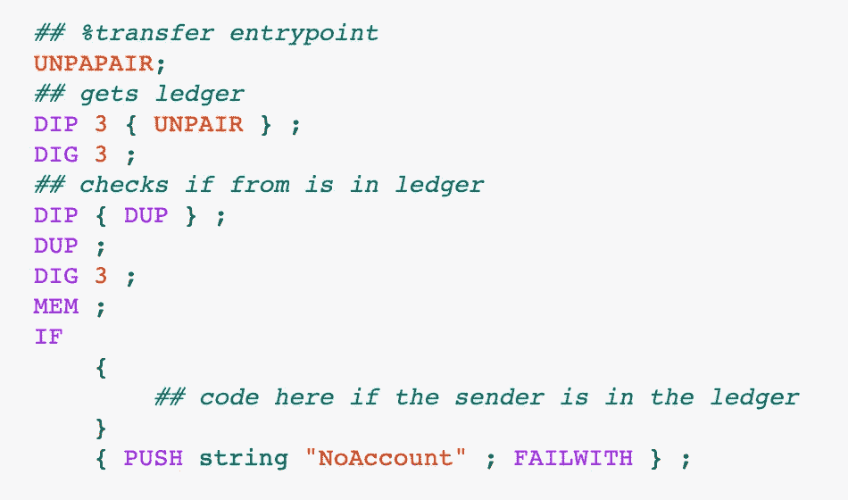
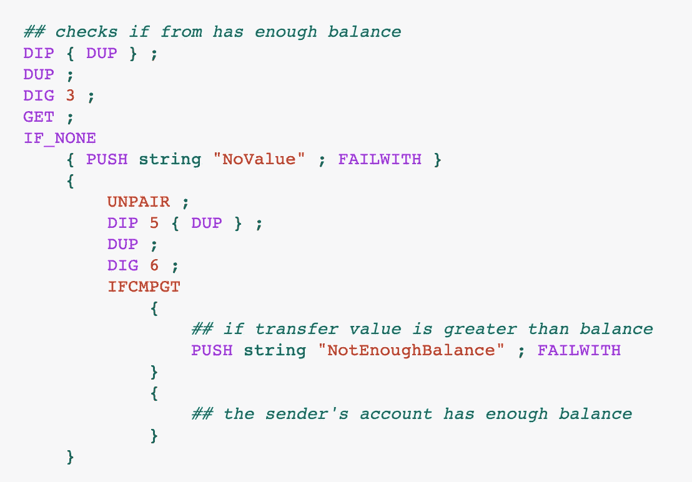
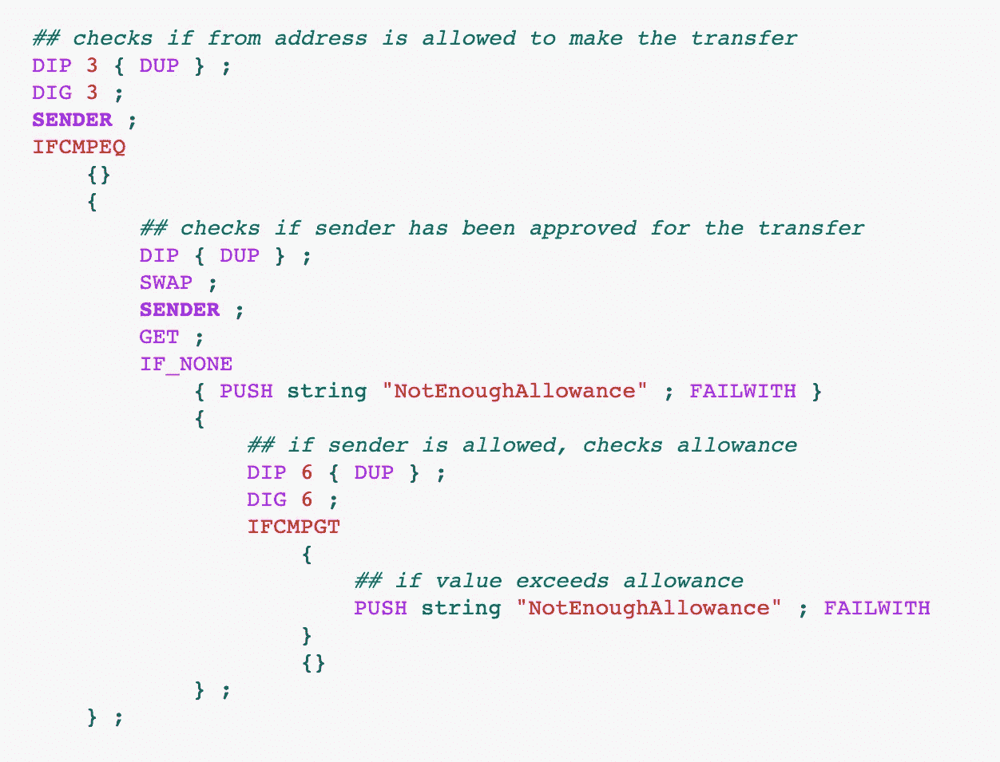
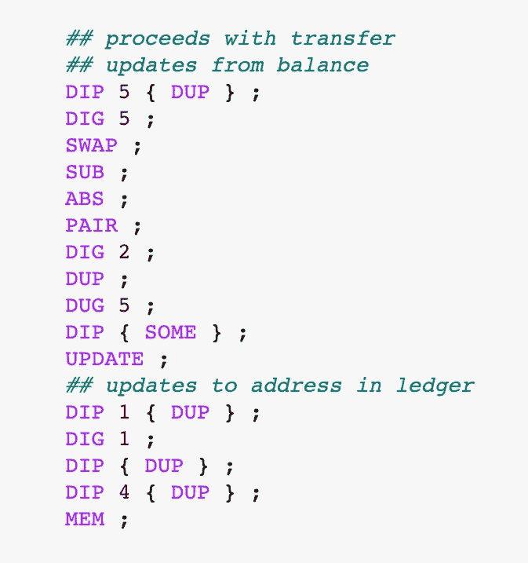
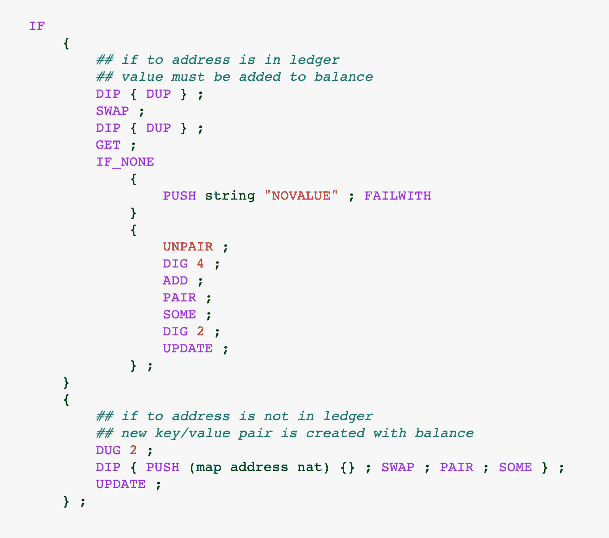
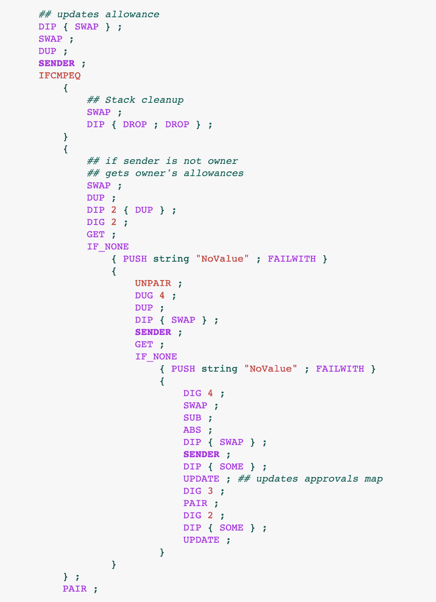

# 用纯迈克尔逊实现 FA1.2 令牌(第 2 部分)

> 原文：<https://medium.com/coinmonks/implementing-a-fa1-2-token-in-pure-michelson-part-2-409be8b8fba8?source=collection_archive---------2----------------------->

## 通过一个更复杂的项目将你的迈克尔逊技能提升到一个新的水平


Image from [Pixabay](https://pixabay.com/images/id-5384830/)

*零件 1 可用* [*此处*](/@claudebarde/implementing-a-fa1-2-token-in-pure-michelson-part-1-b15e63e0c9b3) *。*

在第 1 部分中，我们概述了 TZIP-7 提案，我们在 Jupyter 笔记本中设置了我们的项目，并检查了参数的结构和 FA1.2 令牌的存储。

在第 2 部分中，我们探索了`%transfer`入口点的代码。这是合同的重要部分(也是最长的部分)，因为它允许或限制转让。

现在让我们深入研究代码👨‍💻

## 转移入口点

总的来说，我最开始喜欢做的，是解开参数所建立的结构。因为参数由嵌套的联合值组成，所以会有一些逻辑开关来实现契约的入口点。

它看起来是这样的:



The entrypoint structure

> 注意底部的`*DUMP*`指令了吗？这不是迈克尔逊！它在笔记本中用于打印堆栈的状态。

我们做的第一件事是用`UNPAIR`指令将参数和存储区分开。该参数由嵌套的联合值组成，结构如下:

```
 parameter
               ______________|______________
               |                           |
               or                          or 
        _______|_______             _______|_______
        |             |             |             |     
     transfer      approve    getAllowance        or
                                           _______|_______
                                           |             |
                                      getBalance   getTotalSupply
```

为了在 Michelson 中实现这个结构，我们将使用`IF_LEFT`指令。联合值只能在其一个面中有一个值。如果左侧有一个值，将执行跟随`IF_LEFT`的第一个程序块。如果右侧有值，将执行`IF_LEFT`后的第二个程序块。这就是入口点的模拟方式。

让我们从最复杂的入口点`%transfer`开始。转移入口点接收一个嵌套的对，即一个对包含一个左边的`address`和另一个右边的对，一个左边的`address`和一个右边的`nat`值。我们希望解开这些嵌套对并获得分类帐，这样我们可以首先验证支出者是否存在于分类帐中(实际上，如果我们应该从中扣除代币的地址不存在于分类帐中，那么继续下去是没有意义的)。



`UNPAPAIR`宏表明我们有一个右边有嵌套对的配对，我们想同时解开两个配对。从那时起，我们将可以访问带有`@from`注释的地址，该地址是令牌的发送方。然后，我们可以复制它，并使用它来验证发送者在分类帐中是否有帐户。

之后，我们要检查汇款人的账户是否有足够的余额来处理转账。



像往常一样，我们复制`@from`值(因为我们稍后将再次使用它)并获得它在分类帐中的余额。如果找不到键/值对，则`GET`指令返回一个`optional`值，即`None`，或者带有与键相关联的值的`(Some value)`。虽然我们在这里不太可能有一个`None`值，但是我们不要冒任何风险，如果它发生了，我们会使契约失败。每次发生错误时，契约都必须失效，以防止存储中任何不必要的更改。

现在，我们有了发件人的余额，所以我们可以检查它是否足够。我们复制要发送的令牌数量，将其放在堆栈的顶部，并与余额进行比较。如果代币数量大于余额(`IFCMPGT`)，则合同失败，必须根据标准返回`NotEnoughBalance`错误代码。否则，我们可以继续进行转移前的最后一次检查。

此时，我们知道代币将被记入借方的账户存在，并且有足够的余额。我们必须确保交易的实际发送者已经被允许借记所请求数量的代币。只有两种用户可以这样做:帐户的所有者或帐户所有者批准的地址。



我们首先对堆栈的元素进行排序，以验证交易的发送者是否也是帐户的所有者。我们在这里使用`SENDER`而不是`SOURCE`来允许智能合约在分类账中保持平衡。如果所有者的地址和发送者的地址相同，我们使用空的花括号`{}`来告诉编译器继续处理条件后面的代码。如果它们不相同，我们检查发件人的地址是否已经得到帐户所有者的批准。

我们在`allowances`地图中搜索发送者的地址，如果找不到，我们使合同失败并根据标准返回`NotEnoughAllowance`错误代码。如果我们找到它，我们必须进行最后的核实，并检查当前的津贴是否包括转让的代币数量。如果没有，合同失效，否则，我们可以进行转让。



处理转账的代码的第一部分很简单:我们获得发送者的余额，并扣除要转账的代币金额。请记住，在 Michelson 中减去 2 个 nat 会产生一个 int 值，因此在更新分类帐大图之前，您必须使用`ABS`将其转换回 NAT。

接下来，您可能会面临两种不同的情况:令牌的接收者可能已经在分类帐中有一个帐户，因此我们必须增加它的余额，或者它可能没有，在这种情况下，我们必须创建一个新的键/值对并设置余额。我们使用`MEM`指令来检查该密钥(即收件人的地址)是否存在于分类账中。



Updating the recipient’s balance

如果我们找到一个账户，我们会得到它的余额。万一从`GET`指令中得到`None`(我们知道账户存在，所以一定有余额，即使它可能是`0`)，我们使合同失败，否则，我们得到余额，加上要转移的代币数量，并将其与`allowances`地图一起推回到接收者的账户中。

如果没有账户，我们只需创建一个账户，为津贴推送一个空的`map`，将它与收到的代币数量配对，并将其推送到分类账中(使用`UPDATE`)。



Updating the sender’s allowance

我们现在正处于进入点的最后冲刺阶段。为了避免不必要的花费，更新发送者的津贴是非常重要的。

我们首先检查发送者是否是帐户的所有者，因为之后没有津贴更新要做，我们将做一些堆栈清理来删除我们不需要返回入口点的元素。

如果发送者不是帐户的所有者，我们获取所有者的帐户详细信息(余额和`allowances`地图)，我们解除它们的配对并搜索发送者的地址。我们之前已经验证过发送者被允许传输令牌，所以不需要再做一次。一旦我们得到了津贴，我们就扣除我们刚刚转移的代币的数量，并把它放回津贴映射中(不要忘记在你的`UPDATE`之前用`SOME`把结果包装在一个可选值中)。之后，我们可以将映射与帐户的余额配对(注意将元素按正确的顺序排列，余额在配对的左边，津贴在右边),并将更新的帐户详细信息推回分类帐！此时，堆栈应该由`ledger`大图和`totalSupply`号组成，因此我们可以使用`PAIR`将它们配对在一起，并最终返回我们的新存储🥳

# 结论

就是这样！您已经成功实现了 FA1.2 令牌合约的`transfer`入口点！迈克尔逊代码在实际更新代币余额和津贴之前会进行一系列验证，但是这些验证对于确保您的合同和用户余额的安全是绝对必要的。

还要记住，任何意外的价值或行为都会导致合同失效，以保持分类账中账户的完整性。

这是第 2 部分的结尾。在第 3 部分中，我们将探索`approve`入口点和`view`入口点，敬请关注！

## 另外，阅读

*   最好的[加密交易机器人](/coinmonks/crypto-trading-bot-c2ffce8acb2a)
*   [密码本交易平台](/coinmonks/top-10-crypto-copy-trading-platforms-for-beginners-d0c37c7d698c)
*   最好的[加密税务软件](/coinmonks/best-crypto-tax-tool-for-my-money-72d4b430816b)
*   [最佳加密交易平台](/coinmonks/the-best-crypto-trading-platforms-in-2020-the-definitive-guide-updated-c72f8b874555)
*   最佳[密码借贷平台](/coinmonks/top-5-crypto-lending-platforms-in-2020-that-you-need-to-know-a1b675cec3fa)
*   [最佳区块链分析工具](https://bitquery.io/blog/best-blockchain-analysis-tools-and-software)
*   [加密套利](/coinmonks/crypto-arbitrage-guide-how-to-make-money-as-a-beginner-62bfe5c868f6)指南:新手如何赚钱
*   最佳[加密制图工具](/coinmonks/what-are-the-best-charting-platforms-for-cryptocurrency-trading-85aade584d80)
*   [莱杰 vs 特雷佐](/coinmonks/ledger-vs-trezor-best-hardware-wallet-to-secure-cryptocurrency-22c7a3fd391e)
*   了解比特币的[最佳书籍有哪些？](/coinmonks/what-are-the-best-books-to-learn-bitcoin-409aeb9aff4b)
*   [3 商业评论](/coinmonks/3commas-review-an-excellent-crypto-trading-bot-2020-1313a58bec92)
*   [AAX 交易所评论](/coinmonks/aax-exchange-review-2021-67c5ea09330c) |推荐代码、交易费用、利弊
*   [Deribit 审查](/coinmonks/deribit-review-options-fees-apis-and-testnet-2ca16c4bbdb2) |选项、费用、API 和 Testnet
*   [FTX 密码交易所评论](/coinmonks/ftx-crypto-exchange-review-53664ac1198f)
*   [n 零审核](/coinmonks/ngrave-zero-review-c465cf8307fc)
*   [Bybit 交换审查](/coinmonks/bybit-exchange-review-dbd570019b71)
*   [3Commas vs Cryptohopper](/coinmonks/cryptohopper-vs-3commas-vs-shrimpy-a2c16095b8fe)
*   最好的比特币[硬件钱包](/coinmonks/the-best-cryptocurrency-hardware-wallets-of-2020-e28b1c124069?source=friends_link&sk=324dd9ff8556ab578d71e7ad7658ad7c)
*   最佳 [monero 钱包](https://blog.coincodecap.com/best-monero-wallets)
*   [莱杰纳米 s vs x](https://blog.coincodecap.com/ledger-nano-s-vs-x)
*   [bits gap vs 3 commas vs quad ency](https://blog.coincodecap.com/bitsgap-3commas-quadency)
*   [莱杰纳米 S vs 特雷佐 one vs 特雷佐 T vs 莱杰纳米 X](https://blog.coincodecap.com/ledger-nano-s-vs-trezor-one-ledger-nano-x-trezor-t)
*   [block fi vs Celsius](/coinmonks/blockfi-vs-celsius-vs-hodlnaut-8a1cc8c26630)vs Hodlnaut
*   Bitsgap 评论——一个轻松赚钱的加密交易机器人
*   为专业人士设计的加密交易机器人
*   [PrimeXBT 审查](/coinmonks/primexbt-review-88e0815be858) |杠杆交易、费用和交易
*   [埃利帕尔泰坦评论](/coinmonks/ellipal-titan-review-85e9071dd029)
*   [赛克斯·斯通评论](https://blog.coincodecap.com/secux-stone-hardware-wallet-review)
*   [区块链评论](/coinmonks/blockfi-review-53096053c097) |从您的密码中赚取高达 8.6%的利息