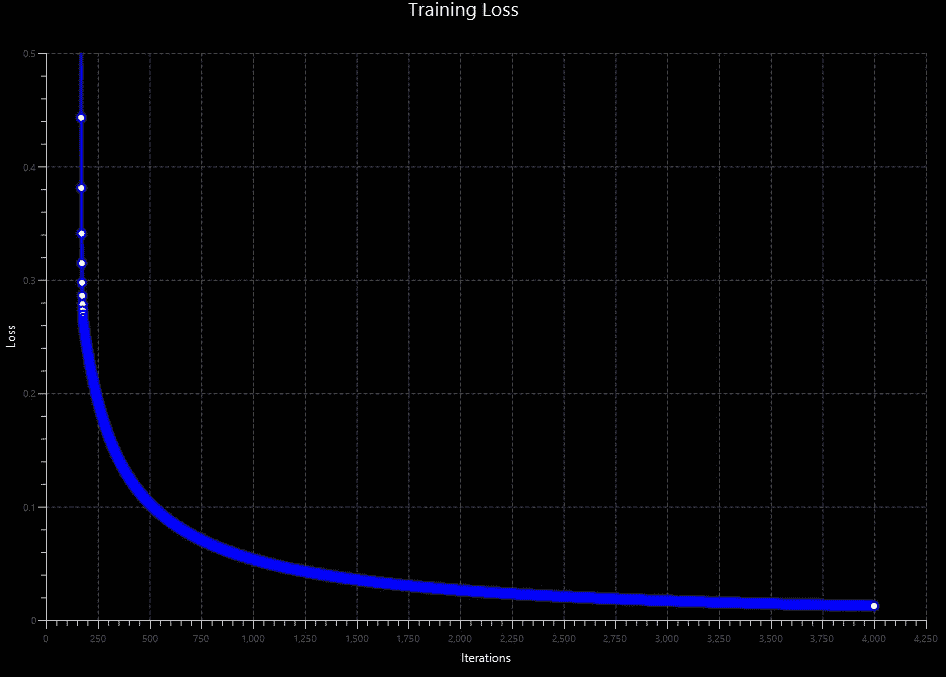

# 用纯 Java 实现人工神经网络(无外部依赖性)。

> 原文：<https://medium.com/coinmonks/implementing-an-artificial-neural-network-in-pure-java-no-external-dependencies-975749a38114?source=collection_archive---------0----------------------->

Visualization of the training loss with JavaFx

深度学习框架过度简化了实现神经网络的过程，有时很容易陷入抽象学习过程的陷阱，认为你可以简单地将任意层堆叠在一起，它会自动处理一切[1]。通过从零开始实现核心概念，如反向传播算法(用于 NNs、CNN 和 r NNs)，在机器学习(ML)方面拥有坚实的基础是很重要的。花点时间去理解它的派生，试着自己从头开始推导它，并从头用代码实现它，看看你是否能让它工作。你获得的知识将会坚持下去，并且独立于你以后决定学习的任何框架。在我的学习过程中，我认为出于求知欲，了解幕后发生的事情是值得的。在本文中，我将向您展示我用纯 java 实现的两层神经网络。

[这是我的第二篇帖子](/@jeraldydeus/going-deep-from-scratch-3809f5890c5e)

> 如果你在赶时间[这里](https://gist.github.com/Jeraldy/1aa6ae6fefa46b7a9cc02b6573cfeefe)是完整的代码。它的 python/numpy 版本可以在[这里](https://gist.github.com/Jeraldy/b5bb83ed10df20834c75bab6b963bebd)找到

**网络架构**

下面展示的是一个我们将要用 java 实现的两层前馈神经网络。我们将使用以下网络架构，但是所有概念都可以扩展到任意数量的层和节点。

Two-layer Neural Network

我们将教我们的神经网络识别的模式是异或运算。运算 **y= x1 XOR x2** 的 **XOR** 运算符真值表如下所示

XOR table

**一些背景数学**

以下是上述神经网络体系结构的正向推进方程[2]。较高的索引表示层，较低的索引表示节点的索引。

***第一部分:正向传播方程***

**矢量化**

对于大多数需要在一长串元素上迭代的任务，我们都使用过 for 循环。我敢肯定，几乎所有正在阅读这篇文章的人，都是在高中或大学时使用 for 循环编写了他们的第一个矩阵或向量乘法代码。For-loop 长期稳定地服务于编程社区。然而，它带来了一些负担，并且在处理大型数据集(在这个大数据时代有数百万条记录)时，执行速度通常很慢[3]。

让我们对方程进行矢量化。结合计算隐藏层的节点(先忽略激活函数，然后再考虑它们)。

**需要注意的是**

1.增加节点的数量会增加权重矩阵的行数。

2.增加特征的数量将增加矩阵的列数。

***我这里是指***

例如，假设我们在隐藏层中添加了另一个节点。矩阵方程向下生长。

**激活功能**

我们需要激活函数来学习数据输入和目标输出之间的非线性复杂函数映射。从上一节，我只是忽略了激活函数方程，以便于证明。我们将使用乙状结肠激活功能。

***第二部分:反向传播方程***

为了直观地了解 back prop 是如何工作的，我将使用下图来说明梯度计算，梯度下降将使用该计算来更新可学习的参数 w 和 b。为了简单起见，我将使用单层神经网络(逻辑回归)。该思想可推广到 N 层神经网络[2]。

我们将使用交叉熵损失来计算成本

计算损失 w.r.t 对权重的( **dw)** 导数。这可以通过使用如下所示的链式法则来完成。

计算损失 w.r.t 对偏差的( **db)** 导数。

**更新方程式**

我们将使用梯度下降执行每个层的参数更新如下。

**完整 Java 代码**

理解上述概念是理解该代码如何工作的关键部分。

[np.java](https://gist.github.com/Jeraldy/7d4262db0536d27906b1e397662512bc)包含了所有的矩阵运算

**训练结果**

以下是对神经网络进行 4000 次迭代训练后的结果。我们可以清楚地看到(预测= [[0.01212，0.9864，0.986300，0.01569]])，我们的网络在尝试模拟异或运算方面做得很好。正如我们所看到的，内部值被推到 1，而外部值被推到 0。

=========
费用= 0.1257569282040295
预测= [[0.15935，0.8900528，0.88589，0.0877284694]]

。

.

。
费用= 0.015787269324306925
预测= [[0.013838，0.984561，0.9844246，0.0177971]]
= = = = = = = = = = = = = = = = = = = = = = = =
费用= 0.01386971354598404
预测= [[0.01212，0

**结论**

这不是一个有效的神经网络的实现，但我的意图是传达一个直观的理解机器学习的概念，并有能力沟通他们成为代码。

你觉得这篇文章有帮助吗？你发现什么错误了吗？(*有可能，因为这是我的第一篇文章，而英语不是我的母语*)。有意见/评论？把它们放到下面。

[我的第二个帖子在这里](/@jeraldydeus/going-deep-from-scratch-3809f5890c5e)

**参考文献**

[1][https://medium . com/@ karpathy/yes-you-should-understand-back prop-e 2f 06 eab 496 b](/@karpathy/yes-you-should-understand-backprop-e2f06eab496b)

[https://www.coursera.org/specializations/deep-learning](https://www.coursera.org/specializations/deep-learning)

[3][https://towards data science . com/why-you-should-forget-loop-for-data-science-code-and-embrace-vectorization-696632622 d5f](https://towardsdatascience.com/why-you-should-forget-for-loop-for-data-science-code-and-embrace-vectorization-696632622d5f)

> 加入 Coinmonks [电报频道](https://t.me/coincodecap)和 [Youtube 频道](https://www.youtube.com/c/coinmonks/videos)获取每日[加密新闻](http://coincodecap.com/)

## 另外，阅读

*   [密码电报信号](http://Top 4 Telegram Channels for Crypto Traders) | [密码交易机器人](/coinmonks/crypto-trading-bot-c2ffce8acb2a)
*   [复制交易](/coinmonks/top-10-crypto-copy-trading-platforms-for-beginners-d0c37c7d698c) | [加密税务软件](/coinmonks/crypto-tax-software-ed4b4810e338)
*   [网格交易](https://coincodecap.com/grid-trading) | [加密硬件钱包](/coinmonks/the-best-cryptocurrency-hardware-wallets-of-2020-e28b1c124069)
*   [印度的加密交易所](/coinmonks/crypto-exchange-dd2f9d6f3769) | [加密应用](/coinmonks/buy-bitcoin-in-india-feb50ddfef94)
*   [面向开发人员的最佳加密 API](/coinmonks/best-crypto-apis-for-developers-5efe3a597a9f)
*   最佳[加密借贷平台](/coinmonks/top-5-crypto-lending-platforms-in-2020-that-you-need-to-know-a1b675cec3fa)
*   [杠杆代币的终极指南](/coinmonks/leveraged-token-3f5257808b22)
*   [八大加密附属计划](https://coincodecap.com/crypto-affiliate-programs) | [eToro vs 比特币基地](https://coincodecap.com/etoro-vs-coinbase)
*   [最佳以太坊钱包](https://coincodecap.com/best-ethereum-wallets) | [电报上的加密货币机器人](https://coincodecap.com/telegram-crypto-bots)
*   [交易杠杆代币的最佳交易所](https://coincodecap.com/leveraged-token-exchanges) | [购买 Floki](https://coincodecap.com/buy-floki-inu-token)
*   [3 commas vs . Pionex vs . crypto hopper](https://coincodecap.com/3commas-vs-pionex-vs-cryptohopper)|[Bingbon Review](https://coincodecap.com/bingbon-review)