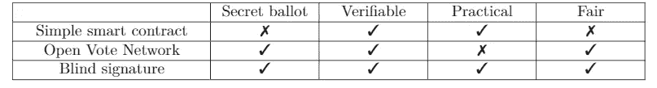
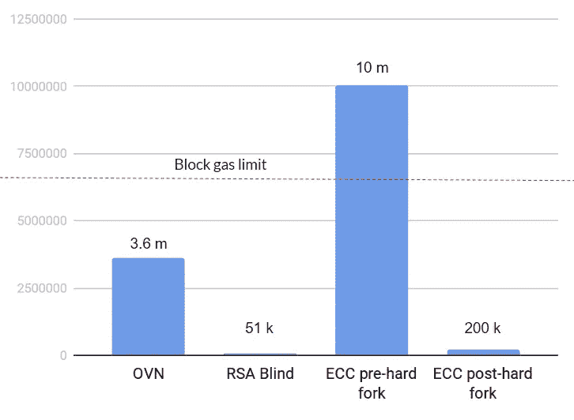
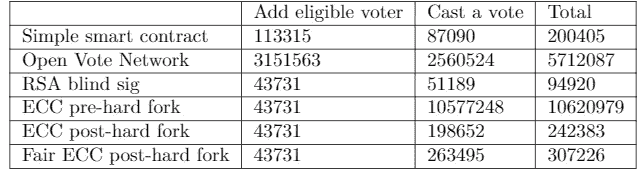

# 在以太坊上实现盲签名的电子投票协议

> 原文：<https://medium.com/coinmonks/implementing-an-e-voting-protocol-with-blind-signatures-on-ethereum-411e88af044a?source=collection_archive---------1----------------------->

[Source](https://www.brennancenter.org/blog/restore-ex-felons-voting-rights-its-right-thing)

在过去的几十年里，电子投票一直是一个非常活跃的研究领域，旨在设计和实现密码协议，以克服传统纸质投票系统的诸多缺点，如缺乏可验证性、易出错和费用高昂。(远程)电子投票系统具有为投票提供信任最小化、环境友好、经济且不易出错的平台的潜力。

在区块链发明之前，电子投票协议[依靠公共公告板](https://www.usenix.org/legacy/event/sec08/tech/full_papers/adida/adida.pdf)来存储人口普查、投票、密码(零知识、洗牌、施诺尔、解密等。)证明等补充资料。公共公告板一般被作为关系数据库实现[，不提供数据完整性和透明性。这意味着这种电子投票平台本质上是集中式系统，其中为了获得某些安全属性(可用性、数据完整性和隐私)，人们需要信任公共公告板。这种集中的故障点可以通过应用区块链作为分散的公共公告板来修正。](https://www.cs.cornell.edu/projects/civitas/papers/clarkson_civitas_tr.pdf)

基于区块链的电子投票协议通过部署区块链作为公告板缓解了上述安全问题；实现数据完整性、透明性、更高的可用性和容错性。然而，这通常会带来[难以承受的计算复杂性](https://eprint.iacr.org/2017/110.pd)和[有限的可扩展性](https://www.dgalindo.es/mscprojects/yifan.pdf)。

**我们的贡献:**我们提出了[协议](https://eprint.iacr.org/2017/1043.pdf)的第一个实用的[可扩展的实现](https://github.com/itblockchain/evoting)，它使用盲签名来验证选票。对实现的安全性进行了分析，并对其执行成本进行了计算分析。我们的实现[在 github](https://github.com/seresistvanandras/evoting) 上公开，人们可以在以太坊的测试网络上查看[合同。](https://rinkeby.etherscan.io/address/0xa87cd09c77b47c8bd0ad4b6b7af0ea9ce735e36b)

## **相关工作**

简单明了的基于区块链的电子投票协议只使用区块链来记录个人投票，并借助智能合约的代码来计算票数。尽管这些解决方案是实用的，并且与区块链本身一样可扩展，但是它们不提供投票保密，而这是一个关键的、基本的属性，而且被宣称是一项人权。

选票保密、自动计票和匿名投票是通过[开放投票网络(OVN)协议](https://pdfs.semanticscholar.org/e57b/12f582b5f18c197965971fb3d4ef6946e10f.pdf)实现的，该协议[由 Patrick McCorry 等人作为以太坊智能契约](https://eprint.iacr.org/2017/110.pdf)首先实现，该协议的主要缺点是投一票的计算成本为 **O(n)** ，其中 **n** 是投票人的数量。这使得该实现基本上不适合于进行具有超过几十个投票者的选举，因为在以太网上，人们只能在新生块中放置有限数量的计算步骤，并且在 cca 之后很快达到该限制。40-50 名选民。该协议的另一个缺点是，最后一个投票者能够在任何人之前计算出最终的计票结果，并据此采取行动(投票或中止)。

Comparing various protocols by crucial (e-)voting related properties

盲签名最早是由大卫·乔姆提出的。在随后的论文中，电子投票已经成为盲签名[应用的主要用例之一](https://people.csail.mit.edu/rivest/voting/papers/Chaum-SecretBallotReceiptsTrueVoterVerifiableElections.pdf)。盲签名是一种在保持匿名性的同时获得投票者授权的稳健解决方案。第一个基于区块链的使用盲签名的电子投票协议[于 2017 年](https://eprint.iacr.org/2017/1043.pdf)提出。作为应用盲签名的结果，该协议提供了投票者(伪)匿名性(伪，因为区块链的性质)，而投票的复杂度是 **O(1)** 。在 2017 年 10 月以太坊协议更新之前，验证盲签名是不实际的。[然而，在更新](https://blog.ethereum.org/2017/10/12/byzantium-hf-announcement/)之后，使用椭圆曲线运算是可行的，允许高效的椭圆曲线数字签名的链上验证。

# 以太坊上的盲签名电子投票协议

盲签名协议允许投票方案将投票与投票人分离，同时仍然保持认证。在讨论其在以太坊上的智能合约实现之前，在此简要回顾一下电子投票协议。

协议中有三种类型的参与者:

***投票者:*** 所有合格投票者的集合。
***组织者:*** 选举组织者的集合，其任务是登记合格的选民，并在整个投票过程中与他们互动(盲签选票)。
***检查员:*** 意在监视组织者行动以限制其权力的一组当事人。他们还与选民互动，潜在地，他们也可以被添加到盲目签名投票。

让爱丽丝做投票人，鲍勃做组织者，卡罗尔做检查员。实施的协议有三个阶段:

***预投票阶段* :** 爱丽丝通过鲍勃提供的渠道将自己注册为合格投票人。注册成功后，鲍勃将爱丽丝放入**选民**组。在这个阶段的最后，公开**表决器**集合以供检查。
***投票阶段:*** Alice 请求组织者和检查员在她的投票上盲签。在收到来自这些政党的盲签名后，Alice 用明文发送她的投票，盲签名来自新生成的区块链地址。
***投票后阶段:*** 协议自计，即一旦所有的选票都投完了，任何人都可以计算出票数。人们需要检查选票上的签名是否经过验证。如果所有的签名都被验证，那么它应该被计算在最后的计数中，否则不算。

**设计选择**

以太坊区块链被选择来实现该协议，因为与比特币相比，它不仅能够存储数据，而且由于其可编程的性质，还能够强制协议的正确执行。选举智能契约用于促进协议的进行。源代码可在[这里](https://github.com/itblockchain/evoting)获得。

盲签名的发布不能发生在以太坊智能合同中，因为为了计算盲签名，管理员和组织者需要提供他们的私钥。由于 EVM 执行环境的透明性质，这些政党在不暴露他们的私人签名密钥的情况下不能签署选票。因此，只能在链上执行签名验证。

## 以太坊上的盲签名验证

在将每张选票计入最终计票之前，选举智能合同会验证盲签名。当且仅当选票上的盲签被验证时，选票才会被包括在最终计票中。

可以使用几种算法来实现盲签名。第一个也是最明显的选择是使用 RSA 盲签名。由于 EVM 的最大字长是 256 位，并且目前没有任何安全、快速和成本有效的方法来在 EVM 上使用更大的整数，因此需要使用 256 位长的盲签名，这显然是不安全的。

Approximate gas consumption of verifying one vote for OVN and for various algorithms using blind signatures

使用椭圆曲线密码(ECC)的盲签名在密钥长度上更紧凑，因此即使在像 EVM 这样的受限环境中，它们也能提供足够的安全级别。这就是我们使用[ECC 盲签名方案](http://www.isecure-journal.com/article_39171_47f9ec605dd3918c2793565ec21fcd7a.pdf)的动机。然而，在以太坊网络范围的协议升级之前，不支持验证 ECC 盲签名，这意味着需要使用外部库——如[这个](https://github.com/androlo/standard-contracts)——来使用椭圆曲线运算。从上图中可以看出，在协议升级(硬分叉)之前，即使验证一个 ECC 盲签名的成本也将超过 block gas 限制，这意味着此类事务将总是被抛出气体不足错误 ie。它绝不会在以太坊区块链留下任何状态变化。

由于拜占庭硬分叉椭圆曲线点加法和标量乘法在 EVM 中得到本地支持，这也意味着此类操作消耗的气体比硬分叉之前少得多。这个协议的改变使得我们的实现变得可行。为了客观地看待问题，可以查看上图，该图显示了使用以太坊智能合同实现开放式投票网络协议进行投票的气体成本。

Gas costs of different blockchain-based e-voting protocols for casting a vote for an eligible voter (numbers denote the amount of gas while registering a voter or casing a vote)

以太坊基金会开发的一个简单的智能合同解决方案几乎是投票中最具成本效益的，然而，它不提供投票保密，这意味着任何人都将知道所有其他人是如何投票的。所有其余的协议提供了投票保密，这显然是以计算成本为代价的。如果注册和投票在同一个街区进行，开放投票网络几乎可以避免街区气体限制。RSA 盲签名是使用盲签名的协议中最快的，尽管它不提供任何有意义的安全级别。拜占庭硬叉子确实是实现协议所必需的。最初的[协议](https://eprint.iacr.org/2017/1043.pdf)不能保证公平性，但是可以通过额外的提交和揭示回合来实现。可以看出，这些额外的回合使得电子投票方案的成本效益稍低。

## 证券分析

因此，我们的实现是从安全的角度来分析的。我们假设在管理者和投票者之间存在一个安全的通信通道。此外，调查客户端问题和漏洞超出了本文的范围。

**人口普查**
目前，合格选民的名单由选举管理员维护。选举管理员可以从合格选民列表中添加和删除选民。这使得当前的人口普查机制完全依赖于管理者的仁慈。
这种设计缺陷可以通过使用某种形式的自我认证来缓解。在像爱沙尼亚或马耳他这样的国家，已经给出并部署了电子身份，该电子身份可用于让用户以分散的方式认证自己，而不依赖于任何中央方。集成这样的电子身份解决方案是留给未来的工作。

**审查阻力**
选举管理员可以拒绝签署被蒙蔽的选票，或者她可以只出示一个无效的签名。这种情况可能会有所改善，办法是不仅让一个实体签署选票，而是允许多个政党作为选举组织者参与。
一种完全分散的方式是将该功能委托给选举智能合同。然而，这是完全不可行的，因为智能合同是完全透明的，因此它们不能保存私有数据，如用于签名的私钥。

**ECC 盲签名**
盲签名方案的安全性取决于 altBN128 椭圆曲线群中离散对数问题的求解难度。

**公平性**
所提出的协议不保证公平性，尽管这可以通过使用提交方案(例如，Pedersen 提交方案)添加额外的提交-揭示阶段来解决。然而，正如前面指出的，这恶化了平台的可用性和计算复杂性。

**可证实性**
E2E 的、个体的和普遍的可证实性是由区块链的本性和透明性来实现的。投票人可以通过检查包含其投票的事务是否包含在区块链中，以及它是否被成功挖掘和执行，来验证其投票是否包含在计数中。同样，选民可以检查所有其他交易的有效性，也就是说，他们越来越确定整个选举是以安全和诚实的方式进行的。

双重投票，假票
如果一个人能够让选举管理员妥协并得到她的签名密钥，就可能产生双重投票或假票。同样，如果部署一名以上的选举管理员，这一弱点可能会有所缓解。这一修改要求在一次投票中有多个签名。

如果离散对数假设被打破，那么基本上任何人都能够在任何投票中创建有效的签名，不管部署了多少选举管理员。

**定时攻击**
选民匿名可能会受到定时攻击的危害。如果在签名生成和投票之间只有很少或没有投票人投票，则可以将投票与投票人身份联系起来。投票者的匿名集合本质上是在以太坊交易中投票的区块中的投票数。匿名性可以通过盲签名后随机投票来加强。这种随机延迟功能应该在客户端开发。

**选票冲突**
只有当两张选票具有相同的选择代码和签名时，才有可能发生选票冲突。这种可能性微乎其微。

**网络分析**
人们可以分析网络并揭示哪个 IP 地址(真实世界的物理身份)属于哪个以太坊地址。应该提示用户使用匿名服务，如代理或 TOR，这可以使用户隐藏他们的 IP 地址。

**网络攻击**矿商也可能通过不包括针对选举智能合同的交易来损害选举。

**合意算法**
如果一个人希望使用私有/许可的区块链，她必须决定她想要使用哪种合意算法。一个直接的选择是部署一个权威证明共识算法，然而，所部署的区块链的不可信任的本质是承认的。在这种情况下，信任分散在被授权签署块的各方中。

## 结论

在此提出了一个以太坊智能合同，作为一个具有盲签名的[电子投票协议](https://eprint.iacr.org/2017/1043.pdf)的实现。不同的盲签名算法已经过测试，以选择最适合我们的电子投票平台。对我们的实现进行了安全性分析和计算成本分析。通过在以太坊 Rinkeby 测试网络上模拟选举，展示了我们的智能契约实现的实用性和可扩展性。

如果你想了解更多关于我即将开展的区块链相关项目，请关注我的 [Medium](/@Istvan_A_Seres) 或 [Twitter](https://twitter.com/Istvan_A_Seres) 。争取更多，保持#buidl！