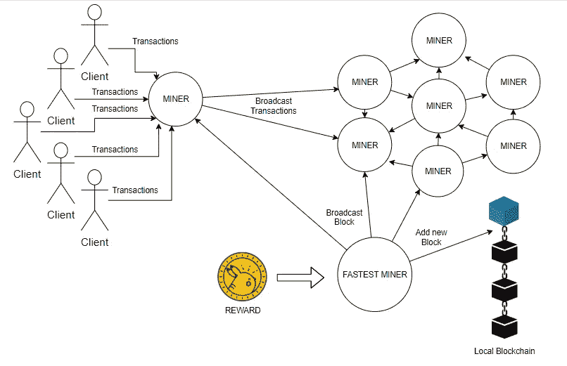

# 第 1 部分:用 PoW 共识算法实现区块链和加密货币

> 原文：<https://medium.com/coinmonks/implementing-blockchain-and-cryptocurrency-with-pow-consensus-algorithm-part-1-545fb32be0c2?source=collection_archive---------0----------------------->

在 node.js 中使用工作共识算法证明，小规模、易于理解、全面、逐步实施区块链和加密货币


Source: [Bitcoin Wiki](https://en.bitcoinwiki.org/wiki/Proof-of-work)

# 工作证明

工作证明(PoW)是区块链共识算法，由中本聪在 2009 年应用。最早被比特币使用，后来被以太坊采用。

为了向区块链添加新区块，需要一种算法来决定哪个采矿者能够向区块链添加区块。因此，这是战俘事务的首要目标。

> [发现并回顾最佳加密软件](https://coincodecap.com)

# 工作

在 PoW 中，挖掘器需要投入大量的计算能力，以便找到与给定的约束集匹配的散列串。在比特币中，矿工需要找到一个散列，以便在散列的开头有一些已知数量的前导零。一个挖掘器通过改变一个数字不断地发现一个块的新散列值，这个数字与块一起被散列，称为 nonce。计算哈希值中前导零的个数称为难点。这是块生成中如此长延迟的原因。

考虑这个简单的例子:

```
let block = {"random":"data"};
let nonce = 1;
let difficulty = 5;let blockHash = hash( block,nonce,difficulty );
//blockHash = 6B86B273FF34FCE19D6B804EFF5A3F5747ADA4EAA22F1D49C01E52DDB7875B4B
```

由于 blockHash 不遵循约束，挖掘器将递增 nonce 并重试。矿工必须这样做，直到它收到这样的东西:

```
00000273FF34FCE19D6B804EFF5A3F5747ADA4EAA22F1D49C01E52DDB7875B4B
```

此外，不仅仅是一个矿工，而是网络上的每个矿工在同一块上运行相同的算法。这就创造了一个竞争环境，每个矿工都在相互竞争。找到满足给定约束的散列值的第一个矿工赢得这一轮并成为这一轮的领导者。然后，它在用其私钥对其签名后添加该块，并将其广播到网络。其他挖掘器将接收到的块添加到本地链中。

对于完成这种计算量大的任务，矿工会得到奖励。以比特币为例，矿工会收到一定数量的比特币，以及他们刚刚添加到区块链的区块中存在的所有交易的交易费。

# 优势

> [其主要优势——免受 Ddos 攻击，以及矿工拥有的加密货币在提取能力方面的低份额影响。](https://en.bitcoinwiki.org/wiki/Proof-of-work#The_advantages_of_PoW)

由于计算能力非常昂贵，有效攻击也需要类似的处理能力。对攻击者来说，与整个网络竞争在经济上是不可行的。攻击者会逐渐耗尽现金来资助自己的攻击。

# 不足之处

权力一个主要缺点也是它的优点。运行这个算法的巨大成本。欲知耗电多少，读功耗比较[阐述这个问题的文章](https://powercompare.co.uk/bitcoin/)。

> 比特币采矿现在使用的电力超过了 159 个国家

其次，比特币并不完全安全，PoW 也不是应对所有攻击的灵丹妙药。 [51%攻击](https://hackernoon.com/what-is-a-51-attack-or-double-spend-attack-aa108db63474)是一种场景，在这种场景中，攻击者可能获得超过整个网络 51%的计算能力，然后攻击者可以成功篡改区块链。

# 结构

让我们通过这个图表来理解 PoW 算法的结构:



Structure of Proof of Work Consensus Algorithm

# 设计

在我们开始编码之前，让我们分析一下我们必须做什么。

以下是我们根据上述概述在代码中创建的类:

1.  块类
2.  区块链类
3.  交易类别
4.  钱包类
5.  P2P 服务器类
6.  矿工阶级

稍后我们会添加更多，但这些看起来很好，以便更好地理解。我们继续吧。

[第二部分:用 PoW 共识算法实现区块链和加密货币](/coinmonks/implementing-blockchain-and-cryptocurrency-with-pow-consensus-algorithm-in-node-js-part-2-4524d0bf36a1)

*感谢您的阅读。* ***在下一部分，我们将开始编写一些代码。*** *希望你喜欢这个简短的介绍。如果你发现这很有帮助，请鼓掌。*

如果你对区块链、以太坊或整个世界有任何问题，请发表评论。:)

[](http://bit.ly/2G71Sp7)

> [直接在您的收件箱中获得最佳软件交易](https://coincodecap.com/?utm_source=coinmonks)

[](https://coincodecap.com/?utm_source=coinmonks)