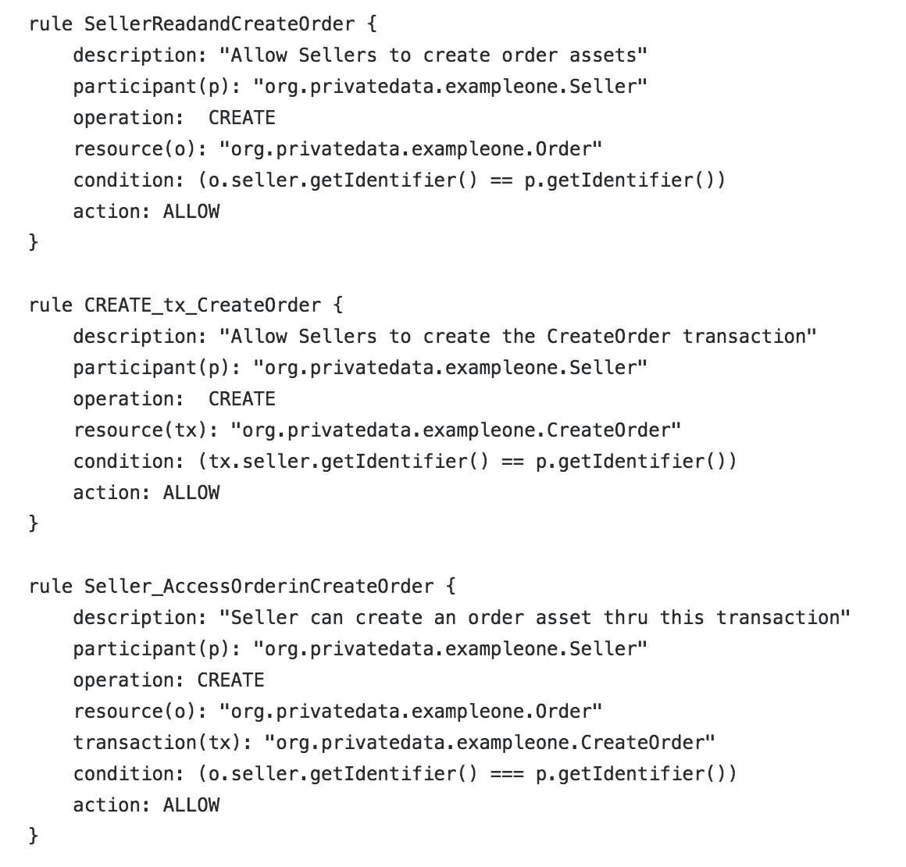

# 在 Hyperledger Composer 中实施数据私有化

> 原文：<https://medium.com/coinmonks/implementing-data-privatization-within-hyperledger-composer-2bc99a11c344?source=collection_archive---------1----------------------->

虽然 Hyperledger 区块链网络的一些最重要的功能是透明和信任，但在业务情况下，有时仍然需要数据隐私。

有几种方法可以考虑数据隐私和机密性。根据您的网络架构，您可能希望使用[通道](https://hyperledger-fabric.readthedocs.io/en/release-1.1/channels.html)并最终使用[集合](https://hyperledger-fabric.readthedocs.io/en/release-1.2/private-data/private-data.html)在 Hyperledger 结构级别解决这个问题。在本文中，我们将使用 Hyperledger Composer 在业务网络设计的更高层次上解决这个问题。

考虑这样的情况，不同的参与者需要访问在他们的业务关系中交换/管理的部分私有化的数据。例如，在供应链管理系统中，让我们假设买方和卖方是同一组织的一部分，并且在 Hyperledger Composer 模型中被表示为业务网络定义中的不同参与者。在这个场景中，买方向卖方下订单购买商品。在订单中，可能会有只有卖家可以更新和查看的信息，比如批发价、支付信息、可用性、库存等。还可能存在双方都应该有权访问的公共数据，如零售价格、订单 id、跟踪号、客户地址。

Hyperledger Composer 提供的好处之一是简单的建模来定义访问控制规则，以管理已定义的资产、参与者和事务。访问控制语法允许针对整个资产和/或交易功能定义规则。目前，无法针对资产中的特定数据字段定义规则。那么，除了在应用程序级别限制对资产数据的访问，我们如何在网络级别限制访问呢？

基本上，有两种不同的方法:

**方法#1** :限制对资产的完全访问(在这种情况下是*订单*)，但是提供明确的用户定义的事务函数和对那些函数的访问控制规则，允许对资产内的单个数据字段进行有限的访问。

这个例子的代码位于[这里](https://github.com/annumberhocker/hlc_confidentiality_ex/tree/master/private-data-example1)。

注意 [permissions.acl](https://github.com/annumberhocker/hlc_confidentiality_ex/blob/master/private-data-example1/permissions.acl) 文件中的规则。给予*订单*资产的唯一访问权是在 *CreateOrder* 交易功能内创建它的能力:

因此，对*订单*资产的各个字段的访问是通过交易处理器功能进行的，例如:

要了解数据私有化的实际情况:

1)调用在线[Hyperledger Composer Playground](https://composer-playground.mybluemix.net/login)。
2)“部署新的业务网络”
3)选择“放在这里上传或浏览”并选择[private-data-example 1 @ 0 . 0 . 1 . bna](https://github.com/annumberhocker/hlc_confidentiality_ex/blob/master/private-data-example1/private-data-example1%400.0.1.bna)。
4)“部署变更”。
5)选择“测试”标签。
6)创建一个*买方*和一个*卖方*参与者。
7)为*买方*和*卖方*创建 id。为此，请参见[创建商务名片](https://hyperledger.github.io/composer/latest/playground/id-cards-playground)。
8)切换到*卖家* id。
9)作为*卖家*，提交 *CreateOrder* 交易函数。
注意:您需要切换回管理员 id 来查看新的*订单*资产，因为*买方*和*卖方*都没有实际*订单*资产的读取权限。
10)*卖方*可以使用*更新订单价格*、*更新订单买方信息*和*更新订单卖方信息*交易函数来更新*订单*资产上的买方信息、卖方信息和价格。
11)切换到*买家* id，尝试一个 *UpdateOrderBuyerInfo* 交易。*买方*只能更新*订单*资产的买方信息。

这种方法的一个问题是查询无法从私有化的资产中获取信息。查询受访问控制规则的约束(见[查询](https://hyperledger.github.io/composer/latest/business-network/query.html))，在这种情况下，不允许对私有资产进行直接访问。事件可用于获取数据，如我们在模型中所示(参见[org . privatedata . example one . CTO](https://github.com/annumberhocker/hlc_confidentiality_ex/blob/master/private-data-example1/models/org.privatedata.exampleone.cto)和 [logic.js](https://github.com/annumberhocker/hlc_confidentiality_ex/blob/master/private-data-example1/lib/logic.js) 文件)。然而，一旦事件被生成，并且应用程序被设置为订阅它们(参见[事件](https://hyperledger.github.io/composer/latest/applications/subscribing-to-events.html))，应用程序就可以获得它所知道的任何事件，从而获得对有效负载的访问。

在这个例子中，我们只演示了从一个*卖方*许可的交易函数中发出事件。为了便于讨论，我们将说，我们发布这些事件只是为了让*销售者*授权的应用程序功能接收这些事件并对其进行操作。

**方法#2** :将私有数据抽象成它自己的资产，并控制对私有数据资产本身的访问。

这个例子的代码位于[这里](https://github.com/annumberhocker/hlc_confidentiality_ex/tree/master/private-data-example2)。

在这里，我们将*订单*资产中的私有数据分离出来，放在[org . privatedata . example two . CTO](https://github.com/annumberhocker/hlc_confidentiality_ex/blob/master/private-data-example2/models/org.privatedata.exampletwo.cto)文件中它自己的 *OrderSellerInfo* 资产中:

允许销售者访问私有数据资产的访问控制规则如下:

要查看本例中的数据私有化:

1)调用在线[Hyperledger Composer Playground](https://composer-playground.mybluemix.net/login)。
2)“部署新业务网络”
3)选择“拖放到此处上传或浏览”，选择[private-data-example 2 @ 0 . 0 . 1 . bna](https://github.com/annumberhocker/hlc_confidentiality_ex/blob/master/private-data-example2/private-data-example2%400.0.1.bna)
4)“部署变更”。
5)选择“测试”选项卡。
6)创建一个*买方*和一个*卖方*参与者。
7)为*买方*和*卖方*创建 id。为此，请参见[创建商务名片](https://hyperledger.github.io/composer/latest/playground/id-cards-playground)。8)切换到*卖家* id。
9)作为*卖家*，提交 *CreateOrder* 交易功能。注意:将创建一个*订单*资产和一个 *OrderSellerInfo* 资产。*卖家*可以看到两者。
10)作为*卖方*，调用 *CreateOrder* 交易函数。
11)更改为*买方*身份，您将只能看到*订单*资产。
12)*卖方*可以使用 *UpdateOrderBuyerInfo* 和 *UpdateOrderSellerInfo* 交易函数更新*订单*资产上的 buyerInfo 和 sellerInfo。
13)*采购员*只能更新*订单*资产上的采购员信息。

为了完成这个例子，可以将一个. qry 文件添加到模型中(参见 [queries.qry](https://github.com/annumberhocker/hlc_confidentiality_ex/blob/master/private-data-example2/queries.qry) )来定义针对私有化资产的查询，并且可以添加一个事务函数来包含调用已经定义的查询的代码，以访问私有化资产数据。或者可以直接从客户端应用程序调用查询。更多信息参见[查询教程](https://hyperledger.github.io/composer/latest/tutorials/queries)和[查询语言参考文档](https://hyperledger.github.io/composer/latest/api/client-businessnetworkconnection#buildquery)。

总之，Hyperledger 的灵活性提供了在结构级别(参见[教程](https://hyperledger-fabric.readthedocs.io/en/release-1.2/private_data_tutorial.html)了解使用集合，1.2 版中的新功能)和组合器/智能合约级别解决数据隐私需求的机制，如本文所示。快乐区块链。