# 实现 Merkle 树和 Patricia Trie

> 原文：<https://medium.com/coinmonks/implementing-merkle-tree-and-patricia-trie-b8badd6d9591?source=collection_archive---------0----------------------->

## 本文涵盖了 Merkle Tree 和 Patricia Trie 在 Node.js 中的实现，还涵盖了这两种数据结构的一些理论方面。


Photo by [Jeremy Bishop](https://unsplash.com/@jeremybishop?utm_source=unsplash&utm_medium=referral&utm_content=creditCopyText) on [Unsplash](https://unsplash.com/s/photos/tree?utm_source=unsplash&utm_medium=referral&utm_content=creditCopyText)

# 介绍

Merkle 和 Patricia 是以太坊区块链中最常用的两种数据结构，布隆过滤器紧随其后。在这篇文章中，我将涵盖以下内容:

1.  关于默克尔树和帕特里夏尝试
2.  算法
3.  Node.js 中的实现

# 默克尔树

默克尔树不是计算机科学中的新概念，它已经存在了几十年，起源于密码学领域。

简而言之，默克尔树本质上是一种树数据结构，其中数据存储在叶节点中，非叶节点存储数据的散列，每个非叶节点是其下两个节点的组合散列值。

数学上，它可以表示为

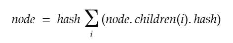

Computing the value of each node in a Merkel Tree

**例如:**给定一个字母表，从中创建一个默克尔树。

树的最底层将包含所有字母作为叶节点。

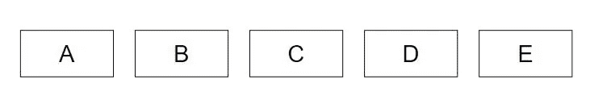

Lowest layer of the tree would contain the data in each node

上面的层包含它的哈希值。

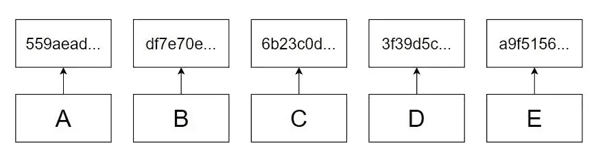

The layer above the leaf node has the hash values of leaf node data

第二层之后的层中的节点包含子节点的哈希值。通常，我们从第二层中取出两个节点，并将它们组合起来形成另一个节点。我们也可以采用两个以上的节点，但二进制默克尔树是其中最简单的，增加节点的度数只会增加计算和算法的复杂性。

如果我们有偶数个节点，我们取 2 个连续的节点并形成父层。但是如果我们有奇数个节点，我们取两个连续的节点，直到剩下一个来形成父层，然后我们通过将散列复制到父层来重复剩余的节点。

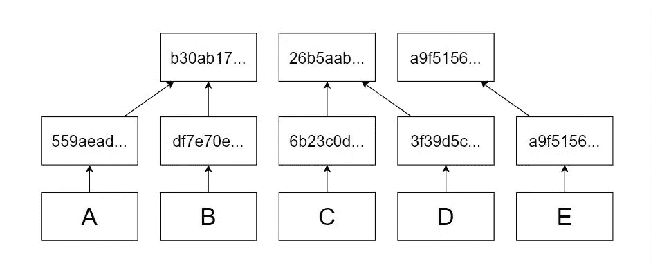

Layer 3 has the hash of the values of the 2 consecutive nodes of layer 2 and in case we have odd nodes in a layer the last node is repeated

类似地，使用第三层的值形成第四层。

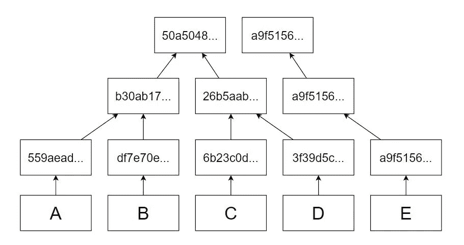

The fourth layer is formed by the hash of the values of the 2 consecutive nodes of layer 2

最后一层或 Merkel 树的根由最顶层剩余的最后两个节点的散列值形成。在任何情况下，奇数或偶数叶节点，我们总是在最顶层有两个节点。

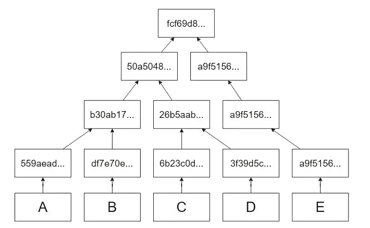

Merkel Tree formed by the five letters

## 确认

默克尔树的重要性在于其高效验证数据的能力。给定列表中的任何数据，我们可以在 *O(h)* 时间复杂度中验证该数据是否有效。此外，我们不需要整个名单来核实。

默克尔树的一种更简单的形式是散列链或简单的[区块链](https://blog.coincodecap.com/tag/blockchain/)，其中每个节点都有前一个节点值的散列。如果我们篡改中间的任何节点，我们可以在 *O(n)* 时间内识别该节点是否被篡改。哈希链中的验证可以通过计算所有节点的哈希来执行，从所讨论的节点开始，直到结束。在需要验证多个节点的情况下，我们从所有可疑节点中第一个节点开始，然后计算最后一个节点的哈希。现在我们有了最后一个节点的散列，我们可以比较并检查这个散列是否匹配。散列链看起来很简单，但对于大型数据对象来说并不是一个有效的选择。因为我们需要整个链实际存在来验证数据，这也使得散列链空间效率低下。

默克尔树中的验证却不是这样。为了说明验证过程，考虑下面的例子。

*假设我从另一台服务器收到一个数据 C。假设这是 C。我们想验证 C '没有被篡改。我们拥有列表中所有数据的默克尔树。*

在散列链的情况下，我们需要整个数据列表来验证 C '是正确的。在默克尔树中，我们只需要哈希值。下图说明了在没有其他可用数据对象情况下，我们如何验证 C'。

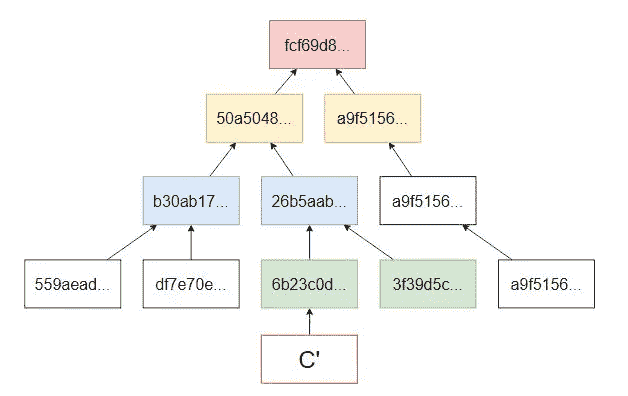

Verifying C’ by hashing all the nodes that lead us to the root

1.  找到 C '在列表中的位置。大概是通过 id 搜索。
2.  计算 C '的散列值
3.  通过将当前节点与其邻居(如果位置为奇数，则为下一个，如果位置为偶数，则为上一个)进行哈希运算来计算父节点的值，并将父节点设置为当前节点。
4.  重复步骤 3，直到我们找到根
5.  将该根与前一根进行比较，如果它们匹配，则 C '

将新根与现有根进行比较。如果新的根匹配，那么 C '本质上是 C，没有被篡改。

为了验证哈希链中的数据，我们需要 *O(n)* 时间，因为我们将在最坏的情况下计算 *n* 个哈希，而在默克尔树的情况下，相同的数据可以在 *O(logn)* 时间内验证，因为我们只计算 *logn* 个哈希。

## 算法

本节以数学形式描述了用于在默克尔树中创建和验证的算法。

**创作**

如前所述，默克尔树是通过从每层取两个节点并散列它们以创建父节点来创建的。通过以矩阵形式表示该树，我们可以用数学方法将其写为:

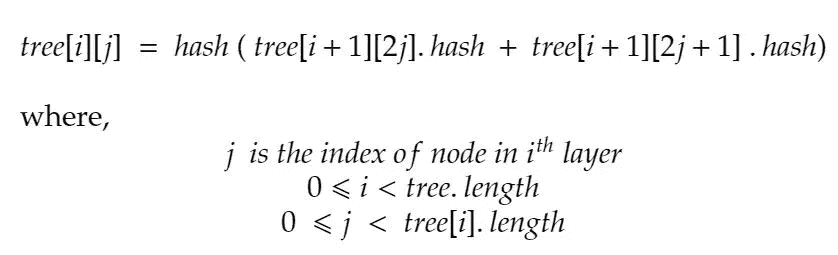

*这使得树根在树[0][0]* 处可用

**验证**

验证是一种自下而上的方法，我们从数据开始，找到它的哈希，计算父项，并继续下去，直到找到根。数学上，我们可以表达如下:

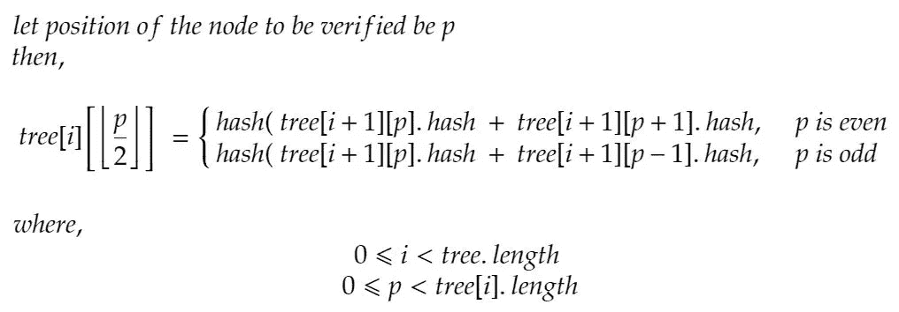

## **实施**

我们将在 Node.js 中实现一个默克尔树

**先决条件**

1.  节点. js
2.  VS 代码
3.  咖啡

**代码**

创建您的项目目录并放入 cd。

```
mkdir merkel-and-patricia && cd merkel-and-patricia
```

打开此目录中的 VS 代码

```
code .
```

在实现我们的之前，我们需要创建一个函数来散列数据。因此，创建一个名为`helper.js`的文件，并在其中包含以下代码。

我们将使用这个文件在项目的其余部分散列我们的数据。接下来，我们将创建我们的事务类。

事务类将包含以下属性:

1.  到
2.  从
3.  数量
4.  身份证明（identification）
5.  混杂

创建一个文件`Transaction.js`，并在其中添加以下代码。

**待办事项**:交易类

函数`getCount`和`incrementCount`用于为交易提供一个 id。*你可以用 uuids 来代替这个。*

为了存储所有的事务，我们将创建一个包含一系列事务的事务列表类。

创建一个文件`TransactionList.js`，并在其中添加以下代码。

我们有散列函数和数据。让我们实现默克尔树。

创建一个名为`MerkelTree.js`的文件，并创建一个只有属性`root`的 MerkelTree 类，这个属性是保存整个树的矩阵。

在这个类中，创建一个名为`createTree`的方法，它只接受参数 TransactionList 实例，并从中创建一个默克尔树。

`createTree`方法将首先把`transactionList`添加到最底层，事务散列就在它们上面。接下来，它将从最顶层取出两个项目，并将它们散列在一起并保存在临时列表中，直到覆盖了所有项目，如果只剩下一个项目，则将它直接推入临时数组，并将临时列表`temp`添加到`root`的开头。重复该过程，直到根的第一个项目的长度等于 1，这将表明我们已经找到了根散列。

现在我们已经创建了一棵树。让我们编写一个方法来验证事务。

验证将使用上述相同的算法，取相邻节点和要验证的节点，对它们进行哈希运算，然后移至父层，执行相同的操作，但要验证的节点将使用我们之前计算的哈希。

在 merkel 树类中创建一个函数`verfiy`,采用单个参数，一个事务。

我们的 MerkleTree 类完成了。下面是该类的完整代码。

为了测试功能，在根目录中创建一个 js 文件，将其命名为`test.js`，并在其中添加以下代码。

它应该打印以下输出:

```
Element found at: 2
Valid
Element found at: 2
Not Valid
```

您可以取消控制台日志的注释，以打印整个根事务和被篡改的事务。

这就完成了关于默克尔树的部分。下一位是帕特丽夏·特里。

# 帕特丽夏试图

Patricia 树是 n 叉树，与 Merkel 树不同，它用于存储数据而不是验证。

简单地说，Patricia Tries 是一种树形数据结构，其中所有数据都存储在叶节点中，其中每个非叶节点都是标识数据的唯一字符串中的一个字符。使用唯一的字符串，我们通过字符节点导航，最终到达数据。

***Patricia Trie 就像一个散列表，但有一些细微的区别。***

让我们看一个例子。考虑以下词语:

*猫，猫，汽车，狗，狗狗，狗狗，蚂蚁*

存储这些项目的 patricia trie 将如下所示:

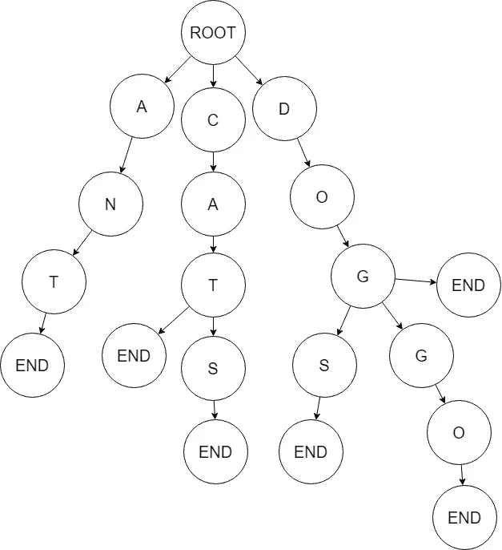

值为 **END** 的节点表示到目前为止遍历的路径实际上是一个单词。那些没有 **END** 子节点的节点表示该单词不存在。

例如，在上图中，单词 **ANT** 出现在 trie 中，因为“T”后面有 **END** 节点。类似地，对于 **CATS** ，结束节点出现在 S 之后，这使得它成为 trie 中的一个单词。有趣的是，如果我们像 CAT 一样在前面放一个 END 节点，我们将有两个单词存储在同一个路径中，但是我们可以通过不遍历到底部并检查 END 是否存在于两者之间来访问 CAT。

狗狗、DOGS 和狗狗也是如此。对于 DOG，我们将只有一个返回值，因为它有一个结束节点。但是如果我们用 DOG 作为前缀搜索 patricia，我们将得到三个返回值。也就是说，这里使用深度优先搜索。

[以太坊](https://blog.coincodecap.com/tag/ethereum/)使用 Patricia tries 来存储块中的交易、交易收据和维护网络状态。

## 储存；储备

对于存储数据对象，我们不需要像单词那样的前缀。由于我们的数据对象要么是事务，要么是块，我们用来在 trie 中存储数据的所有“唯一字符串”都是事务散列或块散列，长度总是相同的，所以我们不需要担心前缀。

如果我们为事务创建一个 Patricia trie，它应该如下所示，尽管要大得多:

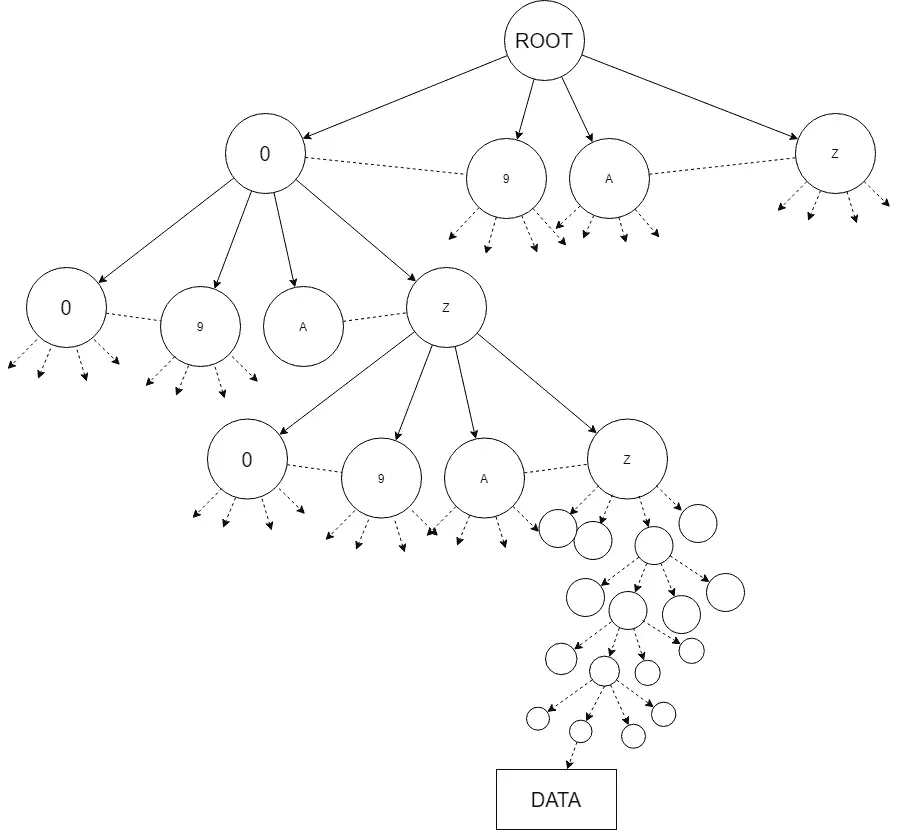

每个事务散列将包含数字或字符(取决于算法)。对于 sha256，我们将使用 32 个字符长的哈希。如果我们假设散列只由 0–9 和 A-Z 组成，那么 patricia trie 中的每个节点将有 35 个子节点。从根开始，我们将向下遍历，同时将每个字符与节点值进行匹配，直到获得事务数据对象为止。

## 算法

我们可以说，trie 中的每个节点本身就是一个哈希表，它将一个字符作为键，将另一个哈希表作为值。所有的操作、插入、删除和访问都需要花费 *O(h)* ，其中 *h* 是哈希的长度或者在我们的例子中是树的深度。

通过使用这个定义，我们可以编写以下算法来将数据存储在 trie 中:

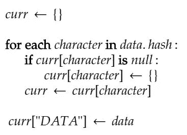

在这个算法中，我们创建一个空的键-值对对象，遍历散列的整个长度，并将每个字符集的值作为一个新的 empyt 键-值对对象。同样，对于每个字符，我们将 curr 映射设置为下一个映射。最后，当我们创建了整个分支后，我们用最后一个节点键“data”来设置最后的数据。

在访问时，我们返回键“数据”的最后一个映射的值，在删除时，我们只删除给定散列的叶节点。

## **实施**

本节提供了在 Node.js 中实现上述 Patricia Trie 算法。创建一个文件`PatriciTrie.js`并在其中添加以下代码。

方法`add, get`和`remove`顾名思义，分别向 trie 树插入事务、从 trie 树访问事务和从 trie 树删除事务。

让我们测试一下这个功能。将以下内容添加到我们之前创建的`test.js`文件中。

运行这个文件，您应该会得到类似于下面的输出:

```
$ node test
Transaction {
  to: 0.01106239432861833,
  from: 0.774577364867872,
  amount: 0.7140173399739937,
  id: 0,
  hash:
   'e4bc0c48be1ad748af6dbc714ddf49d3b76643a491d068a5f1494c84b54971ad' }     
true
null
null
false
```

这就完成了帕特丽夏尝试的部分。

# 延长

您可以通过实现以下内容来进一步扩展此项目:

1.  实施区块链与默克尔树和帕特里夏尝试。
2.  使用 Patricia Trie 实现状态。
3.  在[区块链](https://blog.coincodecap.com/tag/blockchain/)以外的区域测试两种数据结构的工作情况。

在本文中，我们实现了一个在[以太坊](https://blog.coincodecap.com/tag/ethereum/)中使用的基本 Merkel 树和 Patricia Trie。**文章的代码可以在我的** [**github 资源库**](https://github.com/kashishkhullar/merkel-and-patricia) **中找到。**

*感谢您阅读本文。如果你对这篇文章有任何问题，请留下评论，如果你喜欢它，请鼓掌。*

[](https://coincodecap.com)

> [在您的收件箱中直接获得最佳软件交易](https://coincodecap.com/?utm_source=coinmonks)

[](https://coincodecap.com/?utm_source=coinmonks)