# 在区块链中实现 PBFT

> 原文：<https://medium.com/coinmonks/implementing-pbft-in-blockchain-12368c6c9548?source=collection_archive---------0----------------------->

在本文中，我们将了解区块链系统中实用拜占庭容错的工作原理、该算法背后的数学原理及其意义，编写其伪代码，然后在 node.js 中实现它


Source: [Unsplash](https://unsplash.com/photos/_d0zgyMmYT8)

声明者:这篇文章不是关于区块链的教程。假设读者对区块链/比特币有足够的了解。

***在谈论 PBFT 之前，让我们先了解一些围绕它的术语。***

# 容错和容错系统

想象一下，你的汽车的发动机发生了故障，但它仍然工作，然而，汽车的速度大大降低了，我们称之为容错汽车，它表现出容错特性。

> 任何系统在未知或已知故障的影响下继续运行，导致系统容量降低，可以称为容错系统，它表现出容错特性。

与其他系统不同，容错系统在故障发生时不会崩溃，相反，即使存在故障，系统也能运行，但吞吐量降低或等待时间延长。

# 拜占庭容错

拜占庭故障尤其存在于分布式系统中。这些故障是系统节点间错误信息的结果。分布式系统的成员大多不知道这些故障/错误信息的原因。因此，在这种情况下，节点可能行为异常，并向网络中的不同节点发送不同的响应，结果，很难将该节点分类为恶意或有故障的。因此，为了做出关于故障节点的决定，系统的诚实节点达成共识，并且可以得出不受恶意/故障节点影响的结论的系统可以被认为是拜占庭容错系统。

> 展现拜占庭容错的系统解决了[拜占庭将军问题](/all-things-ledger/the-byzantine-generals-problem-168553f31480)中提出的问题。

拜占庭容错不是识别有故障的/恶意的并找出问题，而是继续等同于当系统中没有成员有故障时的情况运行。(*吞吐量和效率会因此降低)*

让我们潜入 PBFT。

# 实用拜占庭容错

[Castro 和 Liskov](http://pmg.csail.mit.edu/papers/osdi99.pdf) 开发了一种在分布式系统中实现一致性的新方法，该方法可以通过复制节点/状态机来容忍故障/恶意节点。但是 PBFT 只能容忍这样的节点，直到故障节点的数量少于所有节点的三分之一。网络中的节点通过在彼此之间传递关于决策的消息来达成关于决策的共识。诚实节点越多，系统越安全。由于同意正确决策的诚实节点的数量多于同意错误决策的错误/恶意节点的数量，所以错误信息将被大多数拒绝。

> 为了保持系统安全，pbft 需要系统中有 3f+1 个节点，其中 f 是系统可以容忍的故障节点的最大数量。因此，对于要做出任何决定的节点组，需要来自 2f+1 节点的批准。


Photo by Adam Kool

# 区块链中的 PBFT

区块链的实用拜占庭容错算法继承了分布式系统中的许多概念。在这种情况下，达成共识以决定块的有效性。

系统中的节点在彼此之间共享消息，以将块提交给链。在这种情况下，恶意节点可能会广播被篡改的块，因此，被最大数量的节点视为有效的块被整个网络视为整体有效。

## PBFT 的意义

在比特币(工作证明)中，大宗提议者是最快的矿工，而在股权证明中，大宗提议者是最富有的矿工。在 PBFT，区块创建者可能不是任何特殊的采矿者，但提交给链的提议区块将是最同意的区块。从而达到与 PoW 和 PoS 相同的目的，即将一个新的块添加到链中。

## 状态和消息

本节描述了不同会话中每个节点的各种状态，以及在任何一轮数据块建议期间节点之间传递的不同消息:

*   `NEW ROUND`:提议人发送新的整体提议。验证器等待`PRE-PREPARE`消息。
*   `PRE-PREPARED`:验证器收到`PRE-PREPARE`消息，广播`PREPARE`消息。然后等待`PREPARE`或`COMMIT`消息中的`2F + 1`。
*   `PREPARED`:验证器接收到`PREPARE`条消息中的`2F + 1`条，并广播`COMMIT`条消息。然后等待`COMMIT`消息中的`2F + 1`。
*   `COMMITTED`:验证器已经接收到`COMMIT`消息的`2F + 1`，并且能够将建议的块插入到区块链中。
*   `FINAL COMMITTED`:新块成功插入区块链，验证机准备好下一轮。
*   `ROUND CHANGE`:验证器正在等待同一个建议轮数上的`ROUND CHANGE`条消息中的`2F + 1`

*注:这些状态已从 GitHub 上的本* [*期*](https://github.com/ethereum/EIPs/issues/650) *中引用。*

## 算法

`NEW ROUND`

*   提名者以循环方式选出。
*   提议者从事务池中收集事务。
*   提议者创建一个块提议并将其广播到网络。提议者的状态现在变为`PRE-PERPARED`状态。
*   验证器接收到`PRE-PREPARE`消息并进入`PRE-PREPARED`状态。
*   验证器现在验证提议，然后向其他验证器广播一条`PREPARE`消息。

`PRE-PREPARED`

*   验证器等待`2F+1`有效的`PREPARE`消息，然后进入`PREPARED`状态。
*   验证器现在在进入`PREPAPRED`状态时广播`COMMIT`消息。

`PREPARED`

*   验证器等待`2F+1`提交消息，然后进入`COMMITTED`状态。

`COMMITTED`

*   验证器将收到的`2F+1`提交消息添加到块中，并将该块添加到区块链中。
*   当块被插入到链中时，验证器现在移动一个`FINAL COMMITED`状态

`FINAL COMMITTED`

*   新的一轮开始了新的提议者选举。

## 伪代码

本节介绍上述算法的伪代码:

```
// NEW_ROUND:State = NEW_ROUND
proposer = get_proposers_address( blockchain )
if ( current_validator == proposer )
    block = create_block( transaction_pool )
    broadcast_block( block )
    State = PRE_PREPARED// PRE_PREPARED:ON message.type == PRE_PREPARE
    verify_block( message.block )
    verify_validator( message.block )
    broadcast_prepare( message.block )
    State = PREPARED// PREPARED:ON message.type == PREPARE
    verify_prepare( message.prepare )
    verify_validator( message.prepare )
    prepare_pool.add( message.prepare )if ( prepare_pool.length > 2F+1 )
        broadcast_commit( message.prepare )

    State = COMMITTED// COMMITTED:ON message.type == COMMIT
    verify_commit( message.commit )
    verify_validator( message.commit )
    commit_pool.add( message.commit )if ( commit_pool.length > 2F+1 )
        commit_list = commit_pool.get_commits()
        block.append( commit_list )
        blockchain.append( block )

    State = FINAL_COMMITTED// FINAL_COMMITTED:new_round()
```


Photo by Luca Bravo

## 图解说明

为了更好地理解，本节将图解说明该算法:

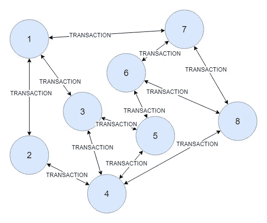

Before a new round begins, transactions are broadcasted among nodes so that all the nodes have the same transactions in their pool. After a sufficient number of transactions in their pool, these nodes start a new round.

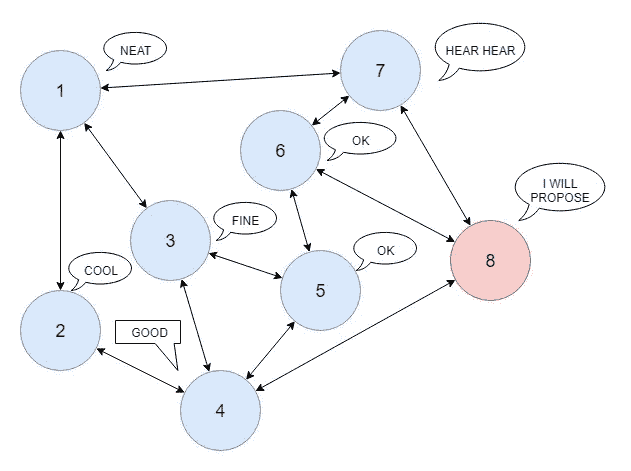

A proposer is chosen in a round-robin fashion. Node 8 becomes the proposer and rest of the nodes agree upon on it. The proposer sends a PRE-PREPARE message and each node enters PRE-PREPARED state.

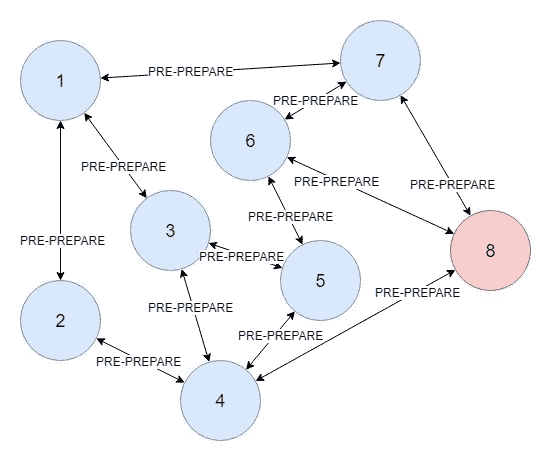

The proposer broadcasted a PRE-PREPARE message, which contains a proposed block. The rest of the nodes broadcast this message to other nodes.

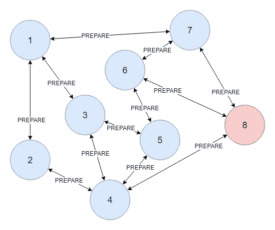

Each node sends a PREPARE message if they agree upon the proposed block. After 2F+1 such messages, nodes change state to PREPARED.

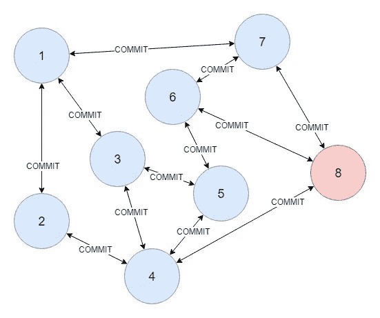

Prepared nodes send COMMIT messages to each other, upon 2F+1 commits, nodes move to COMMIT state and add the block to the chain. After adding the block they move to the FINAL COMMITTED state.

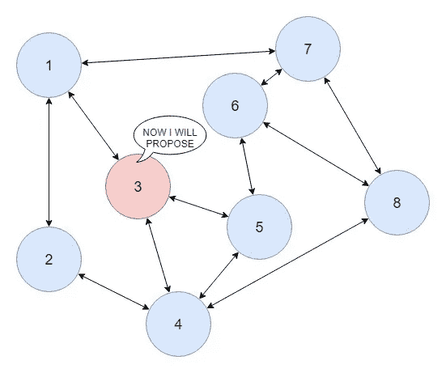

After FINAL COMMITTED, nodes calculate a new proposer.

# PBFT 的数学证明

> 在实际的拜占庭容错中，如果 N=3F+1，一个 N 节点系统可以容忍 F 个故障节点。
> 
> 在一个实际的拜占庭容错系统中，每个决策都需要 2F+1 批准，其中包括故障节点。


Photo by Aaron Burden

我们现在将从数学上证明上述两个定义，它们是互为因果的。下面的计算是斯坦福大学[笔记](http://www.scs.stanford.edu/14au-cs244b/notes/pbft.txt)中的数学简化。

> 分布式系统的两个重要特性是活性和安全性。

## 活性

当系统继续运行时，活跃度是在分布式系统的上下文中使用的术语。这意味着即使出现一些错误，系统也不会停止运行，并且会正常工作。在区块链的情况下，活性意味着系统将继续向链中添加新的数据块，并且系统在任何时间点都不会停止工作。

## 安全

当系统收敛于单个决策时，安全是在分布式系统的上下文中使用的术语。在分布式系统中，节点可能会分成两个决策或进一步分裂，分布式系统的安全性确保了即使存在故障节点，网络也会以跨所有诚实节点的单个决策结束。

## 证明

**非拜占庭式的失败**

*给定网络中的* ***N*** *个节点，有* ***f*** *个故障节点，保证活跃度和安全性所需的法定人数* ***Q*** *是多少？*

> 法定人数是指网络正常运行和做出有效决策所需的最少节点数。仲裁由诚实节点组成。

***活跃度***

为了避免网络停止，必须存在至少一个非故障节点。

*因此，对于活性:*

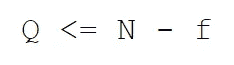

***安全***

为了避免网络分裂成多个决策，多数人应该出席。因为我们需要一个诚实的多数，法定人数应该大于节点总数的一半，以使决策对我们有利。

*因此为了安全起见:*

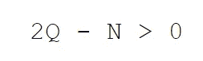

通过结合我们得到的两个条件，

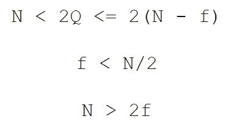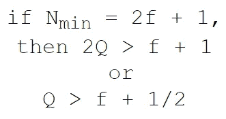

*因此*，*为非拜占庭故障*

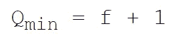

**拜占庭失败**

*给定网络中的 N 个节点，其中 f 个故障节点可能经历拜占庭式的故障，保证活性和安全性所需的法定人数 Q 是多少？*

> 经历拜占庭失败节点可以投票支持无效的块或决策，导致决策的分裂，结果是分叉。

**活性*活性*活性**

为了避免网络停止，必须存在至少一个非故障节点或仲裁。因为拜占庭节点可能不会回复。

*因此，对于活性:*


***安全***

为了避免网络分裂成多个决策，多数人应该出席。然而，与非拜占庭故障不同，拜占庭故障中的节点也可以投票，因此我们也需要在投票过程中考虑故障节点。


该等式提供了网络中可能出现的故障节点的最大数量。

*因此为了安全起见，也可以写成:*

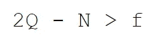

*其中 f 是可容忍故障节点的最大数量。*

通过结合这两个条件，我们得到

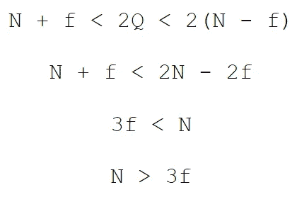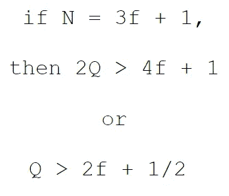

*因此，对于拜占庭式的失败*

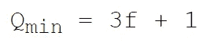

# PBFT 在 Node.js 中的实现

在本节中，我们将实现一个以 PBFT 为共识算法的区块链。可能需要注意的是，这个区块链不会使用加密货币，但如果我们使用帐户模型，就可以使用。此外，PBFT 只能在许可的环境下运行，因为它容易受到 Sybil 攻击，网络的成员必须是已知的。


Photo by Jeremy Bishop

## 先决条件

1.  节点. js
2.  邮递员
3.  VS 代码
4.  关于区块链概念的知识

## 建筑和设计

为了实施 PBFT，我们将开发以下组件:

1.  钱包类—用于公钥和签名数据。
2.  事务处理类-创建事务处理并验证它们。
3.  块类-创建块、验证块和验证块的提议者。
4.  区块链类——创建链、添加区块、计算提议者、验证区块、更新区块。
5.  P2p 服务器类——在对等点之间广播和接收数据。
6.  验证器—生成并验证验证器
7.  事务池、阻塞池、提交池、准备池和消息池—分别存储事务、阻塞、提交、准备和新一轮消息。
8.  App 用于与区块链交互的 Express API
9.  配置—存储全局变量
10.  链实用程序—存储常见的功能，如散列和验证签名。

## 密码

创建一个根目录`**pbft**`并放入 cd。这个项目中的所有文件都在根目录中。

```
mkdir pbft && cd pbft
```

**chain util 类**

我们将从创建一个将在这个项目中多次使用的`chain-util.js`文件开始。该文件将用于创建密钥对，以便对数据进行签名，为交易生成 id，对数据进行哈希处理以及验证签名。

我们需要三个模块来执行这些功能。因此，我们需要安装它们。

```
npm i --save elliptic uuid crypto-js
```

创建一个类`ChainUtil`并导出它。

**交易类别**

接下来，我们将创建一个事务类。在项目文件夹中创建文件`transaction.js`。本项目中的交易将包含以下属性:

1.  id —用于识别
2.  发件人—发件人地址
3.  输入—进一步包含要存储的数据和时间戳的对象
4.  哈希-输入的 SHA256
5.  签名—由发件人签名的哈希

在文件中创建一个类`Transaction`并将其导出。

**钱包类**

接下来是钱包。钱包保存公钥和密钥对。它还负责签名数据散列和创建签名的事务。

在项目目录中创建一个文件`wallet.js`。添加一个类`Wallet`并导出它。

**验证器类**

由于 PBFT 是一个许可的区块链共识算法，我们需要存储每个节点系统中所有节点的地址。我们可以手动选择一个秘密，创建一个钱包，获取它的公钥，并将这个密钥存储到一个文件中，当我们运行我们的项目时，它会读取这个文件中的密钥。

但是我们可以通过创建一个类并添加一个可以返回 N 个节点的公钥列表的函数来实现自动化，而不是手动完成。

我们将创建一个`Validator`类，它将生成一个每个节点都知道的公钥列表。在这个项目中，我们将每个节点的秘密短语用作

`NODE1, NODE2, NODE3......`

这样，我们可以更容易地创建一个公钥列表，并使用相同的公钥从命令行创建节点。

*注意:机密短语不应公开。只是为了演示，我们才使用这样的秘密短语。在现实世界的项目中，发送注册请求以使节点成为验证器。如果整个网络都批准了这个请求，那么该节点就成为一个验证器，并且公钥被添加到列表中。*

**config . js 文件**

网络中验证器的数量可以通过命令行传递，但更容易的是将它存储在文件中，并在需要时导入。

创建一个文件`config.js`并创建三个变量`NUMBER_OF_NODES`、`MIN_APPROVALS`和`TRANSACTION_THRESHOLD`

**闭塞等级**

接下来，我们将创建 block 类。在项目目录中，创建一个文件`block.js`并在其中创建一个类`Block`。块将具有以下属性:

1.  时间戳—创建块的时间
2.  lastHash —最后一个块的哈希值
3.  哈希-当前块的哈希值
4.  数据—块保存的事务
5.  提议者—块创建者的公钥
6.  签名—块的签名哈希
7.  sequenceNo —块的序列号

**事务池类**

我们需要一个地方来存储从其他节点接收的事务。因此，我们将创建一个`TransactionPool`类来存储所有事务。创建一个名为`transaction-pool.js`的文件

**块池类**

为了临时存储块，我们还将创建块池。创建一个文件`block-pool.js`，BlockPool 类在这个文件中保存块，直到它被添加到链中。当接收到`PRE-PREPARE`消息时，一个块被添加到块池。

有许多从节点接收的其他数据对象需要存储。`PREPARE`、`COMMIT`和`NEW_ROUND`消息

因此将再创建三个池，即`PreparePool`、`CommitPool`和`MessagePool`。消息池将保存`NEW_ROUND`消息。

**prepare pool 类**

**提交池类**

提交消息是在收到 2f+1 条准备消息后添加的，因此我们使用准备消息来获取块散列，而不是传递整个块。

**消息池类**

MessagePool 的工作方式与其他两个池类似。唯一的区别是它所携带的额外信息。

**区块链类**

我们拥有创建区块链班级所需的所有班级。我们现在可以创建一个文件`blockchain.js`。`Blockchain`类将具有以下属性:

1.  链-已确认的块列表
2.  验证者列表—给定网络的验证者列表

**P2P server 类**

我们如何向其他节点发送消息？我们将制作一个 P2p 服务器。在文件`p2p-server.js`中创建一个类`P2pserver`

为了创建一个 p2p 服务器，我们将使用套接字。为了使用套接字，我们将安装一个“ws”模块。这个模块使得使用套接字变得非常容易。

```
npm i --save ws
```

P2pserver 类是实现一致性算法的地方。这是项目的核心。这个类负责处理消息并广播它们。

**应用程序**

现在，我们将使用快速模块创建的应用程序连接所有文件。使用 npm 安装快速模块。

```
npm i express --save
```

我们的应用程序将实例化池、钱包、区块链、p2pserver，并声明一些端点来与我们的区块链交互。

以下是所需的最少端点(您可以添加更多):

1.  POST: '/transact' —创建事务，请求对象由要存储在事务中的数据组成
2.  GET: '/transactions' —发送事务池中的事务作为响应
3.  GET: '/blocks' —发送区块链的链作为响应

**这就完成了我们的编码。**您可以通过在单独的终端中运行以下程序来测试这个应用程序:

**第一个节点:**

```
SECRET="NODE0" P2P_PORT=5000 HTTP_PORT=3000 node app
```

**第二个节点:**

```
SECRET="NODE1" P2P_PORT=5001 HTTP_PORT=3001 PEERS=ws://localhost:5000 node app
```

**第三节点:**

```
SECRET="NODE2" P2P_PORT=5002 HTTP_PORT=3002 PEERS=ws://localhost:5001,ws://localhost:5000 node app
```

你想做多少就做多少。 ***在创建更多节点之前，更新配置文件中的节点总数。***

点击任意节点的端点，直到池填满，并通过点击`/blocks`端点来检查链。

同样，点击端点`/transactions`来检查事务池是否为空。

您还可以为提交、准备和消息池创建更多这样的端点。

# 进一步的想法

1.  创建适当的文件夹结构
2.  将所有池合并成一个池。
3.  在项目中添加状态变量，并在达到新状态时更新它。
4.  新一轮后清除提交、准备和消息池。
5.  在区块链创建一个注册方法来动态添加新的验证器。
6.  以此项目为基础创建加密货币。
7.  使用多线程使这个项目并行和更快。

非常感谢您的阅读。如果你觉得有用，就鼓掌。如果你有任何问题，请在下面评论。

**这个项目的完整代码可以在我的**[**GitHub Repo**](https://github.com/kashishkhullar/pbft)**上找到。如果你发现任何 bug，请随意创建一个 PR。**

> 加入 Coinmonks [电报频道](https://t.me/coincodecap)和 [Youtube 频道](https://www.youtube.com/c/coinmonks/videos)获取每日[加密新闻](http://coincodecap.com/)

## 另外，阅读

*   [复制交易](/coinmonks/top-10-crypto-copy-trading-platforms-for-beginners-d0c37c7d698c) | [加密税务软件](/coinmonks/crypto-tax-software-ed4b4810e338)
*   [网格交易](https://coincodecap.com/grid-trading) | [加密硬件钱包](/coinmonks/the-best-cryptocurrency-hardware-wallets-of-2020-e28b1c124069)
*   [密码电报信号](/coinmonks/top-3-telegram-channels-for-crypto-traders-in-2021-8385f4411ff4) | [密码交易机器人](/coinmonks/crypto-trading-bot-c2ffce8acb2a)
*   [币安交易机器人](/coinmonks/binance-trading-bots-d0d57bb62c4c) | [OKEx 审查](/coinmonks/okex-review-6b369304110f) | [阿塔尼审查](https://coincodecap.com/atani-review)
*   [最佳加密交易信号电报](/coinmonks/best-crypto-signals-telegram-5785cdbc4b2b) | [MoonXBT 评论](/coinmonks/moonxbt-review-6e4ab26d037)
*   [如何在 Bitbns 上购买柴犬(SHIB)币？](https://coincodecap.com/buy-shiba-bitbns) | [购买 Floki](https://coincodecap.com/buy-floki-inu-token)
*   [CoinFLEX 评论](https://coincodecap.com/coinflex-review) | [AEX 交易所评论](https://coincodecap.com/aex-exchange-review) | [UPbit 评论](https://coincodecap.com/upbit-review)
*   [十大最佳加密货币博客](https://coincodecap.com/best-cryptocurrency-blogs) | [YouHodler 评论](https://coincodecap.com/youhodler-review)
*   [AscendEx 保证金交易](https://coincodecap.com/ascendex-margin-trading) | [Bitfinex 赌注](https://coincodecap.com/bitfinex-staking)
*   [最好的卡达诺钱包](https://coincodecap.com/best-cardano-wallets) | [Bingbon 副本交易](https://coincodecap.com/bingbon-copy-trading)
*   [最佳加密交易所](/coinmonks/crypto-exchange-dd2f9d6f3769) | [印度最佳加密交易所](/coinmonks/bitcoin-exchange-in-india-7f1fe79715c9)
*   [面向开发人员的最佳加密 API](/coinmonks/best-crypto-apis-for-developers-5efe3a597a9f)
*   最佳[密码借贷平台](/coinmonks/top-5-crypto-lending-platforms-in-2020-that-you-need-to-know-a1b675cec3fa)
*   [免费加密信号](/coinmonks/free-crypto-signals-48b25e61a8da) | [加密交易机器人](/coinmonks/crypto-trading-bot-c2ffce8acb2a)
*   [杠杆代币](/coinmonks/leveraged-token-3f5257808b22)终极指南