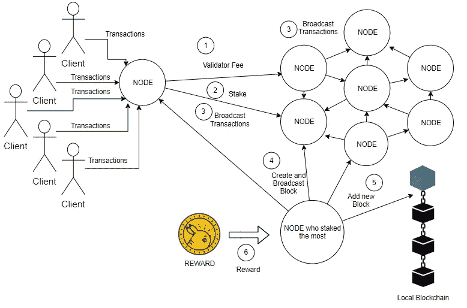

# 实施利害关系证明第 1 部分

> 原文：<https://medium.com/coinmonks/implementing-proof-of-stake-e26fa5fb8716?source=collection_archive---------0----------------------->

本文给出了一个在 node.js 中实现利益一致性算法的简单方法


Source: [Bitcoin Wiki](https://en.bitcoinwiki.org/upload/en/images/thumb/e/e5/Proof%E2%80%93of%E2%80%93Stake_%28PoS%29.jpg/500px-Proof%E2%80%93of%E2%80%93Stake_%28PoS%29.jpg)

# **股权证明**

与工作证明一样，利益证明(PoS)也是一种区块链共识算法。尽管它的工作方式非常不同。许多区块链在生产中使用这种算法，很快以太坊将它的 PoS 版本称为 Casper。

为了向区块链添加新块，需要一种算法来决定哪个节点能够向区块链添加块。因此，这是任何共识算法的主要目标。

# 工作

作为赌注的证明，为了被选为下一个区块创建者，矿工/验证者需要下注他们的代币/余额。因此，持有最多货币的矿商最有可能被选为领导者并创建下一个区块。一些区块链解决方案不遵循这样的原则，而是随机选择矿工。

如果一个矿工被发现作弊或篡改一块，它失去了所有的硬币。因此，这种限制迫使矿工诚实。

考虑这个例子:

```
let stakedCoins = { 
                 "address-1" : 10 
                 "address-2" : 70
                 "address-3" : 50
                 "address-4" : 20
                }let leader = Object.keys(balances).reduce((a,b) => balances[a] > balances[b] ? a :b)// leader = address-2
```

这是一个简单的例子，在这个例子中，拥有最多令牌的地址被选为领导者。

与工作证明相比，矿工们在计算能力方面相互竞争，而在这里，他们在货币方面竞争。

Casper 是 Ethereum 的 PoS 实现，其中验证者必须在智能合约中存放一些令牌才能提出阻塞。任何骗子，如果被抓住，失去所有的赌注代币。

# 优势

> 通过 PoS，一个拥有普通笔记本电脑的人可以成为验证者。

与 PoW 相比，桩的证明将显著减少电力消耗，因此更环保。其次，耗时的挖掘过程将被恒定量的计算所取代。因此，这将提高整个网络的速度。

> 攻击将导致损失而不是收益

这种攻击不但没有带来收益，反而会损失财富。由于在 PoS 中，欺骗导致硬币损失，攻击变得非常昂贵，因此防止分叉。

# 不足之处

> 一个拥有 51%财富的矿工将拥有这个网络。

在 PoS 协议中，拥有总硬币 51%的矿工将始终被选为领导者。因此，如果单个节点总是创建块，那么区块链的去中心化就变得无效。然而，一个节点不可能拥有全部硬币的 51%。

*然而，许多区块链都有防止这种情况发生的协议。一个这样的解决方案是创造货币。其中，随着时间的推移，被选为领导者的趋势降低，或者作为验证者的硬币下注时间最长，成为领导者。*

# 结构

我们将在 node.js 中实现以下给定的结构:



Basic Structure of PoS

1.  如果网络中的节点想要成为验证者，那么它首先提交验证者费用。
2.  当交易被确认后，它可以投入一些硬币来与其他验证者竞争。
3.  同时，每个节点负责广播它们从客户端接收的事务。
4.  当创建了足够数量的交易时，验证者选举具有最大赌注硬币的领导者。当选的领导人然后创建一个块，并向网络广播。
5.  每个节点验证块，执行块中的所有事务，并将块添加到链中。
6.  街区也有特殊的奖励交易。给定回合的领导者获得该区块中存在的交易的交易费作为奖励。

# 设计

在我们开始编码之前，让我们分析一下我们必须做什么。

以下是我们根据上述概述在代码中创建的类:

1.  块类
2.  区块链类
3.  账户模型
4.  验证程序类
5.  桩子模型
6.  交易类别
7.  交易池
8.  钱包
9.  P2P 服务器
10.  蜜蜂

稍后我们会添加更多，但这些看起来很好，以便更好地理解。我们继续吧。

[第 2 部分:实施利害关系证明](/coinmonks/implementing-proof-of-stake-part-2-748156d5c85e)

*感谢您的阅读。* ***在下一部分，我们将开始编写一些代码。*** *希望你喜欢这个简短的介绍。如果你发现这很有帮助，请鼓掌。*

如果你对区块链、以太坊或整个世界有任何问题，请发表评论。:)

[](http://bit.ly/2G71Sp7)

> [直接在您的收件箱中获得最佳软件交易](https://coincodecap.com/?utm_source=coinmonks)

[](https://coincodecap.com/?utm_source=coinmonks)