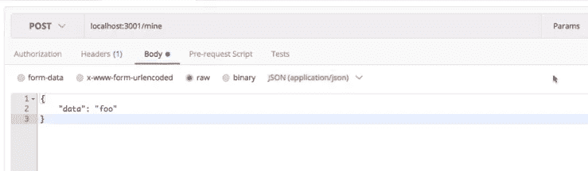

# 实施利害关系证明第 3 部分

> 原文：<https://medium.com/coinmonks/implementing-proof-of-stake-part-3-c68b953a50be?source=collection_archive---------0----------------------->

本文给出了一个在 node.js 中实现利益一致性算法的简单方法


在之前的[帖子](/coinmonks/implementing-proof-of-stake-part-2-748156d5c85e)中，我们编写了一个基本的区块链。在这一部分中，我们将实现验证一个链并添加多个贡献者的功能。

为了增加对多个贡献者的支持，我们需要添加某种形式的验证。网络中的每个节点可能在某个时间点具有不同的链。为了达到一个共同的状态，我们需要验证我们为其他节点收到的新链。在比特币中，使用的是最长链规则。其中，有效的链，即所有块都有效并且具有最大块数的链被认为是有效链。因此，所有节点将其链替换为最长的链。对我们来说，在任何新的连接上，我们发送我们的链并从另一个节点接收链。

我们将在区块链类中创建一个`isValidChain(chain)`静态函数，它告诉我们这个链是否有效。在这个函数中，我们重新计算块的散列，并将其与块的给定散列进行比较。这将检查该块是否已被篡改。

在添加这个函数之前，我们需要一种方法来找到给定块实例的块的散列。让我们将此功能添加到 block 类中。

Handover a block, and I’ll hash it

现在我们可以在我们的`isValidChain()`函数中使用这个函数。

chain valid ? yes : no ;

继续前进。当我们收到一个有效的比我们的更长的新链时，我们必须使用那个链并丢弃我们的链，更正式地说，我们必须用新的更长的链替换我们的链。让我们添加这个功能。

在区块链类中创建一个函数`replaceChain(chain)`。这会将当前区块链对象的新链分配给作为参数接收的新链。

让我们继续围绕我们已经创建的这个区块链系统创建一个 web API。这些 API 将允许用户通过每个 HTTP 请求与区块链进行交互，由于我们很快就会有多链验证，我们将有多个 minorss 更新一个在整个网络上分散的区块链中共享的 minor。

在我们有我们的 web API 之前，让我们组织我们的项目，因为我们将很快在我们的项目中添加更多的文件。

创建一个名为区块链的新目录，并将块和区块链文件与测试文件一起移动到该目录中。

我们的文件项目结构应该如下所示

```
blockchain/
     blockchain.js
     block.js
```

现在让我们为我们的应用程序创建一个单独的`app`文件夹。让我们在这个文件夹中创建一个新的`index.js`文件。

为了制作我们的 API，我们将使用 express 模块。让我们安装它。

```
npm i express --save
```

为了在 post 请求中操作数据，我们需要一个 bodyparser 模块。所以把那个也装上。

```
npm i body-parser --save
```

我们将有多个用户运行我们的应用程序。为了在我们自己的机器上测试这个应用程序，我们需要在每次运行新实例时在不同的端口上运行这个应用程序。因此，我们必须在每次运行新的应用程序时提供一个新的端口。

我们将使用环境变量来实现这一点。我们可以从终端传递端口，并将其分配给运行应用程序的端口。默认情况下，我们将在端口 3000 上运行我们的应用程序。

```
const HTTP_PORT = process.env.HTTP_PORT || 3001;// we can run our app something like the following to run on a
// different portHTTP_PORT = 3002 npm run dev
```

我们还需要这个 API 中的区块链实例来发送和接收块数据。

```
const Blockchain = require('../blockchain');
const blockchain = new Blockchain();
```

我们还需要向我们的应用程序添加一个启动脚本。在 package.json 文件中，添加一个脚本来运行 app 目录中的 index.js 文件。

```
"dev": "nodemon ./app"
```

我们为应用添加了一些基本的端点:

获取 `/blocks` —将链发送给用户。

Post `/mine` —在创建新块的请求中发送数据。

让我们创建我们的应用程序。

Plain simple APIs

太棒了。让我们在《邮差》中尝试一下。

发出 get 请求会给整个链。在我们的例子中，我们只有一个创世纪块。


Get request sends the entire chain

发出 post 请求将会生成一个新的块。因此，我们还需要传入一些数据。



Post request with data


The response has a new chain added to the blockchain

酷毙了。

我们可以与区块链互动，但我们仍然只有一个用户。为了拥有多个对等点，我们将制作一个 p2p 服务器，并使用 WebSockets 连接这些对等点，允许每个对等点与其他对等点通信并传输数据。

当我们启动我们的应用程序时，我们将连接到一些同行，当我们启动我们的应用程序时，我们将通过他们的地址。

# P2P 服务器

我们需要一个 p2p 服务器，以便分散网络中的不同对等点可以通过网络相互发送块、链、事务和其他消息。

为了在 node.js 中实现 p2p 服务器，我们需要一个名为`ws`的模块，这是一个轻量级且易于使用的网络套接字模块。还有各种其他模块可用，但为了简单起见，我们将坚持使用这个模块。

```
npm i ws --save
```

在 app 内，目录下创建一个文件`p2p-server.js`。导入`ws`模块，为服务器定义一个`P2P_PORT`。像我们的 HTTP 服务器一样，我们可以使用环境变量从终端分配一个端口。

```
const P2P_PORT = process.env.P2P_PORT || 5001;
```

我们需要一个列表`peers` ，当我们启动应用程序时，我们将连接到它。每个对等体都有一个这样的地址

```
PEERS = ws://localhost:5002 P2P_PORT=5001 HTTP_PORT=3001 npm run devconst peers = process.env.PEERS ? process.env.PEERS.split(',') : [];
```

因此，我们可以将我们希望从终端连接到的对等点地址作为一个环境变量进行传递，并在以后访问我们的 p2p 服务器。

现在让我们在 p2p-server.js 中创建一个 P2pServer 类，它将保存所有的消息处理程序和事件侦听器。

p2p 服务器将有一个区块链变量，这将是我们在应用程序中使用的相同的区块链。因此，我们将传递一个区块链实例作为依赖项。我们的 p2p 服务器也有一个在给定时间内连接的套接字列表。

我们使用`peers`列表通过遍历每个对等体并将其套接字连接对象保存在套接字列表中以备后用来连接对等体。

让我们实施我们到目前为止所讨论的。

P2pserver class

在我们的`app/index.js`文件中，我们将创建 p2pserver 的实例，传递区块链实例，然后启动 p2pserver。

```
const P2pServer = require('./p2p-server.js');const p2pserver = new P2pServer(blockchain);
// passing blockchain as a dependency.
.
.
.p2pserver.listen(); // starts the p2pserver
```

好了，现在让我们测试我们的 p2p 服务器。

启动终端，打开三个标签。在第一次选项卡运行中

```
npm run dev
```

在第二个

```
HTTP_PORT = 3002 P2P_PORT = 5002 PEERS = ws://localhost:5001 npm run dev
```

在第三个

```
HTTP_PORT = 3003 P2P_PORT = 5003 PEERS = ws://localhost:5002,ws://localhost:5001 npm run dev
```

在第一个终端中，我们将得到输出

```
Listening for peer to peer connection on port : 5001
listening on port 3001
Socket Connected
Socket Connected
```

在第二个终端中，我们将得到输出

```
Listening for peer to peer connection on port : 5002
listening on port 3002
Socket Connected
Socket Connected
```

在第一个终端中，我们将得到输出

```
Listening for peer to peer connection on port : 5003
listening on port 3003
Socket Connected
Socket Connected
```

我们的插座现在互相连接了。

厉害！让我们使用这个 P2P 服务器来同步区块链，以构建一个完全分散的区块链网络。

让我们给 p2p 服务器添加一个消息处理程序。这个 messageHandler 函数将接受一个套接字作为参数。

I handle your messages

我们需要将这个处理程序分配给每个套接字。每次在`connectSocket()`函数中建立新的连接时，我们都可以这样做。

当我们连接到对等体时，我们需要向它发送消息。因此，我们可以在连接上使用`socket.send()`来这样做，我们希望将我们的链发送给对等体。因此，当我们连接到一个套接字时，我们将把链作为消息发送给它们。

*注意:理想情况下，我们会发送块，因为链的大小非常大。但是为了简单起见，我们将发送整个链。*

```
connectSocket(socket){// push the socket too the socket array
        this.sockets.push(socket);
        console.log("Socket connected");// register a message event listener to the socket
        this.messageHandler(socket);// on new connection send the blockchain chain to the peersocket.send(JSON.stringify(this.blockchain));
}
```

如果您运行两个不同的应用程序，您会看到另一个对等体的链打印在第一个对等体的控制台上，反之亦然。这意味着我们的套接字正在正确地相互发送消息。

为了使我们的链与对等体的链同步，我们可以检查接收到的链是否有效和更长。我们已经在区块链类中实现了这个功能。让我们在 p2pserver 类中使用`replaceChain()`函数，当我们从一个对等点接收到一个链时。

在`messageHandler(socket)`功能中添加

```
this.blockchain.replaceChain(data);
```

为了让我们的生活更容易，我们将在我们的 p2pserver 中添加两个助手函数`sendChain()`和`syncChain()`。

`sendChain(socket)`将用于发送我们的链到一个套接字

The chain sender

`syncChain(socket)`将在我们的索引文件中用来同步链

The chain synchronizer

现在，在我们的 app/index.js 文件中，每当我们向链中添加一个新块时，我们都可以使用`syncChain()`函数。

```
app.post('mine',(req,res) => {
    .
    .
    .
    p2pserver.syncChain();
}
```

我们为 p2pserver 编写的最终代码将类似于

通过启动两个应用程序实例来测试这个功能。在第一个应用程序中添加新块。

现在打开第二个终端，您将看到控制台中打印的输出。

```
Listening for peer to peer connection on port : 5002
listening on port 3002
Socket Connected
Replacing the current chain with new chain
```

您可以通过使用第二个应用程序的 get 端点来确认这一点。您可以对第二个实例进行同样的尝试，第一个实例的链将被更长的更改所取代。

太好了！我们的区块链开始同步了。

在下一部分中，我们将为我们的项目创建一个钱包。

*感谢您的阅读。* ***在下一部分中，我们将编写代码来验证区块链并添加对多节点的支持。*** *希望你喜欢编码。如果你发现这很有帮助，请鼓掌。*

如果您对区块链、以太坊或整个世界有任何疑问，请发表评论。:)

[](http://bit.ly/2G71Sp7)