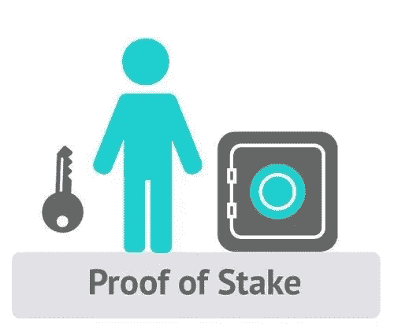

# 实施利害关系证明第 4 部分

> 原文：<https://medium.com/coinmonks/implementing-proof-of-stake-part-4-2107bb07dfed?source=collection_archive---------1----------------------->

## 本文给出了一个在 node.js 中实现利益一致性算法的简单方法



在[之前的文章](/coinmonks/implementing-proof-of-stake-part-3-c68b953a50be)中，我们创建了一个基本的 p2p 服务器和一个 API 来与我们的区块链交互。在这一部分，我们将进一步扩展我们的项目，我们将实现一个钱包。

# 钱包

为了创造一种加密货币，我们需要一个钱包。钱包将有两个密钥，即公钥和一个对应的私钥。公钥/私钥对是不对称加密的一部分，我们将使用它来创建数字签名。

数字签名允许用户验证创建区块和交易的矿工。一旦使用私钥对数据进行了签名/加密，就只能使用公钥对其进行验证/解密。

在根目录中创建一个单独的文件夹 wallet，并在其中添加一个`wallet.js`文件，我们将在其中创建我们的 wallet 类。

我们的钱包将有 3 个主要属性，余额、密钥对和公钥。

注意:我已经将变量`secret`作为参数传递给了构造函数。我们将在创建钱包时传递一个。

为了创建一个密钥对(公钥和私钥),我们将使用一个叫做椭圆的模块。让我们安装它。

```
npm i elliptic --save
```

让我们在根目录下创建一个名为`chain-util.js`的新文件，它将保存与加密货币相关的函数。我们将使用刚刚安装的这个模块，我们将在我们的应用程序中使用基于`ec`曲线的算法。所以在 chainUtil.js 中要求从椭圆中得到`eddsa`算法并使用`ed25519`创建一个实例

```
const EDDSA = require("elliptic").eddsa;
const eddsa = new EDDSA("ed25519");
```

让我们在`chainUtil` 类中创建一个函数，我们将在应用程序中使用它来生成一个密钥对。

```
class ChainUtil { static genKeyPair(secret) { return eddsa.keyFromSecret(secret); }}module.exports = ChainUtil;
```

现在我们可以在我们的 wallet 类中使用这个函数，并使用`getPublic()`函数来获取 public an 并将其编码为十六进制格式。

```
this.keyPair = ChainUtil.genKeyPair();this.publicKey = this.keyPair.getPublic('hex');
```

我们的基本钱包准备好了。交易时间到了。

# 处理

我们的交易将具有以下结构—

```
{
  id: <here goes some identifier>
  type: <transactions type: stake,validator,transaction>
  input: {
          timestamp: <time of creation>,
          from: <senders address>,
          signature: <signature of the transaction>
         }
  output: {
           to: <recievers address>
           amount: <amount transfered>
           fee: <transactions fee>
          }
}
```

每笔交易都需要一个唯一的 id。为了生成这些唯一的数字，我们将使用一个名为 uuid 的模块。

```
npm i uuid --save
```

让我们在`chain-util.js`文件中创建这个模块的一个实例。

```
const uuidV1 = require('uuid/v1');// version 1 use timestamp to generate unique ids, although in production one shouldn't use this
```

让我们创建一个函数来生成 id。

```
static id(){
        return uuidV1();
}
```

既然我们可以唯一地识别交易。我们可以创建我们的事务类。

输入和输出将是如上所述的对象。

在输出对象中也有一个字段`fee`用来添加交易费，我们将创建一个常量并在`generateTransaction()`函数中添加使用它。因为我们以后可能要改变费用，所以我们将把这个内容保存在一个单独的文件中。

在根文件夹中创建一个`config.js`，并在其中添加一个常量变量`TRANSACTION_FEE`。

config.js file

让我们创建一个函数来创建一个事务。这个函数将接收发送者的钱包实例、发送的金额和接收者的地址。

它将检查发送方是否有足够的余额，然后创建一个事务对象，将所有属性传递给该函数。为了保持代码的模块化，我们将把函数分成两部分。`generateTransaction`实际上会起到同样的作用，但看起来会整洁得多。

我们的事务现在需要一个输入对象。我们将使用 wallets 密钥对对交易进行签名，并将签名和其他相关信息一起添加到输入对象中。

让我们在`wallet/index.js`文件中添加一个符号函数

```
sign(dataHash){ return this.keyPair.sign(dataHash);}
```

当我们创建新的交易时，我们将在`transaction.js`文件中使用这个函数。让我们在 transaction 类中添加一个名为`signTransaction()`的函数。该函数将获取 transaction 和 senders wallet 的实例，并在 transaction 中创建一个签名输入。

请注意，我们多次使用散列函数。我们可以把它抽象成 chain-util.js，使代码更加可重用。让我们在`chainUtil`中创建一个`hash(data)`函数并使用它，而不是直接使用`SHA256`

```
static hash(data){ return SHA256(JSON.stringify(data)).toString();}
```

也在 block.js 文件中进行这些更改。

好的，接下来我们将在 transaction.js 中创建`signTransaction()`函数

现在在`generateTransaction()`函数中，我们可以调用带参数的`signTransaction()`作为当前交易和发送者的钱包，然后返回交易对象。

我们还需要验证交易真实性的功能。

让我们创建一个`verifyTransaction()`函数来验证事务的散列和数字签名。

为了验证一个签名，我们需要使用公钥解密它。椭圆模块提供了这种内置的功能。让我们在`ChainUtil`类中创建一个函数 verifySignature()，我们稍后会用到它。

```
static verifySignature(publicKey,signature,dataHash){return ec.keyFromPublic(publicKey).verify(dataHash,signature);}
```

现在，在 Transaction 类中，让我们创建一个名为`verifyTransaction()`的函数，其中我们将使用刚刚创建的 verifySignature 函数。

我们的事务类终于完成了。这是它的样子。

# 游泳池

由于多个个人使用他们的钱包在加密货币上创建交易，因此需要一种方法来包含这些交易的组，我们现在将使用交易池的概念。事务池将是一个实时更新的对象，包含网络中所有挖掘者提交的所有新事务。

用户将创建事务，然后将每个事务提交到池中。池中出现的这些新交易将被视为未确认交易。

挖掘器从该池中取出一组事务，并创建块，使事务得到确认。

为了更新我们的事务池，我们将使用我们创建的 p2p 服务器，并向网络广播事务。当我们收到新的交易时，我们会将其添加到我们的池中。

但是首先，让我们在 wallet 目录中创建 `transaction-pool.js`文件，并创建一个`TransactionPool` 类。

这个类只有一个属性事务数组。

```
this.transactions = [];
```

让我们向池中添加一些方法。

在列表中添加推送交易的方法。请注意，我们可能会收到已经收到的交易，因此也需要事先检查。

创建一个函数`addTransaction(transaction)`，这个方法将简单地把事务添加到池中。

```
const Transaction = require("./transaction");
class TransactionPool {
  constructor() {
    this.transactions = [];
  } addTransaction(transaction) {
    this.transactions.push(transaction);
  }
}
module.exports = TransactionPool;
```

这是我们游泳池的样子:

因为我们的钱包负责创建交易，所以我们需要一个函数来完成这项工作。创建一个函数来创建一个新的交易，使用我们的钱包签名，并将其添加到我们的交易池。我们将使用上面创建的所有函数。

让我们在 wallet 类中创建一个`createTransction()`函数来完成这项工作，因为我们需要将事务添加到事务池中，我们需要一个事务池实例作为参数。

为了创建事务，我们需要一个端点。让所有我们已经创建到我们的主应用程序。

让我们制作`createTransaction()`函数

```
createTransaction(to, amount, type, blockchain, transactionPool) {
    let transaction = Transaction.newTransaction(this, to, amount,                                                                                                    type);
    transactionPool.addTransaction(transaction);
    return transaction;
  }
```

在 app/index.js 文件中，创建一个 wallet 实例和一个 transactionPool 实例。

```
const Wallet = require('../wallet');const TransactionPool = require('../wallet/transaction-pool');// create a new walletconst wallet = new Wallet(Date.now().toString());// Date.now() is used create a random string for secret// create a new transaction pool which will be later// decentralized and synchronized using the peer to peer serverconst transactionPool = new TransactionPool();
```

让我们做一个 get 端点 `‘/transactions’`

```
// api to view transaction in the transaction poolapp.get('/transactions',(req,res)=>{ res.json(transactionPool.transactions);});
```

现在运行应用程序并打开 postman

```
npm run dev
```

点击 api，您将得到一个空数组作为我们期望的响应。

让我们创建 post `‘/transact’` 来创建新的事务

```
// create transactionsapp.post("/transact", (req, res) => { const { to, amount, type } = req.body; const transaction = wallet.createTransaction( to, amount, type, blockchain, transactionPool );res.redirect("/transactions");});
```

用收件人的地址和金额在 postman 中测试这个 api，您会发现您不能创建交易，因为您的初始余额是零。

*出于测试目的，我们可以创建一个常量* `*INITIAL_BALANCE*` *来检查一切是否正常。在* `*config.js*` *中添加一个常量* `*INITIAL_BALANCE*` *并在 wallet 类构造函数中使用。将余额设置为该变量，在 config.js 中将* `*INITIAL_BALANCE*` *设置为 100。*

```
// wallet.js
const {INITAL_BALANCE} = require('../config'); this.balance = INITIAL_BALANCE// config.js
INITAL_BALANCE = 100
```

现在，用 JSON 数据创建一个 post 请求，其中包含 to、amount 和 type 字段:

```
{
 “to”:”rand-address”,
 “amount”:10,
 “type”: “TRANSACTION”
}
```

点击几次发送，你会得到一个令人满意的交易列表。


Transaction present in the pool

太好了！！

# 广播交易

尽管我们可以在应用程序中创建事务，但我们还必须实现一些功能，将这些事务发送到网络中的其他节点。为了实现这一点，我们将利用我们的 p2p 服务器类。

我们可以在 p2p 服务器中添加一个事务池实例。这样，我们的服务器可以直接访问事务。

在 P2server 类中，我们将在其构造函数中添加另一个属性，即事务池实例。

```
constructor(blockchain,transactionPool){this.blockchain = blockchain;this.sockets = [];this.transactionPool = transactionPool;}
```

我们还需要更新我们在 app/index.js 文件中创建的实例，并将`transactioPool`实例传递给`p2pserver`实例。

```
const p2pserver = new P2pserver(blockchain,transactionPool);
```

现在让我们创建一个方法来处理 p2pserver 类中的事务。该方法将非常类似于我们现在已经拥有的同步链功能，该功能同步连接到该应用程序套接字的每个个体的链。

为了处理多种消息类型，我们将在 p2pserver 类中创建一个对象 MESSAGE_TYPE。

```
const MESSAGE_TYPE = {chain: 'CHAIN',transaction: 'TRANSACTION'}
```

每当创建新的事务时，该方法都会将事务发送到每个连接的套接字。

所以，让我们在 p2pserver 类中创建一个函数`broadcastTransaction(transaction)`。这个函数将把事务发送到每个套接字。为了模块化代码，我们可以创建另一个名为`sendTransaction(socket,transaction)`的函数，只是将一个事务发送到一个套接字，并为每个套接字调用这个函数。

类似地，我们也将使用 MESSAGE_TYPEs 来发送链。所以也更新一下`sendChain` 功能。

```
sendChain(socket){ socket.send(JSON.stringify({ type: MESSAGE_TYPE.chain, chain: this.blockchain.chain }));}
```

让我们也编写代码来处理发送给我们的事务。

由于我们有不同类型的消息，我们需要不同地处理它们，而不是创建多个函数，我们将使用 switch 语句来根据消息类型选择句柄。

在我们的消息处理程序中，对于作为数据的链，我们将调用`replaceChain` 函数，对于作为事务的数据，我们将调用`addTransaction` 函数。

如果接收到的事务不在池中，上面的代码片段会将它添加到池中。注意，我们需要在`transactionPool` 类中编写函数`transactionExists()`。

```
// transaction-pool.js
transactionExists(transaction) {let exists = this.transactions.find(t => t.id === transaction.id);return exists;}
```

在将事务添加到我们的池中之后，我们进一步广播它，以便当前节点的所有邻居也接收到该事务。

向每个套接字注册这个消息处理程序

```
// p2p-server.jsconnectSocket(socket){
  this.sockets.push(socket);
  console.log("Socket connected");
  this.messageHandler(socket);
  this.sendChain(socket);
}
```

最后，我们将在 API 中使用广播事务函数。当我们在 API 中创建新的事务时，我们将调用`broadcastTransaction` 函数。

```
// index.jsapp.post("/transact", (req, res) => {
  const { to, amount, type } = req.body;
  const transaction = wallet.createTransaction(
    to,
    amount,
    type,
    blockchain,
    transactionPool
  );
  p2pserver.broadcastTransaction(transaction);
  res.redirect("/transactions");
});
```

现在，事务实际上将在网络上广播，我们的消息处理程序将把它们添加到事务池中。

我们可以通过打开两个终端并运行两个应用程序实例来测试这一点。我们将在其中一个终端中创建一组事务，然后我们将点击另一个应用程序实例的 get transactions 端点。

你会看到交易实际上正在向网络广播。

通过为第二个实例创建事务来测试功能，并使用第一个实例的端点来查看这些事务。

*感谢您的阅读。* ***在下一部分中，我们将创建一个账户模型、赌注和验证者列表。*** *希望你喜欢编码。如果你发现这很有帮助，请鼓掌。*

如果你对区块链、以太坊或整个世界有任何疑问，请发表评论。:)