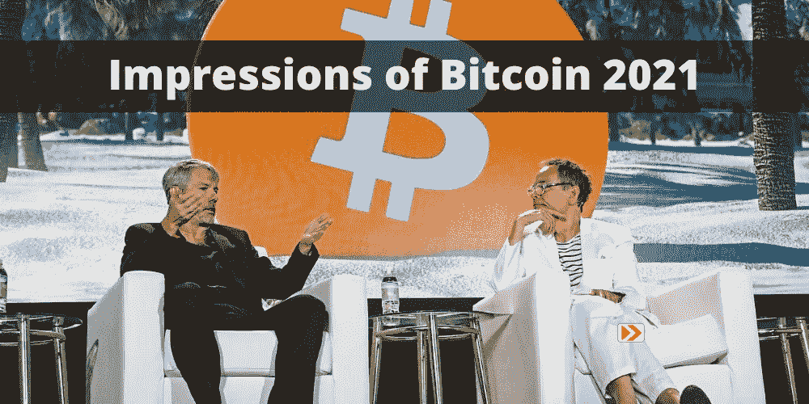

# 比特币 2021 印象

> 原文：<https://medium.com/coinmonks/impressions-of-bitcoin-2021-8dbfdbb60cd7?source=collection_archive---------6----------------------->

## 我们作为比特币杂志嘉宾的观点

# 交通和住宿

杰夫和我很荣幸成为《比特币》杂志在大会上的嘉宾。地点在迈阿密的温伍德区，这里被认为是它的艺术区。它位于市中心，大部分建筑物裸露的墙壁上布满了壁画和涂鸦。

会议中心前有一个很大的停车场，我们以为可以停车，但是，这是会议的外部区域，覆盖着品牌帐篷，如[天鹅比特币](https://www.swanbitcoin.com/)的帐篷，开源帐篷，酒吧，以及几个可以坐下来观看大型投影屏幕上的演示的地方。停车仅限于活动周边的街道。对于任何从酒店开车去参加会议的人来说，这都是一个令人头疼的问题。

我们住在北海滩地区的一家 Airbnb 里。它距离会议中心只有大约 5 英里，但大约需要 25-30 分钟的路程。安塞尔住在佛罗里达州，有自己的车，所以我们可以来回开车而不用买优步，但我们听说优步在会议上两天的单程收费约为 50 美元，仅在优步乘车就至少要 200 美元，比你在食物上的花费还要多。停车和交通状况令人头痛。明年，[比特币&市场](https://bitcoinandmarkets.com/)可能会尝试通过在这个社区的其他成员附近组织房间来解决这个问题，努力协调乘车和下班后的活动。

这个场地很大，很干净，管理也很专业。出席的总人数约为 15，000 人，而内部区域的人数约为这个数字的一半。主舞台可以容纳 4000 个座位，但座位很小，男人们无法并排坐进去。在第一天的前半天，有很多人站在座位区的后面和两边，但消防队长进来制止了这种情况。因此，我们只在里面呆了一个小时，其余时间都在外面。

外面有很多座位，大部分都是遮阳的，这很好。停车场东西两端的两个大屏幕提供了观看演讲者的充足空间。有一个提供全套服务的酒吧，有啤酒、葡萄酒和烈性酒，但价格高得离谱，一杯鸡尾酒 12 美元。

# 人

那里有各种各样的人。像往常一样，里面有许多不同的摊位。比特币和屎币都有代表。我们预计会有更多的 shitcoiners，因为结合了最近的 altcoins，如 doge，以及这是该领域有史以来最大的会议。我认为比特币和屎币的比例大约是 80/20。

男女比例也很有趣。我们注意到几组没有男性的女性，然而，大多数女性都和她们的男朋友或丈夫在一起。这比我们最初设想的要少，但如果你有兴趣在会议上认识基于共同兴趣的女孩，这一比例仍然不大。我们估计男女比例大约是 70/30。

# 小贩和艺术

像 [Bisq](https://bisq.network/) 这样的比特币供应商最为活跃。我们可能花时间最多的场地是美术馆。这很酷。大约 20 名艺术家旅行并展示了他们的作品，你可以直接用比特币/sat 出价。看到艺术家很酷，在某种程度上给了整个会议一种社区的感觉。这部分做得好[比特币杂志](https://bitcoinmagazine.com/)！

我们希望美术馆成为一个特色，不仅是未来比特币会议的特色，也是所有专业会议的特色。这是一个节奏的改变，从高压的摊贩摊位走进艺术画廊，欣赏这个正在崛起的巨大产业的文化和社区。自由/开源软件和赛博朋克文化最明显的两个地方是开源帐篷和艺术画廊。

# 扬声器

诚然，我们没有看到大多数发言者。这两天我们都只在会场呆了几个小时。最初，由于黑暗的主舞台座位和舞台灯光，有点 Bitconnect 的氛围。没有“哇哇哇哇”的问题从舞台上或类似的地方，但也许只是两个老派的比特币制造者对这个地方的规模和能量感到惊讶。

这是一场纯粹的比特币大会。演讲者几乎 100%是讲比特币的，我估计只有几个多元主义者在场。与之前的会议相比，这是一个巨大的能量变化，甚至是以比特币为中心的会议。在过去，你会有像 Eric Voorhees(ShapeShift 的首席多元主义者)和 Roger Ver(比特币的首席敌人和 altcoin 的创始人)这样的人。这一次，这种感觉并不明显。

比特币杂志做的一件伟大的事情是，你可以通过停车场区域到达两个较小的阶段。在这些舞台上，内容制作者、播客、YouTubers 等等做了他们的演讲。我们非常欣赏这一点，并希望这一想法继续发展，通过为内容制作者和社区成员提供一个平台来认可他们。干得好。

# 总体印象

上周，我们说我们的第一反应是见证了比特币生命中的一个重要里程碑。这种感觉伴随了我们整个周末。杰克·马勒(Jack Mallers)在大会上宣布萨尔瓦多将比特币作为法定货币时，完美地展示了我们的感受。从这里开始，比特币是主流。

> 加入 [Coinmonks 电报频道](https://t.me/coincodecap)，了解加密交易和投资

## 另外，阅读

*   [电网交易机器人](https://blog.coincodecap.com/grid-trading) | [加密交易机器人](/coinmonks/cryptohopper-review-a388ff5bae88) | [加密交易机器人](https://blog.coincodecap.com/best-crypto-trading-bots)
*   [加密复制交易平台](/coinmonks/top-10-crypto-copy-trading-platforms-for-beginners-d0c37c7d698c) | [如何在 WazirX 上购买比特币](/coinmonks/buy-bitcoin-on-wazirx-2d12b7989af1)
*   [CoinLoan 审核](/coinmonks/coinloan-review-18128b9badc4)|[Crypto.com 审核](/coinmonks/crypto-com-review-f143dca1f74c) | [火币保证金交易](/coinmonks/huobi-margin-trading-b3b06cdc1519)
*   [尤霍德勒 vs 考尼洛 vs 霍德诺特](/coinmonks/youhodler-vs-coinloan-vs-hodlnaut-b1050acde55a) | [Cryptohopper vs 哈斯博特](https://blog.coincodecap.com/cryptohopper-vs-haasbot)
*   [顶级付费加密货币和区块链课程](https://blog.coincodecap.com/blockchain-courses) | [币安评论](/coinmonks/binance-review-ee10d3bf3b6e)
*   [MXC 交易所评论](/coinmonks/mxc-exchange-review-3af0ec1cba8c) | [Pionex vs 币安](https://blog.coincodecap.com/pionex-vs-binance) | [Pionex 套利机器人](https://blog.coincodecap.com/pionex-arbitrage-bot)
*   [如何在印度购买比特币？](/coinmonks/buy-bitcoin-in-india-feb50ddfef94) | [WazirX 审核](/coinmonks/wazirx-review-5c811b074f5b) | [BitMEX 审核](https://blog.coincodecap.com/bitmex-review)
*   [印度比特币交易所](/coinmonks/bitcoin-exchange-in-india-7f1fe79715c9) | [比特币储蓄账户](/coinmonks/bitcoin-savings-account-e65b13f92451)
*   [币安费](/coinmonks/binance-fees-8588ec17965) | [Botcrypto 评论](/coinmonks/botcrypto-review-2021-build-your-own-trading-bot-coincodecap-6b8332d736c7) | [Hotbit 评论](/coinmonks/hotbit-review-cd5bec41dafb) | [KuCoin 评论](https://blog.coincodecap.com/kucoin-review)
*   [我的加密副本交易经历](/coinmonks/my-experience-with-crypto-copy-trading-d6feb2ce3ac5) | [AAX 交易所评论](/coinmonks/aax-exchange-review-2021-67c5ea09330c)
*   [Bybit 融资融券交易](/coinmonks/bybit-margin-trading-e5071676244e) | [币安融资融券交易](/coinmonks/binance-margin-trading-c9eb5e9d2116) | [Overbit 审核](/coinmonks/overbit-review-9446ed4f2188)
*   [加密货币储蓄账户](/coinmonks/cryptocurrency-savings-accounts-be3bc0feffbf) | [YoBit 审查](/coinmonks/yobit-review-175464162c62) | [Bitbns 审查](/coinmonks/bitbns-review-38256a07e161)
*   [Botsfolio vs nap bots vs Mudrex](/coinmonks/botsfolio-vs-napbots-vs-mudrex-c81344970c02)|[gate . io 交流回顾](/coinmonks/gate-io-exchange-review-61bf87b7078f)
*   [最佳比特币保证金交易](/coinmonks/bitcoin-margin-trading-exchange-bcbfcbf7b8e3) | [萝莉点评](/coinmonks/lolli-review-e6ddc7895ad8) | [比特币保证金交易](https://blog.coincodecap.com/bityard-margin-trading)
*   [创造并出售你的第一个 NFT](https://blog.coincodecap.com/create-nft) | [本地比特币评论](/coinmonks/localbitcoins-review-6cc001c6ed56) | [Prokey 评论](/coinmonks/prokey-review-26611173c13c)
*   [加密保证金交易交易所](/coinmonks/crypto-margin-trading-exchanges-428b1f7ad108) | [赚取比特币](/coinmonks/earn-bitcoin-6e8bd3c592d9) | [Mudrex 投资](https://blog.coincodecap.com/mudrex-invest-review-the-best-way-to-invest-in-crypto)
*   [WazirX vs coin dcx vs bit bns](/coinmonks/wazirx-vs-coindcx-vs-bitbns-149f4f19a2f1)|[block fi vs coin loan vs Nexo](/coinmonks/blockfi-vs-coinloan-vs-nexo-cb624635230d)
*   [杠杆代币](/coinmonks/leveraged-token-3f5257808b22) | [最佳密码交易所](/coinmonks/crypto-exchange-dd2f9d6f3769) | [Paxful 点评](/coinmonks/paxful-review-4daf2354ab70)
*   [加密套利](/coinmonks/crypto-arbitrage-guide-how-to-make-money-as-a-beginner-62bfe5c868f6)指南| [如何做空比特币](/coinmonks/how-to-short-bitcoin-568a2d0b4ae5) | [1xBit 回顾](https://blog.coincodecap.com/1xbit-review)
*   [如何在印度购买以太坊？](https://blog.coincodecap.com/buy-ethereum-in-india) | [如何在币安购买比特币](https://blog.coincodecap.com/buy-bitcoin-binance)
*   [在美国如何使用 BitMEX？](https://blog.coincodecap.com/use-bitmex-in-usa) | [BitMEX 评论](https://blog.coincodecap.com/bitmex-review) | [期货交易机器人](/coinmonks/futures-trading-bots-5a282ccee3f5)
*   [最佳加密交易信号电报](/coinmonks/best-crypto-signals-telegram-5785cdbc4b2b) | [MoonXBT 评论](/coinmonks/moonxbt-review-6e4ab26d037)

*原载于 2021 年 6 月 11 日 https://btcm.co***。**