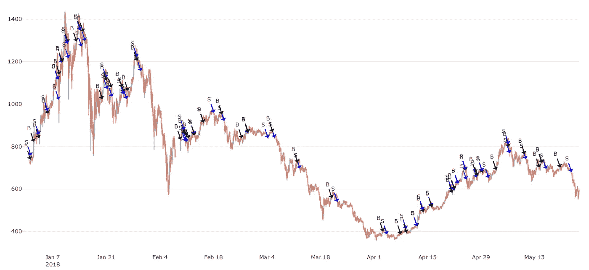
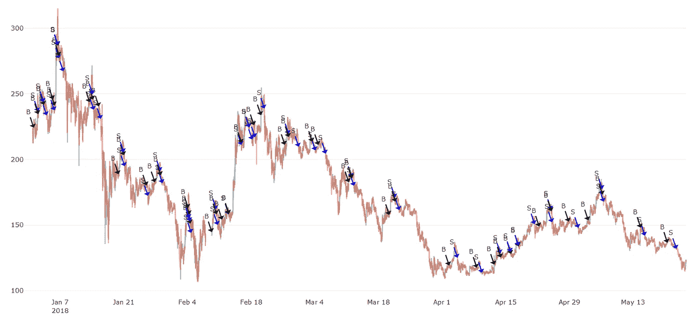

# 使用看跌检测改进 Macd 2.0 加密交易算法

> 原文：<https://medium.com/coinmonks/improving-the-macd-2-0-crypto-trading-algorithm-using-bearish-detection-4f7f4fb2d54f?source=collection_archive---------2----------------------->

之前我们分析和讨论了我们全新的 Macd 2.0 算法。如果你读过我们的帖子，你就会知道我提到过这些算法可以改进很多。在这篇补充文章中，我将讨论我在改进 Macd 2.0 算法方面的进展。

# 趋势交易

正如我在以前的文章中提到的，市场的状态非常重要。例如，不要在市场下跌时交易，除非你真的知道自己在做什么。

> 另请阅读:[最佳加密交易机器人](/coinmonks/crypto-trading-bot-c2ffce8acb2a)

目前，我们的算法都没有考虑到这一点，这就是为什么 30 天的投资回报率从超过 40%(两周前)下降到不到 15%(现在):

Signal ROIs as of today

你可能还记得，MACD 指标是通过减去两条移动平均线确定的。然后，我们可以使用这些新数据，提出一个交易算法/启发式算法——这是我们一直在做的事情。

现在的挑战是通过考虑其他特征来优化我们的 Macd 2.0 算法，例如市场是否**看跌**。通过在我们的程序中添加额外的代码行，我们增加了它的复杂性，并使它更难进行超参数优化。为了让后者尽可能简单，我们必须让代码尽可能简单，但又有效。

# 方位探测

我花了很多时间尝试各种指标，设计算法，让我能够发现熊市。但是我越努力，我的代码就变得越复杂，这是非常不利的。最终，我想出了一个简单而有效的方法。

让我们通过回溯测试来评估我的新看跌检测技术。在下面的结果中，我运行了交易模拟并计算了它的投资回报率。这些测试都使用了 5 个月的数据，从 1 月 1 日到 5 月 24 日。

## USDT 联邦理工学院

下一张图显示了没有看跌检测代码的买入/卖出信号**。其平均投资回报率为 78%。**

下一张图显示了带有看跌检测代码的买入/卖出信号**。其**平均 ROI 为 97%** (比原算法多+19%)。**

## LTC-USDT

下一张图显示了没有看跌检测代码的买入/卖出信号**。其平均投资回报率为 41%。**

下图显示了带有看跌检测代码的买入/卖出信号**。其**平均 ROI 为 51%** (比原始算法多+10%)。**

## BTC-USDT

下一张图显示了没有看跌检测代码的买入/卖出信号**。其平均投资回报率为 12%。**

下一张图显示了带有看跌检测代码的买入/卖出信号**。其**平均 ROI 为 36%** (比原算法多+24%)。**

## 结果分析

看跌检测代码显然做得很好。它将所有算法的投资回报率平均提高了 15%，对 BTC 的改善最大。

这些改善在图表上也清晰可见(这就是我展示它们的原因)——你可以注意到，在价格下跌期间:由于熊市检测，买入/卖出交易大大减少。这消除了许多亏损的交易。最终结果是更高的投资回报率。

## 结论

在这次分析中，我使用了 5 个月的数据，而不是传统的 30 天。这样做是为了强调对整体投资回报的影响。这个长周期也比 30 天的周期有更多的看跌周期。如果我在随机选择的 30 天范围内运行相同的分析，我们可能会看到 ROI 的变化要小得多，因为毕竟它在短期内没有那么大的影响。

这是我能想到的最好的看跌检测代码，它对整体投资回报率也有积极的影响。所以优化之旅并没有到此结束，这只是一个开始。在一些更成功的分析后，我会用这个熊市检测代码调整我们现有的应用程序算法/信号。

感谢您的阅读！如果你喜欢我们的内容，请随意给这篇文章鼓掌。请关注我们，了解更多信息。
——伊利亚·内沃林

## 另外，阅读

*   [最佳加密交易机器人](/coinmonks/crypto-trading-bot-c2ffce8acb2a)
*   [Deribit 审查](/coinmonks/deribit-review-options-fees-apis-and-testnet-2ca16c4bbdb2) |选项、费用、API 和 Testnet
*   [FTX 密码交易所评论](/coinmonks/ftx-crypto-exchange-review-53664ac1198f)
*   最好的比特币[硬件钱包](/coinmonks/the-best-cryptocurrency-hardware-wallets-of-2020-e28b1c124069?source=friends_link&sk=324dd9ff8556ab578d71e7ad7658ad7c)
*   [密码本交易平台](/coinmonks/top-10-crypto-copy-trading-platforms-for-beginners-d0c37c7d698c)
*   最好的[加密税务软件](/coinmonks/best-crypto-tax-tool-for-my-money-72d4b430816b)
*   [最佳加密交易平台](/coinmonks/the-best-crypto-trading-platforms-in-2020-the-definitive-guide-updated-c72f8b874555)
*   最佳[加密借贷平台](/coinmonks/top-5-crypto-lending-platforms-in-2020-that-you-need-to-know-a1b675cec3fa)
*   [莱杰 vs 特雷佐](/coinmonks/ledger-vs-trezor-best-hardware-wallet-to-secure-cryptocurrency-22c7a3fd391e)
*   Bitsgap 评论——一个轻松赚钱的加密交易机器人
*   [Quadency Review](/coinmonks/quadency-review-a-crypto-trading-automation-platform-3068eaa374e1) -为专业人士打造的加密交易机器人
*   [PrimeXBT 评论](/coinmonks/primexbt-review-88e0815be858) |杠杆交易、费用和交易
*   HaasOnline 评论享受九折优惠
*   Bitmex 上的[保证金交易指南](/coinmonks/the-idiots-guide-to-margin-trading-on-bitmex-dbbd7742c6fc?source=friends_link&sk=7bfa99d2a181142510c8442c8ddb0786)
*   [eToro 评论](/coinmonks/etoro-review-78807ddeb33c) |交易股票、密码、交易所交易基金、差价合约和商品
*   [Bitmex 高级保证金交易指南](/coinmonks/bitmex-advanced-margin-trading-guide-2270c195ce25?source=friends_link&sk=1d986cca731f5084b9a2db4a4bc4a7ad)
*   [开发人员的最佳加密 API](/coinmonks/best-crypto-apis-for-developers-5efe3a597a9f)
*   [加密套利](/coinmonks/crypto-arbitrage-guide-how-to-make-money-as-a-beginner-62bfe5c868f6)指南:新手如何赚钱
*   顶级[比特币节点](https://blog.coincodecap.com/bitcoin-node-solutions)提供商
*   最佳加密制图工具
*   了解比特币的[最佳书籍有哪些？](/coinmonks/what-are-the-best-books-to-learn-bitcoin-409aeb9aff4b)