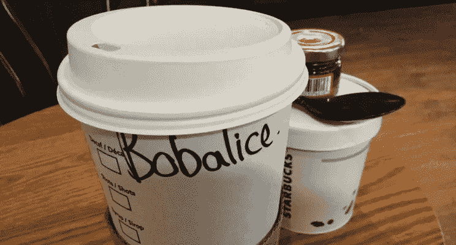

# 在一个区块链世界中，我们如何在不透露他们年龄的情况下判断 Bob 是否比 Alice 大？

> 原文：<https://medium.com/coinmonks/in-a-blockchain-world-how-can-we-tell-if-bob-is-older-than-alice-without-revealing-their-ages-2611d6ba2a0c?source=collection_archive---------12----------------------->

自从开始计算以来，我们已经处理了真实值，所以如果我们需要确定 Bob 是否比 Alice 大，我们需要让 Bob 和 Alice 告诉我们他们的年龄，然后让我们进行比较。

但是，如果鲍勃不想透露他的年龄，爱丽丝也不想。的答案…