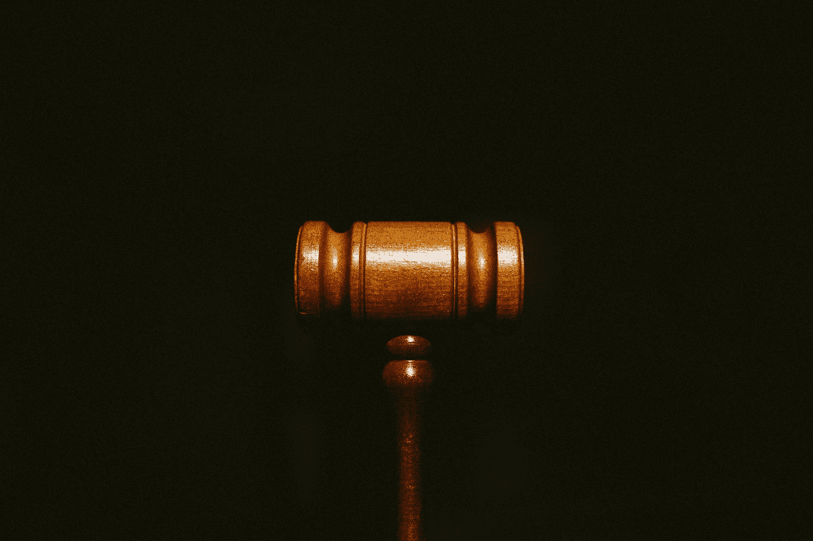

# 为波尔卡多特的治理机制辩护

> 原文：<https://medium.com/coinmonks/in-defence-of-polkadots-governance-mechanism-83db6558e33f?source=collection_archive---------4----------------------->

## 6 批评及其反驳

Photo by [Tingey Injury Law Firm](https://unsplash.com/@tingeyinjurylawfirm?utm_source=medium&utm_medium=referral) on [Unsplash](https://unsplash.com?utm_source=medium&utm_medium=referral)

我看到了一些批评 Polkadot 的链上治理机制的推文。通常，我会跳过它，但这些引起了我的注意，因为我是 Polkadot 生态系统设计的粉丝，特别是，它融合了链上治理和无叉升级。我相信这种结合是一个巨大的飞跃…