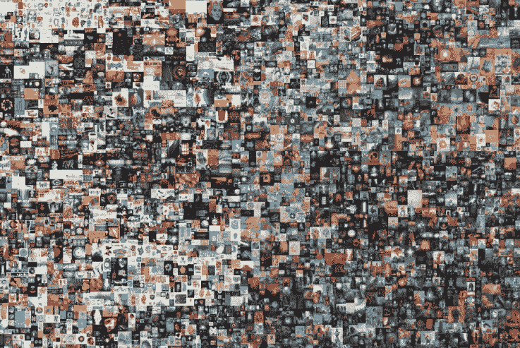

# 为非功能性测试的乐观未来辩护

> 原文：<https://medium.com/coinmonks/in-defense-of-an-optimistic-future-for-nfts-3e250e41334a?source=collection_archive---------4----------------------->

## 数字艺术不是泡沫，它正在经历四个方面的发现

Beeple’s collage, Everydays: The First 5000 Days, sold at Christie’s. Image: Beeple

迈克·温克尔曼是世界上最有价值的三位在世艺术家之一，而你从未听说过他。更为人所知的是，温克尔曼是“每一天:前 5000 天”背后的艺术家，这是第一件由…