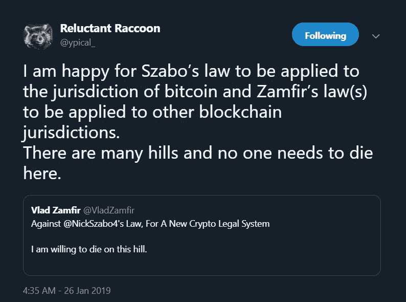

# 为萨博定律辩护，对于一个(大部分)不合法的加密系统

> 原文：<https://medium.com/coinmonks/in-defense-of-szabos-law-for-a-mostly-non-legal-crypto-system-8f1ce2b364a6?source=collection_archive---------2----------------------->

## *律师回应 Vlad Zamfir 的“反对 Szabo 的法律，为了一个新的加密法律系统”*

Crypto Law — Is it a Thing?

律师！你厌倦了 devs 掌握着区块链的所有权力吗？你希望回到过去的好时光吗？那时开发者来问你他们的软件如何符合法律，而不是你去问开发者他们的软件如何符合法律？你有没有像默默无闻的密码律师安吉拉·瓦尔希一样，觉得“[表现得好像区块链全是数学或科学，而实际上它们只是关于人们决定一起工作……](https://twitter.com/angela_walch/status/1083069503335002112)”令人费解？

安静点。欢呼吧！领先的以太坊开发者和分片理论家弗拉德·扎姆菲尔[宣布了“密码法律”的诞生](/@Vlad_Zamfir/against-szabos-law-for-a-new-crypto-legal-system-d00d0f3d3827)现在，你可以通过帮助定义一个专门适用于区块链科技社会治理的新的、定制的法律秩序来再次感受到自己的重要性(&大概是在一些跨部门的开发人员、用户、矿工、交易所、警察部队和立法者之间达成一致并执行的？但是，请询问这是如何工作的…)。你的工作安全有保证！你的社会地位，恢复了！

除非你像我一样，认为弗拉德意义上的“秘密法律”是只有非律师才能想象出来的东西，尽管它可能代表了一种非常有趣、创造性和智慧的区块链方法的核心，但它迫切需要——嗯，因为缺乏更好的词，一些律师服务。

我试图保持这种简洁和非正式，所以，不再多说，我只想说我不同意 Vlad 建议的某些方面(尽管我认为他有一个非常有趣的想法的核心),并在下面的三个核心建议中提出一些仓促拼凑的批评和建议的替代方案:

1.我们坚持真正的密码法则，而不是试图发明“密码法则”

什么是“关于密码的真正法律？”事实证明，它已经以法令和普通法(包括允许高度私人订购的普通法合同法)的形式存在了，尽管这些法律中的绝大多数没有明确提到(并且在发明区块链技术之前很久就被阐明了)。

诚然，这一法律的某些部分存在两个问题中的一个或两个:

(a)关于区块链理工大学，现有法律可能存在漏洞，这些漏洞应该被填补——当立法者修改或法院解释旧法律以涵盖区块链等新技术时，这可能会发生。这方面的一个很好的例子可以在怀俄明州的《统一商法典》待决附录中找到，该附录试图通过定义区块链代币的不同类别来填补 UCC 的空白，在合理可能的情况下将它们与给定类别的传统 UCC 规则联系起来，并在必要时创建新的规则——例如，通过创建“控制”的新概念来完善区块链代币的担保权益。

(b)现有法律会有不良(非故意的？)应用于区块链时的后果或抑制创新的结果。同样，这只能通过正常的政治法律程序从立法或司法上改变法律来解决。我个人认为，这方面的一个例子是美国联邦证券法，其中一些适用于区块链(反欺诈，一些披露要求)，而另一些则不适用(萨班斯-奥克斯利法案)?)——但美国证交会目前似乎普遍认为，这应该在大规模批发的基础上适用于许多区块链代币。此类问题的解决方案是，在监管机构有权批准豁免和修改适用于区块链的现有法律的范围内，与监管机构进行接触，或者在这种方法不足以解决问题的情况下，说服法官或立法者修改适用于区块链的法律。

尽管存在上述限制——我们预计这些限制适用于任何高度创新、因而具有“颠覆性”的新技术——法律就是法律:法律的绝大部分已经存在，并经历了几个世纪的测试、调试和(主要是)保守的渐进优化。无论需要对它进行什么样的改变以适应像区块链这样的新技术(当然，如上所述，还有一些)都不能仅仅由弗拉德·扎姆菲尔和区块链的其他居民(chainizens？区块链岩？波波洛·查诺斯？)，不管他们有多少人，也不管他们在这个问题上意见有多广泛。相反，Vlad 和其他区块链开发者/用户最多能做以下一项或两项:

→参与传统的法律制定/影响过程，如游说、撰写有影响力的思想文章、为他们认为在立法和裁决时能代表他们利益的政治家和法官投票等；和/或

→签订合同(合同必须符合真正的合同法，而不是“密码法”)，在他们之间就某一套治理规则达成一致，作为私人订单。

***注:*** 第二种可能性(通过合同进行私人订购)实际上非常非常强大，是一种可以让 chainizens/blockchainets/popolo chainos 更快地用法律做更多事情的途径，以类似但不完全是 Vlad Zamfir 可能喜欢的方式，而不是创建一个全新的“加密法律系统”我在文章的最后更多地谈到了这种可能性，但是，就目前而言，可以说这是我推荐的方法的一部分，最终意味着我并不像目前为止看起来那样强烈地反对 Vlad。

2. ***我们为探索萨伯定律保留了空间，让那些想使用它的群体这样做***

*A .什么是萨博定律？*

弗拉德这样描述“萨伯定律”:

> Szabo 法则很简单:除非出于技术维护的目的，否则不要对《区块链议定书》进行修改。

大多数人可能没有注意到这一点，但将这定义为一条定律，一条 Szabo 所相信的定律，并准确地定义这一“简单”的事情，是 Vlad 的精彩修辞策略，如果我们让它们毫无疑问地溜走，可能会在辩论开始前赢得一半的辩论。因此，我们绝不能这样做。

如果你仔细阅读弗拉德的文章，就会发现他的批评并不局限于萨博的“法律”(据我所知，萨博从未定义过，当然也从未定义为“法律”)，而是指人们可能更普通、更自然地提到的萨博的“方法”、“哲学”或“精神气质”。比如，他反复提到萨伯是“不安全的”以及萨伯的各种辅助行为(以一种不太恭维的方式描述),这些行为据说支持了“萨伯定律”的传播和接受。因此，很明显，弗拉德不仅反对他称之为“萨伯定律”的简单“定律”或规则，还反对与该“定律”相关的一系列规范、假设和目标。

虽然我不同意弗拉德所批评的东西是一种“法律”,并认为这样称呼它是非常令人困惑和适得其反的，但我 ***do*** 同意它是区块链世界中一种非常真实的文化力量，并且足够分散，可以具体化，举起，审查和批评，赞扬或建设。与弗拉德不同，我不把这个真实的东西称为“萨伯定律”，而是称为区块链技术的“社会信任最小化方法”。虽然不同的人在不同的时间以不同的方式描述和倡导这种方法，但我认为它可以追溯到迄今为止最清晰和最著名的表达，也是我个人最喜欢的表达:萨伯的论文“[金钱，区块链和社会可伸缩性](https://unenumerated.blogspot.com/2017/02/money-blockchains-and-social-scalability.html)因此，我并不否认弗拉德是在批评一件真实的事情——区块链的社会信任最小化方法——而尼克·萨博是这件事情的典型代表。

尼克·萨伯和我有一个共同点:我们都是律师(尽管在尼克的案例中，他可能没有执业，但他有一个法学博士学位，是一个非常热衷于法律历史的长期学生，这使他在我的书中成为一名律师)。相似之处到此为止，因为尼克在技术上远比我娴熟，他花了数年时间开发革命性的软件，我冒昧地猜测，我在法律上比尼克更娴熟，他花了 8 年时间在真正的 AMLAW10 律师事务所为真正的高风险客户做高风险交易。但在这种情况下，我们都有对法律的深刻理解(而不是主要由弗拉德自己承认的，通过阅读我认为是一个非常有争议的，分散的和不均衡的区块链焦点法律博客而形成的理解)，这解释了为什么我们可能都看到了社会信任最小化的优点，并就弗拉德在他的文章中提出的问题得出了类似的结论。

我邀请任何怀疑至少探索通过区块链最小化社会信任的价值的人做一件简单的事情:阅读尼克的文章。除了回顾我在文章“[标记公司股本](https://gabrielshapiro.wordpress.com/2018/10/28/2/)”中给出的注释，我没有太多要补充的了:

> 从纯粹的表演角度来看，区块链很烂。更糟糕的是，在利用所谓的“客户端-服务器/主-从架构”的网络上，*做不到*做不到的事情，区块链技术都做不到……更糟糕的是，由于这些“客户端-服务器/主-从”架构可以依靠集中式协调机制来实现拜占庭容错和 sybil 抵抗，因此它们(比区块链技术)更快、更便宜、更易于使用。因此，区块链技术对大多数应用的“独特卖点”(USP)不是“做与集中式技术完全相同的事情，而是更快、更便宜、更方便。”……[相反],区块链技术的 USP 在于它通过创建普通人在一个[社会]信任最小化且安全的环境中持有、管理和交易资产所必需的技术断言，推进了个人资产主权的价值。

这就是 ***真正的*** 萨博定律，以及它与区块链的关系，简而言之。

*B .什么是赞菲尔定律？*

弗拉德想要什么而不是 Szaboist (Szabbic？Szaboean？)社会信任最小化方法？坦白地说，这有点难以判断，但对他的一种解读方式是，他希望链化人走到一起，定义他们自己的“法律”(尽管不是真正的“法律”，更像是一个社会商定的规则集)，以确定如何/何时/何处分叉区块链/区块链协议，以便他们可以相对经常地分叉，为受委屈的人提供更快的“正义”，确保区块链上非密码法律和密码法律的执行，并以更快的速度促进区块链创新。因此，我推测他想要的是一套规则(大概包括如何修改或补充这些规则的元规则)，在经过长时间的辩论后，每个人都同意这套规则，例如，如果 Parity 由于黑客攻击而损失了资金，Parity 可以通过某种社会进程(查询这是什么)提交问题，该进程将迅速、果断和合法地工作，以确定资金是否、如何以及多少应该通过 fork 返回给 Parity。

这听起来熟悉吗？应该的。这基本上是目前的法律争端机制程序，但在新的准区块链政府的要求下，在一套新的准法律规则和一套新的准法律法官/立法者/代表的指导下适用于区块链。从本质上看，Vlad 想要做的是创建一个完整的加密法律系统，该系统与传统法律系统平行运行，但在传统法律系统之外，不与传统法律系统冲突或违反传统法律系统。Vlad，如果我在某种程度上有错，请随时指出并纠正我，但你必须承认，尽管你对不变性的批评非常清楚，但你对在你的视野下如何/何时/何地做出可变性决策并不清楚——所以，公平地说，在后一点上我没有太多工作要做。

让我们把这种制度应该存在并应该管理区块链的法律称为“赞菲尔法律”。

虽然 Zamfir 定律代表了一个令人钦佩/有趣的目标，但它也可能是一个非常浪费和不可信的目标。我们已经有了一个伟大的法律体系，建立了几个世纪。至少在美国和世界上其他高度发达的地区是这样。一个非常合理和自然的问题是，为什么我们认为由一群可能混杂(尽管可能可爱)的密码爱好者拼凑的“密码法”可能会做得更好——至少在规模上是如此(同样，见下面第 3 条关于私人订购的一些相反观点)。

*C. A 海波:为什么萨伯定律和赞菲尔定律会冲突？*

为了理解为什么/如何 Szabo 定律和 Zamfir 定律可能冲突，以及为什么 Szabo 定律(或者，实际上，Szabo 的社会信任最小化方法)是值得保留/探索的东西，让我们考虑一个 hypo 的变体，这个变体对激发我关于区块链的智能合约和应用于其上的社会信任最小化的潜在价值非常有影响。

1.  你住在印度。
2.  我住在美国。
3.  我们在/r/mechmarket 见面，我得知你有一个别致的定制键盘——黄铜重量，碳纤维板，HHKB 布局，改装过的老式 nixendorf 开关，带 hotlites 的全 RGB，像梦一样的类型——我想买。
4.  我们打算签订一份合同，我同意购买，你同意以 1000 美元的价格出售你的键盘。
5.  对于键盘交易来说，预付款是惯例，而且，除非我先付你钱，否则你不愿意把键盘寄给我。
6.  但在尽职调查中，我了解到印度有一个出了名的低效、错综复杂的法律体系，即使是印度人(更不用说像我这样的美国人)也很难成功驾驭这个体系——显然，如果我付钱给你，但你违反了合同，没有交付键盘，我实际上就没有任何补救措施，因为我不可能忍受在印度起诉你的时间和费用——特别是因为即使我这样做了，我也不太可能得到满意的补救。
7.  因此，我考虑根据美国法律执行协议，但随后意识到，即使我根据美国法律清楚、迅速和有效地证明违反了合同，对我也没有任何好处，除非我可以在你和键盘所在的印度执行判决——因此，印度法律体系的所有问题仍然不可避免。
8.  但是，我有一个想法——“让我们通过一个可信的中介来做这笔交易！”“如果我们使用贝宝，”我说，“贝宝将有效地保障我免受你欺诈的可能性。如果我付款后没有从你那里拿到键盘，PayPal 会退款给我。虽然这不如我在美国时能够获得合同的“具体履行”作为一种补救措施(即，法院强迫你向我交付你同意出售的键盘)，但至少我会有*一个*补救措施，这比没有补救措施要好，我认为为了能够达成交易以获得这个潮湿的键盘，这是我愿意冒的风险。”
9.  不过，你告诉我，你不喜欢这个主意，因为贝宝将欺诈索赔的几乎所有风险都放在了卖家身上。PayPal 还向卖家收取交易费，这是 PayPal 为这类交易中的欺诈风险提供保险的经济意义的一部分——实际上，我使用 PayPal 意味着我支付更低的董事会价格作为折扣，反映了我对印度法律体系的不信任。最后，你会注意到，你曾经被 PayPal 骗过——你给别人寄了一个通过 PayPal 购买的键盘，而买家试图通过立即向 PayPal 提出未收到的索赔来进行非区块链版本的“双重消费”,这导致了购买款在 PayPal 被扣留了六个月，同时 PayPal 对索赔进行了调查。更糟糕的是，PayPal 犯了错误，做出了不利于你的决定，因此你失去了你的键盘和资金，没有有效的补救措施——因为你不愿意为了 1000 美元的索赔而通过美国法院，就像我不愿意通过印度法院一样。你永远不会原谅 PayPal，不相信 PayPal，相信 PayPal 有亲美偏见，永远不会给你公平的待遇。
10.  我不信任印度的法律体系，你也不信任我提议的中间人(PayPal ),这会让我不信任印度的法律体系。我们该怎么办？
11.  *竞技场灯光昏暗*
12.  *金属乐队的《进入睡魔》渐弱*
13.  *灯光开始闪烁，数字硬币在大屏幕上级联*
14.  *区块链进入舞台，像盛年的瑞克·佛莱尔一样昂首阔步，赢得雷鸣般的掌声*
15.  这个呢？假设你懂代码，我懂代码，我们都对特定的区块链和其上的代码的工作方式有很强的信心。那时我们能做什么？
16.  虽然你不信任 PayPal，我也不信任印度的法律体系，但总的来说，任何两个人都可以找到至少另一个他们都信任的人。在这种情况下，我们有——/u/Ripster——一个美德的典范，一个英雄，一个机械键盘社区的传奇，他(我们假设)恰好位于美国，在我的驾车距离之内。
17.  现在，难道我们不能这样做吗？

→在以太坊上部署一份我们双方都理解的智能合同

→我在那里存了价值 1000 美元的 ETH

→智能合同授予 Ripster 的私钥唯一权限，可以将 1，000 美元发送给你(在键盘成功交付后)或返回给我(如果键盘未在截止日期 x 前交付)

→您将键盘邮寄给 Ripster

→Ripster 通过发送到 smart contract 的传输命令释放 ETH，该命令由他的私钥签名(或首先向我展示键盘，以便我检查它，然后释放 ETH)

→我从 Ripster 那里拿键盘。

这是我(我猜也是尼克·萨博)对区块链的梦想。 人们可以玩弄细节，或许还可以想象出进一步降低社会信任度的方法，但关键在于，这项技术为通过私人订购加强交易创造了大量的机会。那些不会完成的交易，或者只会以更高的成本或更多的问题和风险完成的交易，可以完成，或者以更低的成本或更少的戏剧性完成，充分利用区块链。或者，至少，这是一个梦想——我们要把它变成现实。

然而，你知道什么可能真正限制这个梦想的价值吗？没错，你猜对了——赞菲尔定律可以。再次注意我的皮下注射液中的 15 号。为了让这个方案打破我们的交易僵局，至关重要的是，我们要消除除了我们碰巧分享的两种信任形式之外的所有形式的信任 Ripster 中的社会信任和部署在某某区块链上的某某智能合约代码将导致某某可预测结果的数学/计算信任。但是，如果区块链可以通过一个社会法律但非司法的“密码法”过程来改变，那么除了我们对 Ripster 的共同信任之外，我们还需要一种额外的社会信任——对“密码法”和应用它的人的信任。对我来说，这是一个主要问题，可能会大大削弱区块链的潜在利益。

当然，弗拉德和像安吉拉·瓦尔希这样的批评者会指出，这种信任总是需要的——即使是比特币，最厌恶改变的区块链，*也可以被改变，因此在使用比特币时，我“相信”那些可能会对它产生负面影响的人不会这样做。但是，一般来说，什么更容易信任:*

*(a)一个由根深蒂固、历史悠久并广为宣扬的“萨博定律”所“统治”的区块链，在理论和实践上都意味着区块链几乎永远不会改变，除非有几乎任何有理智的人都会同意的极其重要的原因？或者*

*(b)高度复杂的赞菲尔法则/"密码法则",实际上是有意让一群人决定是否、何时以及如何改变区块链、他们商定的复杂原则以及他们可能决定在特定情况下适用这些原则的特定方式？*

*我认为，总的来说，由萨伯定律支配的区块链更容易信任，因此在某种意义上有助于“最小化信任”，或最小化信任的数量或复杂性，这是促进通过区块链进行私人订购所需要的，而赞菲尔定律极大地增加了这种信任，因此回避了为什么区块链甚至会优于同样需要高度社会信任的现有替代方案的问题。毕竟，有没有可能你不信任“密码法”和它的管理者就像我不信任印度法律一样，因此通过使用区块链，我们只会转移，而不是解决，最初导致我们考虑使用区块链的信任问题？*

*另一方面，我要承认的是:人们对于他们所信任的事物会有非常不同的偏好。有些人(大概像安吉拉·瓦尔希)认为一切“最终都是关于人的”，对自动化、数学化的决策几乎没有信心或渴望。其他人(比如我和前总统尼克·萨伯)认为，在尽可能减少必须信任的人、社会变量和社会机构的数量，以及必须对这些事情的信任程度(无论这种信任需要到什么程度)的同时，能够达成交易是有巨大前景的。这是一个自由的世界，有很多很多的空间来拥有不同的技术，甚至不同的区块链，来迎合这些不同的偏好。*

*这就引出了我的下一点。*

**D .为什么萨伯定律和赞菲尔定律尽管相互冲突，却不相互排斥？**

*我觉得[不情不愿的浣熊](https://twitter.com/ypical_)说得好:*

**

*长话短说:有不同的区块链。有些可以用赞菲尔定律。有的可以用萨博定律。人们甚至可以将一个使用赞菲尔定律的区块链或一个使用萨伯定律的区块链分叉，并试图说服人们将萨伯定律应用于前者的分叉版本，或将赞菲尔定律应用于后者的分叉版本。我们可以让市场和历史来决定哪种方法更好(要么绝对适用于所有目的，要么相对适用于某些目的)。没有必要呼吁否定或谴责任何一方。让世界去试验吧。*

*3.*

***正如上文第一点所述，在我看来，弗拉德似乎认为的“密码法”(一部分区块链人自愿同意的东西)对于我有点滑稽地称之为“法律法”的东西来说，既不是必要的，也不是可行的替代物——我指的是真正的法律，即由国家制定并通过暴力、监禁和/或剥夺财产等形式的胁迫威胁来实施的法律。你知道，“老式”法律——你爸爸的爸爸的爸爸的法律。***

******然而，*** 你知道弗拉德的“密码定律”听起来像什么吗，除了给它起了个欠考虑的名字？哦，我不知道，“在一个可强制执行的私人秩序系统中，通过契约达成的治理协议”怎么样？我知道这有点拗口，但归根结底，这难道不是他真正提议的，也是他真正需要的吗？公司会这么做。有限责任公司就是这样做的。达成交易的私人团体会这么做。一直都是。法律，真正的法律，帮助他们。***

***我并不真的喜欢/支持 EOS，但 EOS 的一个有趣的特点是，它通过一个用自然语言编写并以李嘉图方式刻在 EOS 区块链上的所谓的“[宪法](https://github.com/EOSIO/eos/blob/5068823fbc8a8f7d29733309c0496438c339f7dc/constitution.md)，将区块链理工大学与湿合同技术结合起来。我一直对 EOS 决定实施这种方法的特定方式非常不满，人们可以质疑他们的宪法是否具有可执行性，并对其实施的法外方式吹毛求疵。此外，总的来说，我同意 V [lad 对链上治理的担忧](/@Vlad_Zamfir/against-on-chain-governance-a4ceacd040ca)(所以我真的不同意他的观点，正如我希望我在这里阐明的那样，关于区块链治理(无论是链上还是链下)的必要性或可取性的程度)。 ***然而***《EOS 章程》背后的核心理念——即，将区块链技术与一种合同“服务条款”相结合，并可能为其各种用户/维护者提供“分叉条款”——非常有趣且潜在强大，可能是在现有法律框架内实施类似 Vlad 的理念的一种很好的方式。***

***例如，AFAIK 没有什么可以阻止 Vlad 分叉以太坊，声明他的以太坊版本只能由签署(无论“签署”的含义是什么，可能包括点击协议)合同的人使用、修改或参与，该合同同意所有关于冻结资金、黑客、分叉或任何其他问题的争议将由遵循“密码法”的“Vladdites 委员会”决定，如附件 A 中所定义，并可能根据关于修订的密码法#5 不时进行修订或补充。这似乎可以实现弗拉德通过拒绝萨伯定律想要实现的大部分目标，但不会以消除碰巧喜欢和/或只是想玩和探索萨伯定律的可能性的系统的存在为代价。***

***我谦卑地问一句——这个版本的“密码法则”有什么问题？利用当前真正合法的合同法，让一群志同道合的人走到一起，为特定的区块链建立一个复杂的区块链治理体系，从而使其能够经常分叉，这种方法有什么错？我看不出有什么问题。我甚至希望看到它被采用和实验，当然作为一名律师，我会尽全力帮助建议合同约定的“密码法”应该是什么样的。作为一名律师，这就像为有史以来最酷的交易之一提供建议——为交易建立平台的交易！***

***但我也看不出为什么这种模式应该是通用的，或者为什么它应该是区块链唯一可能的*类型。我有一个问题要问弗拉德，这是否是他职位的一部分，或者他只是想让密码法成为区块链的众多选择之一。有人可能会说(我怀疑，但我不确定，弗拉德会不会说)区块链“没有密码就太危险了”。****

****但是为什么呢？“法律的法律”仍然存在，无论我们做什么，法律的法律可以调节区块链的危险就好。也许不是 ***完美地*** ，但是很好。随着我们律师努力应对这一迷人的新技术，这样的法律将继续发展，变得更好。为什么要预先假定这是不可行的，并试图强加一个平行的“密码法律”，这基本上取决于一个新的“密码国家”的存在？据我们所知，对区块链所谓危险的“治疗”最终可能比疾病更腐败、更危险。而且，如果经验可以作为指导的话，当新政府/法律体系从零开始建立时，它们通常都很糟糕，把权力交给怪人，并以灾难告终。有充分的理由保持谨慎。****

*******结论*******

****弗拉德是一个非常聪明和有趣的家伙，我很高兴他正在研究和发表他的想法——包括关于区块链治理和“密码法”的想法这并不意味着我不能批评他们。就像我要写一些关于编码某些方面的长篇大论，我很可能会以这样或那样的方式严重破坏它，但也可能会想到一些有趣的想法，我类似地相信(真的没有下意识的优越感)，Vlad 在作为一名非律师冒险进入法律领域时，错过了许多关于法律和治理的细微差别。然而， 值得称赞的是，弗拉德有一个非常有趣的想法，他已经含蓄地接受了——即通过法律合同将区块链技术与私人订购的力量结合起来。我谨建议(或许结合一些真正的立法和监管游说)，而不是宣布区块链治理应该如何，应该制定什么样的“秘密法律”等等。，将是一个更具建设性的框架，在这个框架内解决弗拉德非常非常正确地关注的问题，即区块链利益的最大化和损害的最小化。****

****我将欢迎与弗拉德或任何对这些话题感兴趣的人进一步对话。****

> ****[在您的收件箱中直接获得最佳软件交易](https://coincodecap.com/?utm_source=coinmonks)****

********