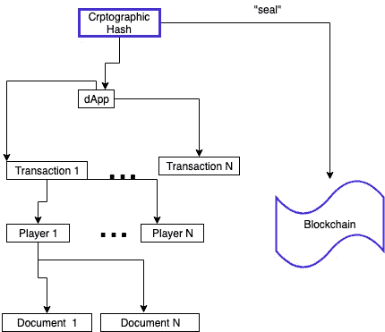

# 我们信任的医生！—关于文档驱动的交易

> 原文：<https://medium.com/coinmonks/in-docs-we-trust-about-document-driven-trading-db4389ceacad?source=collection_archive---------0----------------------->

Document Driven Trading

# 这可能是美好未来的开始…

…但是现在贸易资产令牌化有一个大问题。它只是还没有准备好黄金时间！原因很简单:真实资产和区块链上的加密令牌之间的联系缺失了——或者说这只不过是一个简单的约定。让我给你举个例子:任何建筑都可以很容易地“符号化”。它可以被建模为一个简单的数据结构，并在一个准备充分的 P2P 网络中进行处理。但这不足以开展真正的业务。

如果你出售或转让一栋建筑，你总是在当地管辖范围内进行。已经存在许多约定和标准。法律是有的。有很多拥有丰富商业知识的人来处理这些案件。我们不可能忽视现有的限制、成熟可靠的基础设施、许多人的专业知识以及他们的习惯。你不可能从零开始建立一个新的、数字化的、分布式的交易平台。**但这正是许多人目前正在努力做的事情！**

一种解决方案是“等待”缺失的基础设施成为现实。在我们的例子中，*基础设施*可以是建筑物的门，如果这些门有 IOT 连接的话。锁可以是任何种类的区块链地址，而负责开门的人可能是区块链地址的所有者。但这是科幻小说。我们不应该等待这样的梦想成真。

因此，这个问题同时出现:*在缺失的基础设施开发出来之前，我们能做些什么？*

我现在将描绘一些可以被称为*文档驱动交易*的东西。不会涉及智能合约！此场景中使用的唯一区块链功能是注册或“密封”文档的可能性。可以保证，某个文档…

1.  从某个时间点开始存在
2.  有特定的内容
3.  有特定的所有者

文档可以包含许多法律信息。它们可以是合同、发票、收据、订单和许多其他东西。每笔销售交易通常都包含大量的文档，随着交易的进行，文档的数量会不断增加。所以，给定一个特定的时间，任何交易都可以用与之相关联的一堆文档来表示。你把这堆翻一遍，就能明白交易明细是什么，状态是什么。

因此，利用我们的技术，现在可以在任何给定时间可靠地跟踪交易，并以这样一种方式“密封”交易，即任何参与方都可以信任它，即使没有其他形式的信任或联系。

我们假设我们有一个像 [IPFS](https://ipfs.io/) ( *我经常提到*[*【IPFS】*](https://ipfs.io/)*)这样的分布式文件存储系统，因为它的“点对点”特性，也因为它使用了许多目前很流行的概念*。因此，我们可以将文档保存在一个树状结构中，就像上图中描绘的那样:树的叶子就是文档。每个文档必须有一个*所有者*。—我们在图中称他为*玩家*，只是为了提醒您，在这个非常抽象的概念中，不同的名称可能是合适的，这取决于应用领域。

若干玩家将参与一个交易(或*游戏*)。

交易平台仅仅聚合了过去和现在正在进行的所有交易。在我们的图表中，我们将交易平台标记为 [DApp](/hbus-official/what-is-a-dapp-eec896a4bbbf) ，以指出这种无服务器的应用程序可能很适合这种情况。但是再一次:实际的应用程序类型可能依赖于特定的上下文，并且不能以通用的方式来确定。

正如我们已经知道的，完整交换的状态可以通过加密散列来标记，这将取决于所有过去和现在的事务的状态。使用 [Merkle 树](https://en.wikipedia.org/wiki/Merkle_tree)可以很容易地得到这个值。—但这些细节与本次讨论无关，因为它的范围更广。

让我们称这个密码散列为**信任封印**，只是为了在婴儿的早期命名。**信托印章**满足所有需要的要求。它…

*   唯一标识交换的状态
*   对于每笔交易中的每张单据，它都可以用来证明单据的有效性
*   在任何交易中，每次变化都会有所不同

**信任印章**可以定期保存，不依赖可信的第三方，例如通过使用类似 [tierion](https://tierion.com/proof/) 的服务。实现可验证的数字文档的重要性不能被高估。在每个管辖区，保证某些文件的有效性是政府的一项极其重要的任务。护照并不是唯一重要的例子。陪审团做出的任何判决都会产生一份文件，而这份文件需要是可验证的。任何继承案件中的任何遗嘱都是另一个很好的例子。商业伙伴之间的任何合同都有相同的要求。

在文章的开头，我们谈到了目前阻碍令牌化交易的缺失的基础设施。当然，这也适用于文档验证，但不太适用！

1.  你不需要一个“现代”或“第三代”区块链做这种登记。连比特币区块链都能做到。与其他功能相比，这是一个简单的功能。
2.  数字文档与其物理副本之间存在明显的联系。数字文档只是纸质文档的扫描结果。因此，如果您能够以透明的方式**管理、组织和验证**您的数字文档(涵盖交易的整个生命周期)，那么回到原始纸质文档总是很容易的。因此，*和*回到传统的、非数字化的工作流程将是可行的。甚至可以集成旧的遗留应用程序。
3.  未来更智能的自动化将成为可能:数字化文档可以由人工智能解析和处理。这种新功能的潜力是巨大的。它可以只在以*文档为中心的*交易平台的顶部上实现*，这里已经对其进行了概述。多么迷人的未来景象啊！*

最后，让我给你一些上述概念的可能应用:

*   交易电子书的分布式点对点市场
*   登记遗嘱的平台
*   房地产交易平台
*   全球货物运输和物流平台

很容易扩展这个列表。请你自己做！

我们在这里可以看到，并不总是需要利用“成熟的”区块链基础架构的全部潜力。**您并不总是需要智能合约！我个人对智能合约的真正潜力持怀疑态度，比如那些由以太坊这样的平台实现的智能合约。他们的想法很有趣。它们很容易解释。每个人都会对它们有一定的了解，因为常规合同的概念是众所周知的。我的问题是:*把现实世界的合同概念移植到区块链世界真的容易吗？这样的比喻往往很有诱惑力，但也有误导性。***

这也是我选择**而不是**在这个概念中使用智能合约的另一个原因。我刚刚使用了纸质合同的扫描件。尽管如此，用这种有限的方法所能取得的进步确实是巨大的。想想还有多少时间浪费在愚蠢的文书工作上。取消文书工作。

比智能合约更聪明，使用文档驱动交易！

> [在您的收件箱中直接获得最佳软件交易](https://coincodecap.com/?utm_source=coinmonks)

