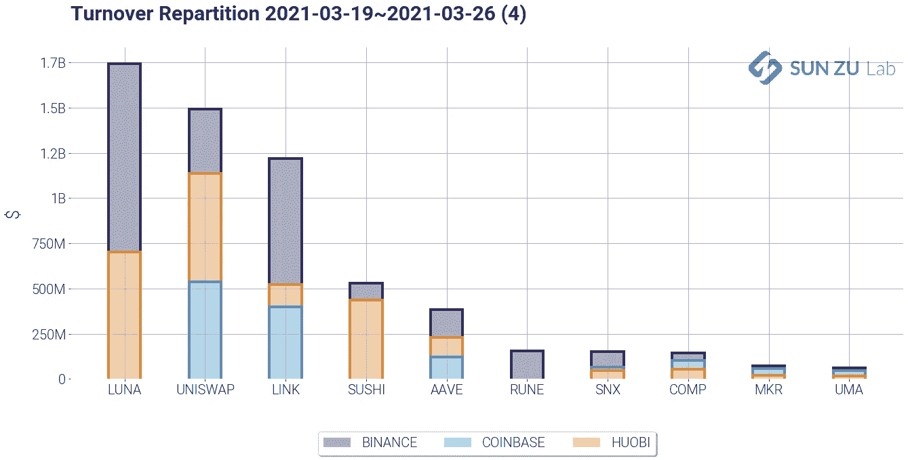
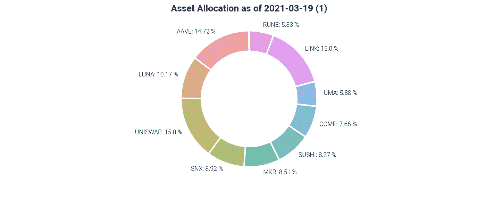
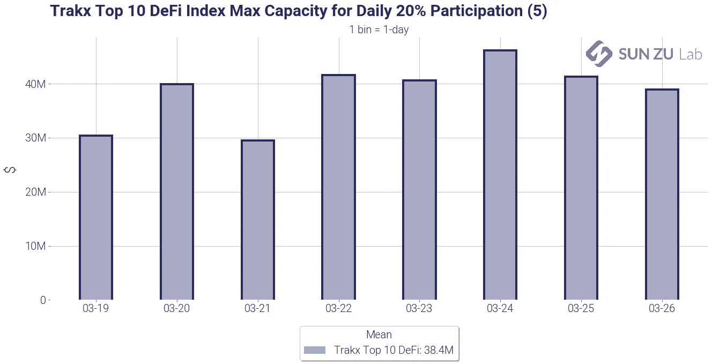
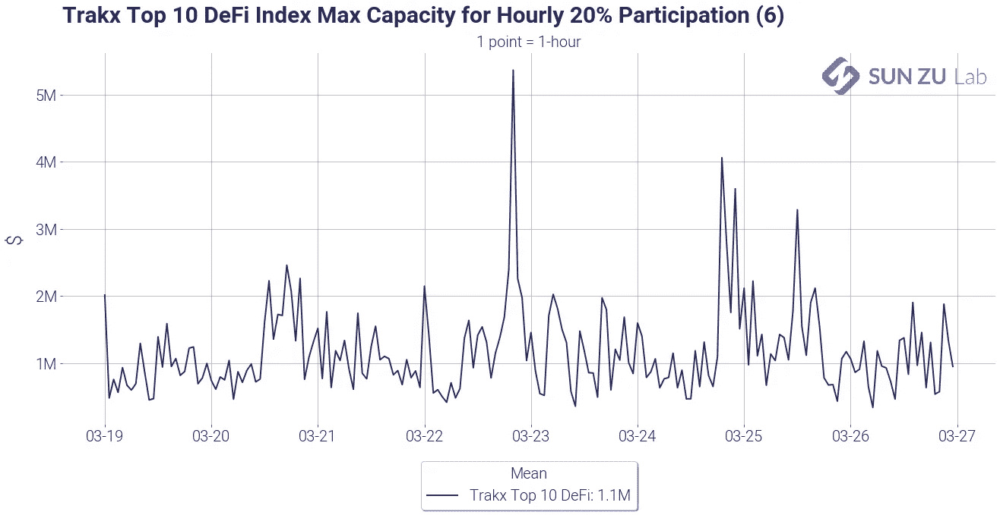
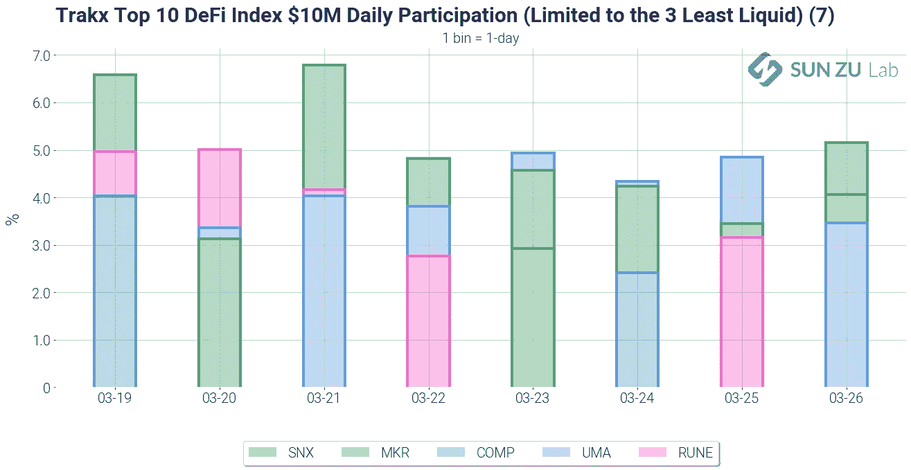
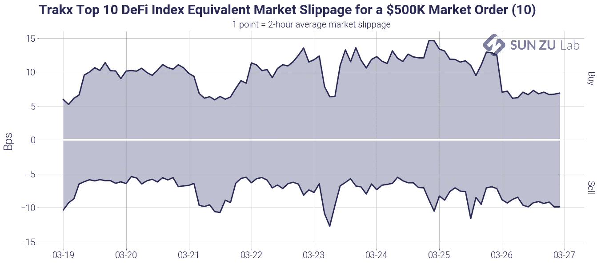
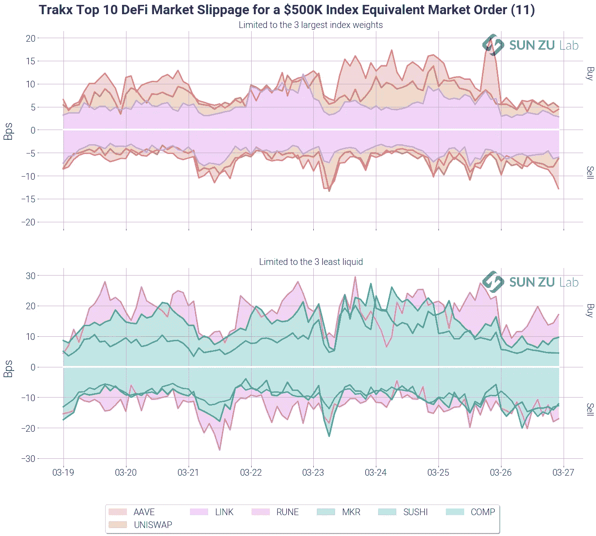

# 指数流动性:意味着什么？

> 原文：<https://medium.com/coinmonks/index-liquidity-what-does-it-mean-816aa988a78a?source=collection_archive---------3----------------------->

## 索引正在进入数字资产市场

指数化一直是传统市场上的一种流行策略，事实上，最近的历史表明，指数基金和 ETF 获得了大量资金流入，资产增长优于主动管理型基金。

因此，数字资产开始出现索引也就不足为奇了。对于投资者来说，这是一种从交易量最大的资产中分散投资的方式，同时保持严格的方法以避免武断的决定。Trakx 是此类索引解决方案的领先提供商。

然而，指数化策略下的投资并不一定意味着更多的流动性。事实上，一个指数通常只不过是其各部分的总和。因此，评估指数流动性意味着深入研究基础篮子。这是我们在 [SUN ZU La](https://sunzulab.com/about-us/) b 的专长，本文的目的是在 Trakx 指数之一的背景下介绍我们的方法，该指数由以下组成:

我们的目的是建立该指数的基本流动性特征，使投资者能够根据市场的实际情况定制他们的执行策略。

## ***投资者想知道的基本面特征是什么？***

如果你要投资任何一种证券，你的第一个问题将是评估在不引起不利价格变动的情况下有多少容量。该容量与您的分配相匹配吗？否则，你将无法建立你想要的曝光率。

投资于指数意味着购买基础篮子，并跟踪随时间的变化。这些变更由指数赞助商发布的书面文件管理。例如，如果你将 100，000 美元投资于一个由 4 个同等权重的成分组成的指数，你将不得不在每个成分上投资 25，000 美元。每个组件都有自己的特点。购买其中一种价值 25，000 美元的产品可能需要深入了解订单，而购买另一种产品可能只需要达到市场上的第一个报价。此外，优化的执行策略需要考虑中介(例如专业经纪人)提供比其他方式更好的价格的能力。例如，当你下单时，如果经纪人能够找到一个积极的卖家，就会出现这种情况。

我们认为，实际上有两个主要的流动性指标来帮助投资者分配给定的资产(或指数):**容量**和**滑点**。

容量的概念回答了下面的问题:需要多少容量来吸收我想接受(或解除)的风险敞口？同样的问题也可以用不同的方式表述:在对我参与市场的合理限制下，可寻址的流动性是多少？

滑点分析侧重于价格恶化与执行规模的衡量，并试图回答以下问题:与我想要的风险敞口相关的价格恶化是什么(即，我必须支付多少才能为我的风险敞口找到足够的流动性)？

# **容量**

我们对 Traxk Top 10 DEFI 指数的流动性分析着眼于这些指标(顺便提一下，还有几个)。例如，下图显示了某个时间点 20%参与的能力(此处为 3 月下半月的每日能力):

对于每项资产，最大可寻址规模是在 20%的市场参与度约束下计算的。从该图中，可以根据单个资产权重推断出指数的总容量。例如，3 月 23 日的 4000 万美元的数字如下:当天买入 4000 万美元的指数是执行每个指数成分当天交易量的 20%以下的最大值。从图表中可以看出，该数字在整个期间相当稳定，图例中显示了平均值:3840 万美元。

自然，对于较小的风险敞口来说，只看日成交量可能是不够的，日内数据会很有用。我们也以每小时容量的形式提供这些服务:

除了时间间隔设置为 1 小时之外，该计算与每日计算相同。图表显示，在这个时间框架内，20%的参与上限将导致 100 万美元的可寻址流动性。这个数字可能看起来很小，但它不应该被解读为更多:对市场行为的被动观察。如果一个市场参与者真的在某一点进入市场建立他的敞口，他将最有可能*吸引更多的流动性*，超过这里被动记录的流动性。

为了完善参与情况，我们认为了解哪一个指数成分负责限制整体流动性是有用的。如果所有成分在任何时候都有相似的流动性，这个问题就无关紧要了，但很自然，事实并非如此。个体差异意味着一项资产可能是某个时间点的“限制因素”，而不是之前或之后。为了便于理解，我们制作了以下图表:

它显示了在考虑的时间范围内，流动性最差的指数成分的个人参与情况，规模为 1000 万美元。我们将资产数量限制为每天 3 个，以避免信息过载。例如，在 3 月 21 日，一个 1000 万美元的订单将导致 MKR 7%的参与，RUNE 4%的参与，UMA 4%的参与。所有其他令牌在当天的参与度较低(因此这里没有显示)。

图片给出了以下见解:

*   没有单一的“限制因素”:在指数中的 10 个标记中，其中 5 个在某个点或另一个点出现在至少 3 个液体中。这是个好消息，它表明在处理索引时没有“单点故障”。
*   然而，有一些标志出现得更频繁:MKR 和乌玛几乎每天都出现。当谈到执行策略时，应该特别注意这两个名字。
*   对于 Trakx 的指数赞助，这些统计数据可能表明，如果 MKR 或 UMA(或任何其他令牌)表现出流动性不足，则需要重新平衡指数。同样，投资者可能希望在 MKR 和阿马市场寻找流动性，以此作为投资该指数的先决条件。

# **滑移**

流动性的另一个量化指标是滑点。这是在积极买卖金融工具时衡量价格恶化的一种方法。这个想法很简单:如果你开始买入时，一项资产的中间价是 100 美元，如果你的平均价格是 100.3 美元，那么这个特殊执行的滑点是 0.3%。

滑点是一个非常“局部”的度量，它非常依赖于部署的执行策略和当时的环境。根据执行的时间和地点，相同的订单可能会面临非常不同的情况。你是否在一个或几个地方获得流动性，如果是，是哪几个？你是积极消耗订单簿中的流动资金，还是耐心下单并等待匹配订单？

为了解决这些问题，我们提供了以下图表，显示了该指数在一天内 50 万美元的市场影响:

它在订单簿的两侧显示了在 2 小时的执行窗口内，50 万美元订单的预期价格恶化。可以看出，这里的影响相当合理，在 10 个基点左右。正如之前所说，这个数字不应该被夸大:如果一个投资者进入市场，没有办法知道他会找到多少*更多的流动性*。同样，对于超过 50 万美元的订单，估计的影响不能被视为线性的(即 100 万美元的订单不一定会产生 20 个基点的影响)。

像以前一样，我们也想知道当天的“限制因素”:哪个(些)标记是造成这种影响的原因？我们沿着两条不同的轴线回答这个问题。首先，我们看看指数中最大的 3 个标记，以了解它们的滑动情况。其次，我们看一下流动性最差的 3 种。以下图表显示了结果:

最大的上限令牌在这里确实不是限制因素，如果说对这些令牌(5~10 个基点)的影响小于对整个指数的影响的话。流动性最差的 3 家银行确实对指数产生了影响，分别为 10 ~ 20 个基点。

顺便说一下，根据影响力指标，流动性最差的公司(如恩、MKR、公司)与交易量最差的公司(如恩、MKR、公司)相似。

# **结论**

投资者能从这一分析中得出什么可行的结论？首先，他或她将能够量化市场中当前的潜在风险。这是非常重要的信息，因为它能够评估执行情况。其次，他或她可以对所考虑的指数的市场影响进行一阶估计。这也是一个关键因素，因为它有助于对执行服务提供商进行基准测试，无论其形式如何(算法、块、直接市场准入等)。)最后，我们相信我们的研究可以帮助 Trakx 完善其指数方法，不仅反映资本化，还反映流动性，这是促进真正可投资指数的另一个关键特征。

由于数字资产仍处于起步阶段，这些指标几乎每天都在发展，因此应该密切监控。为了使投资者能够与市场保持密切联系，孙祖每月至少进行两次影响分析，必要时还会按需进行分析。如有任何问题，欢迎[联系我们](mailto:contact@sunzulab.com)！

## 另外，阅读

*   最好的[加密交易机器人](/coinmonks/crypto-trading-bot-c2ffce8acb2a) | [网格交易机器人](https://blog.coincodecap.com/grid-trading)
*   [加密复制交易平台](/coinmonks/top-10-crypto-copy-trading-platforms-for-beginners-d0c37c7d698c) | [如何在 WazirX 上购买比特币](/coinmonks/buy-bitcoin-on-wazirx-2d12b7989af1)
*   [CoinLoan 审核](/coinmonks/coinloan-review-18128b9badc4)|[Crypto.com 审核](/coinmonks/crypto-com-review-f143dca1f74c) | [火币保证金交易](/coinmonks/huobi-margin-trading-b3b06cdc1519)
*   [尤霍德勒 vs 考尼洛 vs 霍德诺特](/coinmonks/youhodler-vs-coinloan-vs-hodlnaut-b1050acde55a) | [Cryptohopper vs 哈斯博特](https://blog.coincodecap.com/cryptohopper-vs-haasbot)
*   [杠杆代币](/coinmonks/leveraged-token-3f5257808b22) | [最佳密码交易所](/coinmonks/crypto-exchange-dd2f9d6f3769) | [Paxful 点评](/coinmonks/paxful-review-4daf2354ab70)
*   [加密套利](/coinmonks/crypto-arbitrage-guide-how-to-make-money-as-a-beginner-62bfe5c868f6)指南| [如何做空比特币](/coinmonks/how-to-short-bitcoin-568a2d0b4ae5) | [1xBit 回顾](https://blog.coincodecap.com/1xbit-review)
*   [如何在印度购买比特币？](/coinmonks/buy-bitcoin-in-india-feb50ddfef94) | [WazirX 评论](/coinmonks/wazirx-review-5c811b074f5b) | [BitMEX 评论](https://blog.coincodecap.com/bitmex-review)
*   [印度比特币交易所](/coinmonks/bitcoin-exchange-in-india-7f1fe79715c9) | [比特币储蓄账户](/coinmonks/bitcoin-savings-account-e65b13f92451)
*   [币安收费](/coinmonks/binance-fees-8588ec17965) | [Botcrypto 审查](/coinmonks/botcrypto-review-2021-build-your-own-trading-bot-coincodecap-6b8332d736c7) | [Hotbit 审查](/coinmonks/hotbit-review-cd5bec41dafb) | [KuCoin 审查](https://blog.coincodecap.com/kucoin-review)
*   [我的密码交易经验](/coinmonks/my-experience-with-crypto-copy-trading-d6feb2ce3ac5) | [购买硬币评论](https://blog.coincodecap.com/buycoins-review)
*   [逐位融资融券交易](/coinmonks/bybit-margin-trading-e5071676244e) | [币安融资融券交易](/coinmonks/binance-margin-trading-c9eb5e9d2116) | [超位审核](/coinmonks/overbit-review-9446ed4f2188)
*   [加密货币储蓄账户](/coinmonks/cryptocurrency-savings-accounts-be3bc0feffbf) | [YoBit 审核](/coinmonks/yobit-review-175464162c62) | [Bitbns 审核](/coinmonks/bitbns-review-38256a07e161)
*   [Botsfolio vs nap bots vs Mudrex](/coinmonks/botsfolio-vs-napbots-vs-mudrex-c81344970c02)|[gate . io 交流回顾](/coinmonks/gate-io-exchange-review-61bf87b7078f)
*   [最佳比特币保证金交易](/coinmonks/bitcoin-margin-trading-exchange-bcbfcbf7b8e3) | [萝莉点评](/coinmonks/lolli-review-e6ddc7895ad8) | [比特币保证金交易](https://blog.coincodecap.com/bityard-margin-trading)
*   [创造并出售你的第一个 NFT](https://blog.coincodecap.com/create-nft) | [本地比特币评论](/coinmonks/localbitcoins-review-6cc001c6ed56)
*   [加密保证金交易交易所](/coinmonks/crypto-margin-trading-exchanges-428b1f7ad108) | [赚取比特币](/coinmonks/earn-bitcoin-6e8bd3c592d9) | [Mudrex 投资](https://blog.coincodecap.com/mudrex-invest-review-the-best-way-to-invest-in-crypto)
*   [如何在印度购买以太坊？](https://blog.coincodecap.com/buy-ethereum-in-india) | [如何在币安购买比特币](https://blog.coincodecap.com/buy-bitcoin-binance)
*   [顶级付费加密货币和区块链课程](https://blog.coincodecap.com/blockchain-courses) | [币安评论](/coinmonks/binance-review-ee10d3bf3b6e)
*   [MXC 交易所评论](/coinmonks/mxc-exchange-review-3af0ec1cba8c) | [Pionex vs 币安](https://blog.coincodecap.com/pionex-vs-binance) | [Pionex 套利机器人](https://blog.coincodecap.com/pionex-arbitrage-bot)
*   [在美国如何使用 BitMEX？](https://blog.coincodecap.com/use-bitmex-in-usa) | [BitMEX 评论](https://blog.coincodecap.com/bitmex-review)