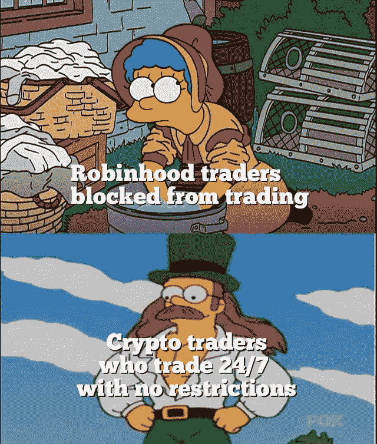
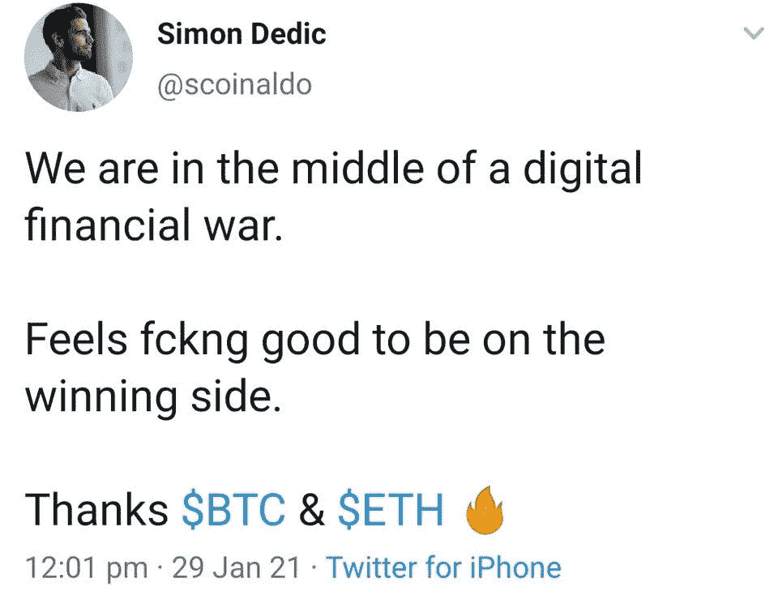

# 印度禁止加密| Reddit 与以太坊基金会合作

> 原文：<https://medium.com/coinmonks/india-banning-crypto-reddit-partners-with-ethereum-foundation-a49e1f2ab754?source=collection_archive---------4----------------------->

[Source](https://www.reddit.com/r/Bitcoin/comments/l9ntae/spotted_in_glasgow_scotland/)

## 灰度眼 DeFi space | Visa 拥抱加密货币

*   印度政府计划在该国下议院提出一项法案，禁止比特币等私人加密货币，并创建一种全国性的加密货币。
*   Visa 首席执行官 Al Kelly 表示，这家支付巨头有能力让加密货币更加“安全、有用和适用”，并可能将它们添加到公司的支付网络中。

## [Bitsgap](https://blog.coincodecap.com/go/bitsgap) 交易报价:

> “信心不是”我会从这笔交易中获利。“自信是”如果我不从这笔交易中获利，我会没事的。”——**伊文·拜亚吉**

## [Pionex](http://blog.coincodecap.com/go/pionex)

试试专业的加密交易所 Pionex，它有免费的加密交易机器人来自动完成你的交易。阅读我们的 [Pionex 评论](/coinmonks/pionex-review-exchange-with-crypto-trading-bot-1e459d0191ea)并查看我们的 [**加密交易机器人**](/coinmonks/crypto-trading-bot-c2ffce8acb2a) 列表。

## 最新消息📰

*   [禁止私人加密货币的法案](https://timesofindia.indiatimes.com/business/india-business/bill-to-ban-private-cryptocurrency-likely-in-budget-session-of-parliament/articleshow/80607008.cms)可能会在议会预算会议中提出
*   Visa 首席执行官表示，Visa 可能会在其支付网络中加入加密货币
*   基思·吉尔[推动了 GameStop](https://www.wsj.com/articles/keith-gill-drove-the-gamestop-reddit-mania-he-talked-to-the-journal-11611931696) Reddit 热潮。
*   Reddit [宣布](https://www.reddit.com/r/ethereum/comments/l6c3kx/reddit_announces_partnership_with_the_ethereum/)与以太坊基金会合作
*   在花费数十亿美元探索私有区块链的使用案例后，IBM 关闭了其区块链分部。
*   比特币基地[正式宣布](https://www.theblockcrypto.com/linked/93007/coinbase-crypto-exchange-direct-listing)通过直接上市成为公众公司
*   埃隆·马斯克推动的比特币价格飙升导致 3 . 87 亿美元空头清算
*   图表[评估](https://thegraph.com/blog/evaluating-multiblockchain)整合额外的 L1 区块链
*   数字资产管理公司[灰度眼睛用新的信托文件定义空间](https://www.coindesk.com/digital-asset-manager-grayscale-eyes-defi-space-with-new-trust-filings)
*   新加坡银行称，比特币可能取代黄金成为价值储存手段
*   荷兰比特币交易所因钱包 KYC 规则将中央银行告上法庭
*   当[系绳](https://www.coindesk.com/what-tether-means-when-it-says-its-regulated)说它“受管制”时是什么意思
*   随着 SEC 开始追踪 Ripple 和 Bitcoiin2Gen，DeFi 会是它的下一个目标吗？

> *报税季即将来临，使用最好的* [***加密报税软件***](/coinmonks/best-crypto-tax-tool-for-my-money-72d4b430816b) *来申报你的加密报税吧。*

[Source](https://www.reddit.com/r/CryptoCurrency/comments/l8954p/i_love_this_space_and_you_guys/)

> BlockFi 首次推出加密奖励信用卡。在日常购物中获得 1.5%的比特币奖励。现在加入等候名单。

## 好的读物📑

*   矿工起义看起来像什么？
*   用 Coinlib 数据评估比特币的流动性是站不住脚的
*   价值生成的[商店](https://blogmaverick.com/2021/01/31/the-store-of-value-generation-is-kicking-your-ass-and-you-dont-even-know-it/)正在踢你的屁股，而你甚至不知道
*   初学者的[指南](https://nakamoto.com/beginners-guide-to-defi/)定义
*   Q4 以太坊 [DeFi 报告](https://consensys.net/insights/q4-2020-defi-report/)
*   关于[乐观汇总](https://research.paradigm.xyz/rollups)你需要知道的一切
*   我[对比特币](https://www.bridgewater.com/research-and-insights/ray-dalio-what-i-think-of-bitcoin) —雷伊·达里奥的看法
*   [数字货币](https://www.bis.org/speeches/sp210127.htm)和货币体系的未来
*   [夺权](https://investoramnesia.com/2021/01/24/activists-short-squeezes-the-masses/):积极分子，短裤&群众
*   [革命](https://www.duneanalytics.com/blog/revolution-not-quarterly)不会每季度报道一次
*   比特币:让石油和天然气行业更有弹性的一种方式
*   [阶级斗争](/coinmonks/class-warfare-reddit-gamestop-hedge-funds-7c34cfbd2c27) : Reddit、GameStop &对冲基金
*   跟随比特币的信号，而不是噪音
*   比特币是伟大的[定义金融化](https://unchained-capital.com/blog/bitcoin-is-the-great-definancialization/)
*   所有的数字内容都在链上运行
*   [GameStop 传奇](/coinmonks/the-gamestop-saga-why-we-need-bitcoin-33eeaa225863)我们为什么需要比特币

> *买一个* [***硬件钱包***](/coinmonks/the-best-cryptocurrency-hardware-wallets-of-2020-e28b1c124069)*[*保护你的加密货币*](/coinmonks/how-to-prevent-cryptocurrency-hacking-and-theft-from-your-wallet-65c8ff767766) *。**

**

*[Source](https://www.reddit.com/r/Bitcoin/comments/kmof53/the_8_laws_of_bitcoin_updated/)*

> *Eth2 核心团队在线[研讨会](https://hackmd.io/@hww/workshop_feb_2021)，2021 年 2 月*

## *开发商*

*   *以太坊的[开发者指南](https://snakecharmers.ethereum.org/a-developers-guide-to-ethereum-pt-2/)。2*
*   *坚固性 [0.8.1 版本](https://blog.soliditylang.org/2021/01/27/solidity-0.8.1-release-announcement/)*
*   *你可能错过的 0.8.0 Solidity 编译器中的[变化](https://www.pwc.ch/en/insights/digital/change-in-080-solidity-compiler.html)*
*   *可靠性[开发商调查](https://blog.soliditylang.org/2021/01/26/solidity-developer-survey-2020-results/) 2020 年结果*
*   *一个关于 zk-SNARKs 如何可能的[近似](https://vitalik.ca/general/2021/01/26/snarks.html)介绍*
*   *启动[可靠性论坛](https://blog.soliditylang.org/2021/02/01/launching-the-solidity-forum/) 🗃️*
*   *[可靠性方面的可升级性](/coinmonks/upgrade-contracts-in-solidity-500a34c1dde)—数据和应用合同*
*   *Merkle 空投:要爱，不要战争*
*   *Eth2 中的[新功能](https://hackmd.io/@benjaminion/eth2_news/https%3A%2F%2Fhackmd.io%2F%40benjaminion%2Fwnie2_210129)*
*   *[升级](https://forum.openzeppelin.com/t/upgrades-with-peace-of-mind-structs-edition/5526)安心:“结构”版*
*   *[基准测试](https://hackmd.io/@zkteam/eccbench)配对友好的椭圆曲线库*
*   *台风。现金[漏洞](https://avner1122.medium.com/typhoon-cash-vulnerabilities-e82b0faa54b6)*
*   *[制作](https://secureum.substack.com/p/making-hermez-safu-secureum-4)赫米兹·SAFU*
*   *加密中的随机数重用——最坏会发生什么？*
*   *用于验证加密实现的恒定时间的[工具状态](https://neuromancer.sk/article/26)*

> *想成为一名以太网和 Web3 开发者吗？[从这里开始](http://blog.coincodecap.com/go/learn)。*

## *多方面的*

*   *范例 CTF 的注册现在开始！*
*   *[分散的](https://decrypto.org/)学术研究小组*
*   *🏗[脚手架 eth](https://github.com/austintgriffith/scaffold-eth/blob/challenge-1-decentralized-staking/README.md) 🏰BuidlGuidl*
*   *Altcoin 赛季[指数](https://www.blockchaincenter.net/altcoin-season-index/)*
*   *[盛况加密作业](https://pompcryptojobs.com/)*
*   *DappHub 的 Dapp 工具*
*   *[rapidsnark](https://github.com/iden3/rapidsnark) —用 C++和英特尔汇编编写的 zkSnark proof 一代。*

## *播客和视频💽*

*   *MIT 区块链[视频讲座](https://ocw.mit.edu/courses/sloan-school-of-management/15-s12-blockchain-and-money-fall-2018/video-lectures/)*
*   *[硬币的两面](https://www.grant-williams.com/podcast/both-sides-of-the-coin-featuring-mike-green-and-nic-carter/):文明的比特币辩论*

**

*[source](https://www.reddit.com/r/CryptoCurrency/comments/l88x5t/when_the_meme_catches_up_with_reality/)*

## *加密交易和折扣🔖*

*   *注册参加[**by bit**](/coinmonks/bybit-exchange-review-dbd570019b71)exchange，赢取高达 625 美元的奖金。*
*   *在 [**Bityard**](https://blog.coincodecap.com/go/bityard) 获得 258 美元的交易费折扣*

## *产品评论和其他加密软件📙*

*   *[Bityard 审查](https://blog.coincodecap.com/bityard-reivew)*
*   *[区块链审查](/coinmonks/blockfi-review-53096053c097)*
*   *最佳加密交易所*
*   *密码复制交易机器人*
*   *什么是[电网交易](https://blog.coincodecap.com/grid-trading)？*

*想让我们展示你的产品吗？请通过 [Twitter @coinmonks](https://twitter.com/coinmonks) 联系我们*

**

*[source](https://www.reddit.com/r/ethtrader/comments/l8f1pi/yes/)*

## *乔布斯👷*

*   *MetaMask 正在招聘工程师。在此处使用。*
*   *[开发工程师](https://remoteok.io/remote-jobs/100451-remote-devops-engineer-district0x)，0x 区，远程*
*   *[生态系统开发者](https://jobs.lever.co/3box/ec1093c5-ed31-483c-b1b3-49b07bd0bd2e)，3 盒，远程*
*   *[在 mStable 的 BD](https://angel.co/company/mstable/jobs/1096364-business-development-manager)*
*   *[动作设计师](https://cryptocurrencyjobs.co/design/kraken-digital-asset-exchange-motion-designer/) —北海巨妖*
*   *[全栈工程师](https://cryptocurrencyjobs.co/engineering/zapper-full-stack-engineer/) —扎珀*
*   *高级前端工程师 —乌玛*
*   *SigmaPrime，[区块链安全工程师](https://blog.sigmaprime.io/blockchain-security-engineer.html)*
*   *0x 寻找各种类型的[开发人员](https://0x.org/about/jobs)和一名 [Matcha 营销经理](https://boards.greenhouse.io/0x/jobs/4923909002)*
*   *小道消息位正在寻找一位[技术编辑/撰稿人](https://jobs.lever.co/trailofbits/8bf936ff-b86c-462e-80b2-4d58004bc68d) & [安全工程师](https://jobs.lever.co/trailofbits/4f459855-3299-462f-9e73-299a840d5baf)*
*   *Nexus Mutual: [在欧洲时区经历了稳健发展](https://angel.co/company/nexus-mutual-1/jobs/967538-smart-contract-engineer)*

## *在 Coinmonks 上发布*

*如果你喜欢在 crypto/区块链空间上写教育文章，并且想在 Coinmonks 出版物上发表。就在**【gaurav@coincodecap.com】***给我发邮件或者 DM 我**[***推特***](https://twitter.com/coinmonks)**