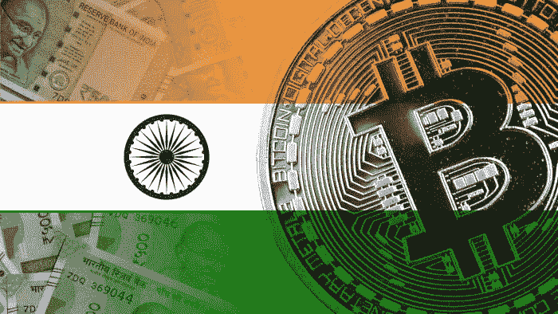

# 印度正在禁止加密货币，加密货币在印度的未来。

> 原文：<https://medium.com/coinmonks/india-is-banning-cryptocurrency-the-future-of-cryptocurrency-in-india-8f82adbd5642?source=collection_archive---------10----------------------->

crypto image by pexels

在没有官方证实印度将禁止加密货币的消息传出后，最近的消息引发了加密世界对加密市场的冲击。

从人口角度来看，印度的钱包比世界其他地方都多，如果像印度这样的国家禁止加密货币，这一消息就会引发整个市场崩溃并得到纠正。

# 印度禁止加密的真实新闻

crypto ban google image

然而，印度不打算禁止加密货币，但他们计划对其进行监管。众所周知，投资加密货币在青少年中更受欢迎，而且印度经常是世界上持有加密货币的钱包数量最多的国家。因此，禁止整个密码和生态系统将使人们陷入困境，因为他们已经投资了他们的血汗钱。

政府理解它，禁止它会使情况变得更糟，对其他人，甚至是通过它创造的工作和机会。

政府正计划制定一项法案，并试图监管整个加密的事情，因为我们都知道，加密在印度是不征税的，没有人支付任何加密税，因为它没有监管，但加密投资应显示为收益，然后征税。

也许这就是为什么政府计划提出一项法案，并对其进行监管，以避免滥用和奇怪的活动或为错误的事情提供资金的原因。

现在没有来自政府的明确声明，但是在加密信徒中主要的消息是私有加密网络可能会被禁止，而公共加密网络不会被禁止。这意味着交易可以被公开追踪或跟踪，该网络将在印度。

# 什么是私有和公共加密？

由此，我理解的是公共加密，例如，我们有 Etherum，我们可以通过 Etherscan 跟踪交易细节，这意味着它是可跟踪的，并且是公共的。

因此，私人网络将是相反的，无法跟踪或追踪更多的机会做非法活动，如洗钱将增加，这是政府不希望的，甚至一些极端分子可以利用它作为一个来源携带资金。

# 印度加密技术的未来

印度在拥有更多加密钱包的人口中排名第一。印度人在印度支持加密，主要是因为它在青少年中很受欢迎，因为它在印度老年人口中会越来越受欢迎，然后越来越多的人会把它视为一个投资机会，它会在印度创造新时代的百万富翁。

随着大量创新和技术的建立，印度加密的未来非常美好，越来越多的创新将会发生，因为印度的短视频平台之一 Chingari 也正在走向去中心化，并通过加密世界筹集了数百万资金，看到了它的成功。更多的创业公司会把它作为一种容易获得资金的方式。

新机会的未来看起来很好，甚至在创新领域，许多大人物都将其视为机会，只是在等待政府制定一些法规的绿色信号。

政府也将采取一些积极的措施，因为禁止互联网上的任何东西是可能的，但不是完全的，政府将把它作为创造更多就业机会和获得全球直接投资的机会。

# 结论

这是我的想法，看到所有的嗡嗡声发生了什么，以及由于哪些市场崩溃了，但我相信未来一切都会好起来，并对更大的思想有信心，如果他们花时间制定一些法律和法规，那么他们也将此视为一个机会。

这就是我所理解的，你们所有人都可以自由研究和投资，因为当你把钱投资到某样东西或任何资产时，它是有风险的。因此，在投资或做出任何决定之前，请对此进行研究。

感谢你阅读这篇文章，并祝你有一个美好的一天，希望我能够以积极的态度拯救加密市场。

> 加入 Coinmonks [电报频道](https://t.me/coincodecap)和 [Youtube 频道](https://www.youtube.com/c/coinmonks/videos)了解加密交易和投资

## 另外，阅读

*   [最佳加密交易信号电报](/coinmonks/best-crypto-signals-telegram-5785cdbc4b2b) | [MoonXBT 评论](/coinmonks/moonxbt-review-6e4ab26d037)
*   [OKEx 评论](/coinmonks/okex-review-6b369304110f) | [Coinswitch 俱吠罗评论](/coinmonks/coinswitch-kuber-review-1a8dc5c7a739) | [比特币基地收费](/coinmonks/coinbase-fees-831e77d4f2c5)
*   [AscendEX 审查](/coinmonks/ascendex-review-53e829cf75fa) | [OKEx 交易机器人](/coinmonks/okex-trading-bots-234920f61e60) | [OKEx 交易机器人](/coinmonks/okex-trading-bots-234920f61e60)
*   [火币交易机器人](https://blog.coincodecap.com/huobi-trading-bot) | [如何收购 ADA](https://blog.coincodecap.com/buy-ada-cardano) | [Geco。一次审查](https://blog.coincodecap.com/geco-one-review)
*   [币安 vs 比特邮票](https://blog.coincodecap.com/binance-vs-bitstamp) | [比特熊猫 vs 比特币基地 vs Coinsbit](https://blog.coincodecap.com/bitpanda-coinbase-coinsbit)
*   [如何购买 Ripple (XRP)](https://blog.coincodecap.com/buy-ripple-india) | [非洲最好的加密交易所](https://blog.coincodecap.com/crypto-exchange-africa)
*   [非洲最佳密码交易所](https://blog.coincodecap.com/crypto-exchange-africa) | [胡交易所评论](https://blog.coincodecap.com/hoo-exchange-review)
*   [eToro vs robin hood](https://blog.coincodecap.com/etoro-robinhood)|[MoonXBT vs Bybit vs Bityard](https://blog.coincodecap.com/bybit-bityard-moonxbt)
*   [风暴增益评论](https://blog.coincodecap.com/stormgain-review) | [普罗比特评论](https://blog.coincodecap.com/probit-review) | [北海巨妖评论](/coinmonks/kraken-review-6165fc1056ac)
*   [如何在势不可挡的域名上购买域名？](https://blog.coincodecap.com/buy-domain-on-unstoppable-domains)
*   [印度的秘密税](https://blog.coincodecap.com/crypto-tax-india) | [altFINS 审查](https://blog.coincodecap.com/altfins-review) | [Prokey 审查](/coinmonks/prokey-review-26611173c13c)
*   [Blockfi vs 比特币基地](https://blog.coincodecap.com/blockfi-vs-coinbase) | [BitKan 评论](https://blog.coincodecap.com/bitkan-review) | [期货交易机器人](/coinmonks/futures-trading-bots-5a282ccee3f5)
*   [南非的加密交易所](https://blog.coincodecap.com/crypto-exchanges-in-south-africa) | [BitMEX 加密信号](https://blog.coincodecap.com/bitmex-crypto-signals)