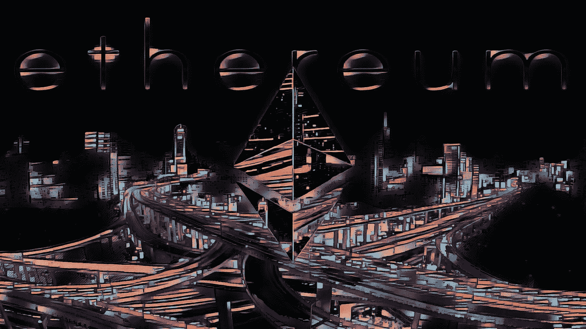

# 印度计划禁止加密交易/ Eth 2.0 准备上线/各地监管机构加强控制

> 原文：<https://medium.com/coinmonks/india-plans-to-ban-crypto-trading-eth-2-0-5cd0477158d?source=collection_archive---------2----------------------->

Ethereum after dark — [source](https://www.reddit.com/r/ethtrader/comments/isgfb6/eth_after_dark_oc/)

## 对不起，我搞砸了——寿司开发商返还 1400 万美元

寿司的主要开发商 Chef Nomi [将他的 1400 万美元归还给寿司财政部，并为没有达到社区的期望而道歉。](https://twitter.com/NomiChef/status/1304442510844899329)

## 试试 [Quadency](https://blog.coincodecap.com/go/quadency)

寻找易于使用的一体化加密交易解决方案？阅读我们的[季度回顾](https://blog.coincodecap.com/quadency-review-a-crypto-trading-automation-platform)。

[Quadency](https://blog.coincodecap.com/go/quadency) ，2018 年推出的密码交易自动化平台。它给你带来了一个更聪明的方式来交易和管理你的密码。

## 最新消息📰

*   印度计划出台法律禁止加密货币交易
*   Gnosis 中的一个[投资者，最初的 DeFi 协议之一，呼吁项目回报投资者](https://www.theblockcrypto.com/post/76453/arca-gnosis-defi-project-call)
*   美国监管机构将为加密公司引入统一规则
*   尼日利亚[屈服于比特币的采用后监管加密](https://decrypt.co/41834/nigeria-regulates-crypto-after-bowing-to-bitcoin-adoption)
*   以太坊 2.0 在发布前进行最后一次“彩排”
*   DeFi Lender bZx [收回在周日的袭击中被盗的 800 万美元](https://www.coindesk.com/bzx-reclaims-8m-hack)
*   FATF 说，用户特征分析可以帮助监管者识别非法加密活动
*   SEC [指控说唱歌手 TI](https://www.coindesk.com/flik-coinspark-ti-felton) 宣传 2017 ICO 违反证券法规
*   MicroStrategy [又购买了](https://www.coindesk.com/microstrategy-buys-more-bitcoin)1 . 75 亿美元的比特币，使 BTC 的持有量达到 4 . 25 亿美元
*   日本密码交易所指控币安帮助清洗 2018 年黑客攻击所得的 900 万美元
*   泰国央行的[新区块链支持的](https://www.coindesk.com/thai-central-bank-blockchain-bond-infrastructure-1-6b-sale)债券基础设施通过测试，发行 16 亿美元债券
*   修复两年后，比特币软件中的高‘[严重性漏洞](https://www.coindesk.com/high-severity-bug-in-bitcoin-software-revealed-2-years-after-fix)暴露
*   欧盟旨在牢牢控制数字货币以规避风险
*   山药又准备好了🚀
*   渴望将与马克道竞争
*   超过 [100K BTC](https://cointelegraph.com/news/more-than-1b-in-bitcoin-has-been-tokenized-for-defi) 现在锁定在 DeFi 协议中

## 好的读物📑

*   [圣杯](https://aragon.org/blog/snapshot):链上执行的离线轮询
*   [Uniswap Flash Swaps](https://blog.quiknode.io/uniswap-flash-swaps-a-hidden-defi-money-lego/) —一个隐藏的 DeFi Money Lego
*   [连锁互换](https://tether.to/explained-chain-swaps/)解释
*   [协调，好与坏](https://vitalik.ca/general/2020/09/11/coordination.html)
*   为什么美国政府和加密生态系统必须合作
*   不要混淆你的[时间锁](/blockstream/dont-mix-your-timelocks-d9939b665094)
*   为什么[投票代币](https://www.zeframlou.com/2019/02/why-voting-tokens-are-fking-horrible.html)很恐怖，以及 4 种修复方法
*   你需要知道的一切
*   中本聪[共识要求](https://talk.lazyledger.io/t/nakamoto-consensus-requires-social-coordination-and-subjectivity/28)社会的协调性和主体性
*   Filecoin: [理解](https://www.coindesk.com/filecoin-fil-crypto-data-storage-explained)旨在与 AWS 竞争的复杂加密系统
*   [金钱重塑](https://www.coindesk.com/money-reimagined-distance-trap):终结金钱的距离陷阱
*   对比特币前景的现实评估
*   Sushinomics 的可持续性
*   [产量农业](/coinmonks/yield-farming-what-is-it-and-how-does-it-work-452c7ce2c467):什么是产量农业，它是如何工作的？
*   什么是波尔卡多特？它是如何工作的

## 开发商

*   [以太坊 2.0 (Ubuntu/Medalla/Nimbus)上的定位指南](/@SomerEsat/guide-to-staking-on-ethereum-2-0-ubuntu-medalla-nimbus-5f4b2b0f2d7c)
*   [评估](https://www.attestant.io/posts/evaluating-beacon-nodes/)信标节点
*   Python 中以太坊的开发者指南
*   [视觉](/openethereum/vision-for-openethereum-ex-parity-client-eb7b11f6eef8)为露天剧场
*   时钟同步作为一个分散的[不可信的 Oracle](https://ethresear.ch/t/clock-sync-as-a-decentralized-trustless-oracle/7959)
*   一个通用的 L2 友好的 ENS 标准
*   虚空之心简介[发现协议](/nethermind-eth/introduction-to-nethermind-discovery-protocol-4bb17ea31d1f)
*   Github 上的 Solidity 语言[检测](https://twitter.com/NomicLabs/status/1303010441954762754)
*   Eth2.0 [路](/prysmatic-labs/eth-2-0-dev-update-56-road-to-mainnet-3fbd50dde484)至 mainnet
*   [公平测序服务](https://blog.chain.link/chainlink-fair-sequencing-services-enabling-a-provably-fair-defi-ecosystem/):实现可证明公平的 DeFi 生态系统
*   使用 Ligo 的 Tezos 上的 Oracles:一个简单的用例
*   使用库共享[公共数据](/coinmonks/sharing-common-data-using-libraries-6573857d328c)

[Source](https://www.reddit.com/r/Bitcoin/comments/ipy7le/rule_number_one_in_bitcoin/)

## 多方面的

*   [格兰特](https://gitcoin.co/grants/)探险家
*   加密货币开放专利联盟( [COPA](https://open-patent.org/about-copa/) )
*   Etherscan 上的[产量农场](https://twitter.com/etherscan/status/1304434029035286528)
*   [NFT 成长](https://twitter.com/DCLBlogger/status/1304420025449631744)
*   [ETHGas](https://ethgas.app/) App

## 黑客马拉松👷

*   破解 Rambow-Near 协议
*   Eth2 Medalla [数据](https://ethereum.org/en/eth2/get-involved/medalla-data-challenge/)挑战

## 播客💽

*   SushiSwap 如何证明流动性不是护城河

## 加密交易和折扣🔖

*   BlockFi 为注册和存款提供了 250 美元的 USDC 奖金(T21)
*   全新 [Trezor 钱夹套](https://shop.trezor.io/?offer_id=10&aff_id=5199)有多种颜色可选
*   *试用*[*Hypertrader*](https://hypertrader.app/?utm_soruce=coinmonks)*并使用优惠券****COINCODECAP****获得****15%****折扣*
*   使用[此链接](https://webapp.coinrule.io/coupon/coinmonks-7-25-3-e2bf6c60e795407381edf98d1a174ac2?fp_ref=coincodecap)在 [Coinrule](https://webapp.coinrule.io/coupon/coinmonks-7-25-3-e2bf6c60e795407381edf98d1a174ac2?fp_ref=coincodecap) 享受 7 天免费试用和前 3 个月 25%的折扣
*   *试用* [*哈森在线*](https://www.haasonline.com/?ref=11087) *并使用优惠券****COINCODECAP****获得****10%****折扣👏*

## 产品评论📙

*   神童评论——赚大钱的社交密码交易
*   [Shrimpy vs 3commas](https://blog.coincodecap.com/shrimpy-vs-3commas)
*   [哈森在线评论](https://blog.coincodecap.com/haasonline-review)—2020 年最佳交易机器人(10%优惠券)
*   免费编写你下一个有利可图的交易机器人
*   4 种简单的赚钱方法
*   [Hodlnaut 评论](https://blog.coincodecap.com/hodlnaut-review)——Hodl 的最佳方式是赚取你的比特币的利息
*   [Quadency Review](https://blog.coincodecap.com/quadency-review-a-crypto-trading-automation-platform)——专为专业人士打造的加密交易机器人
*   [Botsfolio 评论](https://blog.coincodecap.com/botsfolio-review-automate-crypto-investment) —让您的加密投资自动化的简单方法
*   你需要知道的 2020 年 5 大[加密贷款平台](https://blog.coincodecap.com/top-5-crypto-lending-platforms)
*   [2020 年最佳密码交易机器人](/coinmonks/whats-the-best-crypto-trading-bot-in-2020-top-8-bitcoin-trading-bot-c16adeb13317)
*   [2020 年最佳密码交易平台](/coinmonks/the-best-crypto-trading-platforms-in-2020-the-definitive-guide-updated-c72f8b874555)

想让我们展示你的产品吗？在 [Twitter @coinmonks](https://twitter.com/coinmonks) 上联系我们

## 照片说明了一切📷

香港汇丰银行总部前😜

[Source](https://www.reddit.com/r/Bitcoin/comments/iqnsm9/in_front_of_hsbc_hq_in_hong_kong/)

## 在 Coinmonks 上发布

如果你喜欢在 crypto/区块链空间上写教育文章，并且想在 Coinmonks 出版物上发表。只需在***【gaurav@coincodecap.com】****或者 DM 我**[***推特***](https://twitter.com/coinmonks)*

> **“如果你喜欢读***[*你也可以捐我们*](/coinmonks/monks-need-your-help-7440418d67ec) *。****
> 
> ***[*在您的收件箱中直接获得最佳软件交易*](https://coincodecap.com/?utm_source=coinmonks)***

******