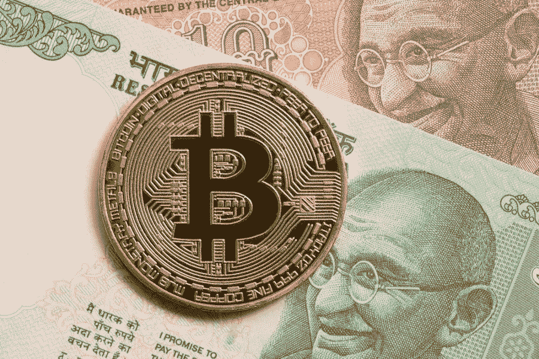

# 印度应该接受而不是禁止加密货币

> 原文：<https://medium.com/coinmonks/india-should-embrace-and-not-ban-cryptocurrencies-e20c7c563575?source=collection_archive---------2----------------------->

## ⚠️ 🚨下一次衰退敲门，买比特币。🚨 ⚠️

加密社区正在印度最高法院努力反对政府的加密货币禁令。

> 在 19 世纪 60 年代，如果印度当局拿出勇气，采用金本位制，我们可能会走上不同的道路。*——*b . r .安贝德卡博士

## CoinCodeCap APIs

我们认为加密开发活动是加密投资者的重要信息。所以我们也在上周发布了我们的[API](https://documenter.getpostman.com/view/346282/SVYwLwe3?version=latest)(测试版)👏。我们正在与一些 dex 和其他与 CoinCodeCap APIs 集成的项目合作。如果你想加入我们，你可以发邮件到 gaurav@coinmonks.com

本周故事👇 👇

## 印度应该接受而不是禁止加密货币

最近，[印度部际小组建议](https://economictimes.indiatimes.com/news/economy/policy/indian-panel-recommends-ban-on-cryptocurrency/articleshow/70331293.cms)禁止所有私人加密货币。它还建议鼓励使用分布式账本技术(DLT)，因为它看到了底层技术的价值。

这就像在 20 世纪 90 年代，一个小组建议禁止互联网，因为它可能被用于非法活动。并且只鼓励在公司内部使用内部网。如果这样的禁令得以实施，那将是印度经济的巨大挫折。。 [***在这里阅读全文……***](/coinmonks/india-should-embrace-and-not-ban-cryptocurrencies-crypto-networks-5d0e5c1b0f6b)

**由** [**阿沛·坎布尔**](https://medium.com/u/d31b04d6f834?source=post_page-----e20c7c563575--------------------------------)

**额外字节**

*   **论信息策化的激励结构** **由** [**扬·奥索尼克**](https://medium.com/u/df462b6141b9?source=post_page-----e20c7c563575--------------------------------)
*   **AION 从 Iota —** [**奥拉夫·范·韦克**](https://medium.com/u/7f867a25787b?source=post_page-----e20c7c563575--------------------------------)

> [直接在您的收件箱中获得最佳软件交易](https://coincodecap.com/?utm_source=coinmonks)

# 在 Coinmonks 上发布

如果你喜欢在 crypto/区块链空间上写教育文章，并且想在 Coinmonks 出版物上发表。只需在***【gaurav@coincodecap.com】****或者 DM 我**[***推特***](https://twitter.com/coinmonks)*

> **“我们是一个非宣传性和非营利性的教育出版物，如果您喜欢阅读***[*您也可以捐赠我们*](/coinmonks/monks-need-your-help-7440418d67ec) *。****

******暂时就这样吧，送我❤️，下次再说。******