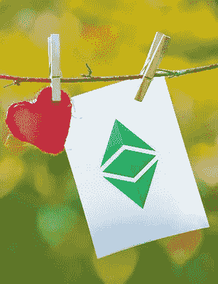

# 印度采取措施禁止比特币

> 原文：<https://medium.com/coinmonks/india-takes-steps-to-ban-crypto-1ccb527ee014?source=collection_archive---------7----------------------->

Image Credit: [sandeepachetan.com travel photography](https://www.flickr.com/photos/sandeepachetan/)

## 网络星期一是洗钱者最后一个加密周期的开始吗？

上周，印度政府[宣布](https://www.reuters.com/world/india/new-indian-law-will-allow-only-few-cryptocurrencies-government-says-2021-11-23/)正在采取措施禁止私人加密货币，如比特币和以太坊，并最终用印度储备银行发行的中央银行数字货币(CBDC)取代它们。与中国的禁令一样，该禁令将包括所有与加密货币相关的活动，如加密开采、托管交易所、加密货币的营销或广告等。

对于当前的加密投资者和去中心化爱好者来说，这是个坏消息。非常糟糕。如果你认为我反应过度，请考虑一下这个问题——随着中国(14 亿人)和印度(13.8 亿人)对 crypto 的禁令，突然之间，世界三分之一的人口(77.5 亿人)将无法使用 crypto。三分之一！事实上，这 27.8 亿人做的任何与加密货币有关的事情都可能让他们坐牢。

一旦印度启动“比特币禁令”，世界其他国家的政府需要多长时间才能决定集中加密并禁止分散加密，从而将其余三分之二的人口排除在当前模式之外？如果你认为你在比特币或以太币或 DogeCoin 的投资现在是安全的，你打算等一等，看看市值会涨到多高，我希望你也可以考虑做完全相反的事情——今天在网络星期一把你的收益全部变现。非常讽刺的时机，对吧？

Image Credit: [ETC](https://www.flickr.com/photos/149639283@N08/26833560229)

你当然不会孤单！克鲁克斯将在印度新闻上表现灵活，并从本周开始寻求尽可能多地从他们拥有的加密货币中洗钱，然后像你希望的那样，在市场崩溃之前卖掉它，或者在他们自己的国家发生加密集中化。

随着金融市场对印度消息的反应，关于以色列和其他国家加入的传言，密码罪犯将简单地跟踪消息，并在多米诺骨牌倒下之前集体出售他们的密码。希望你也会。

去中心化的死亡，以及随之而来的加密货币金融自由理念的真正美丽，可能会缓慢而丑陋。它将被公开播放给我们所有人看，非常详细。不要介意预期的[翻转](/coinmonks/the-flippening-what-it-is-and-why-it-matters-63e22486ca44)，因为 12 个月后它甚至不会是一件事。明年大型财经媒体和加密媒体的讨论将是一个大而糟糕的话题:“去中心化”。还是那句话，如果你怀疑我，请看下文。

## **FATF 发布新指南**

请查看全球金融行动特别工作组 (FATF)发布的[新指南。该指南涵盖了监管机构的重要议题，包括如何监管稳定账户、增值服务提供商的许可和监管、旅行规则以及政府与增值服务提供商之间的信息共享与合作。最重要的是，因为它与我们的 Fincrooks 有关，FATF 将其大部分精力放在如何处理点对点交易(参见 NFTs)以及分散与集中的主题上。](https://www.fatf-gafi.org/publications/fatfrecommendations/documents/guidance-rba-virtual-assets-2021.html)

底线？如果加密公司想和世界各地的政府合作，他们必须首先接受 FATF 对中央集权的定义。FATF 认为，大多数加密公司，即使他们认为自己是分散的，实际上是某种形式的集中，因此负责反洗钱报告和监管。一旦这些加密公司承认他们已经被集中化，任何面临所有加密货币立法集中化的障碍都被有效地减少到仅仅是颠簸。

书写在墙上。

*   结束-

> 加入 Coinmonks [电报频道](https://t.me/coincodecap)和 [Youtube 频道](https://www.youtube.com/c/coinmonks/videos)了解加密交易和投资

## 另外，阅读

*   [什么是融资融券交易](https://blog.coincodecap.com/margin-trading) | [成本平均法](https://blog.coincodecap.com/dca)
*   [支持卡审核](https://blog.coincodecap.com/uphold-card-review) | [信任钱包 vs 元掩码](https://blog.coincodecap.com/trust-wallet-vs-metamask)
*   [Exness 回顾](https://blog.coincodecap.com/exness-review)|[moon xbt Vs bit get Vs Bingbon](https://blog.coincodecap.com/bingbon-vs-bitget-vs-moonxbt)
*   [如何开始通过加密贷款赚取被动收入](https://blog.coincodecap.com/passive-income-crypto-lending)
*   [BigONE 交易所评论](/coinmonks/bigone-exchange-review-64705d85a1d4) | [电网交易 Bot](https://blog.coincodecap.com/grid-trading)
*   [莱杰 vs Ngrave](/coinmonks/ledger-vs-ngrave-zero-7e40f0c1d694) | [莱杰 nano s vs x](/coinmonks/ledger-nano-s-vs-x-battery-hardware-price-storage-59a6663fe3b0) | [币安评论](/coinmonks/binance-review-ee10d3bf3b6e)
*   [Bybit Exchange 审查](/coinmonks/bybit-exchange-review-dbd570019b71) | [Bityard 审查](https://blog.coincodecap.com/bityard-reivew) | [CoinSpot 审查](https://blog.coincodecap.com/coinspot-review)
*   [3 commas vs crypto hopper](/coinmonks/3commas-vs-pionex-vs-cryptohopper-best-crypto-bot-6a98d2baa203)|[赚取加密利息](/coinmonks/earn-crypto-interest-b10b810fdda3)
*   最好的比特币[硬件钱包](/coinmonks/hardware-wallets-dfa1211730c6) | [BitBox02 回顾](/coinmonks/bitbox02-review-your-swiss-bitcoin-hardware-wallet-c36c88fff29)
*   [BlockFi vs 摄氏](/coinmonks/blockfi-vs-celsius-vs-hodlnaut-8a1cc8c26630) | [Hodlnaut 点评](/coinmonks/hodlnaut-review-best-way-to-hodl-is-to-earn-interest-on-your-bitcoin-6658a8c19edf) | [KuCoin 点评](https://blog.coincodecap.com/kucoin-review)
*   [Bitsgap 审查](/coinmonks/bitsgap-review-a-crypto-trading-bot-that-makes-easy-money-a5d88a336df2) | [Quadency 审查](/coinmonks/quadency-review-a-crypto-trading-automation-platform-3068eaa374e1) | [Bitbns 审查](/coinmonks/bitbns-review-38256a07e161)
*   [加密复制交易平台](/coinmonks/top-10-crypto-copy-trading-platforms-for-beginners-d0c37c7d698c) | [Coinmama 审核](/coinmonks/coinmama-review-ace5641bde6e)
*   [印度的加密交易所](/coinmonks/bitcoin-exchange-in-india-7f1fe79715c9) | [比特币储蓄账户](/coinmonks/bitcoin-savings-account-e65b13f92451)