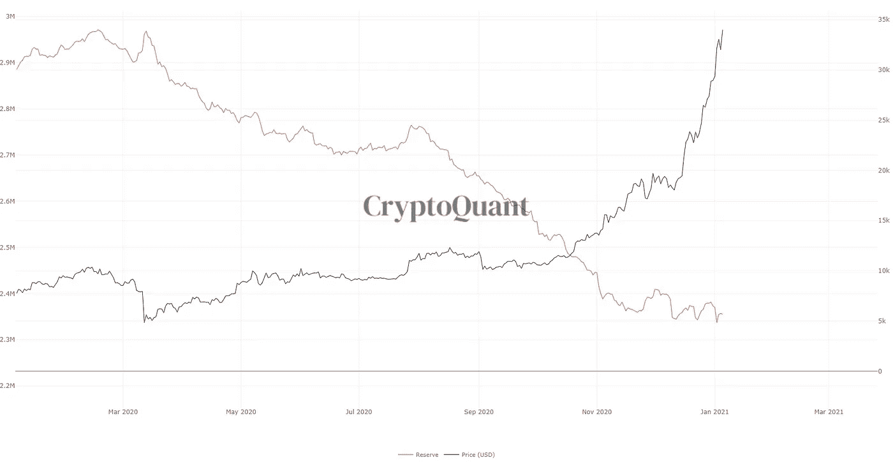

# 预测 2017 年 10 倍回报的指标又闪了！

> 原文：<https://medium.com/coinmonks/indicator-that-predicted-10x-returns-in-2017-flashes-again-2ce1b50ad20e?source=collection_archive---------4----------------------->

比特币的 MVRV Z 值(实际市值与实际市值之差的比率)刚刚超过 5。当 2017 年发生这种情况时，它标志着接下来的 6 个月上涨了 10 倍。

让我们开始吃吧。

## 发出 10 倍反弹信号的比特币指标再次闪烁

周三，一个比特币趋势指标再次闪烁，该指标上次预测比特币将上涨 10 倍。

该指标被称为 MVRV Z-score，是加密货币的实际和实际市值之间的差异比率。

简而言之，MVRV Z 分数用于衡量比特币相对于其公允价值何时被高估；红区是获利回吐最严重的地区。

提出这一指标的分析平台 Glassnode 指出，这个分数是比特币被低估的一个迹象。

相反，任何高于 7 的指数都表明市场顶部信号，暗示月度时间框架的超买状态。

***发布时获取此。*** [***订阅邮件列表！***](https://chrisoncrypto.com/subscribe)

# 技术上来说

## 市场正在出现泡沫吗？

如果我们纵观当前的市场状况，我们可以尝试将当前的比特币和加密氛围置于人类行为的范围内。

目前，从“乐观”到“相信”的转变似乎已经接近完成，至少对于久经沙场的市场参与者来说是如此。

我甚至可以进一步说，根据各种指标，如上周提到的 NUPL(未实现净损益)、上面的 MVRV Z 得分以及 Twitter 上的一般轶事，我们正处于捕捉“信念”阶段的边缘，从这些指标中可以判断情绪。

随着杠杆融资利率全面飙升，交易员也将高风险押注推至新的水平。周一，Bitfinex 美元融资利率飙升至 7%，ETH 利率飙升至 3%。这种利率的每日回报是天文数字，但最终是不可持续的——事实上，它们已经急剧降温。

当在你的“普通人”和全球水平的背景下看时，很可能我们仍然处于“希望”阶段，因为羊群总是落后于专业的水晶球赌徒(双关语)。现在比特币已经超越了所有的历史高点，大众开始相信比特币和 crypto 正在卷土重来；有充分的理由。

当然，你可以在任何给定的时刻对任何数量的这些心理状态进行辩论，但既不兴奋也不潜伏的市场周期情绪不太可能在任何程度上普遍存在(除非你做空比特币，使其陷入贫困)。

## **回调即将到来**

虽然我可能听起来像一张破唱片，但事实是，让你的头脑牢牢扎根于现实是前进的唯一途径。比特币从 2017 年的历史高点飙升了 80%，自 2020 年 3 月的低点以来上涨了 700%以上。

随着价格不断攀升，下行风险也在增加。期待股市大幅回调并非臆测，这是不可避免的事实。

上面提到的两个链上指标都接近应该考虑 2-4 周冷却期的技术区域。

如果比特币的最高价格略低于 40，000 美元，那么 35%的修正将使其达到 25，000 美元——假设历史先例对今天的价格走势有一些影响。

然而，由于没有人能够预见未来，20 周均线(指数移动平均线)是牛市中提供巨大买入机会的可靠指标，目前位于 19，344 美元，并且每周都在快速上涨。

除非比特币趋势在周日之前低于该指标，否则下周和下周的周线均线将会更高，直到重大抛售压力重新进入市场。

那些寻找风险调整后进入市场的人只需要看看这条长期移动平均线就行了。

## 交易所的 BTC 平衡:圆底？

为了进一步了解市场行为，我们还可以关注交易所的比特币余额，也称为比特币交易所储备。

显然，随着价格趋势呈抛物线上升，交易所的比特币余额正在减少，但速度比几个月前比特币交易低于 15000 美元时慢得多。

这意味着获利回吐正在上升，但仍不足以抵消此时的购买力。十有八九，在恢复更大的趋势之前，下跌趋势会有一个临时的调整期。

## **最终想法**

没有什么是永远直线上升的，期待这一点是天真的，就像买入欣快也是天真的一样。

比特币今年可能会达到 10 万美元，从其目前的表现来看，这可能是一个保守的数字。

然而，在接下来的几个月里，你会有一些小的机会可以充分利用。

当其他人因担心最新的监管打击、交易所黑客或 FUD 稳定而抛售股票时，这就是有远见的投资者发现机会的时候。

最终，在牛市中，你必须持有乐观的偏见，直到事实证明并非如此。

比特币和以太坊正在重塑货币和金融市场，任何人都无法阻止这一点。用美元和欧元获利的心理参照系将很快出现在接收端，而且不会就此止步。它永远不会停止。

下次再见。

在你的社交网站上分享这些内容。感谢您的支持！
**加入** [**电报频道**](https://t.me/chrisoncryptochannel) **进行实时更新！**
**关注我** [**推特**](https://twitter.com/ChrisOnCrypto1)**&**[**insta gram**](https://www.instagram.com/chrisoncrypto/)**更多轻松内容。**
**引荐，商机和反馈也很感谢。**

[https://chrisoncrypto.com/blog/f/us-federal-regulator-greenlights-bank-stablecoin-usage](https://chrisoncrypto.com/blog/f/us-federal-regulator-greenlights-bank-stablecoin-usage)

www.chrisoncrypto.com

你经常阅读吗？给我小费！发送 **BTC** 到这个地址:
**3 eydseypjhn 68 axkncuqbb 7 ebqcxrejamr**

最诚挚的问候，
**克里斯托弗·阿塔尔德**
克里斯对加密的创始人
贡献者[www.cityam.com](https://www.cityam.com/)
直接接通:[电报](https://t.me/chrisoncrypto)

*最初发布于*[*https://mailchi . MP*](https://mailchi.mp/5f6cffce762e/indicator-that-predicted-10x-returns-in-2017-flashes-again)*。*

## 另外，阅读

*   [学习以太坊和 Web3 开发](http://blog.coincodecap.com/go/learn)
*   最好的[密码交易机器人](/coinmonks/crypto-trading-bot-c2ffce8acb2a)
*   [3 商业评论](/coinmonks/3commas-review-an-excellent-crypto-trading-bot-2020-1313a58bec92)
*   [Pionex 评论](/coinmonks/pionex-review-exchange-with-crypto-trading-bot-1e459d0191ea)
*   [AAX 交易所评论](/coinmonks/aax-exchange-review-2021-67c5ea09330c) |推荐代码、交易费用、利弊
*   [Deribit 审查](/coinmonks/deribit-review-options-fees-apis-and-testnet-2ca16c4bbdb2) |选项、费用、API 和 Testnet
*   [FTX 密码交易所评论](/coinmonks/ftx-crypto-exchange-review-53664ac1198f)
*   [n 零审核](/coinmonks/ngrave-zero-review-c465cf8307fc)
*   [Bybit 交换审查](/coinmonks/bybit-exchange-review-dbd570019b71)
*   [3Commas vs Cryptohopper](/coinmonks/3commas-vs-pionex-vs-cryptohopper-best-crypto-bot-6a98d2baa203)
*   最好的比特币[硬件钱包](/coinmonks/the-best-cryptocurrency-hardware-wallets-of-2020-e28b1c124069?source=friends_link&sk=324dd9ff8556ab578d71e7ad7658ad7c)
*   [密码本交易平台](/coinmonks/top-10-crypto-copy-trading-platforms-for-beginners-d0c37c7d698c)
*   最佳 [monero 钱包](https://blog.coincodecap.com/best-monero-wallets)
*   [莱杰 nano s vs x](https://blog.coincodecap.com/ledger-nano-s-vs-x)
*   [bits gap vs 3 commas vs quad ency](https://blog.coincodecap.com/bitsgap-3commas-quadency)
*   最好的[加密税务软件](/coinmonks/best-crypto-tax-tool-for-my-money-72d4b430816b)
*   [最佳加密交易平台](/coinmonks/the-best-crypto-trading-platforms-in-2020-the-definitive-guide-updated-c72f8b874555)
*   最佳[加密贷款平台](/coinmonks/top-5-crypto-lending-platforms-in-2020-that-you-need-to-know-a1b675cec3fa)
*   [莱杰纳米 S vs 特雷佐 one vs 特雷佐 T vs 莱杰纳米 X](https://blog.coincodecap.com/ledger-nano-s-vs-trezor-one-ledger-nano-x-trezor-t)
*   [block fi vs Celsius](/coinmonks/blockfi-vs-celsius-vs-hodlnaut-8a1cc8c26630)vs Hodlnaut
*   Bitsgap 评论——一个轻松赚钱的加密交易机器人
*   为专业人士设计的加密交易机器人
*   [硬币追踪审查](/coinmonks/cointracking-review-a-reliable-cryptocurrency-tax-software-5114e3eb5737)
*   [优霍德勒评论](/coinmonks/youhodler-4-easy-ways-to-make-money-98969b9689f2)
*   [埃利帕尔泰坦评论](/coinmonks/ellipal-titan-review-85e9071dd029)
*   [SecuX Stone 评论](https://blog.coincodecap.com/secux-stone-hardware-wallet-review)
*   [BlockFi 评论](/coinmonks/blockfi-review-53096053c097) |赚取高达 8.6%的加密利息
*   [共同规则审查](https://blog.coincodecap.com/coinrule-review-a-perfect-trading-bot)
*   [最佳区块链分析工具](https://bitquery.io/blog/best-blockchain-analysis-tools-and-software)
*   [加密套利](/coinmonks/crypto-arbitrage-guide-how-to-make-money-as-a-beginner-62bfe5c868f6)指南:新手如何赚钱
*   最佳[加密制图工具](/coinmonks/what-are-the-best-charting-platforms-for-cryptocurrency-trading-85aade584d80)
*   了解比特币的[最佳书籍有哪些？](/coinmonks/what-are-the-best-books-to-learn-bitcoin-409aeb9aff4b)

> [直接在您的收件箱中获得最佳软件交易](/coinmonks/newsletters/coinmonks)

